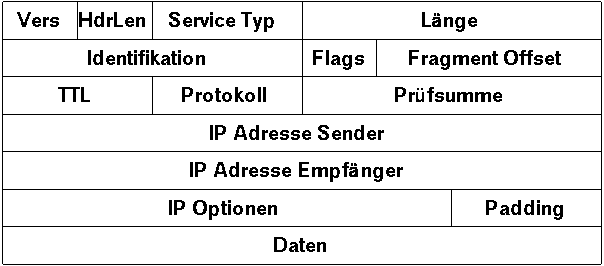
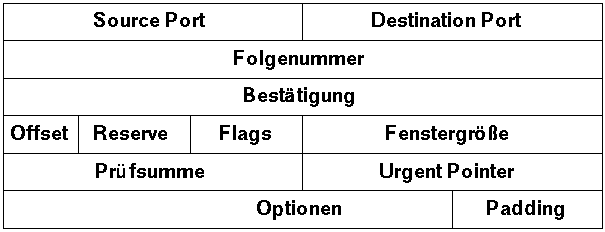

- [TCP/IP Technik](#tcpip-technik)
- [Ein SMTP Dialog](#smtp)

**aus »c't - Magazin für Computertechnik«, Ausgabe 4/93**

# TCP/IP Technik

*Rechner miteinander zu vernetzen ist heutzutage kein Problem mehr, so scheint es.
Um die Rechner im Büro zu verbinden, nimmt man Ethernet, ARCNET oder Token-Ring;
für die Anbindung von Außenstellen stehen Modems, Datex-P und neuerdings auch ISDN zur Verfügung
und um mal eben einige Daten von seinem Mac auf den Atari zu überspielen, legt man ein Nullmodemkabel.
Alle diese Netze haben ihre Stärken und Schwächen und dementsprechend ihre Einsatzgebiete.*

Leider haben diese Netze aber auch alle eine unterschiedliche Schnittstelle der Anwendung gegenüber.
Das fängt schon bei den Adressen an (Datex-P Adressen sehen anders aus als Adressen in einem Ethernet)
und hört erst wieder bei den grundlegenden Konzepten des jeweiligen Netzwerks auf.
Wie schön wäre es, würden alle diese Netzwerke zusammenarbeiten können,
sodaß man Daten auf dieselbe Art und Weise vom Wohnzimmer in den Hobbykeller wie von einem Ende der Welt zum anderen verschicken könnte,
wenn man die verschiedenen Netzwerke miteinander vernetzen könnte. 

Genau diese Anforderung erfüllen die TCP/IP-Protokolle, die im Internet verwendet werden. 

# Was kann TCP/IP?

- gibt einem die Unabhängigkeit von Hardware des unterliegenden Trägernetzes.
- gibt einem eine netzwerkweit einheitliche Adresse.
- präsentiert dem Programmierer eine einheitliche, geschlossene API.
- bietet einen Baukasten von standardisierten High-Level-Protokollen für die verschiedensten Netzwerkdienste.
- ist eine offene Protokollfamilie, die unabhängig von Herstellern entwickelt wurde.

Um die Entwicklung und das Verständnis von Rechnernetzen zu erleichtern, 
hat die International Standards Organisation (ISO) ein Architekturmodell für Rechnernetze entwickelt, 
das OSI Referenzmodell.
Dieses Modell teilt den Prozess des Verschickens von Daten über ein Rechnernetz in 7 übereinanderliegende Schichten ein,
die einander zuarbeiten und jede für sich eine bestimmte Abstraktionsebene kennzeichnen.
Weil diese Schichten in der Abbildung übereinander liegen, redet man oft auch von einem
Protokollstapel.

*Bild 1: OSI Referenzmodell*

Wenn Daten zwischen zwei Rechnern übertragen werden, erscheint es im Programmiermodell so,
als würden zwei gleiche Schichten auf verschiedenen Rechnern miteinander kommunizieren.
Die Details der darunterliegenden Abstraktionsebenen werden vor den darüberliegenden Schichten verborgen.
Beispielsweise ist es die Aufgabe der Schicht 2, eine fehlerfreie Verbindung zwischen zwei benachbarten Netzknoten zur Verfügung zu stellen.
Das bedeutet, dass die Schicht 3 sich mit den Details der Datenübertragung zwischen zwei Maschinen nicht mehr zu befassen hat.
Sie kann mit der Schicht 3 der Gegenstelle kommunizieren, 
ohne sich um Einzelheiten der Datenübertragung und möglicherweise auftretende Fehler kümmern zu müssen.

In Wirklichkeit besteht jedoch die einzige Verbindung zwischen zwei Rechnern auf der Ebene 1, der physikalischen Schicht. 
Wenn Daten zu senden sind, werden sie von einer Schicht zur jeweils darunterliegenden Schicht weitergereicht. 
Damit die einzelnen Schichten voneinander unabhängig sind,
müssen die Schnittstellen zwischen den Schichten natürlich bekannt und definiert sein.
Diese Art von Modulbildung erleichtert die Wartung und Entwicklung von neuen Netzwerkprotokollen und die Fehlersuche.

## Internetworking Protocol (IP)

Auch TCP/IP hat einen ähnlichen, schichtweisen Aufbau, wenn es auch nicht so vielfach unterteilt ist wie das OSI-Modell;
üblicherweise unterscheidet man vier Schichten.
Die Grundlage des TCP/IP-Protokollturms bildet die Netzwerkschicht, deren Aufgabe der eigentliche Datentransport ist.

TCP/IP ist kein Netzwerkprotokoll, das von der Hardware direkt verstanden wird.
Normalerweise werden TCP/IP-Daten immer über ein vorhandenes Trägernetz, 
etwa Ethernet oder X.25, übertragen, denn die Aufgabe von TCP/IP ist es ja gerade, solche vorhandenen Netzwerke zu vereinheitlichen.
Im OSI-Modell deckt die Netzwerkschicht also die Hardwareschichten 1 und 2 sowie in einigen Fällen auch noch Teile der Schicht 3 ab.

Auf der Netzwerkschicht aufbauend liegt die Internet-Schicht, die die erste Abstraktionsschicht von einem konkreten Netzwerk darstellt.
Damit ist das Internet-Protokoll, kurz IP, der Kern von TCP/IP, denn es stellt den grundlegenden Dienst des Netzes zur Verfügung: 
den Versand von Datenpaketen, sogenannten Datagrammen, über verschiedene Netze hinweg.

Die Netzwerkschicht hat keine Information darüber, von welcher Art die Daten sind, die sie befördert:
Für eine Ethernetkarte sind die ankommenden Daten eben einfach nur Daten, die vom Netz kommen.
Der Kartentreiber interpretiert einen Teil dieser Daten als IP-Header und den Rest als Datenteil eines IP-Paketes.
Auf diese Weise ist der IP-Header innerhalb eines Ethernet-Paketes gewissermaßen eingekapselt.
Aber auch das IP-Paket selbst enthält selbst wieder ein Datenpaket für eine höhere Protokollebene, dessen Header auf der IP-Ebene als Bestandteil der Daten erscheint.

*Bild 2: Kapselung von Daten in ein Protokollpaket der nächstniederen Schicht.*

IP ist ein verbindungsloses Protokoll, das bedeutet, IP kennt keinen Verbindungszustand.
Es ist also nicht notwendig, eine IP-Verbindung zu einem Rechner zu "öffnen", 
bevor man Daten zu diesem Rechner senden kann, sondern es genügt, das IP-Paket einfach abzusenden.
Bei einem verbindungsorientierten Protokoll wird beim Öffnen einer Verbindung getestet, ob der Zielrechner überhaupt erreichbar ist.
Ein verbindungsloses Protokoll macht das nicht und kann demnach auch nicht garantieren, daß ein Datenpaket überhaupt beim Empfänger ankommt.
IP garantiert auch nicht, daß ein von einem einmal abgeschickten Datenpaket nur eine Kopie beim Empfänger ankommt,
oder dass in einer Reihenfolge abgeschickte Datenpakete auch wieder in dieser Reihenfolge empfangen werden.
Dadurch ist es möglich, daß längere Transfers von einem Rechner zum anderen, die über mehrere Zwischenrechner laufen, 
beim Ausfall eines dieser Rechner dynamisch neu konfiguriert werden.
Irgendwann während der Übertragung bricht ein Übertragungsweg zusammen und es wird ein neuer Weg zum Ziel gesucht und benutzt.
Da der neue Weg zeitlich länger oder kürzer sein kann als der alte, kann man keine allgemein gültigen Aussagen darüber machen,
in welcher Reihenfolge IP-Pakete beim Empfänger eintreffen.
Es kann auch sein, daß bei dieser Umschalterei IP-Pakete verloren gehen oder verdoppelt werden.
Alle diese Unebenheiten auszubügeln überläßt IP anderen, höherliegenden Schichten im Protokollturm.

*Bild 3: Aufbau eines Internet Protocol (IP) Headers.
Eine Zeile stellt ein Langwort (4 Byte) dar.
Das höchstwertigste Byte eines Langwortes wird als erstes übertragen (Network Byte Order).*

Die Hauptaufgabe von IP ist es also, die Unterschiede zwischen den verschiedenen, 
unterliegenden Netzwerkschichten zu verbergen und eine einheitliche Sicht auf die verschiedensten Netzwerktechnologien zu präsentieren. 
Dazu gehören die Einführung eines einheitlichen Adressierungsschemas und eines Fragmentierungsmechanismus,
der es ermöglicht, große Datenpakete durch Netze mit kleiner maximaler Paketgröße zu senden.

Jedes IP-Paket enthält zwei Adressen in Form von 32 Bit Worten: 
Die Absender- und die Empfängeradresse. 
Eine Internet-Adresse wird meist in Form von vier, durch Punkte getrennten Bytes notiert, 
man spricht in diesem Fall von der "dotted quad"-Schreibweise.
Um die Zustellung von IP-Paketen zu vereinfachen, unterteilt man die Adresse in zwei Teile: 
Den Netzwerkteil und den Rechnerteil. 
Ein Router muss, um ein Datenpaket zustellen zu können, nur den Netzwerkteil einer Adresse erkennen.
Erst im Zielnetzwerk wird der Rechnerteil einer Adresse ausgewertet.
Um den verschiedenen Anforderungen gerecht zu werden, was die Größe von Netzwerken angeht, unterscheidet man verschiedene Aufteilungen der 32 Adreßbits:

- bei Netzwerken der Klasse A ist das erste Bit der IP-Adresse 0. 
 Die folgenden 7 Bit bilden den Netzwerkteil der Adresse und die restlichen 24 Bits bilden den Rechnerteil.
 Es kann also weniger als 128 verschiedene Klasse A Netzwerke geben, aber jedes dieser Netze aus Millionen von Rechnern bestehen.
 Ein typischer Vertreter ist zum Beispiel das amerikanische MILNET, das sich über das ganze Land 
 erstreckt.
- bei Netzwerken der Klasse B fängt die Adresse mit der Bitfolge "10" an.
 Die folgenden 14 Bit stellen den Netzwerkteil der Adresse dar, die restlichen 16 Bit den Rechnerteil.
 Es kann also Tausende von Klasse B Netzen mit jeweils tausenden von Rechnern geben.
 Ein typischer Vertreter ist das Campusnetzwerk einer großen Universität. 
- bei Netzwerken der Klasse C fängt die Adresse mit der Bitfolge "110" an.
 Die folgenden 21 Bit stellen den Netzwerkteil der Adresse dar, die restlichen 8 Bit den Rechnerteil.
 Es kann also Millionen von Netzwerken der Klasse C geben, 
 von denen jedes weniger als 256 Rechner beherbergt. 
 Standardmässig bekommt man ein Klasse C Netz, wenn man ein Netzwerk beim NIC anmeldet.
- fängt eine Adresse mit den Bits "111" an, so hat sie eine Spezialbedeutung.
 Manchmal werden solche Adressen als Klasse D Adressen bezeichnet. 

Höherliegende Protokolle und Dienste bieten dem IP-Benutzer Mechanismen, die Namen Internet-Adressen zuordnen und umgekehrt.

Weil das Internet-Protokoll wie bereits erwähnt normalerweise immer auf einem Trägernetzwerk aufsetzt, 
muss es noch eine andere Eigenschaft der unterliegenden Netzwerkschicht verbergen:
Normalerweise existiert bei allen Netzwerken eine maximale Größe, die ein Datenpaket haben kann.
Im IP-Jargon nennt man diese Grenze die "maximum transmisson unit", MTU.
Natürlich ist diese Obergrenze je nach verwendeter Trägertechnik unterschiedlich.
Die Internet-Schicht teilt IP-Pakete, die größer als die MTU des verwendeten Netzwerks in kleinere Stücke, sogenannte Fragmente auf.
Auf dem Zielrechner werden diese Fragmente dann wieder zu vollständigen IP-Paketen zusammengesetzt, bevor sie an die darüberliegenden Protokolle weiter gegeben werden.

Welches darüberliegende Protokoll der Transportschicht das Datenpaket bekommt, steht im "Protokoll"-Feld eines jeden IP-Paketes.
Jedes Protokoll der Transportschicht bekommt eine eindeutige Identifikationsnummer zugewiesen,
anhand derer der IP-Treiber entscheiden kann, wie weiter mit dem Paket zu verfahren ist.
Eines der wichtigsten Protokolle der Transportschicht ist TCP.

## Was leistet TCP?

Die Aufgabe von TCP ist es, die oben geschilderten Defizite von IP zu verbergen.
Für den TCP-Benutzer soll es nicht mehr sichtbar sein,
daß die darunterliegenden Protokollschichten Datenpakete versenden, 
sondern stattdessen soll der Benutzer mit einem Bytestrom wie bei einer normalen Datei arbeiten können.
TCP garantiert das Ankommen, die Einmaligkeit und die Reihenfolge der Daten.
Zusätzlich multiplext TCP die Verbindung zwischen zwei Rechnern:
Während auf der Internet-Schicht nur eine Verbindung zur Zeit zwischen zwei Rechnern bestehen kann,
teilt TCP diese Verbindung in viele virtuelle Kanäle auf.

Im Gegensatz zu IP ist TCP verbindungsorientiert.
Das muss so sein, denn TCP-Verbindungen sollen ja für den Benutzer wie Dateien zu handhaben sein.
Das bedeutet, eine TCP-Verbindung wird wie eine Datei geöffnet und geschlossen,
und man kann seine Position innerhalb des Datenstromes bestimmen,
genau wie man bei einer Datei die Position des Dateizeigers angeben kann.

Auch TCP sendet die Daten in größeren Einheiten, um den Verwaltungsaufwand durch Header und Kontrollinformation kleinzuhalten.
Im Gegensatz zu den IP-"Paketen" bezeichnet man in die Einheiten der Transportschicht als "Segmente".
Jedes gesendete TCP-Segment hat eine eindeutige Folgenummer, die die Position seines ersten Bytes im Bytestrom der Verbindung angibt.
Anhand dieser Nummer kann die Reihenfolge der Segmente korrigiert werden und doppelt angekommene Segmente können aussortiert werden.
Da die Länge des Segmentes aus dem IP-Header bekannt ist, können auch Lücken im Datenstrom entdeckt werden 
und der Empfänger kann verloren gegangene Segmente neu anfordern.

Beim Öffnen einer TCP-Verbindung werden zwischen beiden Kommunikationspartnern Kontrollinformationen ausgetauscht, 
die sicherstellen, daß der Endpunkt der Verbindung existiert und Daten annehmen kann.
Dazu schickt der Sender ein Segment mit der Aufforderung, die Folgenummern zu synchronisieren.
Der Empfänger weiß jetzt, daß der Sender eine Verbindung öffnen möchte und an welcher Position im Datenstrom der Sender anfangen wird zu zählen.
Der Empfänger bestätigt den Empfang der Nachricht und legt seinerseits eine Folgenummer für Übertragungen in Gegenrichtung fest.
Der Sender bestätigt nun seinerseits den Empfang der Folgenummer von B und beginnt dann mit der Übertragung von Daten.
Diese Art des Austausches von Kontrollinformation, bei der jede Seite die Aktionen der Gegenseite bestätigen muss,
ehe sie wirksam werden können, heisst "Dreiweg-Handshake".
Auch beim Abbau einer Verbindung wird auf diese Weise sichergestellt, daß beide Seiten alle Daten korrekt und vollständig empfangen haben.

Bild 4: Aufbau eines Transmission Control Protocol (TCP) Headers.*

Während der Übertragung kann der Empfänger dem Sender im Feld "Fenstergröße" signalisieren, für wie viele Bytes er noch Pufferkapazität frei hat.
Der Sender darf nicht mehr Daten senden, als der Empfänger auf diese Weise freigegeben hat, 
bis er eine weitere Empfangsbestätigung mit einer neu festgelegten Fenstergröße vom Sender erhält. 
Auf diese Weise kann der Empfänger den Datenfluß vom Sender nach Wunsch dosieren. 
Wenn der Empfänger dem Sender eine Fenstergröße von Null Byte signalisiert, muss der Sender den Transfer unterbrechen,
bis er eine zweite Bestätigung mit einer Fenstergröße ungleich Null bekommt.

Auf einem Rechner können mehrere Prozesse zu einem Zeitpunkt TCP-Verbindungen geöffnet haben.
Die Portnummer in jedem TCP-Segment gibt an, welche virtuelle Verbindung zu welchem Prozess gehört.
So ist es möglich, Leitungen für eine Vielzahl von Prozessen zu multiplexen.
Vom Standpunkt eines Modembenutzers aus kann man TCP/IP also in gewisser Weise als eine Art glorifiziertes ZMODEM- oder BIMODEM-Protokoll betrachten:
Es ist nicht nur eine Übertragung von Daten in beide Richtungen gleichzeitig möglich, sondern es können pro Richtung noch mehrere Verbindungen zugleich unterhalten werden.

Damit die verschiedenen Schichten des Protokollturms miteinander Daten austauschen können,
müssen jeweils zwei aneinanderstoßende Schichten sich jeweils über ein gemeinsames Interface einig sein.
Normalerweise sind diese Interfaces nicht interessant, weil sie für den Anwender unsichtbar sind.
Das Interface der Internet-Schicht ist zum Beispiel nur für denjenigen interessant,
der TCP oder ein vergleichbares Protokoll selbst implementieren möchte.
Das Interface zwischen der Transportschicht und der Anwendungsschicht ist jedoch von besonderem Interesse, 
denn es stellt das Interface dar, mit dem ein Programmierer umgehen muss, der eine Anwendung schreiben möchte,
die von den Möglichkeiten von TCP/IP Gebrauch macht.

Leider gibt es zwei verschiedene, inkompatible APIs für TCP/IP.
Die ältere der beiden ist als "Berkeley Sockets" bekannt geworden und in BSD UNIX zusammen mit der ersten Version von TCP/IP implementiert worden.
Die andere API ist das "Transport Level Interface", kurz TLI, von AT&T.
Es stellt den Versuch dar, eine generelle, TCP/IP unabhängige API für Netzwerkprogrammierung zu schaffen.
Die Namen und Parameter der TLI-Aufrufe orientieren sich dabei an der Begriffswelt der OSI.

Die Grenze zwischen der Anwendungsschicht und der Transportschicht ist in den meisten Implementierungen zugleich
die Grenze zwischen dem Betriebssystem und den Anwendungsprogrammen.
Im OSI-Modell ist diese Grenze in etwa die Grenze zwischen den Schichten 4 und 5.
Daher ordnet man IP vorwiegend ungefähr in die Ebene 3 und TCP ungefähr in Ebene 4 des OSI-Modells ein.
Da TCP/IP jedoch älter und einfacher als das OSI-Modell sind, kann diese Einordnung nicht genau passen.

## Typische TCP/IP Dienste

Auf TCP/IP setzen viele verschiedene Dienste auf, von denen die meisten ein eigenes, 
anwendungsspezifisches Protokoll zwischen ihrem Server und den verschiedenen Client-Programmen verwenden.
Der UNIX-Tradition folgend kommunizieren viele dieser Anwendungen zwar in einem formalisierten Format miteinander,
aber dieses Format ist überwiegend so gehalten, dass es noch von einem Menschen ohne besondere Debugging-Werkzeug gelesen und erzeugt werden kann.

Eines dieser Protokolle ist zum Beispiel das "simple mail transport protocol", SMTP. 
Es dient der synchronen Auslieferung von Electronic Mail im Internet und wird von einer ganzen Palette von Mailtransportprogrammen direkt verstanden.
Ist eine Mail zu versenden, so baut der sendende Mailer eine TCP/IP-Verbindung direkt zum Zielrechner auf.
Der physikalische Weg zu diesem Rechner muss nicht direkt vorhanden sein, aber das braucht den Absender nicht zu kümmern.
Die Internet-Schicht des Netzes wird einen Weg zum Zielrechner konstruieren, wenn es einen gibt.
Für den Mailer sieht es so aus, als hätte er eine direkte, virtuelle Verbindung zum Zielrechner. 
Kommt eine Verbindung zustande, so meldet sich auf dem Zielrechner ein Hintergrundprozeß, der auf eingehende Nachrichten wartet.
Zwischen den beiden Mailern läuft dann ein SMTP-Dialog ab.
Da der Dialog aber in reinem ASCII und sogar relativ lesbar ist, 
kann man ihn bei Kenntnis des SMTP-Protokolls auch als Mensch simulieren.
Im Kasten [SMTP](#smtp) ist so eine Simulation eines SMTP-Dialoges zu sehen.

So wie SMTP der Zustellung persönlicher Nachrichten an einzelne Personen dient, 
ermöglicht das NNTP-Protokoll die Verbreitung öffentlicher Nachrichten im Internet, die USENET News.
Das FTP-Protokoll dient zur Übertragung von Dateien durch das Netz, das TELNET- und das rlogin-Protokoll ermöglichen es,
Sessions auf entfernten Rechnern zu fahren und wieder andere Protokolle ermöglichen 
die Einrichtung von Namensverzeichnissen oder die Fernabfrage der eigenen Mail.

TCP/IP ist durch das schichtweise Design ein modularer Protokollstandard. 
Die einzelnen Komponenten sind in den sogenannten "Requests for Comments" (RFCs) genormt und offengelegt.
Am Zustandekommen einer einzelnen SMTP-Verbindung über TCP über IP über Ethernet-Verbindung sind dann auch eine ganze Reihe dieser Normen beteiligt. 
Das Format der übertragenen Nachricht ist in RFC 822, "Standard for the format of ARPA Internet text messages" festgelegt.
Die Nachrichten werden nach dem in RFC 821 definierten SMTP-Verfahren übertragen. 
SMTP bedient sich wiederum des in RFC 793 spezifizierten TCP, das auf dem in RFC 791 und RFC 792 definierten Internet Protocol aufsetzt.
Wie Internet-Pakete auf einem Ethernet als Träger verschickt werden, 
ist wiederum in RFC 894 festgelegt, während RFC 826 die Zuordnung von Ethernet-Adressen zu IP-Adressen regelt.

Die Universalität von TCP/IP verbirgt die Eigenheiten der unterliegenden Trägernetze vollständig.
Für einen TCP/IP-Benutzer, ja sogar für den Programmierer ist es egal, auf welche Weise der Zielrechner erreicht wird, er hat eine einheitliche Sicht auf ein riesiges, weltweites, aus
tausenden von Teilnetzen zusammengesetztes Netzwerk.

# SMTP

**SMTP Dialog zwischen tpki.toppoint.de und black.toppoint.de**

*Von tpki.toppoint.de gesendete Zeichen sind fett gesetzt.*

<pre>
220-black.toppoint.de Smail3.1.26.7 #3 ready at Wed, 9 Dec 92 00:08 
MET
220 call +49 431 676689 for operator.
<b>helo tpki.toppoint.de</b>
250 black.toppoint.de Hello tpki.toppoint.de
<b>mail from: kris@tpki.toppoint.de</b>
250 &lt;kris@tpki.toppoint.de> ... Sender Okay
<b>rcpt to: kris@black.toppoint.de</b>
250 &lt;kris@black.toppoint.de> ... Recipient Okay
<b>data</b>
354 Enter mail, end with "." on a line by itself
<b>.</b>
250 Mail accepted
<b>quit</b>
221 black.toppoint.de closing connection
</pre>
