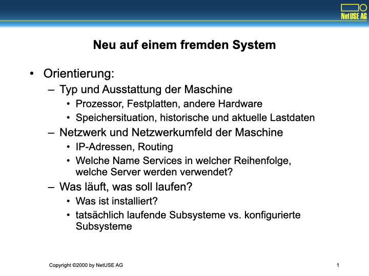
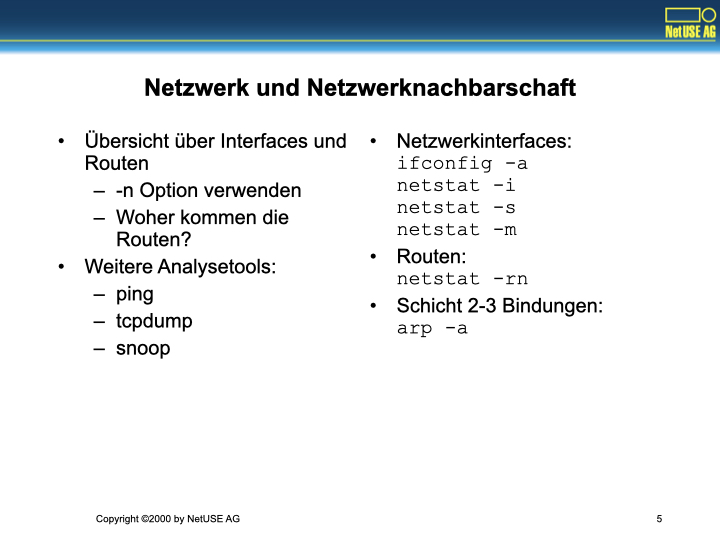
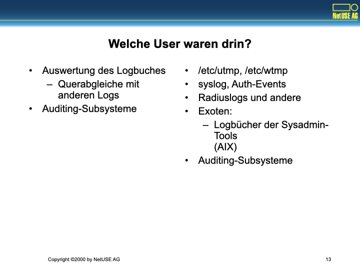

Dies ist eine aktualisierte Version der Schulung „Unix Systemsicherheit“, die ich vor einiger Zeit schon einmal gehalten habe.
Der Schwerpunkt dieser Schulung hat sich etwas zu den Grundlagen hin verschoben:
Es geht diesmal weniger um Unix Systemsicherheit als um die typische Situation der Consultants und Bereitschaften:

Man kommt an eine neue Maschine und muss sich erst einmal zurechtfinden.

# Neu auf einem fremden System



Orientierung:
- Typ und Ausstattung der Maschine
  - Prozessor, Festplatten, andere Hardware
  - Speichersituation, historische und aktuelle Lastdaten
- Netzwerk und Netzwerkumfeld der Maschine
- IP-Adressen, Routing
  - Welche Name-Services in welcher Reihenfolge, welche Server werden verwendet?
- Was läuft, was soll laufen?
  - Was ist installiert?
  - tatsächlich laufende Subsysteme vs. konfigurierte Subsysteme

Wir sind neu auf einem fremden System und loggen uns zum ersten Mal ein.
Wie können wir uns zurechtfinden? Was wollen wir überhaupt wissen?

Die Maschine selbst ist nach Hardware, Speicher, Platten und Netzwerk zu beurteilen.
Die Netzwerkumgebung der Maschine ist einzuschätzen.
Die auf der Maschine installierten Systemdienste sind einzuschätzen und zu beurteilen.
Es muss ein Soll/Ist-Abgleich stattfinden.

Ausgehend von diesen Daten kann die Arbeit auf der Maschine beginnen:

Die Maschine kann für ihre Aufgabe angepasst werden (Hardware- oder Softwareinstallation durch Consulting), bzw. die Fehlersuche kann beginnen (Alarmruf für die Bereitschaft).

# Typ und Ausstattung der Maschine


- Was für Hardware ist das hier?
- Was ist in der Maschine eingebaut?
- Wie lange ist die Hardware schon "up"?

Erster Handgriff: `uname -a`.
Weitere Aktionen systemspezfisch.

- Linux: `lscpu`, `free`, `df -Th`, `lspci`, `lsusb`
- Solaris: `prtconf -v`, `psrinfo -v`, `/usr/platform/$(uname -m)/sbin/prtdiag`
- Uptime und Load: `w`, `uptime -w`

Für uns meist: Sparc/Solaris oder Intel/Linux.
Bei einigen Kunden auch PPC/AIX oder Intel/SCO.
Äußerst wenige Kunden mit HP oder Digital Hardware.

Peilung des Maschinentyps (mit `uname -a`) und der eingebauten Hardware.
In Solaris mit den drei Kommandos `prtconf`, `psrinfo` und `prtdiag`.
In Linux mit `lscpu`, `lspci` oder indem man manuell durch `/proc` turnt.

Peilung der Systemauslastung und der anwesenden Benutzer:
Neben `w` und `uptime` einmal die Prozeßliste ansehen (`ps -ef`, `ps axuwww`) und die Systemlast checken (`iostat`, `vmstat`).

# Speicher und Last


Virtueller Speicher und seine Auslastung:

- Linux: `free`.
- Solaris: `swap -l`, `swap -s`.
- Wenn Accounting "up" ist (Solaris): `sar`, `sar -r` (freeswap), `sar -w` (paging).
- In Linux (Suse 6.4): `sa` aus dem Paket `ap1/acct.rpm`.

Der weitaus größte Teil aller Lastprobleme sind Speicherprobleme (zuwenig RAM, zu kleiner Swap). 
Zweithäufigstes Problem ist fehlende I/O-Kapazität.
Fehlende CPU-Kapazität ist fast niemals das Problem.

Erst messen, dann nachdenken, dann handeln (OODA loop -- Observe, Orient, Decide, Act).
Optimierungen ohne genaue Messungen und Kenntnis des tatsächlichen Problems sind Verschwendung der durch den Kunden bezahlten Arbeitszeit.
Punktmessungen können hilfreich sein, aber ein Wochenlastprofil ist sehr viel wertvoller (hier `sar`-Beispiele von `boss` und `prime` bringen).

# Platten


- Logical Volume Management?
  - Welches System?
  - Welche Zuordnung?
- Quota?

- `/etc/vfstab`, `/etc/fstab`
- Solaris (SDS):
  - Gerätenamen
  - metastat
  - format
- Linux:
  - Gerätenamen
  - fdisk
  - `raidtool.rpm` als Nachfolger von `md-tools`
  - `/etc/raidtab`, `raid.conf`
  - `df`, `du`, `mount`
  - Quota-Tools

Vergleiche die sichtbaren Partitionen mit der durch das Hardware-Inventory angezeigten vorhandenen Hardware.
- Sind alle Platten partitioniert und eingebunden?
- Ist die gezeigte Aufteilung sinnvoll gewählt für die Aufgabe der Maschine?

Prüfe auch:
- Verteilung der Partitionen nach Auslastung auf Spindeln
- Verteilung der Partitionen über Platten und Controller nach Ausfallgesichtspunkten?

Welche RAID-Level für welche Aufgabe
- Wir verwenden fast überall RAID 0+1 (Solaris SDS).
- Linux-RAID (a la Suse) derzeit nur eingeschränkt nützlich.
  - Lange Startzeit.
  - Rootplatte, Swap-Partition.

Prüfe auch:
- Platzproblem oder Quota-Problem?

# Netzwerk und Netzwerknachbarschaft



- Übersicht über Interfaces und Routen
  - `-n` Option verwenden
  - Woher kommen die Routen?
- Weitere Analysetools:
  - ping
  - tcpdump
  - snoop

- Netzwerkinterfaces: `ifconfig -a`, `netstat -i`, `netstat -s`, `netstat -m`
- Routen: `netstat -rn`
- Schicht 2-3 Bindungen: `arp -a`

Welche Interfaces und welche Routen werden tatsächlich wie oft verwendet?
Woher kommen die Routen?

Viele Kunden haben ein kaputtes Netzwerkonzept (d.h. keines) und setzen Routen eventuell manuell. Probleme sind vorprogrammiert.

Andere Kunden haben nur Default-Routen und bekommen differenzierte Routen nur über ICMP Redirect. Ebenfalls problematisch (Effizenz, Security).

# Name Resolution


- Welche Namensdienste werden verwendet?
- Welche Server werden verwendet?
- Wie ist das Verhalten im Fehlerfall?
  - Ausfall
  - Angriff

- `/etc/nsswitch.conf`
  - Files, DNS/Bind, NIS/NIS+, LDAP, Exoten 
- Falls DNS: `/etc/resolv.conf`
- Falls NIS: `ypwhich`

Woher kommen die Namen, welcher Dienst wird verwendet?

Oft lokale Hostdateien -> Probleme! Im besten Fall DNS. Dann dort die Zone ansehen und Netzstruktur und Zonengröße abschätzen.

Welche Abhängigkeiten existieren zwischen den Servern?

Ausfall- und Bootszenarien: Was ist, wenn der DNS-, der Time- oder der NIS-Server nicht da sind? Gibt es NFS-Platten, auf die die lokale Maschine angewiesen ist?

Security: Wer macht was in wessen Auftrag? Wer kontrolliert? Wird die Konfiguration manuell gepflegt oder existieren Frontends? Welche Dokumentationsprozeduren existieren?

# Netzwerkdienste


- Welche Netzwerkdienste werden erbracht?
  - Prüfe neben `inetd` auch persistenten Server.
  - Prüfe auf Vorhandensein von Sicherheitsmechanismen
  - Prüfe Verhalten im Falle von Ausfällen, etwa Firewall-Versagen
- Wie begründen sich diese Dienste?
- Welche Sicherheit bieten diese Dienste?

- `/etc/inetd.conf`, `/etc/hosts.allow`, `/etc/hosts.deny`
- Sonderfälle für das jeweilige System
  - Todesfallen bei AIX: Import/Exporttools für `inetd.conf`
  - Todesfallen bei HP/UX: `/etc/inetd.sec`
- `rpcinfo -p`, `showmount -e`
- `nmap`!

Vergleiche `inetd.conf` und Startscripte mit `netstat -an`.

- Consulting: Viele verstorbene Pflegefälle wegen manuell gestarteter Dienste, die in keiner Konfigurationsdatei auftauchen.
- Bereitschaft: Umgekehrtes Szenario. Alarm wurde wegen verschwundenem Server ausgelöst.

Sicherheitsanalyse wieder:
- Wieder technische und organisatorische Prozesse synchronisieren und abgleichen:
  - Was tun die Maschinen?
  - Wer entscheidet das? Wie begründen sich die Dienste?
  - Wer dokumentiert und prüft das?

Vergleiche Prozeduren bei uns im Haus:
- ISP-Betrieb plant und deployed.
- Operating betreibt nach Doku vom ISP-Betrieb, Operating überwacht und alarmiert die Bereitschaft. Auch diese operiert mit dieser Doku.
- Konfigurationsgenerierung meist automatisch durch die Backends der KundenDB -> automatische Dokumentation und Abrechnung.

# Welche Verzeichnisse werden exportiert?


- Häufige Panne:
  - Verzeichnisse werden ungewollt exportiert
  - Rechner importiert Verzeichnisse und hängt wegen Abhängigkeit vom Server
- Automounter?
  - Mit NIS/NIS+?
- Samba?
  - Klartextpaßworte?
  - Public Shares?
  - Logfiles?

```console
$ showmount -e
$ kshowmount -e
$ share
$ vi /etc/exports; vi  /etc/dfs/dfstab
$ vi /etc/auto.master; vi /etc/auto.homel vi /etc/auto.misc
$ vi smb.conf; smbclient
```

Einschlägige Beispielserver draußen zeigen.

Wir wollen nicht so enden wie die! Mehrfach gestaffelte Sicherheit durch
- automatisch generierte Konfigurationen mit Sicherheitssperren
- Dienstsperrungen für Außen durch `tcpwrapper`
- Portsperrung und Alamierung über die Firewall und das Operating
- Logauswertung (Usagelog, Wrapper-Protokoll, Firewall-Protokoll) durch
  - Abrechnung (KundenDB), Alarm bei Diensten mit fehlendem technischem Objekt in der KundenDB
  - Operating (Wrapper, Firewall), Alarm bei Attack Patterns

Einschlägige Selbstmordkonfigurationen zeigen.

# Was ist installiert?


- Welche Pakete und Programme sind installiert?
  - In welcher Version?
- Installation validieren?
  - "set permissions" und "check optionen"
  - tripwire?

- Solaris: `pkginfo`, `/var/sadm/install/contents` (Reihenfolge!)
- Linux: `rpm -qa`, `rpm -qi <paket>`, `rpm -ql <paket>`, `rpm -qlc <paket>`, `rpm -qld <paket>`, `rpm -qf <datei>`, `rpm -qp <datei.rpm>`

- Solaris Paketarchiv („NetUSE Distribution“) zeigen
  - Consulting-CDROM, wird auch an Kunden verkauft
- Keine Installation ohne Paket
  - Verweis auf Paketschulung
  - Kein Paket -> automatische Konfigurationsgenerierung aus Installserver oder KundenDB macht die Verzeichnisse möglicherweise platt.

- Kommandoäquivalenzen Linux/Solaris
- Verweis auf Rootkits
  - Rootkits ersetzen wichtige Systemprogramme,
  - in Folge belügt die Maschine den Operator
  - tripwire-Check nach sauberem Reboot zeigen
  - lrk3 demonstrieren (ohne sauberen Reboot bekommt man keine verlässlichen Informationen mehr und kompromittiert sein Netz nur noch weiter)

# Was soll laufen?


- Welche Dienste sollen von der Maschine erbracht werden?
  - Konfiguration beim Systemstart für persistente Server
  - Konfiguration von transienten Servern
  - Konfiguration von zeitgesteuerten Services
    - Suche nach Zeitbomben?
  - Wenn es hängt?

- Start/Stopscripte
  - Linux: `/sbin/init.d/...`
  - Solaris: `/etc/init.d/...`
  - Crondateien: `/var/spool/cron/crontabs`, `/var/cron/tabs`
  - `strace`, `truss`
  - `ltrace`

- Bootsequenz durchgehen, Single User Mode, Wie bekomme ich meine Platten wieder?, Wie überlebe ich ohne Editor und Terminalemulation?
- Defekte Programme tracen: `ldd`, Solaris `proctools`, Linux: `/proc/<nummer>/...` 
- `strace`/`truss` Output lesen, `ltrace`/`sotruss` Output lesen

# Was Läuft?


- Welche Dienste sind auf der Maschine aktiv?
  - Welche waren aktiv?
- Welche Ressourcen belegen diese Dienste?

- `ps -ef`, `ps auxwww`, `top`, `lsof`
  - Linux: `ptree`, `sa`
  - Solaris: `/usr/proc/bin/*`

- Beispiele mit den Proctools
  - Speicherverbrauch abschätzen für Server
  - Programmaktivität laufender Prozesse feststellen

# Welche User können rein?


- Quellen von Userlisten
  - lokal, aus dem Netz
- Erlaubte und nicht erlaubte Shells
- Gehackte Authentisierung
  - Modifizierte wu-ftpd, imapd
  - LDAP-Module

- `/etc/nsswitch.conf`, `/etc/shells`, `/etc/ftpusers`, `/etc/ftpaccess`
- Zugangsmechanismen
  - Regeln für den Zugang, etwa über PAM: `/etc/pam.d`, `/etc/pam.conf`

Verweis auf Folgeschulungen:
- NSS/PAM/GSS nutzen.
- NSS/PAM/GSS-Module erstellen.
- Überblick über die von NetUSE für den ISP-Betrieb modifizierte Software.

# Welche User waren drin?



- Auswertung des Logbuches
  - Querabgleiche mit anderen Logs
- Auditing-Subsysteme

- `/etc/utmp`, `/etc/wtmp`, syslog, Auth-Events, Radius-Logs und andere
- Exoten:
  - Logbücher der Sysadmin-Tools (AIX)
- Auditing-Subsysteme

- Linux: fehlendes Auditing, bescheidenes Accounting (falls installiert).
- Solaris: Demo des Auditing
- Beide: Welche Logs liegen wo und wie finde ich die gewünschte Info?

# Zugriffsrechte und Privilegien in UNIX

Bonusfolien aus der alten Schulung


- Erkläre, wer unter welchen Bedingungen in UNIX auf eine Datei zugreifen darf!
  - rwx? sst?
  - Verzeichnisrechte vs. Dateirechte
  - Dateiattribute? Dateisystemattribute?
- Welche Spuren hinterläßt so ein Zugriff?
- [RWX - sonst nix?]()

- Wer bin ich?
- Zu welchen Gruppen gehöre ich?
- Wie kann ich meine Identität ändern?
- Welche Rechte (alle!) brauche ich, um auf eine Datei zuzugreifen? Sind es immer dieselben?


# Kurzer Sicherheitscheck für Zwischendurch

Bonusfolien aus der alten Schulung


Die meisten Fehler entstehen nicht durch falsche Software, sondern dumme User.

- `find / -fstype ... ! -type l -perm ... -ls`
  - -perm -2 (find world writeable files)
  - -perm -4000 (find SUID)
  - -perm -2000 (find SGID)

- Finde Dateien, die world writeable, suid oder sgid sind.
  - `/tmp`, `/var/tmp` (1777 ?)
  - Verzeichnisse im Pfad, Binaries, Konfigurationsdateien?
  - Dateien mit vorhersagbaren Dateinamen?
  - Geräte? Backup?

# Rechte an Geräten

Bonusfolien aus der alten Schulung


- Auf vielen älteren kommerziellen Unices sind Gerätedateien unzureichend geschützt.
  - Beschreibbare Plattendevices, Banddevices
  - 777-Verzeichnisse `/dev/md/*`, Löschen von LVM-Pseudogerätedateien
  - `ioctl()`-Aufrufe nicht ausreichend privilegiert.
  - Medien mit sensitivem Inhalt in lesbaren Geräten.

- Beispiele:
  - ioctl()-Aufrufe in AIX teilweise nicht dokumentiert und nicht privilegiert.
  - /dev-Unterverzeichnisse 777 in HP/UX.
  - /bin-Verzeichnisse 777 in HP/UX und AIX nach Installation von Software.
