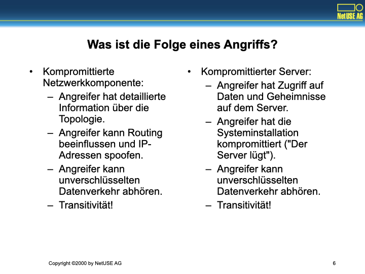
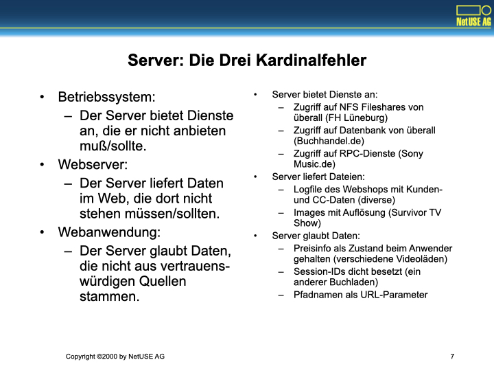
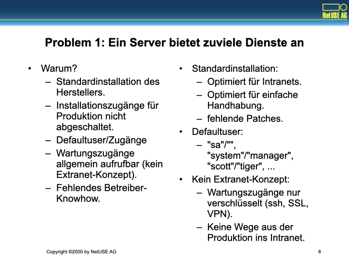

NetUSE AG, http://www.netuse.de, ist ein Internet Systemhaus in Kiel.

Gegründet 1992, war die Firma ursprünglich als Internet Service Provider tätig. 
Heute werden die Geschäftsfelder ISP-Geschäft, Consulting, Hard- und Softwarehandel, Service und Support sowie Anwendungsentwicklung abgedeckt. 
NetUSE hat derzeit etwa 60 Mitarbeiter und wächst schnell.

Zu den Kunden gehören viele größere Konzerne, etwa Deutsche Telekom, Mobilcom, DASA/Airbus, der Landtag des Landes Schleswig-Holstein und andere.

# Gehackt


"Hacken" einer Website ist ein Angriff auf Verfügbarkeit, Integrität oder Vertraulichkeit.

"Hacker" vs. "Cracker"

Ursprünglich bezeichnete das Wort "Hacker" einen Menschen, der ein Programm oder eine Maschine dazu bringen konnte, irgendetwas Unerwartetes oder Geniales zu tun.
Jemand, der in Rechner einbricht oder Kopierschutze entfernt, war dagegen ein "Cracker".

Die Medien haben jedoch entschieden und verwenden die Bezeichnung "Hacker" im Wortsinn der Bezeichnung "Cracker".
Dies ist nicht mehr zu ändern.

# Wer greift an?


Zwei große Gruppen:
- "Script Kiddies", Angreifer ohne Insiderwissen und ohne tiefergehende Ausbildung, verwenden meist vorgefertigte Angriffswerkzeuge. Greifen ungerichtet an (Scanning) und brechen in eine große Zahl von Systemen ein.
- "Insider", (Ex-)Mitarbeiter et. al. Teilweise weitgehendes Wissen über Infrastruktur, verwendet Systemtools, Angriffswerkzeuge und selbstgeschriebene, maßgeschneiderte Programme ("Das Einbruchswerkzeug sitzt zwischen den Ohren").  Will gezielt an bestimmte Netzwerkressourcen herankommen.

"Script Kiddies" oder "Spielkinder" sind eigentlich kein neues Phänomen.
Neu ist lediglich, daß eine so große Anzahl von Werkzeugen existiert, die es Spielkindern so leicht macht, ihren Neigungen nachzugehen.

Spielkinder sollten für den Administrator einer Site eigentlich kein Problem sein, ihre Methoden und Werkzeuge sind beschrieben in
- "Maximum Linux Security", Anonymous, Taschenbuch - 800 Seiten (1999) Sams Publishing; ISBN: 0672316706
- "Hacking Exposed - Second Edition", Joel Scambray, Stuart McClure, George Kurtz, Taschenbuch - 700 Seiten (Oktober 2000), Osborne/McGraw-Hill; ISBN: 0072127481

Insider sind ein wesentlich schwierigeres Problem und nur durch ein durchgehendes Sicherheitskonzept zu bekämpfen, das von dem betreffenden Betrieb auch gelebt werden muß.

# Welche Ziele verfolgen Angreifer?


- "Script Kiddies": Warez-Site, IRC "Trading-Bots", Bandbreite, Paßworte als Handelsware
- "Insider": Rache, spezifische Informationen aus dem Intranetwork, Kundenstammdaten, Kundenverkehrsdaten

"Script Kiddies" sind auf der Suche nach Umschlagplätzen für "Warez", d.h. für geknackte Raubkopien von Programmen, Musik-CDs und Spielfilmen.
Sie stehen über eine Reihe von unterschiedlichen Kommunikationssystemen miteinander in Verbindung und benötigen für ihr Geschäft massenhaft Plattenplatz, Netzbandbreite und Kommunikationsplattformen.

Schlecht geschützte und unzureichend gepflegte Rechner sind ihre bevorzugte Beute. 
Sie finden diese Maschinen, indem sie mit Hilfe von "vulnerability scannern" ein Netzwerksegment nach Programmen mit bekannten Fehlern absuchen und dann halb- oder vollautomatisch in diese Maschinen einbrechen.
Der Automat trägt in der Regel einen gescripteten Angriff binnen weniger Sekunden vor und installiert einen Satz von modifizierten Systemwerkzeugen, ein sogenanntes "root kit", das den Einbruch vertuscht und den verbrauchten Plattenplatz sowie die Prozesse des Einbrechers vor dem Sysadmin verbirgt.

Insider gehen dagegen meist gegen einen bestimmten Rechner im Netz vor, von dem sie spezifische Daten (Mails, Kundenstammdaten, Protokolle) haben möchten, oder dessen Betrieb sie sabotieren möchten.

# Was wird angegriffen?


- Netzwerkkomponenten: Router, Firewalls, Switches
- Ziel: Angriffsquelle verschleiern, Stepping Stone, Netzwerktopologie ermitteln, Netzwerkverkehr belauschen

- Server (eigentliches Ziel): Server-Betriebssystem, Webserver, Webanwendung
- Ziel: Zugang zum Server-Betriebssystem, Zugang zu den Zieldaten

Angriffe erfolgen in den meisten Fällen auf Server, nicht auf Netzwerkkomponenten:
Wissen um Betriebssysteme und Fehler von Servern ist in den relevanten Kreisen meist wesentlich weiter verbreitet.

Angriffe auf Netzwerkkomponenten erfolgen fast niemals durch Script Kiddies (Ausnahme sind bestimmte Distributed Denial Of Service-Angriffe), sondern fast immer als Teil eines geplanten Angriffes mit Insiderwissen und durch besser ausgebildete Angreifer.

Auf dem Server können Angriffe dem Serverbetriebssystem, dem installierten Webserver oder der Webanwendung selbst gelten.

# Was ist die Folge eines Angriffs?



- Kompromittierte Netzwerkkomponente:
  - Angreifer hat detaillierte Information über die Topologie.
  - Angreifer kann Routing beeinflussen und IP-Adressen spoofen.
  - Angreifer kann unverschlüsselten Datenverkehr abhören.
  - Transitivität!
- Kompromittierter Server:
  - Angreifer hat Zugriff auf Daten und Geheimnisse auf dem Server.
  - Angreifer hat die Systeminstallation kompromittiert ("Der Server lügt").
  - Angreifer kann unverschlüsselten Datenverkehr abhören.
  - Transitivität!

Es ist davon auszugehen, daß Betriebssystem und Anwendungen auf einem kompromittierten Rechner so verändert sind, daß sie den Administrator belügen.
Der Rechner kann nicht wiederhergestellt werden, er muss neu installiert werden.

Zur Sicherung der Beweismittel gelten die folgenden Regeln:
- Alle Platten aus dem betreffenden Rechner ausbauen und niemals wieder mounten. Ein Mount würde access times an Dateien oder wichtigeres zerstören und das Medium als Beweismittel unbrauchbar machen.
- Die betreffenden Platten können in eine andere Maschine eingebaut, um mit dd Images zu generieren (`dd if=/dev/hdc of=/export/disk2/imagefile`). Weitere Analysen finden nur auf den Images statt.

Transitivität ist ein Problem:
Kompromittierte Rechner sind Sprungbretter für ein weiteres Eindringen in das gehackte Netz oder für Angriffe auf andere Netzwerke:
- Paßworte können mit Sniffern ausgespäht worden sein.
- Andere Administratoren in anderen Netzen müssen informiert werden.

Gehackt ist nie ein einzelner Rechner, sondern immer mindestens ein Subnetz!
Aufräumen und Validierung bringt enorme Kosten!

# Server: Die Drei Kardinalfehler



- Betriebssystem: Der Server bietet Dienste an, die er nicht anbieten muß/sollte.
- Webserver: Der Server liefert Daten im Web, die dort nicht stehen müssen/sollten.
- Webanwendung: Der Server glaubt Daten, die nicht aus vertrauenswürdigen Quellen stammen.

- Server bietet Dienste an:
  - Zugriff auf NFS Fileshares von überall (FH Lüneburg)
  - Zugriff auf Datenbank von überall (Buchhandel.de)
  - Zugriff auf RPC-Dienste (Sony Music.de)
- Server liefert Dateien:
  - Logfile des Webshops mit Kunden- und CC-Daten (diverse)
  - Images mit Auflösung (Survivor TV Show)
- Server glaubt Daten:
  - Preisinfo als Zustand beim Anwender gehalten (verschiedene Videoläden)
  - Session-IDs dicht besetzt (ein anderer Buchladen)
  - Pfadnamen als URL-Parameter

Angriffe auf einen Webserver lassen sich in drei Problemklassen einteilen:
- Angriffe auf das Betriebssystem. Bei dieser Sorte Angriff werden bekannte Schwächen in Diensten ausgenutzt, die das Betriebssystem standardmäßig anbietet.
  Dies setzt voraus, daß das Betriebssystem diesen Dienst überhaupt anbietet. 
  Dienste, die nicht eingeschaltet sind, können über das Netz nicht für einen remoten Angriff genutzt werden.
- Angriffe, die darauf abzielen, bestimmte Logdaten oder andere Informationen zu beziehen, die der Webserver anbietet (aber nicht anbieten sollte).
  Diese Angriffe sind spezifisch für Webserver und Webanwendungen, meist sind sie nur bei schlechten Defaultkonfigurationen in Zusammenhang mit schlampigem Setup möglich.
- Angriffe, die spezifisch auf die eingesetzte Webanwendung abzielen und die sich schlechte Programmiergewohnheiten der Entwickler zunutze machen.
  Viele Webanwendungen gehen davon aus, daß ein Client/Browser vertrauenswürdig ist und nicht manipulierte Daten liefert. Diese Annahme ist im Allgemeinen falsch.

# Problem 1: Ein Server bietet zuviele Dienste an



- Warum?
  - Standardinstallation des Herstellers.
  - Installationszugänge für Produktion nicht abgeschaltet.
  - Defaultuser/Zugänge
  - Wartungszugänge allgemein aufrufbar (kein Extranet-Konzept).
  - Fehlendes Betreiber-Knowhow.
- Standardinstallation:
  - Optimiert für Intranets.
  - Optimiert für einfache Handhabung.
  - fehlende Patches.
  - Defaultuser: "sa"/"", "system"/"manager", "scott"/"tiger", ...
  - Kein Extranet-Konzept:
    - Wartungszugänge nur verschlüsselt (ssh, SSL, VPN).
    - Keine Wege aus der Produktion ins Intranet.

Für den sicheren Betrieb von Servern gilt generell, daß ein Rollout- und Pflegekonzept vorhanden sein muss.
Dies klingt selbstverständlich, ist es aber nicht:

- Werden Systeminstallationen industriell gefertigt?
  Installserver erlauben reproduzierbare Installationen, Versionierung von Installationen und den systematischen Test einer Installation.
- Werden Systemupdates industriell durchgeführt?
  Test- und Verteilkonzepte für die Software auf Servern in der Produktion müssen existieren, damit Fehlerkorrekturen und Upgrades schnell und sicher verteilt werden können.
- Breakeven-Point ist klein, schon ab 5 identischen Installationen rentiert sich das Knowhow und der Aufwand.

Oft werden Extranet-Kontakte mit unstrukturierten Kontakten mit Laufkundschaft gleichgesetzt:
- Verbindungen sind nicht auf bestimmte Teilnetze beschränkt.
- Verbindungen sind nicht verschlüsselt.
- Verbindungen sind nicht gut authentisiert.

Derartige "offene" Extranet-Kontakte sind ein beliebtes Einfallstor in Produktionsnetze von Firmen.

# Überflüssige Dienste


Standardinstallation (UNIX):
- Webserver für Manualpages (mehrere)
- Systemadministration
- Backupsteuerung
RPC-Server für 
- Backupsteuerung (Legato)
- Systemadministration
- Desktop-Komponenten
- Network Filesystems
- (Datenbanken)
- Oracle, MySQL
- Application-Server

```console
Interesting ports on jayniz.de:
Port State  Protocol  Service
21   open    tcp   ftp
22   open    tcp   ssh
25   open    tcp   smtp
53   open    tcp   domain
80   open    tcp   http
111  open    tcp   sunrpc
113  open    tcp   auth
199  open    tcp   smux
443  open    tcp   https
515  open    tcp   printer
1024 open    tcp   unknown
3306 open    tcp   mysql
6666 open    tcp   irc-serv
7000 open    tcp   afs3-fileserver

Nmap run completed -- 1 IP address (1 host up) scanned in 4 seconds
```

- "www.jayniz.de" am 30. August 2000:
  - Unverschlüsselte Systemzugänge mit ftp, obwohl ssh eingesetzt werden könnte.
  - 53/tcp ist offen für alle, statt nur für Secondary Server zugreifbar zu sein.
  - 111/tcp ist weit offen und erlaubt den Angriff auf RPC-Dienste.
  - 515/tcp läuft vollkommen sinnlos.
  - 3306/tcp erlaubt Zugriff auf eine Datenbank.
  - **199/tcp führt auf eine Bash mit root-Rechten:**
  - Die Maschine wurde bereits gehackt und mit einem Rootkit versehen. Für den Administrator sind über die Backdoor eingeloggte Benutzer nicht in der Prozeßliste und der Speicherstatistik zu sehen, der von ihnen verbrauchte Plattenplatz wird versteckt. Die Maschine lauscht auf ihrem Netzwerksegment nach Klartext-Paßworten für andere Maschinen, nur ein Switch hat schlimmeres verhindert.
  - ipchains waren auf der Maschine installiert, aber nicht in Betrieb.
  - 3 Tage nach Neuinstallation wurde die Maschine wieder gehackt (RedHat mit wuftpd 2.6.0 als Einfallstor).

# Notwendige Dienste


Notwendig sind meist nur zwei Dienste:
- Domain Name System, aber nur outgoing?
- HTTP/HTTPS

Zur Wartung oft weitere Dienste:
- FTP -> besser: ssh, scp, rsync
- telnet/rlogin -> besser: ssh
- POP/IMAP -> besser: S/POP, S/IMAP

Zum Intranet oft weitere Dienste:
- Datenbank/LDAP
- rlogin/rcp, FTP/TELNET -> besser: ssh/scp

Drei goldene Regeln:
- Minimiere die angebotenen Dienste.
- Schränke nichtöffentliche Dienste über IP-Number so weit wie möglich ein.
- Übertrage keine Paßworte im Klartext!

Und nicht vergessen, die wichtigste Regel überhaupt:
- Lies die einschlägigen Securityforen.
  - Bugtraq, NT-Bugtraq, Securityfocus.com und andere.
  - Aktualisiere Deine Installationen regelmäßig.

Letzterer Punkt setzt voraus: Ein Betriebskonzept.
- Welche Software in welcher Version läuft wo?
- Wie bekommen wir Updates auf diese Maschinen, ohne den Betrieb zu unterbrechen? 
- Wie bekommen wir gleichartig installierte neue Maschinen? (Installserver).

# Die Realität


```console
Windows 2000, IIS
Port    State     Protocol  Service
21      open      tcp     ftp
25      open      tcp     smtp
80      open      tcp     http
106     open      tcp     pop3pw
110     open      tcp     pop-3
135     open      tcp     loc-srv
143     open      tcp     imap2
389     open      tcp     ldap
443     open      tcp     https
```

```console
AIX
Export list for rzserv2.fh-lueneburg.de:
/stadtinf       (everyone)
/usr/lib/cobol  (everyone)
/usr/local      (everyone)
/ora-client     193.174.32.20
/user           (everyone)
/usr/lpp/info   (everyone)
/install        193.174.32.20
/u              (everyone)
/pd-software    (everyone)
/var/spool/mail (everyone)
/u1             (everyone)
```

```console
Unix, Apache:
Port    State   Protocol  Service
21      open    tcp       ftp
22      open    tcp       ssh
23      open    tcp       telnet
25      open    tcp       smtp
80      open    tcp       http
110     open    tcp       pop-3
111     open    tcp       sunrpc

rpcinfo -p www.....de
program vers proto port
100000    4   tcp   111 portmapper
...
100024    1   udp 32772 status
...
100021    1   udp  4045 nlockmgr
```

Windows 2000 Advanced Server läßt gerne seinen Active Directory Dienst über den LDAP-Port offen zugänglich.

- `ldapsearch -h <ip> -b "" -s base "objectclass=*"` liefert eine Reihe von Naming Contexts. Diese kann man dann der Reihe nach durchprobieren.
- `ldapsearch -h <ip> -b "<context>" "objectclass=*"` erlaubt es sich, den entsprechenden Kontext anzusehen.

In Unix wird dagegen gerne der Portmapper offengelassen, der gleich eine ganze Reihe von unzureichend geschützten Diensten erschließt.
Fehler sind in der Vergangenheit im Portmapper selbst sowie in vielen Diensten aufgetreten.
NFS ist sowieso ein Sicherheitsrisiko und sollte von außen nicht erreichbar sein.

# Abhilfe


- Kein Kontakt zum Internet ohne Firewall:
  - Keine Ausnahmen während der Installation
- Unterscheide Kundenkontakte und Extranet-Kontakte:
  - Wartungszugänge immer
    - verschlüsselt
    - besonders authentisiert
    - nur für bestimmte Adressen

- Regelmäßige Kontrolle
  - Selbst von außen Ports scannen.
  - Selbst von außen "einbrechen".
- Regelmäßige Updates
  - Bugtraq verfolgen.
  - Patchlisten verfolgen.
  - Update-Konzept für Produktionsrechner
    - Zykluszeit < 3 Monate
- Transitivitäten prüfen
  - von außen über DMZ ins Intranet?

Noch einmal:
- Kein Kontakt zum Internet ohne Firewall.
  - Wenigstens ein Paketfilter sollte vorhanden sein, damit auch bei schlampiger Konfiguration im Produktionsnetz nur die intendierten Dienste nach außen sichtbar sind. Verdächtige Pakete sollten gleich gefiltert werden.
- Keine Ausnahmen während der Installation. (Auch nicht für Slashdot).
  - Slashdot.org-Hack: Testmaschine mit Defaultpaßworten (Fehlerklasse 1 == nicht intendierte Dienste öffentlich angeboten) plus "eval-Bug" (Fehlerklasse 3 == Anwendung vertraut Daten aus dem Netz).
- Keine unverschlüsselte authentisierte Kommunikation.
  - SSL. ssh. tcpwrapper/libwrap.a. Nichts  anderes.
- Wer nach Ausnahmen fragt, wird geLARTet.

# Problem 2: Ein Server liefert sensible Dateien


- Webserver als Transformationsmaschine für Pfadnamen
  - Regelsatz:
    - `DocumentRoot /www`
    - `Alias /images /www2/images`
    - `ScriptAlias /cgi-bin /www2/prod/cgi`

- Was passiert, wenn
  - das Serverlog nach `/www/logs/access.log` gelegt wird?
  - das Verzeichnis `/images` browseable ist oder Bildnamen ratbar sind? 
  - `/www/htpasswd` abrufbar ist?
  - Include-Dateien in `/www/include/` abgelegt sind?

"Kann mir nicht passieren?"
- klassischer Fall: Suse Linux Standardregel
  - Alias /cgi-bin-sdb/ /usr/local/httpd/cgi-bin/
- Viele Webshops und andere Standardscripte schreiben Logs oder andere wichtige Informationen in ihr Installationsverzeichnis unterhalb der DocumentRoot.

# Abhilfe


Verzeichnisse außerhalb DocumentRoot:
```console
/home/www/servers/www.kunde.de
    +--> /cgi-bin
         /database
         /logs
         /pages
         /php
         /tmp

DocumentRoot /home/www/servers/www.kunde.de/pages
FTP-Root: /home/www/servers/www.kunde.de
```

Leider nicht sehr übliche Konfiguration

# Nebenkriegsschauplatz Webhosting


- Zugriff durch CGI-Programme aus Hostingumgebungen:
  - Kunde rät aus eigenen Verzeichnisnamen fremde Verzeichnisnamen
  - Kunde schreibt Programme, die Verzeichnisse anderer Kunden durchsuchen

- Abhilfe:
  - chroot()-Umgebungen, "virtuelle Maschinen"
- Nachteil:
  - Aufwendige Realisierung
  - Hoher Speicherbedarf
  - Umständliches Debugging
- Vorteil:
  - ausgezeichnete Systemsicherheit

# Problem 3: Ein Server glaubt nicht vertrauenswürdige Daten


- Bedeutung einer Firewall im Datenfluß:
  - Protokollbegrenzer
  - Authentisierung
  - Trust Boundary
- Bedeutung "Trust Boundary"
  - Systeme/Datenquellen innerhalb werden durch unsere Administration kontrolliert.
  - Sie liefern daher vertrauenswürde Daten.

- Die Umkehrung darf niemals vergessen werden!
  - Systeme/Datenquellen außerhalb der Boundary sind unkontrollierbar.
  - Sie liefern daher **verseuchte** Daten. 
  - Diese Daten müssen vor Gebrauch unbedingt **dekontaminiert** werden.
  - Sie dürfen die Boundary danach niemals wieder nach draußen verlassen.

Trust Boundaries arbeiten in zwei Richtungen. 
Dieser Vortrag betrachtet hauptsächlich den Datenstrom "von außen nach innen", aber auch der Datenstrom "von innen nach außen" ist wichtig.
- Authensierung des Servers durch Serverzertifikat.
- Verhinderung von Informationslecks durch Informationen im Referer (Nicht wirklich ein Datenstrom "von innen nach außen", aber in der Verantwortung des Anwendungsprogrammierers.

Anwendungen müssen alle Daten "von außen nach innen" prüfen und dann "drinnen" behalten:
- Sessions! Niemals HIDDEN-Parameter!
- Daten von "außen":
  - Alle GET-, POST- und COOKIE-Variablen.
  - Alle HTTP_*-Variablen.
  - Alle File-Uploads.
- Schleichende Einschleppung durch
  - unzureichende Validierung (-> OOH Forms)
  - `register_globals = On` (-> `register_globals = off`)

# Trust Boundary


Typische Fehler:
- Anwenderdaten werden durch HIDDEN-Parameter oder per GET/POST/COOKIE weitergereicht.
- Anwendung vertraut Daten aus dem Request in sicherheitsrelevanten Fragen:
  - Referer, User-Agent, IP-Nummer, ...
- Anwendung validiert Anwendungsdaten nur mit JS.
  - Na und? Ich habe kein JS, ich sende mit "telnet".
- Anwendung validiert Anwendungsdaten nicht.
  - "Wie kann ich Formularvariablen bei einer Session registrieren?"
  - "Wie kann ich ein SQL-Statement von Seite zu Seite weiterreichen?"
    - cf. Stored Procedures im MS-SQL Server wie sp_system().

Abhilfe:
- Anwendung validiert Daten serverside, mit einem geprüften Satz von Funktionen/Klassen.
- Nur validierte Daten werden Bestandteil der Session.
- Nur Sessiondaten werden verarbeitet, GPC- und Request-Informationen werden niemals verwendet.

# Ursache


- Der 3. Kardinalfehler ist sehr häufig. Warum?
  - HTTP ist ein zustands-loses Protokoll.
  - Webanwendungen brauchen Zustand.
  - Viele Umgebungen bieten keine adäquate Unterstützung für Statekeeping.
  - Viele Entwickler stricken sich "halbe" Lösungen selbst.

Warum Sessions?

- Dem Anwender steht nur ein einzelnes Token zur Referenzierung des Sessiondatensatzes zur Verfügung.
  - Klare Fehlersemantik: Sessiondaten sind entweder komplett und vertrauenswürdig, oder gar nicht vorhanden (-> neue Session).
  - Klarer Datenfluß (GPC/HTTP-Daten -> Validierung -> Session -> Anwendung), Umgehung der Validierung ist nicht möglich.
- Viel Code wird einfacher, da die Anwendung sich nun "erinnern" kann.
- Anwendungsstruktur wird klarer.
  - Saubere Trennung von "statekeeping", "authentication", "authorization", wie sie in PHPLIB durchgeführt wird.
  - Infrastruktur ("Sessions") wird wiederverwendet, daher besser geprüfter und wiederverwendbarer Code.
- Wichtig: Token darf nicht ratbar ("17") sein.
  - $id = md5(uniqid("geheim"));
  - oder eine Zufallszahl

# Weitere Ursachen


Andere Gründe:
- Aus Zeitdruck Prototypen in Produktion geben.
- Rapid Prototyping ersetzt keine Designphase.
- Es ergänzt die Analysephase.

Datei-Struktur der Anwendung vs. Datenfluß
- An welcher Stelle übernimmt die Webanwendung Benutzerdaten?
- Was passiert, wenn man ihr an anderen Stellen Daten übergibt?
- Was passiert, wenn der Anwender URLs wahllos aufruft?

Eingabevalidierung ist mühsam.
- Findet an allen Stellen Eingabevalidierung statt?
- Ist diese vollständig?

Struktur in der Anwendung kommt nur durch Struktur im Entwicklungsprozeß.
Hemmungslose Kaufempfehlung:
- "Web Application Programming", Gerken/Ratschiller, New Riders

# Abhilfe


- Statekeeping durch Application Server managen lassen.
- Anwendung als Automaten strukturieren.
  - Automaten lassen sich gut formal verifizieren.
- Eingaben zentral prüfen
  - Application Server sollte Bibliothek zum Formularmanagement haben.
  - Datentypen strikt prüfen.
- Eigentlich überflüssig, aber immer wieder gesehen:
  - Pfadnamen oder gar Code haben in Parametern nichts zu suchen. 

- Entgegen der populären Volksmeinung sind viele Methoden aus der Mathematik und dem Informatikstudium sehr hilfreich bei der Entwicklung von Webanwendungen.
  - Anwendung als Code + State modellieren.
  - Formales Datenmodell, formales Datenbankmodell, formales Angreifermodell, formales Sicherheitsmodell.
  - Automatentheorie.
  - Analyse- und Designmethoden zur Identifikation wiederverwendbarer Komponenten und zur Findung von Bibliotheks-APIs.
  - projektbegleitender Code Review, Post Deployment Projektanalyse.
- Webprojekte unterscheiden sich nicht von normaler Anwendungsentwicklung, sie sehen nur auf den ersten Blick anders aus.
  - weit mehr als 80% aller LOC sind PHP, nicht HTML.
  - Das fremdartige Aussehen rührt weitgehend aus dem Fehlen angemessener Werkzeuge und Bibliotheken her.
  - PHP3 pur ist für die Anwendungsentwicklung im Web nicht angemessen.
    - Fehlendes Statekeeping, fehlende Eingabevalidierung
    - -> PHPLIB!
