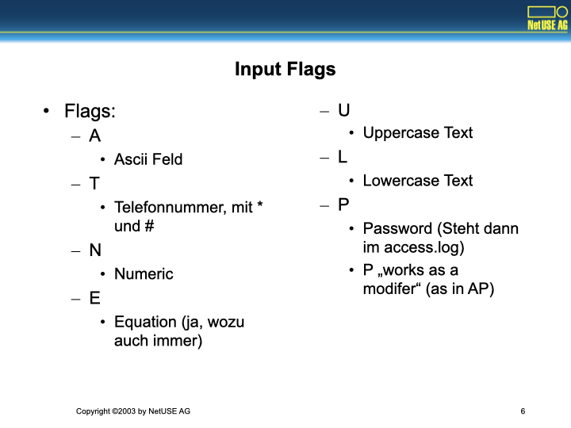

# Cisco IP Phone XML


Dokumentation bei Cisco
- Als HTML: http://www.cisco.com/en/US/products/sw/voicesw/ps556/
- Auch als PDF: http://www.cisco.com/univercd/cc/td/doc/product/voice/sw_ap_to/devguide/phsvcdev.pdf
- Definiert nur sehr wenige Tags
  - Ruft bei Druck der Service-Taste eine vordefinierte Seite auf
    - Diese Seite bekommt keine Parameter
      - Das ist doof!
    - Diese Seite ist im Normalfall ein Menü

# Tagliste


Definierte Elemente:
- CiscoIPPhoneMenu
- CiscoIPPhoneText
- CiscoIPPhoneInput
- CiscoIPPhoneDirectory
- CiscoIPPhoneImage
- CiscoIPPhoneGraphicMenu

Ist das gutes XML Design?
- Upcase?
- `CiscoIPPhone` Prefix statt Namespace?
- Wahrscheinlich keine vollständige XML-Implementierung
  - Dafür ist das Phone viel zu klein
  - Häufig, daher Standard nur begrenzt von Wert
  - Das entwertet jedoch auch XML Designtools

# CiscoIPPhoneMenu


```xml
<CiscoIPPhoneMenu>
  <Title>Blafasel</Title>
  <Prompt>Machwas</Prompt>
  <MenuItem>
    <Name>Profit</Name>
    <URL>http://boss/.</URL>
  </MenuItem>
</CiscoIPPhoneMenu>
```

- Elementliste war natürlich nicht abschließend:
  - CicsoIPPhoneMenu enthält
    - Title
    - Prompt
    - MenuItem
    - Name
    - URL


Beachte:
- Case Sensitivity
- Kein DEBUG!

# CiscoIPPhoneText


```xml
<CiscoIPPhoneText>
<Title>Blafasel</Title>
<Text>Lall</Text>
<Prompt>Machwas</Prompt>
</CiscoIPPhoneText>
```
CiscoIPPhoneText enthält
- Title
- Text
- Prompt

Beachte:
- Keine Layoutmöglichkeiten
- Nicht auf Umbruch verlassen
- Unterschiedliche Modelle

# CiscoIPPhoneInput


```xml
<CiscoIPPhoneInput>
  <Title>Blafasel</Title>
  <Text>Lall</Text>
  <Prompt>Machwas</Prompt>
  <URL>http://...</URL>
  <InputItem>
    <DisplayName>Name:</DisplayName>
    <QueryStringParam>name</QueryStringParam>
    <InputFlags/>
    <DefaultValue>Köhntopp</DefaultValue>
  </InputItem>
</CiscoIPPhoneInput>
```

CiscoIPPhoneInput enthält
- Title
- Prompt
- URL
- InputItem
  - DisplayName
  - QueryStringParam
  - InputFlags
  - DefaultValue
- Das wird dann ein GET
  - Kein POST Support

# CiscoIPPhoneInput Flags



Flags:
- A: Ascii Feld
- T: Telefonnummer, mit * und #
- N: Numeric
- E: Equation (ja, wozu auch immer)
- U: Uppercase Text
- L: Lowercase Text
- P: Password (Steht dann im access.log)
  - P „works as a modifer“ (as in AP)

# CiscoIPPhoneDirectory


```xml
<CiscoIPPhoneDirectory>
  <Title>Ruf Mich An!</Title>
  <Prompt>*peitsch*</Prompt>
  <DirectoryEntry>
    <Name>For a good time, call...</Name>
    <Telephone>0-0190-441777</Telephone>
  </DirectoryEntry>
</CiscoIPPhoneDirectory>
```

CiscoIPPhoneDirectory
- Title
- Prompt
- DirectoryEntry
  - Name
  - Telephone

# CiscoIPPhoneDirectory II


URL Directories Parameter
- Kann im Phone gesetzt werden.
- Zeigt auf ein XML Objekt vom Typ CiscoIPPhoneMenu
- Erweitert das Menü Directories
  - sonst nur local services
- Dieses Menü kann enthalten:
  - CiscoIPPhoneInput
  - CiscoIPPhoneText
  - CiscoIPPhoneDirectory (Pflicht)
- Sinnloserweise nur in dieser Reihenfolge

# CiscoIPPhoneImage


CiscoIPPhoneImage
- Title
- LocationX -1 center
- LocationY -1 center
- Width
- Height
- Depth
- Data
- Prompt

- 133x64 Pixel, 2 bit Greyscale Settings („3“ black, „0“ white)
  - Ja, das Format ist geräteabhängig
  - Nein, Cisco hat sich keine Gedanken über Mischbestückung gemacht
  - UserAgent-Hacks?
- (0,0) is UL-corner

# CiscoIPPhoneImage II


- "generiere 4 Pixel: dunkel, schwarz, hell, weiss" -> 1 3 2 0
- als Bits: `01 11 10 00`
- als Byte: `00 10 11 01`
- als Value: `2D`

- Bild muß ein Vielfaches von 4 Pixeln pro Zeile haben

wird dann zu:

```xml
<CiscoIPPhoneImage>
  <Title/>
  <LocationX>-1</LocationX>
  <LocationY>-1</LocationY>
  <Width>4</Width>
  <Height>1</Height>
  <Depth>2</Depth>
  <Data>2D</Data>
  <Prompt/>
</CiscoIPPhoneImage>
```

# CiscoIPPhoneGraphicMenu


CiscoIPPhoneGraphicMenu
- Title
- LocationX
- LocationY
- Width
- Height
- Depth
- Data
- Prompt
- MenuItem
  - Name, URL

- Das ist nur für wunderliche Sprachen sinnvoll.

# HTTP Parameter


- Refresh
  - Time (Seconds)
- URL (optional)
- Content-Type
  - Cisco dokumentiert ContentType !!!
- Expires
  - Expired pages will not be added to the URL stack of the phone
