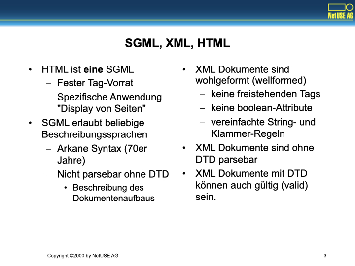
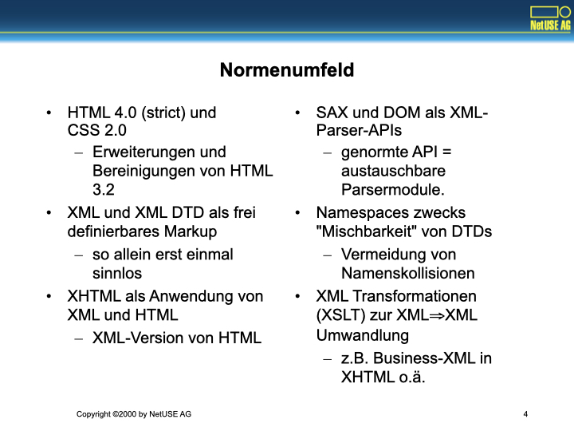
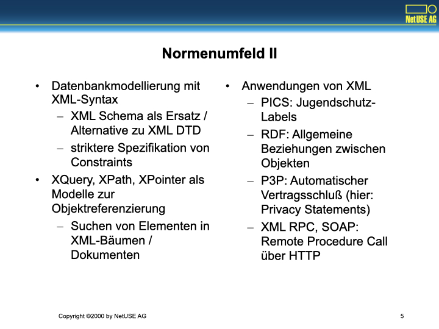
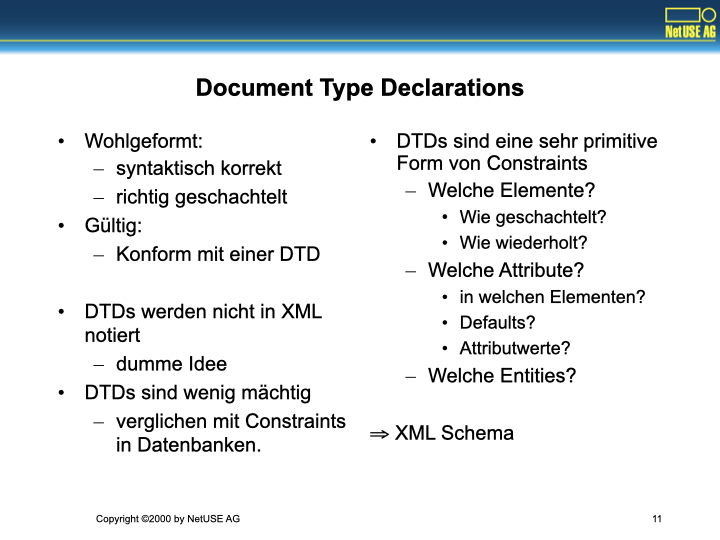
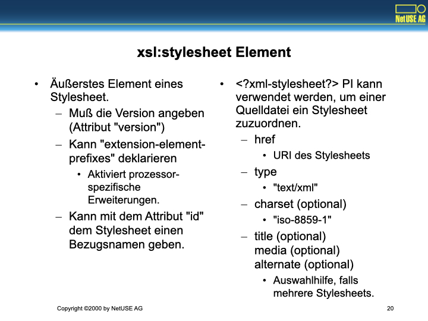
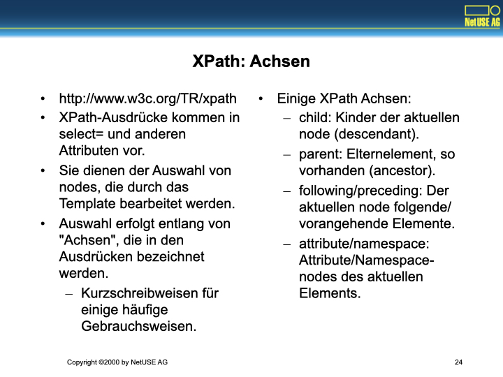
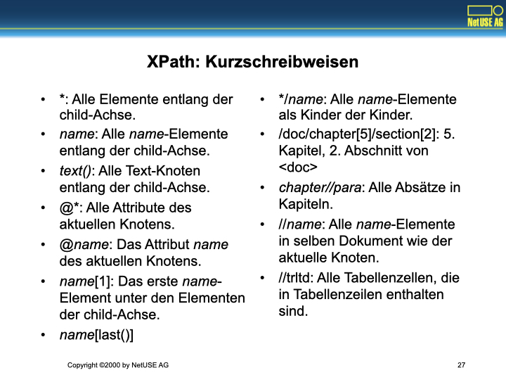
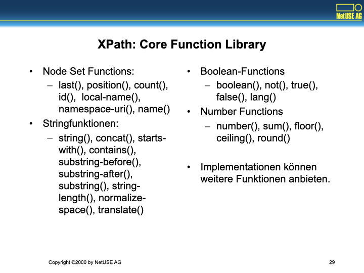

# XML Normensalat


XML ist ein sehr unübersichtliches Thema, bestehtend aus einem Strauß von ca. 10 Normen.
Einige dieser Normen sind zueinander inkompatibel.
Vieles ist noch experimentell, oder noch nicht verabschiedet.
Was schon da ist und funktioniert ist jedoch sehr interessant.

Wir kennen die Normen:
- HTML 4.0 -> XHTML 1.0
- XML, XML DTD, Namespaces, DOM, SAX, CSS, Xlink, XPath, XQuery, XML Schema und XSLT

- Das Versprechen: Vereinfachung, Flexibilität und Datenbankintegration.

# Warum XML?


XML als Standard erscheint 1996 als eine Markup-Variante von SGML, aber regulärer und einfacher zu parsen.
Das Ziel der Norm ist ein vereinheitlichtes Datentauschformat für die Industrie mit den Eigenschaften "Self-Describing" und "lang, aber gut komprimierbar", Ablösung von "EDIFACT".

Für den Entwickler ist das Versprechen Vereinfachung durch normierte Parser und einfache Varidierung durch normierte Datenschemata.
API-Normen sind SAX (streaming Parser) und DOM.

# SGML, XML, HTML



HTML ist *eine* SGML, mit einem vorgeschriebenen festen Tag-Vokabular, für die spezielle Anwendung "Display von Seiten".

SGML als Metanorm erlaubt aber die Definition von beliebigen Seitenbeschreibungssprachen.
SGML selbst ist eine weitgehend unbekannte IBM-Technologie aus den 70er Jahren, und das merkt man an vielen Stellen.
Ohne eine DTD (ein Sprachschema) ist eine SGML nicht parsebar, cf HTML ("IMG"-Element muss nicht geschlossen werden, andere schon).

Die DTD für XML definiert eine Sprache, die wohlgeformt ist (Klammerbaum ohne frei stehende Tag, ohne Boolean-Attribute, mit ein paar Vereinfachungen für Srings und Klammern)
Wegen der Regelmäßigkeit ist XML ohne DTD parsebar, auch wenn man die Bedeutung der Elemente nicht kennt.
Durch die optionale DTD wird XML validierbar.

# Normenumfeld



HTML 4 (strict) und CSS 2 sind eine Erweiterung und Bereinigung von HTML 3.2.

XML und XML DTD sind eine Art Markup-Sprache mit frei definierbaren Tags, also alleine erst mal sinnlos.

XHTML ist eine Schreibweise von HTML nach den Regeln von XML.

SAX und DOM sind zwei genormte Parser-APIs, für jede dieser APIs kann es viele unterschiedliche Parser geben.

Namespaces definieren Verfahren zum Mischen zweier XML-DTDs, Ziel ist die Vermeidung von Namenskollisionen.

Mit XSLT kann man eine Transformation von einem XML zu einem anderen XML spezifizieren, etwa ein Business-XML in XHTML. Ich habe das im Rahmen der dclp FAQ genutzt, um eine FAQ in XML zu schreiben und als HTML-Dokument zu rendern.

# Normenumfeld II



Im Business-Umfeld müssen oft Datenaustauschformate spezifiziert werden.
Dazu ist ein Schema notwendig.
XML DTD ist dazu oft zu sperrig und definiert auch keine Datentypen, die für Programmiersprachen nutzbringend werden.
XML Schema schafft Abhilfe.

Zum Ausschneiden und Adressieren von Dingen in XML-Dokumenten XQuery, XPath und XPointer.

Anwendungen von XML finden wir in
- PICS: Jugendschutz Labels
- RDF: Allgemeine Objektbeziehungen
- P3P: Automatischer Vertragsschluß, hier: Privacy Statements
- XML RPC< SOAP: RPC über HTTP

# XML Syntax I: Tags


XML ist
- case sensitive
- verwendet als Zeichensatz überall Unicode
- erlaubt verkürzte Schreibweise leerer Elemente: `<bla></bla>` wird zu `<bla/>`.
- verlangt saubere Klammergebirge: `<b><i>bla</i></b>`.
- Die Tags mit der Sequenz `<xml*></xml*>` sind reserviert.

# XML Syntax II: Attributes, Entities


Tags könnnen Attribute haben. Die sind ebenfalls Case Sensitive, einmalig pro Tag, und müssen zwingend Werte in Anführungszeichen haben (einfache oder doppelte).
Leere Attribute werden durch Wiederholung des Namens als String geschrieben.

Zeichendaten werden geparsed, das führt zu Entities.
Zwingend sind `&lt;` und `&amp;`, auch `&gt;`, `&apos;` und `&quot;`.
Beliebige Zeichen sind per Zeichencode definierbar.

Die DTD kann weitere Entities vordefinieren.
Diese können auch externe Files referenzieren.
Dadurch bekommmt man einen Include-Mechanismus.

Oder Literale mit CDATA: `<[CDATA[<&>'"]]>`

# XML Syntax III: Whitespace, Language


Whitespace (Tab, LF, CR und Space) ist normalerweise ohne Bedeutung.
In besonderen Fällen ist jedoch mehr Kontrolle notwendig.
Das Spezialattribut `xml:space` kann `default` oder `preserve` angeben und wirkt auf den Text im Element.

```xml
<beispiel xml:space="preserve">
       Besonders     kompliziert.
</beispiel>
```

Weiterhin definiert das Attribut `xml:lang` die Sprache eines Elementes.
Zugelassen sind ISO 639 LC, IETF RFC 1766 LC, ISO 3316 CC, ISO 639 LC-CC, I-<languagecode>, X-<anything>

```xml
<beispiel xml:lang="x-klingon"/>
```

# XML Syntax IV: PIs, Comments


Dannn gibt es noch Processing Instructions (vgl. PHP) und Kommentare.

```xml
<?xml version="1.0" ?>
<?xml-stylesheet ?>
<?php echo "Keks"; ?>

<!-- Kommentar -->
```
Kommentare können kein `--` enthalten, und kein trailing `-`, können nicht geschachtelt werden und nicht in Attributen oder Tags stehen.

# Ein Beispiel


```xml
<?xml version="1.0"
      encoding="iso-8859-15"
      standalone="no" ?>
<books>
  <!-- ein gutes XSLT Buch -->
  <book>
    <author>Michael Kay</author>
    <title>XSLT</title>
    <isbn>1-861003-12-9</isbn>
    <publisher>WROX</publisher>
    <categories>
     <category>Internet</category>
     <category>Webpublishing</category>
     <category>XML</category>
    </categories>
  </book>
</books>
<!-- Epilog ist nicht empfohlen -->
```

Die PI deklariert XML-Version, und bestimmt so das Kompatibilitätsverhalten des Parsers und deklariert den Zeichensatz (damit wir Umlaute verwenden dürfen).

Die Form ist klassisch: Pluralisierter Name der Elemente zeigt einen Container an. `<books/>` kann Dinge vom Typ `<book/>` enthalten. Die Eigenschaften eines Buches werden hier als Elemente definiert. Sie könnten auch Attribute sein (nicht für `<categories/>`, denn Attribute dürfen sich nicht wiederholen).

# Document Type Declarations



DTDs bestimmen, welche Elemente im Dokument vorkommen dürfen, wie sie geschachtelt werden und wie sie wiederholt werden können. Genauso werden Attribute Elementen zugeordnet, mit Defaults und erlaubten Werten versehen.

In jedem Fall ist XML auch ohne DTD syntaktisch korrekt, wenn es korrekt geschachtelt ist.

# DTDs am Beispiel: Entities, Elemente


DTDs werden aus Entities zusammengesetzt, diese werden literal hin geschreben, oder aus Daten gelesen oder kommen sonstwo her.
Es gibt ein paar Konstrukte, die an die Bausteine und Notation von EBNF erinnern.

```dtd
<!ENTITY copyright "(C) 2000 NetUSE AG">
<!ENTITY chap1 SYSTEM "file:/home/kk/chap1.xml">
<!ENTITY % content "(#PCDATA)*">

<!ELEMENT chapter (question*)>
<!ATTLIST chapter
          title CDATA #REQUIRED
          shortname ID #REQUIRED>

<!ELEMENT question (keyword*, answer*)>
<!ATTLIST question
          author NMTOKEN #REQUIRED
          ord NMTOKEN #REQUIRED
          title CDATA #REQUIRED>

<!ELEMENT keyword %content;>
<!ATTLIST keyword>

<!ELEMENT answer %content;>
<!ATTLIST answer
          ord NMTOKEN #REQUIRED
          author NMTOKEN #REQUIRED
          title CDATA #IMPLIED>
```

# DTDs am Beispiel: Attribute


Genau so definiert die DTD auch Attribute.

```dtd
<!ENTITY copyright "(C) 2000 NetUSE AG">
<!ENTITY chap1 SYSTEM "file:/home/kk/chap1.xml">
<!ENTITY % content "(#PCDATA)*">

<!ELEMENT chapter (question*)>
<!ATTLIST chapter
          title CDATA #REQUIRED
          shortname ID #REQUIRED>

<!ELEMENT question (keyword*, answer*)>
<!ATTLIST question
          author NMTOKEN #REQUIRED
          ord NMTOKEN #REQUIRED
          title CDATA #REQUIRED>

<!ELEMENT keyword %content;>
<!ATTLIST keyword>

<!ELEMENT answer %content;>
<!ATTLIST answer
          ord NMTOKEN #REQUIRED
          author NMTOKEN #REQUIRED
          title CDATA #IMPLIED>
```

# Datenmodellierung mit XML: Entities und Attribute


Will man XML verwenden, um ein Datentauschformat zwischen Geschäften zu definieren, muß man meist Daten modellieren.
Diese Modelle liegen oft als ER-Modell vor.
Die Constraints in DTDs sind aber zu schwach, um das zu leisten, was an Constraints in ER-Modellen verwendet wird.

Dazu kommt, daß XML mehrere verschiedene Wege bietet, um Dinge zu modellieren:
- Als Elementhierarchie
- Mit Attributen

Elementhierarchien erlauben komplexe Strukturen, freie Reihenfolgen, sind schachelbar, aber sie sind auch kompliziert anzusprechen und brauchen viel Platz.

Attribute erlauben Wertlisten, und Defaults, erlauben mit ID und IDREF Queryverweise.

# Datenmodellierung mit XML: Attributwerte


Einheiten codieren
- `<buch dicke="987 seiten"/>` vs. `<buch dicke="987" einheit="seiten"/>`

Schalter codieren
- ``, discouraged für SGML Kompatibilität
- ``, Umständlich

Datums- und Zeitangaben
- `<book published="2000-11-03"/>`, ISO-8601 empfohlen

Binäre Daten
- NOTATION ist unflexibel, BASE64 empfohlen, XLink wird es richten.

Saubere Umsetzung von ER-Modellen in XML Schemata ist derzeit nicht möglich. Der XML Schema Standard wird DTDs ersetzen und vieles einfacher machen. DTDs und Namespaces funktionieren auch nicht!

# Document Object Model: XML Bäume


```xml
<book>
 <author>Michael Kay</author>
 <title>XSLT</title>
 <preis
   währung="usd">
     34.99
 </preis>
</book>
```

Dokument als DOM-API Baum repräsentiert
- API erlaubt Suchen, Erzeugen, Löschen von Knoten

SAX-API repräsentiert das Dokument nicht, sondern liefert Parse-Events
- Streaming

# XML Namespaces (Erläuterung)


Beim Mischen zweiter DTDs in einem Dokument kann es zu Namenskollisionen kommen, doppelte Elementnamen, Attribute sollen global verwendbar sein.
Die Idee, jedes Element mit der URL seiner DTD zu prefixen ist zu umständlich.
Feste Namen gehen auch nicht, da dann auch wieder Kollisionen möglich sind. 

# XML Namespaces (Deklaration)


Daher deklariert man Namespaces, indem man für die URL der DTD einen lokalen Kurznamen definiert und den dann als Prefix verwendet.
Dies geschieht mit `xmlns:kurzname=URL`.

```xml
<xsl:stylesheet 
xmlns:xsl="http://www.w3.org/1999/XSL/Transform"
version="1.0">
	<xsl:include href="date.xsl"/>
	<xsl:template match="date">
		<date>
		<xsl:value-of select="$date"/>
		</date>
	</xsl:template>
</xsl:stylesheet>
```

Schon das stylesheet-Element selbst kann das Prefix xsl verwenden. Innerhalb des Elementes kann das Prefix xsl ebenfalls verwendet werden.

# XSLT


XML-Quelldokument und XSLT-Stylesheet werden als Baum dargestellt.
Die Transformationsregeln des Stylesheet matchen dann ähnlich AWK auf Elemente vom Quellbaum, und generieren den Resultatbaum.
Am Ende wird der Resultatbaum ausgegeben.

```xml
<xsl:template match="book">
  <h1><xsl:value-of select="."/></h1>
</xsl:template>
```

Baumwurzel:

```xml
<xsl:template match="/">
  <html>
    <head><title>Bla</title></head>
    <body><xsl:apply-templates/></body>
  </html>
</xsl:template>
```

# xsl:stylesheet Element



Das `xsl:stylesheet` Element definiert die Version des Stylesheet, kann spezielle Erweiterungen aktivieren, und kann das Stylesheet benennen.

In einem XML-Dokument kann mit dem `<?xml-stylesheet ?>` dem XML ein Stylesheet zugeordnet werden. 

# Embedded Stylesheet


Eine Mischform existiert, sie vermischt aber unangenehm Daten und Format. Nicht empfehlenswert.

# Vereinfachte Stylesheets


# Whitespace Handling


XML-Bäume enthalten kein Whitespace.
Whitespace in Nodes mit `#PCDATA` ist signifikant.
Zeilenenden werden normalisiert.
Nodes mit Whitespace-Only können gelöscht werden.
Overrides existieren.

# XPath: Achsen



Um Elemente zu finden und zu selektieren, definiert XPath Suchausdrücke.
Sie suchen im Dokument entlang von "Achsen".
Für die wichtigsten Achsen gibt es Kurzschreibweisen.

Einige XPath Achsen:
- child: Kinder der aktuellen node (descendant).
- parent: Elternelement, so vorhanden (ancestor).
- following/preceding: Der aktuellen node folgende/vorangehende Elemente.
- attribute/namespace: Attribute/Namespace-nodes des aktuellen Elements.

# XPath: Mehr über Achsen


Achsen:
- ancestor, ancestor-or-self
- attribute
- child, descendant, descendant-or-self
- following, following-sibling
- namespace
- parent
- preceding, preceding-sibling
- self

# XPath: Node Tests


Der etwas seltsam klingende Name "Node Test" bezieht sich auf einen Ausdruck, der ausgehend vom aktueellen Knoten weitere Elemente auswählt.
Das Resultat ist ein Node Set, also kein Baum.
XPath ist damit keine Algebra.

Dennoch kann man weitere Prädikate auf den Node Set anwenden und weiter filtern.

# XPath: Kurzschreibweisen



Ein Haufen Kurzschreibweisen existieren, damit man XPath-Ausdrücke ohne kilometerlange Achsennamen schreiben kann.

# XPath: Mehr Kurzschreibweisen


Es braucht etwas Übung, bis die Syntax von der Hand geht.

# XPath: Core Function Library



Dazu kommmt ein sehr begrenzter Satz Funktionen, die man auf Knoten oder Knotenmengen anwenden kann.

# XSLT und XPath


XSLT und XPath zusammen können dann verwendet werden, um Daten aus einem Quell-XML Dokument zu extrahieren und in ein Zieldokument einzusetzen.
