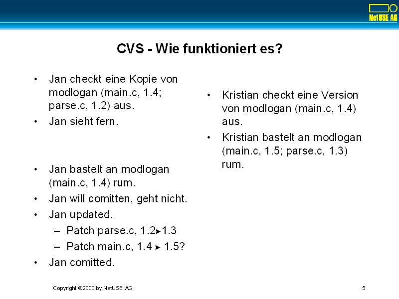

# CVS - Was ist das?


- Concurrent Versioning System
  - System zur Versionsverwaltung von Dateien
  - Arbeitet auf Dateibäumen, nicht auf einzelnen Dateien
  - Arbeitet ohne Locking
  - Netzwerkfähig
  - freie Software

- CVS wird für alle wichtigen Open Source Projekte eingesetzt
  - Ausnahme Linux-Kernel
    - Das ist ein Problem.
    - Grund: Wahrscheinlich Interessenkonflikte
      - Larry McVoy, Bitkeeper (Bitmover.com)
  - Offiziell: Kernel ist zu groß für CVS
  - Gegenbeweis: KDE, GNOME, Star Office

# CVS - Begriffe


- Repository
  - Referenzkopie eines Quelltextes auf dem zentralen Server.
- Workspace
  - Ausgecheckte Arbeitsversion eines Repositories.
- Diff
  - Änderungsanweisungen, um eine Datei von Version x auf Version x+n zu bringen
- Patch
  - Einarbeiten dieser Änderungen
- Commit
  - Diff eines Workspace gegen das Repository, der ins Repository gepatched wird.
- Update
  - Diff eines Repository gegen eine ältere Repository-Version, der in den Workspace eingearbeitet wird.


- Merge
  - Einspielen eines Updates in eine geänderte Workspace-Version ohne Konflikt.
- Konflikt
  - Einspielen eines Updates in eine geänderte Workspace-Version, wobei die Änderungen widersprüchlich sind.
- Revision
  - Versionsnummer an einer Datei (für jede Datei individuell)
- Tag
  - Gemeinsamer Name für gleichalte Dateien unterschiedlicher Revision.
- Logmessage
  - Nachricht, die mit einem Commit mitgesendet wird.

# Diff und Patch


- CVS weiß, welche Version im zentralen Repository aktuell ist.
- CVS weiß, welche Version in den Workspace geladen wurde.
- CVS erstellt ein Diff zwischen Workspace-Version und Repository-Version.
- CVS patched den Workspace mit diesem Diff.

- Der Workspace-Patch gelingt
  - für alle Dateien, die im Workspace nicht bearbeitet wurden.
  - für bearbeitete Dateien, wenn die bearbeiteten Bereiche sich nicht mit dem Patch überlappen.

- Konflikte werden markiert und beide Versionen zusammen präsentiert.
  - Konflikte muss der zweite Developer manuell lösen, bevor er comitten kann.

# CVS - Wie funktioniert es?



- Jan checkt eine Kopie von modlogan (main.c, 1.4; parse.c, 1.2) aus.
- Jan sieht fern.

- Kristian checkt eine Version von modlogan (main.c, 1.4) aus.
- Kristian bastelt an modlogan (main.c, 1.5; parse.c, 1.3) rum.
  
- Jan bastelt an modlogan (main.c, 1.4) rum.
- Jan will comitten, geht nicht.
- Jan updated.
  - Patch parse.c, 1.2 -> 1.3
  - Patch main.c, 1.4 -> 1.5?
- Jan comitted.

# Everyday CVS


- Initales Checkout
```console
$ cd ~/Source
$ export CVSROOT=:pserver:user@host:/repository
$ cvs -d $CVSROOT login
Password:
$ cvs -z9 -d $CVSROOT co Modul
$ cd Modul
```

- Update

```console
$ cd Modul
$ cvs -z9 update -dAP
```

- Commit
```console
$ cvs -z9 update -dAP
$ cvs commit
```

- Diff
```console
$ cvs diff -u
```

- Status
```console
$ cvs status -v
```

- Annotation
```console
$ cvs annotate <datei> | less
```

# CVS - Paßworte und Optionen


- Paßworte werden in der Datei .cvspass abgelegt
  - Verschlüsselung nur schwach
```console
kk@wwwx ~ $ cat .cvspass
:pserver:kk@cvs.php.net:/repository Ah&#060Z 
:pserver:kk@ca.php.net:/repository Ah&#060Z
:pserver:kk@wwwx.netuse.de:/repository A&#060hZ
```
- Optionen werden in der Datei .cvsrc abgelegt.
```console
kk@wwwx ~ $ cat .cvsrc 
cvs -q -z9
update -dAP
diff -u
status -v
```

- Globale Optionen nach dem CVS-Kommando
  - .cvsrc-Schlüsselwort "cvs"
- Subcommand-Optionen nach dem Subcommand, vor den Dateinamen
  - .cvsrc-Schlüsselwort ist der Subcommand-Name</UL></UL></P>

# CVS - Repository anlegen


- Anlegen:
```console
$ export CVSROOT=~/CVS
$ cvs init
```
- Erzeugt `~/CVS/CVSROOT`.
  - Darin jede Menge Default-Dateien.

- So (lokal) wird auch ein pserver-Repository angelegt.
  - Danach Eintrag in `/etc/inetd.conf`.
  - SIGHUP!

- `/etc/inetd.conf`:
  - `cvspserver stream  tcp nowait  cvs/opt/bin/cvs /opt/bin/cvs --allow-root=/repository pserver`
- `--allow-root=/repository`
  - Angabe des lokal angelegten Repository
- `pserver`
  - Subcommand für Servermodus.
- Kann auch mit tcp-Wrapper betrieben werden.

# CVS - User zu Repository zufügen


- `CVSROOT/config`
  - `SystemAuth="no"`
    - Unix-Paßwortdatei wird nicht beachtet.
  - `passwd`
    - Drei Spalten
      - User
      - Paßwort
      - Unix-User-Mapping
  - `3readers`
    - Ein Username pro Zeile
    - Listet User ohne Commitrecht.		</UL></UL></UL></UL></P>

- Zufügen:
  - htpasswd ./passwd user
  - echo ":cvs" >> passwd

# CVS - Neues Projekt anlegen


- Source muss in einem Verzeichnisbaum vorliegen.
- Source darf keine Verzeichnisse "CVS" enthalten.

- Modul importieren:
  - Ins Modulverzeichnis wechseln.
  - `cvs import -m "Neu" modul user start`
  - Danach Modulverzeichnis löschen (wegmoven!).
  - Danach checkout.
    - `cvs -d $CVSROOT co modul`

# CVS - Aktualisieren und Commit


- Aktualisieren des CVS:
  - `cvs update`
  - `cvs -q update -dAP`

- Am günstigsten automatisch per Cronjob.

- Commit immer manuell
  - und immer mit Logmessage.

# CVS - Keywords


- Dateien können Keywords enthalten.
  - Diese werden in `$ $` eingeschlossen.
  - Keywords werden beim update und checkout durch Werte substituiert.
- Keywords:
  - Id, Log
  - Author, Date, Header, Name, Revision, Source, State
- Keyword-Expansion kann abgeschaltet werden
  - Wichtig für Binäre Dateien
  - `cvs add -ko bla.c`
  - `cvs admin -kb bla.gif`

# CVS - Was haben die anderen getan?


- Änderungen der anderen als Diff:
  - `cvs diff -u`
  - Auch für einzelne Dateien

- Status des eigenen Workspace
  - `cvs status`
  - `cvs status -v`

- Detailhistorie einer Datei:
  - `cvs annotate <datei>`

- Beispiel:
- `cvs annotate main.c`

# CVS - Dateien zufügen und lôschen


- Dateien zufühen mit add
  - `cvs add datei.c`
- Daeien entfernen mit remove:
  - Erst Datei löschen.
  - Dann `cvs remove datei.c`
- Änderungen werden erst nach einem Commit wirksam.
- 
- Verzeichnisse zufügen
  - `mkdir neu`
  - `cvs add neu`
  - `touch neu/a.c`
  - `cvs add neu/a.c`

- Verzeichnisse entfernen
  - Verzeichnisse können nicht entfernt werden?
  - Warum? (Nachdenken)

# CVS - Releases erzeugen und holen


- Alle Dateien eines Worksapce können einen gemeinsamen symbolischen Namen bekommen
  - cvs tag NAME
- Tagged Names können beim Update verwendet werden.
  - `cvs udpate -r NAME`
- Das wird "sticky"
  - Neue Versionen werden nicht mehr automatisch geladen.
- Zuordnen von Versionen und Tagged Names:
  - `cvs status -v`
- Statt Tags können auch Datumsangaben verwendet werden.
  - `cvs update -D Datum`
