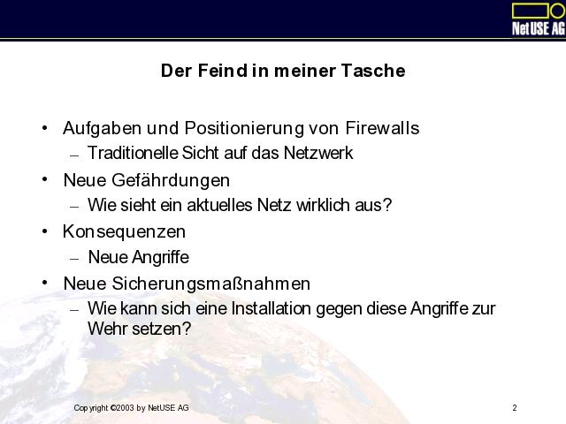
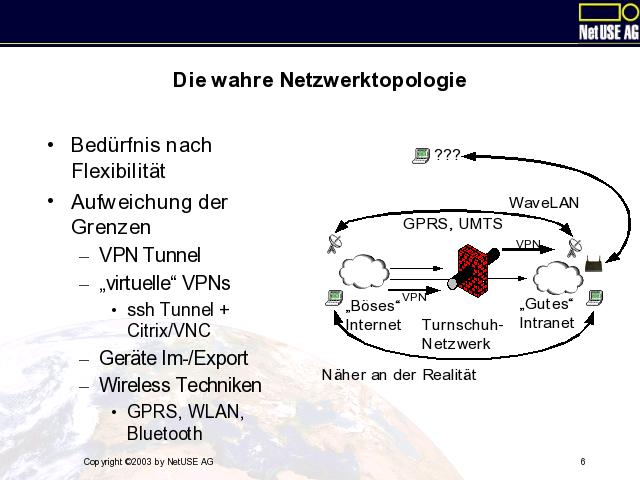
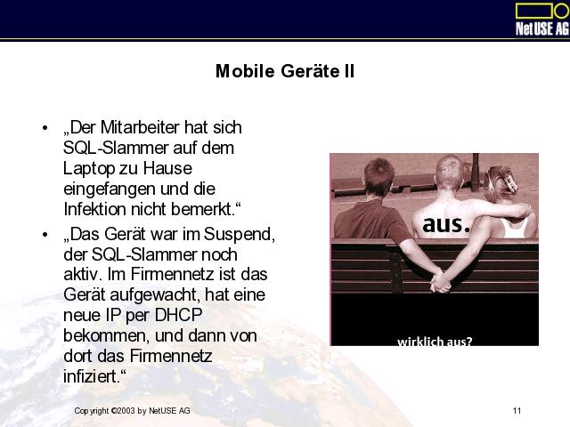
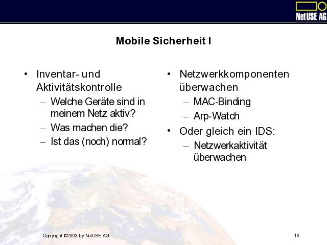

**Vortrag auf der NuBIT 2003**

# Der Feind in meiner Tasche


Firewallkonzepte vs. Mobile Geräte

# Inhalt



- Aufgaben und Positionierung von Firewalls
  - Traditionelle Sicht auf das Netzwerk
- Neue Gefährdungen
  - Wie sieht ein aktuelles Netz wirklich aus?
- Konsequenzen
  - Neue Angriffe
- Neue Sicherungsmaßnahmen
  - Wie kann sich eine Installation gegen diese Angriffe zur Wehr setzen? 

# Aufgaben und Leistungen einer Firewall


- Choke Point
  - Trennt Zonen
    - unterschiedlicher Administration
    - unterschiedlicher Sicherheitslevels
  - Ist Meßpunkt
    - Art, Menge und Gültigkeit von Netzverkehr
  - Trust Boundary 

# Trust Boundary


- Feste Grenzlinie
  - "dort hört die Firma auf"
- Aller Verkehr passiert die Trust Boundary
  - Prüfung auf Legalität
  - Dekontamination
  - Zentrales Verzeichnis aller Außen-kommunikation
  - Zentrale Administration der Kommunikation 

# Strukturierung der Kommunikation


- Firewall als Strukturbildner
- Abtrennung von Bereichen unterschiedlicher
  - Gefährdung
  - Funktion
  - Wichtigkeit

# Die wahre Netzwerktopologie



- Bedürfnis nach Flexibilität
- Aufweichung der Grenzen
  - VPN Tunnel
  - "virtuelle" VPNs
    - ssh Tunnel + Citrix/VNC
  - Geräte Im-/Export
  - Wireless Techniken
    - GPRS, WLAN, Bluetooth 

# Tunnel und andere Löcher I


- VPN Tunnel
  - offizielle Löcher
  - Endpunkte authentisiert
  - Kommunikation verschlüsselt
  - Endpunkte sind effektiv Rechner im LAN
    - aber: Standort außerhalb der Firewall!
    - VPN Client nur sinnvoll mit Firewall und Integritätsprüfung! 

# Tunnel und andere Löcher II


- Selbstbau-VPN Tunnel
- ssh
  - -L 8080:10.11.12.13:80 -l <user> io.example.com
- "Logge Dich auf io.example.com als User ein"
  - Tunnele die lokale 8080 an 10.11.12.13, Port 80
  - "Mache das Intranet von draußen zugänglich" 

# Tunnel und andere Löcher III


- "Protokoll in Protokoll"
- SOAP
  - "HTTP is a very RPC-like protocol that is simple, widely deployed, and more likely to function in the face of firewalls than any other protocol known to man"
    (http://msdn.microsoft.com/msdnmag/issues/0300/soap/default.aspx)

```xml
POST /string_server/Object17 HTTP/1.1
Host: 209.110.197.2
Content-Type: text/xml
Content-Length: 152
SOAPMethodName: urn:strings-com:IString#reverse

<Envelope>
 <Body>
   <m:reverse xmlns:m='urn:strings-com:IString'>
     <theString>Hello, World</theString>
   </m:reverse>
 </Body>
</Envelope>
``` 

# Mobile Geräte I


- Typische Probleme:
  - Backup?
  - Update?
  - Software-Installation?
- Welche Geräte gehören zu meinem Administrationsbereich?
  - Wann sind sie da?
  - Wo waren sie inzwischen?
  - Sind sie kontaminiert? 

# Mobile Geräte II



- "Der Mitarbeiter hat sich SQL-Slammer auf dem Laptop zu Hause eingefangen und die Infektion nicht bemerkt."
- "Das Gerät war im Suspend, der SQL-Slammer noch aktiv. Im Firmennetz ist das Gerät aufgewacht, hat eine neue IP per DHCP bekommen, und dann von dort das Firmennetz infiziert."

# Spontane Vernetzung I


- Mobiltelefone sind universell und datenfähig
- Je restriktiver die Firewall, desto wahrscheinlicher kommt es zu spontaner Vernetzung an der Firewall vorbei.
  - "Wenn das Attachment wieder nicht durch den Viruswall kommt, lade ich das eben kurz über das Handy. Stell es mal schnell auf Deinen Webserver." -- Bei einem Kunden mitgehört 

# Spontane Vernetzung II


- With a hand-held scanner, researchers were able to pick up information from company wireless networks by simply driving around the streets of London.
- The research identified that 63 per cent of the networks surveyed were left on default configuration, which clearly identifying the company owning the data and where it was coming from.
  http://theregister.co.uk/content/55/29337.html, 18-Feb-2003 

# U-Boote und Trojaner I


- Spyware
  - Unterhaltungs-programme
  - Grußkarten
  - P2P Filesharing-Programme
- aber:
  - Druckertreiber???
  - Mehr und mehr Komponenten melden Daten zurück an den Hersteller.

# Aktiver Content


- an unerwarteten Stellen:
  - Mail mit Javascript
  - Mobiltelefone mit Java und Active-X
- Unerwartete Funktionalität
  - Mobiltelefone mit Kamera
    - in Umkleideräumen?

# Mobile Sicherheit I



- Inventar- und Aktivitätskontrolle
  - Welche Geräte sind in meinem Netz aktiv?
  - Was machen die?
  - Ist das (noch) normal? 

# Mobile Sicherheit II


- Überwachung von Geräten, die aus dem Netz entfernbar sind:
  - Anwendungsintegrität
  - Ausführungskontrolle
- Auch disconnected!

# Sind Firewalls überflüssig?


- Sind Firewalls überflüssig?
  - Definitiv nein.
- Sind Firewalls ausreichend?
  - Definitiv immer weniger.
- Strategiewechsel:
  - "Defense in depth." 
