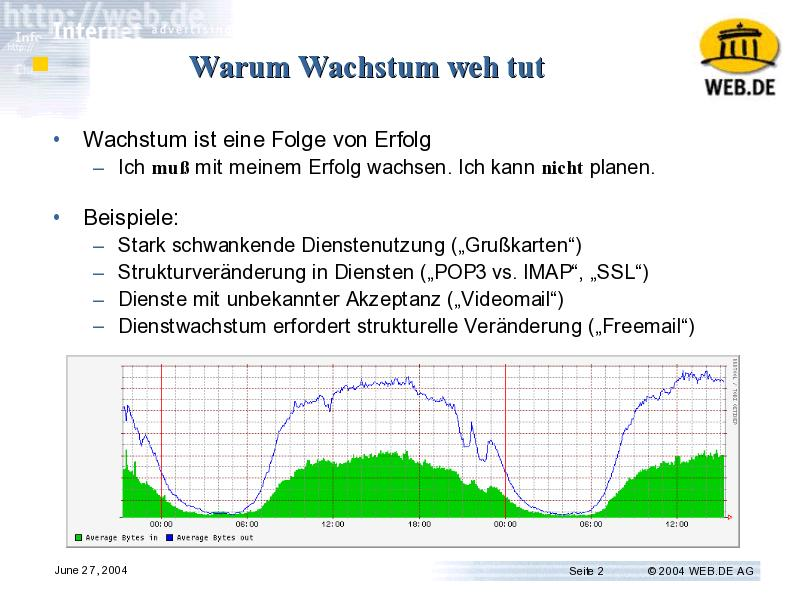

# Warum Wachstum weh tut

- "Systemadministration"
  - Eine Aufgabe, die in sehr unterschiedlichen Größenordnungen kommt
  - Ein mögliches Maß: Anzahl der betroffenen Benutzer
    - 10^1 - für sich selbst und seinen Partner oder für eine WG
    - 10^3 - für einen kleinen Verein ("Toppoint e.V", "INKA")
    - 10^5 - für ein kleines Internet Unternehmen
    - 10^7 - für ein großes Internet Unternehmen
  - Die Aufgabe verändert sich nicht, aber die möglichen Lösungen und die daran hängenden Strukturen 

- Wachstum ist eine Folge von Erfolg
  - Ich muß mit meinem Erfolg wachsen. Ich kann nicht planen.
- Beispiele:
  - Stark schwankende Dienstenutzung ("Grußkarten")
  - Strukturveränderung in Diensten ("POP3 vs. IMAP", "SSL")
  - Dienste mit unbekannter Akzeptanz ("Videomail")
  - Dienstwachstum erfordert strukturelle Veränderung ("Freemail") 

# Limits

# Limits in Hardware und Software

- Hardwaregrenzen
    - Intel-Hardware: 4 CPU, x GB RAM, 60 MB/sec Random I/O
- Softwaregrenzen
    - Die verwendete Datenbank fällt bei bestimmten Daten- und Lastgrößenordnungen schlicht auseinander oder degradiert über die Zeit.
- Hotspots
    - Ein stark belasteter Block bremst die Gesamtperformance eines RAID-Systems

# Reaktionen auf Wachstum

- Wachstum erfolgt aus dem Betrieb
  - "Jetzt wachsen" => "mehr Kisten"
- Kurzfristige und längerfristige Lösungen gleichzeitig verfolgen
  - Das ist nicht immer schön
- Lastverteilung:
  - DNS RR
  - Loadbalancer Appliance
  - Linux Virtual Server
  - Applikation verteilt (login, hashes)
- Schreibrate beeinflußt die Architektur
  - Livebetrieb auf Snapshots und Kopien
  - Zentrale Datenhaltung bildet Flaschenhälse
  - Anwendungen verteilbar realisieren 

# Erfahrungen

- Hardware ist billiger als Software
- Software ist billiger als Leute

- Hardware ist schneller als Software
- Software ist schneller als Leute

- Der Preis ist nie das Problem.
- Lösbarkeit in Zeit ist das Problem

# Zentrale und dezentrale Systeme

- Historisches Wechselspiel
  - Hosts
  - PCs
    - Zentraler Storage, zentrales drucken
  - Workstation Cluster
    - Zentrale Administration
  - Webanwendungen
    - Zentrale Anwendungsinstallation, zentrale Datenhaltung
    - Webanwendungen können im RZ verteilt werden -> Cluster
    - Webanwendungen können dezentral ablaufen -> Applets, Thin Clients
- Einflußfaktoren:
  - Netzbandbreite und Latenz vs. zentrale Rechenleistung 

- Dezentralisierung funktioniert.
- Limits in der verfügbaren Hard- und Software erzwingen dezentrale Systeme
  - Zentrale Systeme haben immer ein wachstumsbegrenzendes Limit.
- Verteilung:
  - Zustand bremst. Zustandslos verteilen!
  - Writes bremsen. Dezentral schreiben!
  - Synchronisation bremst. Asynchrone Strukturen bauen! 

# "Berg der Verzweiflung"

# Architektur

- Freemail:
    - Plugin im Webserver (eine Art PHP/FI)
        - Alle Funktionen des Dienstes in einer Schicht als Teil des Webservers
    - Differenzierung
        - Funktionstrennung
    - Multi-Tier Architektur für zwei Dutzend Teildienste
- Folgen:
    - Abhängigkeiten-Netze
    - Debug-Komplexität
    - Update-Komplexität

# Un-Architektur

- Architektur vs. Betriebliche Erfordernisse
    - Manche Probleme löst man nur durch brachiale Gewalt
    - Das Resultat ist niemals ästhetisch.
        - Aber es macht die Kasse voll. :)
- Problem: Dokumente liefern
    - Informatiker-Lösung:
        - Dokumentenserver in Corba-Dienst verpacken
        - Details wegabstrahieren
    - Folge:
        - Performance... läßt Wünsche offen
    - Lösung:
        - NFS, Datenbank liefert Dateinamen
        - Laufender Dialog mit der F&E

# Denormalisierung

- Problem:
    - Speicherung von Mail-Headerinformationen in Datenbanken
- Informatiker-Lösung:
    - 3NF Datenspeicher
- Folge:
    - Datenbank explodiert
- Lösung:
    - Messen. Hotspots identifizieren. Denormalisierung.
    - Daraus folgend: Fehler → Fehlerbehandlung

# Der ganz normale Wahnsinn

- Problem:
  - "Ab morgen machen wir SSL"
- Folgen?
  - Architektur (mod_gzip + mod_ssl?)
  - Infrastruktur
    - CPU?
    - CPU-Verteilung aka Balancing?
    - Rackspace?
  - Logistik
    - Installation?
    - Rollout? 

# Katalog vs. Reality

- Hersteller nehmen den Mund gerne voll.
  - "4400 RSA-Operations pro Sekunde"
    - Resultat: Montag Mittag, 0% Idle, Totalstillstand
  - "SAN Storage Lösungen", "sie sind eher einer unserer kleineren Kunden"
    - Resultat: Systemstillstand beim Erstellen von Snapshots, "mit so vielen kleinen Dateien haben wir nicht gerechnet"
  - "x tausend Firewall-Connections pro Sekunde"
    - ...
  - Reiserfs, XFS
    - ... 

# Erfahrungen

- Normalisierung gut!
- Denormalisierung besser!

- Architektur gut!
- Einfache Konzepte besser!

- Trau keinem Katalog!
- Alle Hersteller versagen in der Praxis.

- "XP": Architektur als Prozeß:
- Tu' nur was notwendig ist. Behalte die Vision im Hinterkopf.

  - Kritik: Was ist mit Projektkriterien?
  - Mache kurze, überschaubare Projekte (<3 Monate)
  - Sei bereit, Dinge wegzuwerfen. 
- Projekt <-> Prozeß

# Serviceprozesse

# Prozesse nach Außen

- Testballon -> virtueller SLA
    - Auch wenn es kostenlos ist erwartet der Kunde, daß es funktioniert.
    - Ausbildung von Supportstrukturen
    - Steigerung der Abhängigkeiten -> Steigerung der Erwartungen
- "Der User ist produktiv."

# Prozesse nach Innen

- Differenzierung
  - Allroundqualifikation -> Spezialistenbildung
  - Kommunikationsbedarf
  - Dinge explizit machen
    - Dokumentation
    - Prozesse
    - Verantwortungen

# Prozesstrennungen

- ITIL ("The IT Infrastructure Library")
  - ITIL Phasen in der F&E ("Funktionalität")
  - ITIL Phasen in der IT ("Verfügbarkeit, Wachstum und Qualität")
- Was F&E macht, ist allgemein bekannt.
- Was IT macht, können die meisten Leute nicht benennen.
  - Abgrenzung gegen F&E
  - Abgrenzung gegen Support
- Trennung von IT und F&E wird oft nicht durchdacht.

# Ausblick

- Spannungsfelder
  - Zentral <-> Dezentral
  - Projekt <-> Prozeß
  - "Jetzt" <-> "Richtig", "Ordentlich"
  - "F&E" <-> "IT" <-> "Support" 
