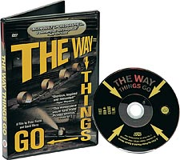

 Im [Spielzeugmuseum](http://www.spielzeugmuseum-soltau.de/) wurde neben vielen anderen Dingen auch einer der eigenartigsten Filme gezeigt, den ich je gesehen habe.
 Es war [Der Lauf der Dinge](http://www.tcfilm.ch/lauf_txt_d.htm), eine unwahrscheinliche und präzise arrangierte Kettenreaktion von Sperrmüll in einer Fabrikhalle.
 Die ganze "Was passiert dann"-Maschine läuft mehr als 30 Minuten, und ist aufgebaut mehr als 30 Meter lang.

Leider ist das Video sehr alt (1987) und wurde ohne Budget mit Consumer-Equipment gedreht, sodass der Film an einigen Stellen mit Schärfe und Weißabgleich kämpft, aber dennoch ist das ganze Konzept so genial, daß man sich diese 30 Minuten einfach gönnen muss.
Was ich dann in Form der DVD getan habe.

(Bestellt als Gebraucht-CD über Amazon France, geliefert von einer US-Firma über UK. Was für eine Odyssee)

