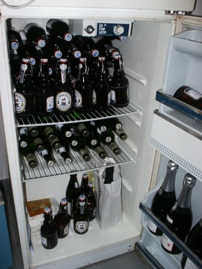

Ciao, 
[Tosi](http://www.torsten-sievers.de/blog/index.php?/archives/21-ich-hab-die-wohnung-gestrichen-voll.html).
Wir haben ihn gehen lassen, damit er sein Hobby "Navigationssysteme bauen" zum Beruf machen kann.
Damit Ihr Euch nicht zu sehr verfahrt, haben wir gleich für eine passende Ausstattung gesorgt (Der Schönling, der sich da links ins Bild drängt ist 
[Cruisi](http://blog.eichenberg-online.de/archives/138-Abgestuerzt.html)).

*Informatikerhaushalt, Erstausstattung*

Besonderer Dank muß hier an 
[Jochen](http://wersdoerfer.com/~jochen/s9y/index.php)
gehen, der konspirativ den Bedarf ermittelt hat und uns so in die Lage versetzt hat, die schlimmsten Lücken zu schließen.

Tosis Antwort besteht darin, dem Süden ordentliches Bier zu bescheren.

