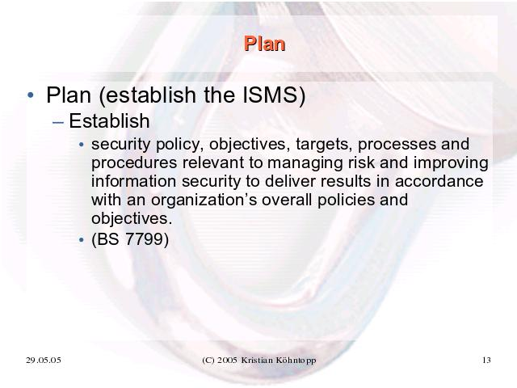

Der folgende Vortrag stammt einem "Dienstags-Vortrag" in Karlsruhe-Durlach, und versucht zu erklären, was der Kontext für ein Information Security Management System (ISMS) ist.

Der Vortrag will erklären, was "Security Management" ist und erreichen will, was die Aufgaben des Security Managementprozesses sind (also was Security, Management und Prozeß sind), welche Schnittstellen der Prozeß hat und wie man eventuell versuchen kann, Security zu messen.

## Risk and Compliance

Klar ist, daß Security kein unmittelbares Geschäftsziel ist: Der Erfolg einer Firma mißt sich nicht an ihrer Performance im Bereich "Security".
Stattdessen ist Security aber ein Non-Functional Requirement, das auf mehr als einem Weg in die Firma hineingetragen wird.
Das heißt, eine Reihe von externen Einflüssen wirken auf die Firma ein und machen es erforderlich auf mehr als eine Weise sich mit Security zu beschäftigen:

- Gesetze und Behörden setzen Mindestmaßstäbe fest, gesetzliche Auflagen und Fürsorge für die Mitarbeiter bestimmen das Vorgehen.
- Wirtschaftsprüfer und externe Verträge ("PCI Standards" aus Verträgen mit Kreditkartenfirmen, oder Cyberversicherungen) schreiben eine Bearbeitung des Themas vor.
- "Usus" oder "Stand der Technik" ist an mehr als einer Stelle im Datenschutzrecht und in anderen Gesetzen verankert.
- Aus dem Markt und durch Expertenmeinungen wird die Entscheidungsfindung beeinflusst.
- Schlechte Presse wegen schlechter Sicherheit führt zur Gefährdung des Geschäftsbetriebes.

Allgemeiner gesprochen geht es um Risiken und ihre Absicherung.
Interne Risiken sind "die Sicherung der Verfügbarkeit, Integrität und Vertrauchlichkeit von geschäftskritischer Infrastruktur" und die "Sicherstellung der Nachhaltigkeit des Geschäftsbetriebes".
Das ist das Äquivalent einer Firma zu dem persönlichen Wunsch, nicht sterben zu wollen.

Externe Risiken sind "die Erfüllung von gesetzlichen und vertraglichen Regelungen", als da sind KontraG, BGB, AktG, HGB, DSG, ... sowie Verpflichtungen aus Verträgen mit Partnern und Versicherungen.
Dieser Teil wird meist unter der Überschrift "Compliance" abgehandelt.

Erstaunlicherweise gehen viele Firmen sehr locker mit dem Todeswunsch (also tatsächlicher Security) um, und nehmen Compliance ernster als tatsächliche Security, die sich mit realen und unmittelbaren Bedrohungen beschäftigt.
Das hat allerdings auch damit zu tun, daß dieses Thema leichter zu greifen und zu quantifizieren ist.
"Wir suchen da, wo Licht ist, nicht da, wo wir was finden könnten."

## Risiken und Maßnahmen: ssh Host Keys

Als Security Fuzzi bei web.de bekomme ich von Freunden und Mitarbeitern oft die Frage (oder den Vorschlag) im Umgang mit ssh eine Liste von Fingerprints von Host-Keys von Maschinen bereit zu stellen.
Wenn ich mich dann auf Host x einlogge, wird mir der Fingerprint der Maschine angezeigt und ich kann den mit der Liste vergleichen.

Die Frage ist also:

Sollten wir nicht eine Liste der Fingerprints aller Maschinen pflegen und den Admins an die Hand geben?

Was denkt Ihr?

Dies ist eine *Maßnahme* die unternommen werden soll.
Eine Maßnahme hat die Aufgabe, ein *Risiko* zu mitigieren, also abzuwehren oder zu entschärfen.
Laien reden über Security meistens in Form von Maßnahmen und dann kommt man schnell vom Hundertsten ins Tausendste.

Die Maßnahme ist also "Stelle eine aktuelle Liste aller ssh Host-Keys bereit und fordere die Admins auf, beim ersten Login zu vergleichen"

Schauen wir einmal auf das *Risiko*:
Wogegen schützt ein solcher ssh Fingerprint?

Der ssh Fingerprint schützt gegen das Unterschieben eines anderen physischen Hosts oder eines anderen ssh-Servers auf dem Zielhost.

Gibt es andere Maßnahmen, die gegen dasselbe Risiko wirken?

Ja, wir könnten zum Beispiel auch einfach eine vorbereitete "known_hosts" Datei verteilen, in der nicht die Fingerprints drin sind, sondern die tatsächlichen Host Keys.
Dann würde beim Login gar kein Fingerprint mehr angezeigt werden, sondern die Identität per Host Key direkt automatisch geprüft werden.
Das wäre gleich viel Aufwand bei uns, und eine bessere UX bei den Admins.
Außerdem wäre die manuelle Kontrolle als Fehlerquelle beseitigt.

Eine andere Maßnahme, die gegen das gleiche Risiko besser wirkt, wäre bei gleichem Aufwand also besser.

Wie sind die Kosten eines Risikos generell zu bewerten?
Meistens macht man sich eine 3x3 Matrix aus Schadenshöhe ("teuer", "das Jahresendergebnis beeinflussend" und "Wir sind pleite") und Eintrittswahrscheinlichkeit ("selten", "sehr selten", "so gut wie nie"), und ordnet Risiken da ein.
Dem stellt man die einmaligen und laufenden Kosten der Maßnahme entgegen.

Wieso sind die Schadenshöhe und und Eintrittswahrscheinlichkeiten so komisch?
Nun, Dinge die billiger als "teuer sind" bezahlen wir und buchen das als "Cost of doing business".
Wir akzeptieren die Risiken also und tragen die Kosten.
Und Dinge die häufiger als "selten" sind, sind keine Sicherheitsereignisse, also keine Ausnahmen, sondern müssen als operative Ereignisse im Tagesbetrieb abgehandelt werden können.

Wenn wir einen Geschäftsprozess haben, in dem "teure" Dinge "häufig" sind, oder schlimmer, dann ist ein geregelter Geschäftsbetrieb mit den vorhandenen Prozessen nicht durchführbar und wir müssen das Geschäftsmodell oder seine Prozesse hinterfragen.

Sicherheitsrisiken treten nicht einfach so auf und nicht jeder Angeifer kann einfach so Dinge tun.
Wir können Angreifer modellieren, ihnen Fertigkeiten (Capabilities) zuordnen und Risiken katalogisieren:
"Um dieses Risiko darzustellen, muss ein Angreifer diese Fertigkeiten haben, und daher kommt dieses Risiko nur bei diesem Angreifertyp vor."

Ein Script-Kiddie könnte unsere Server "r00ten", ein interner Angreifer könnte Maschinen oder Serverprozesse austauschen.

## Risikomanagement

Wir bekommen also den folgenden Ablauf:

- Wir betrachten Risiken als Produkt aus Eintrittswahrscheinlichkeit und Schadenshöhe.
- Wir betrachten Maßnahmen, und was sie mit dem Risiko tun (Eintrittswahrscheinlichkeit und Schadenshöhe reduzieren).
- Das kostet Zeit und Geld.

Und danach in einer Schleife von vorn.

Diese Schleife ist das Kennzeichen eines Prozesses im Gegensatz zu einem Projekt:
Security ist kein einmaliger Vorgang mit einer Deadline und einem Deliverable, sondern eine laufend wiederholte Identifikation, Bestimmung und Abmilderung von Risiken.

Wie jede Schleife muß auch diese Abbruchbedingungen haben:
Bestimmte Maßnahmen sind nicht akzeptabel. "Abziehen des Netzwerkkabels" hilft perfekt gegen "Script Kiddie r00tet den Server", ist aber wegen der geschäftlichen Notwendigkeiten nicht akzeptabel.

Wir können auch Kosten und Nutzen gegeneinander abwägen.
Maßnahmen finden ihre Grenze, wenn die Kosten für die Maßnahme den Schaden aus dem Risiko übersteigt.
Eventuell findet man dann einen Versicherer, der auf den Schadensfall wetten will.

Und damit bekommen wir den Risikomanagementzyklus, die grafische Darstellung dieser Schleife.

Das *Risikomanagement* identifiziert und bewertet allgemeine Risiken für den Geschäftsbetrieb.
Definiert Maßnahmen (konkrete Projekte) zur Risikobehandlung und kontrollieren deren Wirksamkeit.
Wie jeder Prozeß hat auch dieser Retroperspektiven, die regelmäßig durchgeführt werden und mit denen sich der Prozeß reguliert und optimiert.
Das ist der Management-Aspekt an der Sache.

Es gibt viele verschiedene Managementmodelle, aber alle versuchen, die Durchführungsphase eines Prozesses ("Do") von der Planungsphase und der Retroperspektive zu trennen.
Dadurch wird die Durchführungsebene von der Metaebene getrennt und der Prozeß selbst diskutierbar.

Ein häufiger Prozeßzyklus folgt dem PCDA-Modell.

## ISMS

Der recht neue British Standard 7799 ist ein sehr kurzes Papier (nur 21 Seiten) und beschreibt den Aufbau eines Information Security Management Systems (ISMS)

### Plan

- Plan (establish the ISMS)
  - security policy, objectives,targets,processes and procedures relevant to managing risk and improving information security to deliver results in accordance with an organization’s overall policies and objectives.

In den Termen einer deutschen Verwaltung also:

Definiere einen Geltungsbereich des ISMS (definiere die Grenzen), und setze einen Auftrag durch Definition strategischer Ziele.
Definiere Stellen, also schaffe einen organisatorischen Rahmen.
Bestimmte Maße, nach denen wir das Funktionieren des ISMS bewerten wollen.
Legitimiere das ganze durch eine formelle Beauftragung und Delegation von Verantwortlichkeit an eine Leitung.

Wie deutsche Gesetze:
- "so was gibt es als Konzept" (Das Grundgesetz)
- "Das bedeutet im Einzelfall" (Bundesgesetz)
- "So machen wir das" (Durchführungsverordnung zum Gesetz)

Risikoidentifikation und Risikobewertung bilden dann die Matrix, die wir weiter oben schon erwähnt haben.

Wir klassifizieren also, eventuell unter Hinzunahme von einem Standardkatalog, die zu schützenden Güter, mögliche Bedrohungen, Szenarien und Angreifermodelle, und eventuell eintretende Schäden.

Indem wir diesen Eintrittswahrscheinlichkeiten und Bewertungen zuordnen bekommen wir eine Liste an Dringlichkeiten, und eine Liste an möglichen Maßnahmen, die wir wiederum nach Geld und Möglichkeiten ordnen können.

Unser Management kann diese Maßnahmen azeptieren, finanzieren und dann durchführen lassen oder das Risiko als Geschäftsrisiko hin nehmen.
Das Ergebnis dieser Entscheidung wird dokumentiert und dann durchgeführt.

Risiken können wir behandeln indem wir

- sie akzeptieren ("is halt so")
- sie vermeiden ("machen wir nicht")
- sie transferieren ("is versichert, macht also nix")
- oder durch eine Maßmahme kontrollieren (der häufigste Fall, oder in Kombination mit der Versicherung)

Die Restrisiken
- nennen wir
- bewerten wir erneut (die PCDA Schleife dreht sich)
- oder lassen wir durch das Management abnehmen

### Do ("implement and operate controls, processes and the ISMS")

Wieder im BS 7799: implement and operate the security policy, procedures.

Konkret also:
- Den organisatorischen und personellen Rahmen schaffen
  - Stellen
  - Mittel
  - Feedback ("Indicent detection and handling")
  - die Stellen besetzen
  - die Personen ausbilden
  - und Risiken und Maßnahmen thematisieren ("Awareness")

Steht der organisatorische Rahmen, kann man sich um die Technik kümmern:

- Überwachung und Monitoring
  - Systemtests
  - Funktionstests und Integritätsbedingungen für die Business Logic
  - Performancetests
  - Incident Detection and Handling

### Check (monitor and review the ISMS)

"Assess and, where applicable, measure process performance against security policy, objectives and practical experience and report the results to management for review."

Zur Bewertung entfernt man sich sukzessive immer weiter von der Vorgabe und blickt zurück:

- Tun wir die Dinge wie vorgeschrieben, folgen wir der Anleitung ("Compliance")?
- Ist die Anleitung geeignet, die tatsächlich anfallenden Probleme zu lösen ("Effektivität")?
- Ist die Anleitung optimal, um die Probleme zu lösen ("Effizienz")
- Ist die Anleitung noch ein Bild der Realität im Unternehmen, und werden die aktuellen Prioritäten und Organisationsstrukturen korrekt abgebildet? ("Applicability")

### Act

"Take corrective and preventive actions, based on the results of the improvement of the ISMS."

Mit den Erkenntnissen aus der "Check"-Phase können wir unsere Prozesse debuggen und gewonnene Erkenntnisse umsetzen.
Prozesse zu ändern ist dann ein Projekt: Anleitungen werden angepasst und geschult.
Das ist etwas, das wir mit einem Termin versehen und prüfen können und bei dem wir Änderung mit dem "Vorher" vergleichen können.
Wir können das erkannte Muster auch auf andere Fälle transferieren, dokumentieren und lehren.

Änderungen führen zu geänderten Anleitungen, zu angepassten Risikoabschätzungen, zu einem neuen Maßnahmenplan und zu neuen Prozessen und Prozeduren.
Kurzum: Zur nächsten Umdrehung im PCDA.

## Themen

BS 7799 definiert foilgende Tätigkeitfelder:
- Security Policy
- Organisatorische Infrastruktur
  - Beteiligte, Aufträge, Berechtigungen, Rollen
  - Dritte Parteien
  - Outsourcing
- Asset Classification
  - Inventur
  - Dokumentenmanagement
- Personnel Security
  - Job Definitionen und Profile
  - Ausbildung
  - Mißbrauch und Kommunikationskanäle
- Physical und Environmental Security
  - Sicherheitsbereiche
  - Diebstahlschutz, Infrastrukturschutz

- Communications + Operationsmanagement
  - cf ITIL Funktionen
  - Operational Procedures und Reponsibilities
  - System Planning und Acceptance
  - Housekeeping
    - Backups
    - Logs
  - Network Management
  - Media Management
  - Information and Software Exchange

- Access Control
  - Benutzerverwaltung (Identity und Authentication)
  - Rechteverwaltung (Authorization)
  - Zugangsüberwachung (Audit)
- System development + maintenance
  - Security als Teil der Anforderungen
  - Validation (Integrity measures)
  - Cryptography (Confidentiality measures)
  - Change control

- Business Continuity Management
- Compliance
  - Gesetze+Verträge
  - IPR Management
  - Audit und Nachweis

## Security messen

- Compliance: Prüfung der Abdeckung
  - durch Selbstauskunft
  - durch Audit
- Absolutes Maß der Security
  - sehr schwer ("Wie beweisen wir, dass wir nicht gehackt sind?")
  - Capability Maturity Model (Prozessreife)?
    - Aufwendig!
    - fünf Reifegrade in verschiedenen Bereichen

CMMI Reifegrade
- 0 not performed
- 1 performed informally
- 2 Planned and Tracked
- 3 Well defined
- 4 Quanitatively controlled
- 5 Continuously improving
