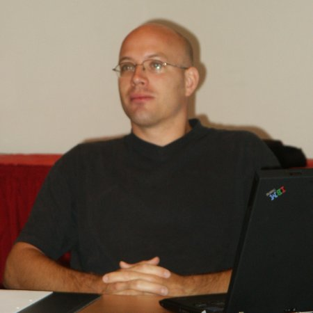

Hinter mir liegt eine Woche MySQL Consulting Bootcamp Munich 2005. 
Für mich eine Woche mit Intensivkursen in MySQL 5, Performanceoptimierung und MySQL Cluster - wir haben das Schlungsprogramm, das sonst mehr als zwei Wochen abgewickelt wird, in 5 Tagen durchgezogen.
Nebenbei habe ich noch das MySQL 4 Core und Pro Exam abgelegt (Ergebnisse liegen noch nicht vor, aber ich fand die Prüfung ziemlich schwierig), und wir waren an 5 Tagen zirka viermal in verschiedenen Bierhallen, Biergärten oder im Hofbräuhaus. 
MySQL geht echt auf die Kondition: 6 Kilo in 5 Tagen zugenommen...

Emea Team - Class of 2005.
In Front: Ivan (Italy, now in England, Sales Team), Bernd (Germany, now in Sweden), Kai (Germany). 
In Back: UlfS (Sweden, now USA, Management), Josh (USA, Consulting USA), PeterS (USA, now Switzerland, EMEA Head), Stephane (France), Johan (Sweden).
Missing: Jennifer (China, now USA).

*Bernd*

*Ivan*

*Jennifer*

*Johan*

*Josh*

*As everybody can see, Kai is evil.*

*PeterS*

*Stephane*

*UlfS*
