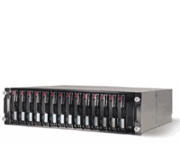

<

*Ein MSA-30 Array mit 14 Platten.*

Liebes Tagebuch!

Heute bin ich gegen eine HP 585 und zwei MSA 30 angetreten und ich bin mir nicht ganz sicher, wer gewonnen hat.
Aber laß mich von vorne erzählen.

Wie Du weißt, liebes Tagebuch, berechnet sich die Anzahl der Zugriffe, die man von einer einzelnen Platte pro Sekunde erwarten kann, wie folgt: 1000 ms/(Average Seek Time in ms + Rotational Delay in ms + Transfer Time in ms).
Die Average Seek Time kann bei einer guten Platte schon mal 4 ms klein sein, bei schlechten Platten auch mal 8 ms groß. 

Die Rotational Delay ist bei 18000 rpm bei 300 Umdrehungen pro Sekunde, als 600 Halbdrehungen pro Sekunde oder 1/600 Sekunde = 1.6 ms.
Bei Laptop-Platten mit 6000 rpm ist sie dreimal größer, also 5 ms.
Die Transfer Time kann man für den Rest der Betrachtungen auch getrost vergessen. 
Somit haben wir eine Access Time von insgesamt 5 ms bis 12 ms rauf.
Das übersetzt sich zu 200 bis 80 Writes/Seeks/Commits pro Sekunde.
Von so einer Platte aus einem MSA 30 würde ich eher 200 als 80 Operationen pro Sekunde erwarten.

Da stand sie nun also, die Hardware:
Eine HP 585 mit 32 GB RAM und 2 Dual-Core Opteron @ 2.6 GHz, zwei 6402 Controllern und zwei Dual-Channel MSA 30 mit jeweils 14 72 GB Platten.
Und wegen der spezifischen Verteilung der Controller und Channels ließen sich die beiden MSA 30 nicht zu einem 28 Disk Hardware RAID-10 zusammenfassen. 
Also haben wir angefangen zu experimentieren und zu messen.
Die Ergebnisse waren sehr merkwürdig.

Wir haben uns das so überlegt, liebes Tagebuch:
Wenn man schon kein Hardware RAID-10 mit allen 28 Platten bauen kann, dann kann man sich immerhin 14 Hardware-RAID-1 Paare stricken und die dann in ein Linuxraid als RAID-0 stopfen.
Gesagt, getan: 
Ins Menü, durch die Controller jongliert und die Plattenarrays wie wild blinken lassen - HP macht ja sehr unmissverständlich klar, welche Platte man gerade wie am Wickel hat.

Am Ende ins Linux booten und da waren sie dann: `/dev/cciss/c1d0-c1d6` und `/dev/cciss/c2d0-c2d6`:
14 RAID-1 Paare.
Ein `mdadm -C -l0 --chunk=128k /dev/md0 --raid-devices 14 /dev/cciss/c[12]d*` später hatten wir dann ein `/dev/md0` mit 14 Paaren.
Das wollten wir nun nackig machen, also `mkfs /dev/md0` und `mount /dev/md0 /data0` und dann 
`[iozone](http://www.iozone.org) -i0 -i2 -O -I -s4g -r128k -f /data0/blah` da drauf.

Stell Dir unsere Enttäuschung vor, liebes Tagebuch: 

```console
iozone -i0 -i1 -i2 -O -I -s4g -r128k -f /data0/blah
        Iozone: Performance Test of File I/O
                Version $Revision: 3.263 $
                Compiled for 64 bit mode.
                Build: linux

        Contributors:William Norcott, Don Capps, Isom Crawford, Kirby Collins
                     Al Slater, Scott Rhine, Mike Wisner, Ken Goss
                     Steve Landherr, Brad Smith, Mark Kelly, Dr. Alain CYR,
                     Randy Dunlap, Mark Montague, Dan Million,
                     Jean-Marc Zucconi, Jeff Blomberg,
                     Erik Habbinga, Kris Strecker, Walter Wong.

        Run began: Fri Feb 17 03:20:20 2006

        OPS Mode. Output is in operations per second.
        O_DIRECT feature enabled
        File size set to 4194304 KB
        Record Size 128 KB
        Command line used: iozone -i0 -i1 -i2 -O -I -s4g -r128k -f /data0/blah
        Time Resolution = 0.000001 seconds.
        Processor cache size set to 1024 Kbytes.
        Processor cache line size set to 32 bytes.
        File stride size set to 17 * record size.
                                                            random  random
              KB  reclen   write rewrite    read    reread    read   write
         4194304     128     999    1165     1126     1131     246    1107
```

Ich meine, wenn ich pro Platte 200 w/s rechne und von einem RAID-1 mit serieller Write-Policy ausgehe, dann erwarte ich auch von einem RAID-1 Paar mal eben 200 w/s, oder von 14 Paaren also 2800 w/s.
Bekommen habe ich nur 1107 w/s Random-I/O.
Das ist aber mächtig schlapp, nur 40 % der projektierten Performance.

Wir haben dann mal ein wenig gespielt:

1 Paar (Hardware RAID, ohne Linuxraid) bringt 198 w/s, also genau wie die theoretische Vorhersage.
2 Paare (Hardware RAID, interner Controller, ohne Linuxraid) bringt nur 336 w/s (84%).
Keine Ahnung, was die Chunksize hier war.
7 Paare linear vom ersten /dev/cciss/c1d* genommen bringen 808 w/s (57%).
7 Paare sortiert (c1d0, c2d0, c1d4, c2d4, c1d2, c2d2, c1d6) bringen 1382 w/s (99%). Fein!
14 Paare linear (/dev/cciss/c[12]d*) bringen wie gesagt nur 1107 w/s (40%).
14 Paare sortiert (c1d0, c2d0, c1d6, c2d6, c1d1, c2d1, c1d5, c2d5, usw) bringen immerhin 1434 w/s (51.2%).

Aber damit nicht genug, liebes Tagebuch!
Ich habe noch ein weiteres Mysterium für heute: `iostat -x` meint während des 7 Paare Linear-Tests so Dinge wie

```console
Device:    rrqm/s wrqm/s   r/s   w/s  rsec/s  wsec/s    rkB/s    wkB/s avgrq-sz avgqu-sz   await  svctm  %util
cciss/c0d0   0.00   0.00  0.00  0.00    0.00    0.00     0.00     0.00     0.00     0.00    0.00   0.00   0.00
cciss/c1d0   0.00   3.00  0.00 307.00    0.00 38696.00     0.00 19348.00   126.05     0.14    2.22   0.46  14.20
cciss/c2d0   0.00   0.00  0.00  0.00    0.00    0.00     0.00     0.00     0.00     0.00    0.00   0.00   0.00
md0          0.00   0.00  0.00 2275.00    0.00 283392.00     0.00 141696.00   124.57     0.00    0.00   0.00   0.00
cciss/c1d1   0.00   6.00  0.00 320.00    0.00 38608.00     0.00 19304.00   120.65     0.21    0.65   0.63  20.20
cciss/c1d2   0.00   9.00  0.00 342.00    0.00 42416.00     0.00 21208.00   124.02     0.23    0.66   0.64  22.00
cciss/c1d3   0.00   0.00  0.00 335.00    0.00 44280.00     0.00 22140.00   132.18     0.23    0.69   0.67  22.60
cciss/c1d4   0.00   0.00  0.00 318.00    0.00 39904.00     0.00 19952.00   125.48     0.22    0.70   0.68  21.60
cciss/c1d5   0.00   5.00  0.00 309.00    0.00 39568.00     0.00 19784.00   128.05     0.21    0.68   0.66  20.40
cciss/c1d6   0.00   9.00  0.00 311.00    0.00 39920.00     0.00 19960.00   128.36     0.27    0.86   0.84  26.10
cciss/c2d1   0.00   0.00  0.00  0.00    0.00    0.00     0.00     0.00     0.00     0.00    0.00   0.00   0.00
cciss/c2d2   0.00   0.00  0.00  0.00    0.00    0.00     0.00     0.00     0.00     0.00    0.00   0.00   0.00
cciss/c2d3   0.00   0.00  0.00  0.00    0.00    0.00     0.00     0.00     0.00     0.00    0.00   0.00   0.00
cciss/c2d4   0.00   0.00  0.00  0.00    0.00    0.00     0.00     0.00     0.00     0.00    0.00   0.00   0.00
cciss/c2d5   0.00   0.00  0.00  0.00    0.00    0.00     0.00     0.00     0.00     0.00    0.00   0.00   0.00
cciss/c2d6   0.00   0.00  0.00  0.00    0.00    0.00     0.00     0.00     0.00     0.00    0.00   0.00   0.00
```

Das heißt in Deutsch:
Man kann sehen, wie die Platte `c1d0-c1d6` hier angeblich um die 320 w/s machen und damit dann noch schon ganze 20 % ausgelastet sind (nein, die ganzen CPUs sind nicht busy).
Die angeblich 2275 w/s zu 128k average request size übersetzen sich dann aber in `iozone` nachher zu 808 w/s.

Dasselbe hier:

```console
Device:    rrqm/s wrqm/s   r/s   w/s  rsec/s  wsec/s    rkB/s    wkB/s avgrq-sz avgqu-sz   await  svctm  %util
cciss/c0d0   0.00   0.00  0.00  0.00    0.00    0.00     0.00     0.00     0.00     0.00    0.00   0.00   0.00
cciss/c1d0   0.00   4.33  0.00 387.33    0.00 48373.33     0.00 24186.67   124.89     0.20    0.51   0.50  19.20
cciss/c2d0   0.00   5.67  0.00 402.67    0.00 51010.67     0.00 25505.33   126.68     0.19    0.47   0.45  18.23
md0          0.00   0.00  0.00 2825.67    0.00 352170.67     0.00 176085.33   124.63     0.00    0.00   0.00   0.00
cciss/c1d1   0.00   0.00  0.00  0.00    0.00    0.00     0.00     0.00     0.00     0.00    0.00   0.00   0.00
cciss/c1d2   0.00   5.67  0.00 404.00    0.00 50626.67     0.00 25313.33   125.31     0.21    0.52   0.50  20.17
cciss/c1d3   0.00   0.00  0.00  0.00    0.00    0.00     0.00     0.00     0.00     0.00    0.00   0.00   0.00
cciss/c1d4   0.00   6.67  0.00 417.00    0.00 51613.33     0.00 25806.67   123.77     0.21    0.49   0.47  19.80
cciss/c1d5   0.00   0.00  0.00  0.00    0.00    0.00     0.00     0.00     0.00     0.00    0.00   0.00   0.00
cciss/c1d6   0.00   6.00  0.00 386.33    0.00 49277.33     0.00 24638.67   127.55     0.27    0.69   0.68  26.20
cciss/c2d1   0.00   0.00  0.00  0.00    0.00    0.00     0.00     0.00     0.00     0.00    0.00   0.00   0.00
cciss/c2d2   0.00   6.00  0.00 386.33    0.00 49557.33     0.00 24778.67   128.28     0.18    0.48   0.47  17.97
cciss/c2d3   0.00   0.00  0.00  0.00    0.00    0.00     0.00     0.00     0.00     0.00    0.00   0.00   0.00
cciss/c2d4   0.00   4.00  0.00 404.00    0.00 51712.00     0.00 25856.00   128.00     0.19    0.48   0.47  18.93
cciss/c2d5   0.00   0.00  0.00  0.00    0.00    0.00     0.00     0.00     0.00     0.00    0.00   0.00   0.00
cciss/c2d6   0.00   0.00  0.00  0.00    0.00    0.00     0.00     0.00     0.00     0.00    0.00   0.00   0.00
```

Das ist die lustige nicht lineare 7-Paar Config in Aktion.
Wir sehen 2825 w/s auf dem md0, die später als 1382 w/s vom `iozone` bilanziert werden. 
Nun frage ich mich, liebes Tagebuch: Wer hat recht?

Ach ja, und außerdem, liebes Tagebuch, das dritte Mysterium dieses Tages:
Wieso saugt meine Read-Performance so?
Ich meine, 246 r/s sind echt kaputt, -I (O_DIRECT) oder nicht.

Morgen, liebes Tagebuch, machen wir dann mal ein Hardware RAID-10 mit einem Array und einem Controller, also 7 Paare Hardware RAID-0 in einer linearen Config.
Mal sehen, was wir dann so für Messwerte bekommen.
