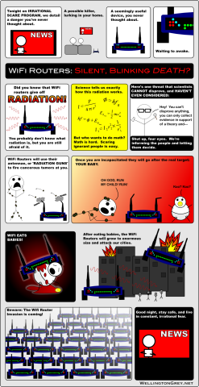

Dieser 
[Comic](http://www.wellingtongrey.net/miscellanea/archive/2007-05-27--the-truth-about-wireless-devices.html)
ist mir wichtig.
Ich bin ja auch eines dieser bedauernswerten Strahlungsopfer, ein schlafgestörter, geistig zurückgebliebener, zwergenwüchsiger Kümmerling:
Ich wäre eigentlich 4.50 m groß geworden, hätte Feuer speien können und die Weltherrschaft an mich gerissen, aber durch die Strahlenexperimente meines Vaters bin ich halt klein und schwach geblieben und muss meine Software unter der GPL verschenken.
Danke, Papa!

Der Comic irrt jedoch, wenn er die Gefahr bei der Strahlung verortet. 
Es ist nicht die Strahlung, die gefährlich ist, sondern die Antenne. 
Ein Mobilfunkprovider, bei dem ich mal gearbeitet habe, hat das in einer Doppelblindstudie erforscht:
Antennen die mit Basisstations-Containern aufgestellt wurden erzeugen bei den Anwohnern exakt dieselben medizinischen Beschwerden wie Antennen, die unangeschlossen aufgestellt werden.
Muss irgendwie die Kristallstruktur in den Antennenmetallen sein.
