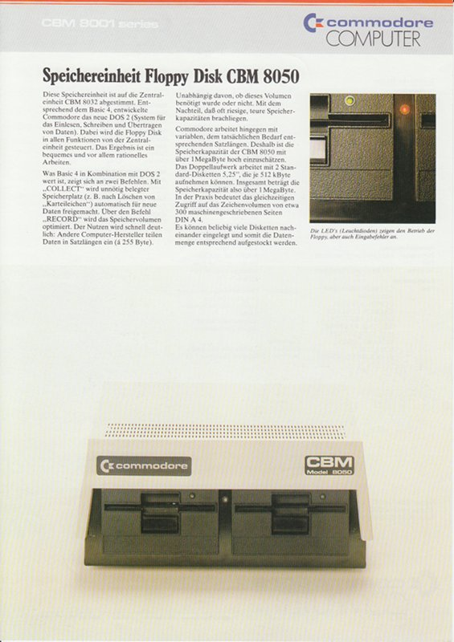
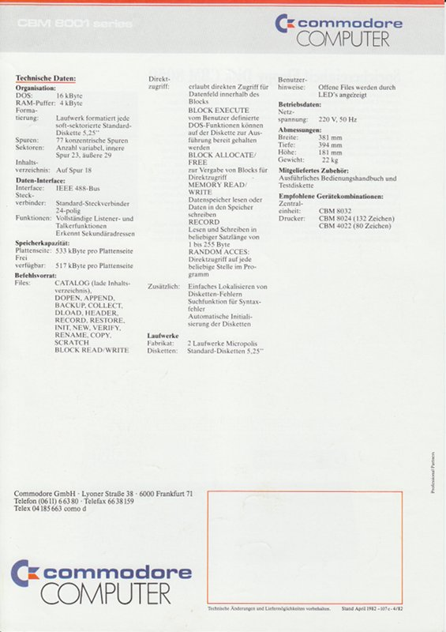
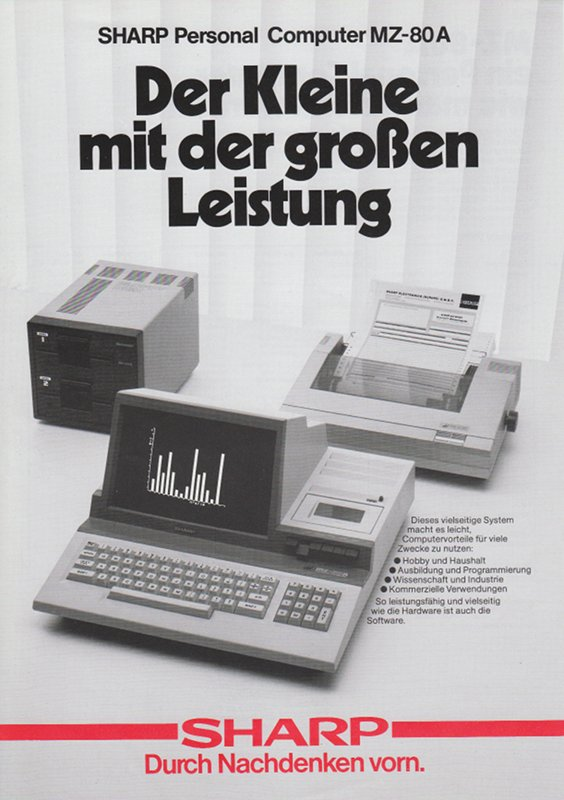
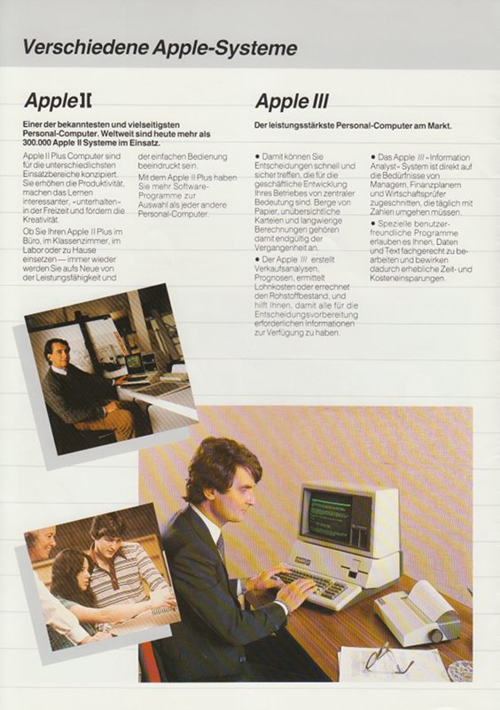

Beim Aufräumen habe ich noch ein paar alte Prospekte gefunden und mal eben
eingescannt.

### CBM 4001 Series, Stand Januar 1982.

### CBM 8001 Series, Stand Januar 1982.

### CBM 8050 Diskettenlaufwerk (das Große mit der hohen Kapazität).

### Commodore MMF 9000 (Ja, so was gab es mal):

### Color Genie:

### Sirius 1 (kleiner Katalog):

### Sirius 1

großer Katalog, mit dem ganzen Business Chic der 80er - um diese Zeit liefen
Dallas und Denver Clan:

### MZ 80 A:

### PC 1500 (LCD, Drucker, batteriebetrieben):

### Apple 2 und 3:

