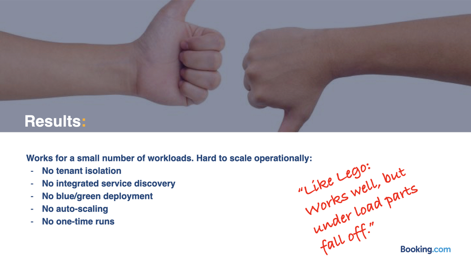
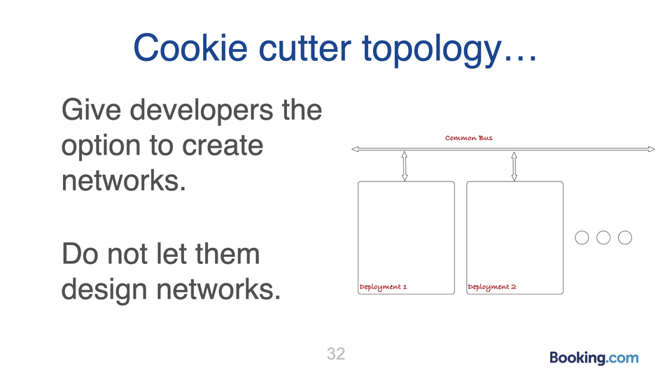
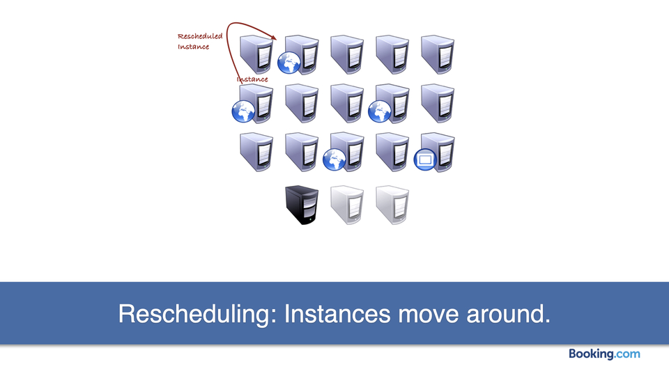
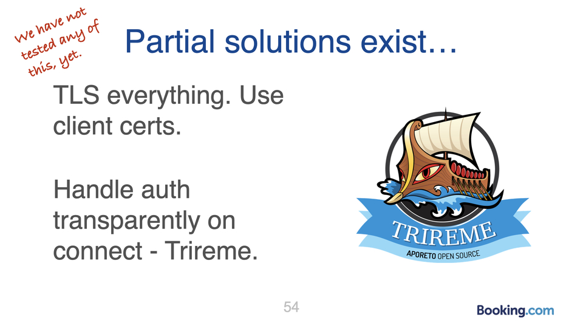
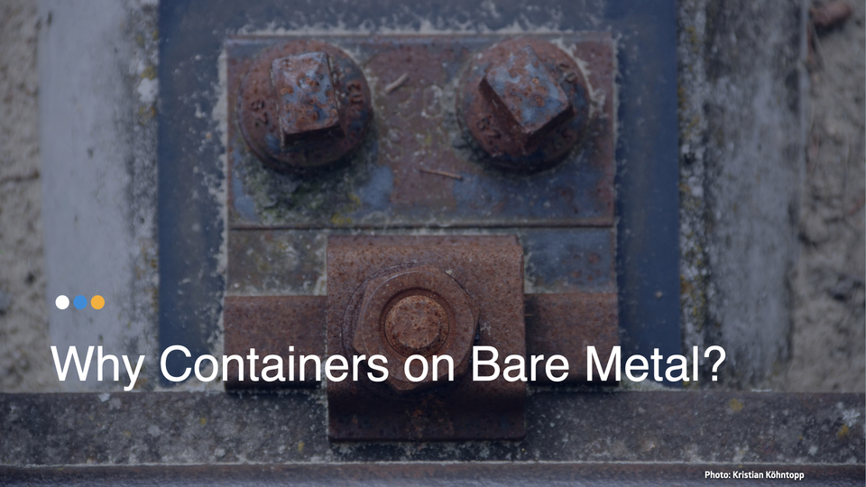

Talk given at the Netways Open Source Data Center Conference 2017.
There is a video of the talk [on Youtube](https://www.youtube.com/watch?v=ggiqbN3xAjs).

The title of the talk was not final, when I submitted the proposal, so I just set it to "Something Mumble Containers Kubernetes".
It came out as "Containers at Booking" in the end.

This is kind of an interim report about how compute is changing, the factors and pressures at work there, and how that affects us.
This is not a finished journey, yet.
Things are still changing at Booking.

# What we do

What Booking does was selling rooms, and getting commission from the hotel for that.
That used to be a very simple thing, it seems, but it was already complicated enough, because the business is very different depending on where in the world you are.

It is for example rather hard to explain what to expect from a hotel, as the product is not very standardized except when in the USA.
Most of the hotels in the world are independently owned and operated, and not part of a hotel chain.
So they are all very different in interior, room arrangement and facilities and many other details.
Many reviews and images are necessary to set expectations properly with customers, and to build trust.

Running the hotel website from an Infrastructure point of view means we aim to be boring:
When we fail, or lose bookings, somebody is sleeping under a bridge and we have ruined a holiday.
While adventure in a vacation is good, that is only when it is planned, and when it ends well.
So being boringly reliable is what we aim for.

# Where we are

At this point in time production is completely on bare metal.
We are a colocation customer, we do not have our own data center buildings, but instead make use of multiple rooms in multiple locations.
In these we have a few ten thousand machines.
These are enterprise class blades from HP and Dell, mostly, plus a few pieces of special purpose hardware.

To drive this, we have automated the handling and provisioning of the machinery, using several Python Django applications that have been developed in-house.
They automatically provision stuff:

- ServerDB managed hardware, from handling procurement and vendor dat ingest, to burn-in, BIOS updates, inventorization and hardware provisioning.
- Nemo does the same for networking equipment and provisioning.

As a developer, you ask ServerDB for servers of a given type in a location.
ServerDB will flash these things up to spec, provision them for you.
It will provide a partition table, install a base operating system and tell Puppet what to do.

Puppet will install packages and configuration templates, and then hand over to class specific tooling.

In the case of databases, for example, this is another piece of class specific tooling, B.admin ("badmin").
This will then provide database packages, replication configuration, data and will ultimately arrange the databases in a replication hierarchy and make them discoverable for clients.

It is possible and totally normal to get 200 databases ready to run in a replication chain, discoverable by applications, without a human touching anything in the course of the provisioning.

## Disadvantages

Despite this being fully automatic and comfortable, it has a number of disadvantages.
For example, it is slow, because hardware provisioning is slow. Rebooting a Dell or HP Blade takes 300 seconds, and only then the OS install can begin. A full provisioning run easily takes around 20-30 minutes.

*Not a blade, but an HP 380DL booting, but not much of a difference in timing or handling ([video](https://www.youtube.com/watch?v=R_qR9_fVIbQ)).*

Bare-metal hardware also is often too large or too small for the task:
In our case the hardware we use is at the low end of the available specification, but in many cases already is too large for a single application to fully utilize.

# Current hardware is too powerful

A current bladecenter chassis (HP C7000, Dell M1000e) uses 10 height units of rack space.
It has room for 16 blades.
When used with the large kind of CPU (2x Intel 6132 per blade), one chassis alone provides around 900 threads, 3 TB of memory and 320 GBit/s of aggregated network bandwidth, and will consume up to 6400 Watts of power under full load.

While the rack theoretically has room for 4 of these things, it cannot realistically power that much compute under full load.
Most data centers provide around 7000 Watt per rack, so with average load two of these blade centers can be put into a single rack,
and if we actually ran the machines at full power, only one bladecenter per rack would be possible in a normal data center.

# Pressures on the data center environment

We do not only need to slice and dice the hardware, but the business also wants us to be even more agile and faster.

We need to be able to scale out the IT organisation to 3x the current number of people, because we are a growing company in a growing market,
but the current way of running things does not support this very well.
In order to get there, we need to automate provisioning of hardware completely, providing our developers with an API.

We need to be able to plan capacity, for which we need metrics.
Also, data center operations need to be able to provide machinery in advance and independently of the consumption.
We can no longer support hardware types that are tailored to the use-case, 
we want to buy larger machines and be able to slice and dice them to bite-sized instances.
This is also more cost effective.

And for better planning, we want to get machine readable service descriptions (who talks to what),
which helps management to see the entire application and all components and the relationships between them.

# The Monolith

The software currently is a monolith and needs to be split from being a 6GB process into something smaller.
This is startup size, then the thing forks and the actual instances share a lot of memory with the parent process.
So the actual memory consumption per instance is a lot less.

The software is written in perl and is pretty well-structured and modular, but the deployment model is outdated.
We roll out between 10-14 times a day, and that is of course also automated.

Software of this shape is not well suited to a rollout in containers.

What so we want to do?
Change the entire stack:
Data center and hardware level, but also looking for better data center space.
Move to containers to be able to slice and dice the hardware.
Change the application to use microservices, in Java.
And also work towards a different business model.

# What are containers?

Containers are just UNIX processes with additional fairy dust added between the `fork()` and `exec()` system calls.
Part of this fairy dust are Linux Namespaces and Linux CGroups.

Namespaces limit what an application inside a container can see, in terms of other processes, other files, and so on.
CGroups limit the amount of resouces an application inside a container can consume, in terms of memory, CPU, and so on.

Containers are for a few years now well understood, and known, in the form of Docker.
Docker standalone is not useful for production, though. 

It is dev centric, and from a developer PoV, it is very useful to simulate pristine environments.
Developers love the layering of filesystem layers, the instant availability,
and that one is able to fold production into a single host.
Docker does nothing at all for operations, though.

K8s is useful because it throws away most of Docker and does proper production things.
It provides an environment where the allocation of resources can happen from many hosts, automatically,
and in which the networking between instances is set automatically, no matter where instances run.
In also manages storage, in a way where the lifetime of storage can be managed independently from the lifetime of a container.

A single dockerhost can take you very far (20C, 512GB memory, disks), it can hold a lot of development.
It still not useful for production, because it gives you a SPOF, does not scale and does not understand things larger than a single machine.

# Images as a form of wrapping dependencies

One of the useful things Docker provides is the concept of an image that collects all the files belonging to an application,
and all the dependencies it has.
It keeps the base host clean, and allows us to the application anywhere without much hassle.
Conversely, it also makes the application app removable.
We get instant applications, just add CPU and memory anywhere in the data center.

Applications become single file, loopmounted images.
This can also be moved around very quickly, much faster than 100.000s of files.

Since we cannot know what is in the image, we need to control what goes into the image.
We need to be able to build the images from scratch, on our own infrastructure, and be able to scan the receipts in order to understand what's inside.
We cache the dependencies locally, and we use this to have reproducible builds.

# Mesos: A project that escaped from a hackathon

Booking was running Containers using Mesos.
This was a Hackathon experiment, that accidentally escaped into internal production.
It was not running important things:

- The Blog
- Some internal websites
- Some ML/Big Data jobs
- Some Java component services, mostly internal

Mesos proved to be a lot like Lego: modular, but parts fall off under load.
This seems to be somewhat par for the course for ASF stuff, judging from our experience with Hadoop.

It was very much not up for production, with many missing things, and also no external mindshare.
For us, what was missing was isolation of tenants, no discovery, no deployment rules, no auto-scaling, 
no one-time batch runs, and no rbac.

But the container thing was useful.
We wanted to keep that, but run it better.

# Trying Kubernetes

When looking around, we found K8s, which has all the stuff we needed.
The Environment is very cooperative and receptive to suggestions, a lot of momentum and mind-share.

This is what you get:
"I want to run something," and it runs somewhere in the cluster where there is space.
The image is installed on the target node selected, it runs, and after the run is finished, the image can be cleaned up.
Like `init`, but for a set of machines.

"Run an application anywhere in my data center, I do not care where exactly"

K8s refines the concept of a container, compared to Docker:
- The Pod: resource barriers (like VM, but is not a VM)
- Filesystem Namespaces + the Images in one Filesystem Namespace.

This allows the resource barriers to contain multiple processes from multiple images, which can touch each other.
This is useful for debugging, for sidecars and in many other situations.

Sidecars can manipulate and debug payloads in their pod.
Pods are very cheap, they are basically invisible: 
just namespaces and limits, they take up almost no resources themselves and also have almost no setup time.

When talking about Kubernetes, it is useful to not say container, because it is not specific enough.
What do we mean, when we say container?

- the pod, 
- the image, 
- the init-container, 
- the sidecar

It is usually better to use specific words instead of the generic word "container".

# Kubernetes, Iteration 1

Earlier this year, we started our first tiny deployment, to test things out:
8 bladecenters are 128 blades, in 8 racks, with 2x 10 Gbit per Blade.
If you put only one bladecenter into each rack, the rack is only 10U filled, 30U are empty:
"Not really a cloud, it's more like ground fog" when you have only one blade center per rack.

Iteration 2 was built with discrete machines (2U):
128 discrete machines, in 8 racks, 1x 25 Gbit/s per machine, with an option to double this.
Also, lots of storage and the option to play with distributed storage.

# A million corecomputer

You can try to build the million core computer:
20.000 machines at 50 cores for a million core computer.
This is too large for a single cluster, it needs to be split for many reasons.

The workload is image based on unified hardware, and the workload is 
location independent.
That is, any core in any machine can talk to any disk in any box.
This needs very strong networking.

# Trying out Openshift

For a full production deployment, we considered using OpenShift.
At that point in time it looked like a good idea to get more familiar with K8s.
OpenShift provided a number of solutions for us that otherwise would need specific solutions from us.

For about two years it was very useful, but in the end it was moving too slow.

# Networking

Clusters always need good networking.
The network we have is using L2 domains per rack, L3 with BGP between the racks.
It is a Leaf-and-spine, which can be oversubscription-free to up to 1.6 TBit/s at the top-of-rack,
but we have no need for this at the moment.
The way we built it means we can incrementally grow it as needed.

We have a lot of east-west-traffic.
This is expected for such a cluster, and it is unlike before, with monolithic bare-metal systems.

Out network looks like this.
Container machines have 100 Gbit/s, but are part of the same topology as for the bare metal stuff.
There is no special K8s network and also no dedicated storage network, leaf-and-spine topology takes care of all of this.

# You need less SDN than you think

We have played with several SDN instances:
Juniper, Midokura, we found that SDN "is too good" for our needs.
Openstack like SDN gives you a lot of flexibility, developers can build an arbitrary virtual network architectures.
The SDN will build and simulate that.

We do not want to give Devs this power, because devs will use this.
This will be very hard to maintain.
We want something standardized.

It also leads to fragility and upgrade problems at the network level.
We are not using SDN at the moment, having Midokura on the backburner.
Instead, we are experimenting with service meshes like Envoy.

We want shared infrastructure on a physical node (i.e. centralized logging),
but we are not doing this right now.
Instead we use instead sidecars for logging and monitoring.
Since we are not a hoster it can be okay to share things.

Finding things is hard in a cluster.
IP addresses and host names no longer mean a thing, they are no longer fixed and can shift around as the cluster topology changes.
This is also a problem for IP-based access rules, or for identifying machines by IP-address, as Cassandra does it.
Everything is dynamic. How do you find things?

Enter `etcd` as a consensus system and as a registry for endpoints and services.
Things that run in the cluster register themselves in the `etcd` and can provide capacity to a service.

Kubernetes creates services, which are almost a load balancer.
The service monitors the available backends in `etcd`, and updates when the list in `etcd` changes.
Incoming requests are randomly routed to any available backend.

Lookups of services are cheap:
Backends register themselves in `etcd`, with a lifetime, when they are ready to serve.
They regularly refresh their presence in `etcd` in order to prevent the registration from expiring.

Services subscribe to changes in the endpoint list, and cache the list.
They get a notification when the list changes, update their cached copy.
Incoming requests are being served from the locally cached copy.

In OpenShift, this is being implemented in a very, very large number of `iptables`-rules,
and that can lead to problems.
We typically see a few 10k rules, and they are used to select random instance to handle a request using DNAT.
This is not pretty.

Service meshes solve the same problem with application level proxying, which is easier to handle, at the cost of latency.

# Balancing load

Kubernetes does not migrate instances, ever,
because that usually does not work at all.
Instead, instances are rescheduled, which means the old instance is destroyed,
and a new one is created.
The number of instances is variable, single things should not exist.

# Storage

This is a problem for things that have state, and use storage.
Kubernetes has a relatively new and recent feature that is largely untested,
called Persistent Volume Claims, which handles this in a nice way.

When you have a piece of hardware that provides storage in the form of volumes.
Volumes need to be created in a hardware specific way, and are then served as iSCSI volumes to the cluster.
Somebody needs to format them with a filesystem, but only if they are new and empty.

It used to be a manual process: Create a bunch of formatted persistent volumes (PVs), and make them available.
The cluster would get requests for these, and find the smallest one large enough to serve, label it and assign it an identity.
It would then serve this out.

This is a partially manual process, and also leads to overprovisioning, because the prepared PV is likely larger than requested.

# Dynamic Persistent Volume Clains (PVCs)

New and automated: PODs can ask for storage, using a persistent volume claim (PVC).
The cluster intercepts this request, a volume is made to order, and then served out to the requesting pod.
This often fails: many storages do not like volumes to be created and deleted at a fast pace.

When it works, it looks like this:

- PVC is scheduled with the rest of things
- PVC intercepted, PV made to order
- Host node mounts the PV using iSCSI
- Bind mount puts the volume into the Pod
- Volume is being prepared if needed, and
- Volume is then available.

When the node fails,

- The pod is rescheduled
- The new instance of the pod has the old identity with the old PVC
- iSCSI lock is broken, volume is dismounted, mounted in on the new host
- New bind mount
- PV comes online in the new instance of that Pod.

It requires that Pods have a fixed identity (are available as a fixed size array).
This is the Kubernetes `PetSet` or `StatefulSet` now.

Plenty of limits: In our case, 64 hosts with Solidfire and the Trident API.
iSCSI has latency issues for some applications.
These issues are being fixed, but currently don't work.

We need < 0.5ms commit latency, but do get 4ms with the current setup.

# Stateful Sets

Storage is a way to manage state.
State is unique, instances have names or fixed identities.
This is a concept that previously was not available in Kubernetes.

The new `StatefulSet` API implements this.
They guarantee ordered teardown and startup of Pods, with fixed identities.
This is needed by any cluster, for example in Zookeeper, MySQL, Elasticsearch and in many other storage systems.

We have mysql running in `StatefulSet`.
We also test with Elastic, and also our internal Availability Database.

# No IPv6

We are using IP per Pod, so we consume a lot of IP addresses.
With 100 hosts, many Pods per Host.
Racks are L2 domains, BGP at the Top-of-Rack switch/router.
A 100 node cluster can easily eat a V4 /16, which is unacceptable even with RFC addresses.

Unexpectedly, Kubernetes is an excellent use-case for IPv6 in production,
but it is internal, not visible to the outside.

Unfortunately, Kubernetes, a brand-new project developed at Google,
is at this point in time totally unaware of IPv6.
Nobody knews why, and it really hurts.

# Getting into the cluster: Gateway routers

Ingress Routers exist on Gateway nodes.
These can act as chokepoints,
especially when there is a lot of traffic from certain nodes,
for example external databases.

A way around that:

Put legacy databases inside the cluster
using in our case ovs-switchd.
This will "take physical database and lift it into the virtual",
so you have a bare-metal node that pretends to be in the cluster.
This works only if that external node can be trusted.

This is not specific to our way of networking, it is also a problem in proper SDNs.

# Breaking IP-based security

*red = allowed, green, yellow, blue = random other things*

Exit IP are now random, and do not identify a service.
Any IP-based security no longer works.

Traditional firewalls are useless; the only way to go is to allow-list the entire cluster.

# Towards a service mesh, and Envoy

In our current model, firewall rules are autogenerated from ServerDB data.
This does not work with Kubernetes at all.

A way around this is to TLS all the things, and use client certificates to identity services.
Connections need to be intercepted and automatically authenticated, then be allowed or disallowed based on their identity.

Trireme is a way to do this at the kernel level, requires no adjustment in the application.
Other ways work with proxies towards the same goal.

We haven't been able to test that, yet.
It feels weird from where we are coming from, and is a bit scary. 

# Sizing the cluster

How large can a cluster be?
It can run on a laptop, or on one or three prod boxes.

Currently have low hundreds of cluster nodes.
Large clusters are not good, you'd want more clusters instead of one rather large one.
This provides resiliency.

Next step: Cluster Federation.
This is a very experimental k8s feature, and a research topic.
Nobody has an idea how any of that works.
If it works, it will be very useful.

# Local Kubernetes and the Public Cloud

We experiment with the public cloud as well.
But we do like bare-metal:
- we control the crosstalk between apps
- we can freely define instance sizes 
- When we talk to a cloud provider about 1 mio cores, how long would it take to spin this up?
  - They do not have the capacity ready in idle, can take a while to get capacity.
  - At enterprise level, the cloud is not elastic: preallocation is necessary.

Data centers are not things that have high margins or low latency.
4MW = 20.000 machines -> somebody needs to run excavators to provide this capacity.
Long term contracts are par for the course, so it is mostly a capex to opex shift.

# Why Kubernetes on Bare-Metal?

Virtual Machines are not helping with any problem we have.
They would add complexity and jitter, and add no benefit.

# What about the Monolith?

What about the Monolith?
That's another problem, it's a problem being worked on.
