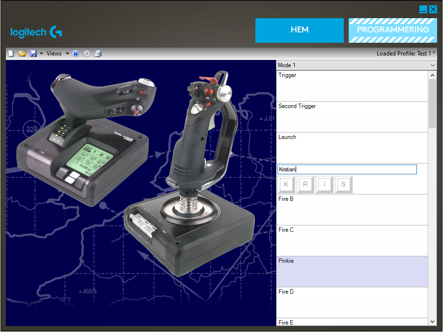

This post is a memo to self, and describes how to disable the
X.52 clutch mode. I am flying with a Saitek/Logitech X.52 pro
[HOTAS](https://en.wikipedia.org/wiki/HOTAS), and this stick has
a 'clutch button' (labelled "i") in the thumb position of the
throttle (image: clutch highlighed in red)

"Clutch mode" for this button means that it is usable as a
modfier for the other buttons, when pressed together with a
second button. Alone, it does nothing. For me, that is useless.

In order to disable the function, go into Windows Settings, click
Devices, and search for "Set up USB Game Controllers".

As always, useful things in Windows can only be accessed via
search and not via menu.

Select the device, and then hit the device properties.

In the MFD (Multi Function Display) of all places you can also
disable the clutch function (which, of course, has nothing to do
with the MFD at all).

Because Windows is stupid and saves this configuration per
USB-port, you will have to redo it every time you plug the stick
into a different USB port.

**EDIT:** Göran Nilsson explained:

> You can reach the Saitek modding using the original Saitek way as follows on Win10:
> 
> -Control Panel-Devices and Printers-Right Click on the HOTAS
>
> 
> 
> The main use of the "Clutch Mode" is to get the current key function displayed on the MFD, without actually activating that function. 
> I find that useful when you change between different SIMS, where you have alternative assignments to a specific key or function.
> So pressing "Clutch"+"Anykey" displays the current functionality of "Anykey" as text on the MFD as long as you keep Clutch depressed.
> Latch Clutch means that you have to press the Clutch once for uncoupling the function and once again to switch between actual function and text describing the tested key.
> The text you want is of course possible to set when you program the keys
> Personally I find that very useful as I tend to forget all these possible allocations of various functions to keys.
> Different sims needs different fast keys. 
>
> Example : Programming the "FireA" button to issue "KRIS" to my software.
> "Clutch"+"FireA" will now show "Kristian" on the MFD without actually sending anything to the running program. 
> Given the rich programmimg possibilities I definitely need an online "cheat sheet" that the "Clutch" makes available.
> 
> 
