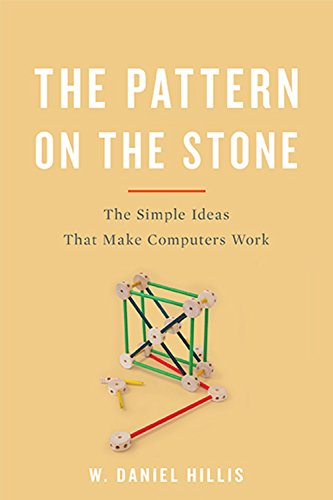

This is an old book, from 1998, and much of the technology referred to directly has evolved since then.
But, as this a book that deals with basics, in terms of metaphor and analogy, it is still valuable.
It explains how computers work, and how we make the tech that powers them.

*[The Pattern on the Stone](https://www.amazon.de/-/en/W-Daniel-Hillis-ebook/dp/B06XC774TQ), W. Daniel Hillis*

Computers are really easy.
There is just Zero and One, and it does not get any more complicated than that.
The complexity in Computers and how they work comes instead from using simple rules, making them combinable, and then arranging them into more complicated structures by reusing previous building block.

The book makes that very clear.
It starts at Zeroes and Ones, and takes the reader on a tour, explaining how we get the things we have (or had, 25 years ago), and how they are made by reusing stuff we build previously.

"[The Pattern on the Stone: The Simple Ideas that Make Computers Work](https://www.amazon.de/-/en/W-Daniel-Hillis-ebook/dp/B06XC774TQ)", W. Daniel Hillis, EUR 9.99 on Kindle
