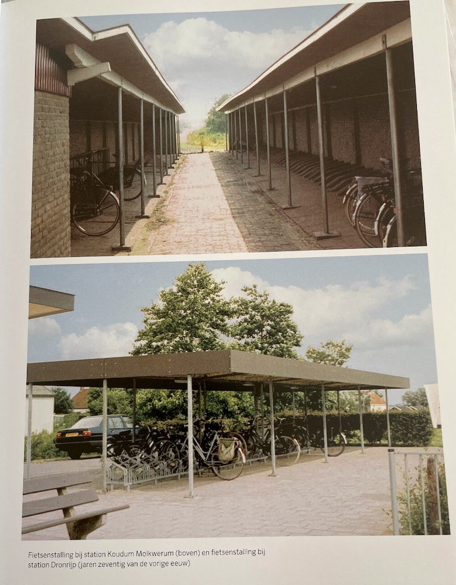
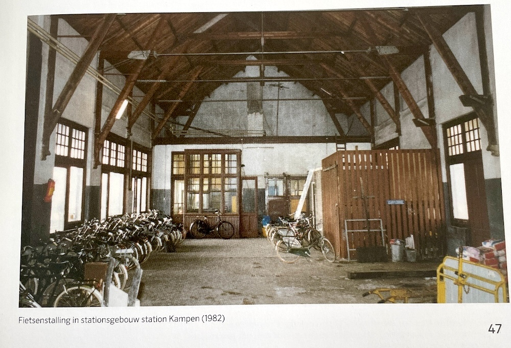

The Netherlands realized around 2000 that they have a problem with bike parking around train stations, and with parking around stations in general.
A program was set up to fix that, assuming things would be done with in ten years.
The program was a great success, and people taking the bike to use the train, and to use a bike after they arrived at their destination by train increased greatly.
This created more needs, and so the program is, changed, still active today.

*[Fietsparkeren bij Stations](https://www.amazon.de/-/en/Folkert-Piersma/dp/9068688286), Folkert Piersma and Wout Ritzema*

*Title Page*

The book talks, in one chapter each, about analyzing customer needs, the history of the program, guidelines and goals, the plannning process, typical bike parking facilities, architecture and design, investment costs, facility operations, technical resources, innovative solutions and finally an outlook.

*Table of Content*

- What matters to cycling train travellers?
- Historic review
- Policy for the development and construction of bicycle parking facilities
- Plan development
- Types of bicycle parking facilities
- Architecture and design
- Investment costs
- Operation, maintenance and enforcement
- Technical resources and innovations
- Innovative types of parking facilities
- Challenges and opportunities
- Overview of bicycle parking facilities at railway stations, numbers of bicycle parking spaces per station to storage type

*The Bike/Train combination is special.*

> The bike/train combination is special in many ways.
> First, as a mode of transport, they have more in common than you would think.
> Both have a low impact on air quality, and they are also propelled in a natural manner:
> The electric trains of the Dutch Railways run on 100% wind energy,
> while bikes are propelled by muscle power, at times supported with a bit of electricity.
>
> Both cyclists and train travelers like speed and convenience;
> cyclists want to get to their train as fast as possible without encountering any obstacles,
> while train travelers move fast while they read a newspaper, prepare for work or take a nap.
>
> According to Dutch Railways, nearly 50% of all train travelers (in 2019, about 1.5 million journeys were made each day)
> get to the station by bike and in some places, that figure is 70%.
> Approximately 16% of those travelers use the bike to get from the station to their final destination.
> Twenty years ago, those figures were 30 % and 10 % respectively.
> Because of the growing popularity of the bike and growing consideration for health and sustainability,
> we expect these percentages in the bike/train combination to rise further.
>
> This combination already means that the car has fierce competition,
> especially for city-to-city connections.
> A study by the University of Amsterdam shows that the travel time from,
> for example, the centre of Arnhem to the Rijksmuseum in Amsterdam (approximately 100 km) 
> is virtually the same for both the bike/train combination and the car.

*Load diagrams and station plan with the bike parking in relation to the platforms.*

*"Groot, licht, dichtbij. Dit is ideaal!" -- Christien*

> Protected and unprotected bike parking.
> People coming to the station can park their bike protected or unprotected.
> Protected bike parking can be with personnel or without.
> An example of protected bike parking without personnel would be bike boxes.

*"Ik kom hier graag. Er is gewoon altijd plek!" -- Xiaohe*

Planability and reliable availability of bike slots are important to customers and commuters.  

*Bike parking in the 1970s. 
Fietsenstalling bij station Koudum Molkwerum (boven) en fietsenstalling bi station Dronrip (jaren zeventig van de vorige euw).*

Times and usage-patterns change.

To understand where the Netherlands are today, we have to look at the past.
These photos from the 1970s show the situation in typical stations from that time.

*Station Kampen, 1982.*

The Dutch word for a bike park is "stalling" ("stable"), and in this case it is meant quite literally.

*Replanning and rebuilding bike parking at station Deventer.*

The Situation shown in 2002, and in 2012 after renovation.

*"Programma fietsparkeren bij Stations"*

The change is not accidental, but the consequence of the program "Bike Parking at Stations",
which started off around 2000.
It has changed the nature of bike parking at stations in the Netherlands fundamentally.

But it also had different, further reaching aspects,
and that is why it is still ongoing after 20 years:
Not only is the sea of bikes around the train stations gone
despite more people arriving by bike at the train than ever before,
also the quality of the area around the train stations improved.
The dark and seedy underpasses and the general feeling of insecurity around many train stations areas in other cities is no longer present here.

What works and what doesn't?
After gaining experience with the initial construction program and being pleasantly surprised by its success,
the program was expanded to a broader basis, and the learnings were implemented.
Financially, the group also improved its position.

> It quickly became clear that not all conditions included in the "Taking Your Bike to the Train" directive were functioning well or efficiently.
> In Chapter 3, we already discussed the aisle widths in the bicycle storage facilities,
> which were found to be able to be narrower, allowing for a more efficient layout of the storage area.
> Another important adjustment was the positioning of the monitored and unmonitored storage facilities
> in relation to the station entrance and the prescribed covered walking route from the monitored storage to the station.
> It also turned out to be necessary to equip the indoor monitored storage with tiered racks,
> which was already the case in virtually all existing monitored storage facilities.

*Planning and exploration phases for a bicycle parking facility are presented and explained*

*Target audience and their needs.*

> Highlighting some important research
> 
> Understanding the Target Audience
> 
> Bicycle parking facilities at stations have a very specific target audience with distinct needs,
> as also mentioned in Chapter 1.
> We know that train travelers are "time travelers"
> and we assume that cyclists heading to the station are almost always in a hurry 
> because the train won't wait.
> It starts with the route from home to the station:
> Cyclists prefer the shortest and fastest route from home to the station.
>
> Furthermore, cyclists want to get on the train as quickly as possible
> and spend as little time as possible parking their bikes.
> Therefore, we place the bicycle parking facility as close as possible to the station entrance.

*Capacity planning using the example of the fictional station Amperveen.*

> Case STATION AMPERVEEN: Local Customization for Projections
>
> The fictional station Amperveen and its surroundings
> 
> Based on the current observed usage, this station requires 3630 spots.
> With the currently available 3000 spots, there is already a shortage of 630 spots.
> It would not be surprising if the long-term projection ends up at 5750 spots 
> (20 % increase in travelers, 20 % increase in bicycle usage, and 10 % latent demand).

*Real Simulations: Amsterdam Centraal Station. [ZW1A with a capacity of 7000 parking spaces has just been completed](https://www.youtube.com/watch?v=EqwasBTzZS8).*

> Case Station Amperveen: Distance to the Station
>
> In the analysis of parking locations, the distance to the station is also important.
> We try to create parking facilities as close as possible to the station entrance,
> but sometimes it is not possible to meet the full demand.
> Offering 'first 24 hours free' parking is also considered a form of unpaid parking.
> If a station has a significant number of weekend parkers, which is often the case in student cities, 
> it may be considered to provide a free unguarded parking facility at a slightly greater distance,
> up to a maximum of 400 meters.

Types, by Prevalence and Price:

- Ground-Level Parking (as seen in the 1970s photos)
- Bicycle Flat (Multi-story Bicycle Parking)
- Indoor Parking
- Underground Parking
- Mega Parking

*Pedestrian Flow Analysis for the bike-parking "Stationsplein Eindhoven Central (south side)".
Variations in the Layout of bike lots.*

So, what did we learn in the last 20 years?

| Typical 90's                                                  | Trend 2020                                                                                                                                    |
|---------------------------------------------------------------|-----------------------------------------------------------------------------------------------------------------------------------------------|
| Not all ground level parking has a roof                       | All ground level parking has a roof                                                                                                           |
| Concrete stairs                                               | Natural stone finished stairs                                                                                                                 |  
| No technical aids to bridge height differences                | Technical aids to bridge height differences, such as brush ramps, moving walkways, or escalators (if required and funded by the municipality) | 
| Unfinished concrete ceiling                                   | Finished with a system ceiling or a smooth finished ceiling                                                                                   |
| Concrete tiles on the floor                                   | Smooth concrete floor                                                                                                                         |
| Unfinished retaining walls visible                            | Retaining walls coated or finished with a cladding                                                                                            |
| Cables and pipes visible                                      | Cables and pipes concealed                                                                                                                    | 
| Unfinished interior walls                                     | (Light) Art on the interior walls                                                                                                             |
| Partition wall made of aerated concrete blocks or system wall | Partition wall made of glass in an aluminum frame                                                                                             |
| Windows in a portion of the wall                              | Floor-to-ceiling windows                                                                                                                      |
| Turnstile at pedestrian exit with low steel revolving gate    | Full-height glass turnstile                                                                                                                   |

*And this is what it looks like.*

"[Fietsparkeren bij Stations](https://www.amazon.de/-/en/Folkert-Piersma/dp/9068688286)", Folkert Piersma and Wout Ritzema, EUR 29.40 Hardcover
