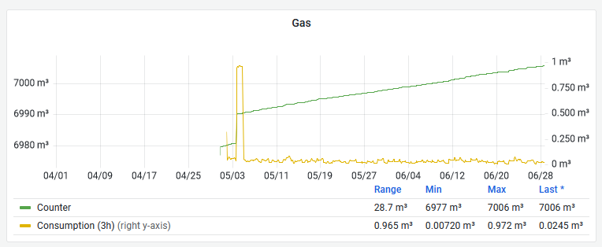

We got our solar roof around 1st of April.
I am describing our setup [here]().
Today we got the bill for Summer 2021 to Summer 2022.

# What I measured

I installed a P1 interface on my electricity counter late in April, so my data does not cover all of the lifetime of the Solar Roof.
Starting the graph at 01-Apr-2022, I get this:

*At this resolution, not very helpful.*

What is visible is the fact that we do not have a battery, and therefore each day we produce energy, but also consume energy from the grid.
What is not visible is the relation.

Looking at the absolute counter values is more helpful.
The total production is on the right hand side, the consumption on the left hand side, and the important number is the Range value below the graph.

We produced 1.66 MWh during the range between 01-Apr and now. We consumed 279 kWh in that interval.
That leaves us with slightly under 1.5 MWh pushed to the grid.

*Heating consumed around 10 m^3 in one evening, otherwise we use gas for warm water. Not a lot.*

We consumed 28.7 m^3 (around 287 kWh) of gas since the begin of metering.
This includes one day of runaway heating worth around 10 m^w, and the rest is warm water.
Warm water is not the cost driver, heating with gas is.

But let's look at the financials:
We get back 561 Euro, because we paid 2297 Euro in 12 monthly installments, and used 1735 Euro worth of power and gas.
Mostly gas, but more on that further down.

Our monthly installment two years ago was 192 Euro, last year 202 Euro, and this year it will be 213 Euro.
Of these 213 Euro, 199 Euro will be for gas.

So already, without knowing details, we have our mission.

# Get off Gas, now!

This is our electricity intake for the last 5 years:

*Down to 2.052 MW/a from 4.850 MW/a.*

Active since April 2022, the solar array has fed back sufficient electricity to compensate for more than half our consumption.
Do I believe in overprovisioning?
Well, yes, kind of.
The array has been built with future use-cases in mind.

In any case, in the last 12 months we used 3881 kWh, and pushed 1834 kWh back to the grid for the set consumption you see in the bill.

*Down to 1251 m^3 of gas.*

Out gas consumption also fell, but that is mostly due to a mild winter and not heating much.

# Doing the math

We are paying around 22 ct per kWh of electricity, and while there is a bit of fixed cost, it hardly matters – 22.5 ct per kWh all in.

Gas costs around 108 ct per m^3, which is an energy equivalent of 10-12 kWh warmth depending on the type of gas.
Fixed cost here is substantial, and we end up at 132 ct per m^3 overall cost (1349.88 Euro for 1251 m^3, and 274.58 Euro of fixed cost).

| *Heating*      | Electricity |     Heat Pump |       Gas |
|:---------------|------------:|--------------:|----------:|
| Heat generated |      10 kWh |        10 kWh |    10 kWh |
| Energy used    |      10 kWh |       2-3 kWh |       1^3 |
| Cost per unit  |  0.225 Euro |    0.225 Euro | 1.32 Euro |
| Total cost     |   2.25 Euro | 0.5-0.75 Euro | 1.32 Euro |

So to create 10 kWh of warmth from a heat pump, you have to expend 2-3 kWh of electricity, coming in at 50 ct to 75 ct per m^3 gas-equivalent of heating.
That would be around 1.75 to 2.5 times cheaper than heating with gas.

A heat exchanger can be a air-water-air system, so a heat exchanger that uses energy from outside air to heat water that is fed into the existing heating.
This will work to around -10 C to -20 C outside temperatur, but for temperatures below zero, it will become successively inefficient.

If your area permits it, you can take energy not from outside air, but from the water or earth below the house.
This is virtually always frost-free and hence relatively efficient.
So if you have a houseboat or are allowed to install an earth circuit, this can be a completely painless solution.

Existing radiators driven by heat exchangers almost always need adjustment or exchange, because the water-in temperature of the system is substantially lower than a preexisting gas burner.
So somebody with actual clue will have to do the math and adjustment during installation, and some people will have to either change radiators, or install active venting (fans, basically) that push air through the radiators as a leisurely pace.

If you need air condition anyway, because for example there is a roof room that needs active cooling in summer, you can make sure that you get an airco unit that can operate in reverse mode.
Most of the units that support it are as efficient as heat exchangers, and heat air directly.
Here the work factor is comparable to normal heat exchangers.

Either system will get you off gas, or (with the airco) work in parallel to an existing gas or oil heating – which is nice in case you do not trust the new system and need backup.
