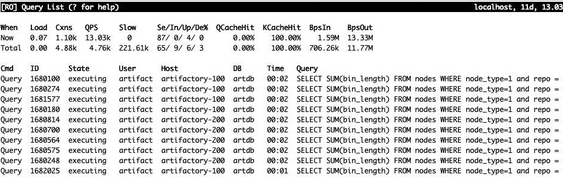

Two weeks ago I was being drawn into the debug of artdb, the Replication hierarchy used by our Artifactory instance.

> ## TL;DR
>
> Artifactory overloaded the database. 
> This was incident-handled by optimizing a number of slow queries using some covering index trickery, and by upgrading the hardware substantially.
>
> Using the runway we bought, we found and partially fixed the following problems:
>
> - *Fixed:* A number of very expensive reporting queries were sped up 16x to 20x using covering indexes, from 180s runtime to 8s-12s runtime.
> - *Fixed:* We optimized our database and data size by completing the data lifecycle for several repo types, deleting old images.
> - *Fixed:* Hardware upgrade lowered load even more, and sped up the queries even more.
> - *Fixed:* Further investigation identified a synchronisation cron job which overloaded the database in 40m intervals. The cron job was throttled and is now on a backlog for refactoring.
> - *Fixed:* The long running queries were identified in the Artifactory source code, which allowed us and jFrog support to identify that a) the Artifactory internal cache for these queries was bypassed and b) this happens when certain JMX monitoring options are enabled, per application host hitting the database instance. The monitoring was temporarily disabled.
> - *Fixed:* For each image download, Artifactory writes statistics updates, which can lead to lock contention on hot images. We identified a configuration that could turn this off, and later found that these updates can be happening batched in the background.
> - *Unfixed:* Artifactory does not understand the concept of Replicas and database scale-out at all, it can only do database scale-up, and that has absolute limits.
>
> The database workload for Artifactory is now well below critical levels and has on the current, upgraded hardware runway for estimated 4x growth.
> Beyond that, vertical scaling is going to be hard without changes to the architecture of Artifactory.

Artifactory is a third party piece of software that stores binary objects in one of several BLOB storages and serves them up to people who need binaries in whatever way.

There are several choices of BLOB storages for it, we are using S3.

There are several choices of data delivery formats for Artifactory, we are using many of them, with "Docker Repository" and "Maven Repository" being the most prominent use-cases.

Artifactory is using a database as a metadata storage, and again, there are several possible choices. 
We are using MySQL.


*Binary Delivery Formats and Protocols supported by Artifactory (https://jfrog.com/artifactory/).*

# Overloaded Database

The original complaint was "Artifactory is down" and "The database is overloaded".
Investigation of that shows that this was very much true:

The primary of the replication hierarchy was a blade from 2017 with 12C/24T, and was showing load spiking into the 40-ies.


*For a CPU-saturated MySQL on a 12C/24T, anything over 18-20 is probably not very stable and certainly not fun.*

I was looking at the load of the full replication hierarchy and found out multiple things:

- Artifactory does not understand the concepts of replication, multiple database handles or scale-out at the database level. 
  It only talks to the primary database, and can only scale vertically.
- The Artifactory database is seeing a very large query load (> 20.000 QPS), which is comprised of a large number of reads and underneath still 1000s of writes per second. 
  Some of the reads are long running queries, with runtimes in the 180s.
- The long running queries have been sped up from 180s to 9s by applying covering indexes and some index order juggling. 

Read [Boiling JFrogs]() for the full and detailed writeup of this phase.

# Buying Runway

Solving the long runners, we found several other issues at the database level. 
But first we threw more cores into the fire and scaled Artifactory vertically to buy more runway:


*The Blade 7 hardware type uses 2x $400 CPUs for 16C/32T. Blade 2A.1 hardware uses 2x $2100 CPUs for 32C/64T. At the same load, these more expensive CPUs are also clocked around 1 GHz faster.*

Since we had this long running scan queries on memory-resident data, we were using a lot of CPU. 
Even after the optimization, these were scans, but on less and better organized data with one level of indirection removed from each data access – so 16x to 20x faster.

Still, we had a base load of 12 on the Blade 7 with only 12C/24T. 
Moving to the better equipped, but more expensive Blade 2A.1, we have 32C/64T, and at the same load, we gain around 1 GHz is clock speed.


*At a load of 12 on a Dual-4110, we have 6 cores busy per socket, running at 2400 MHz.
At a load of 12 on a Dual-6130, we have 6 cores out of many more busy, so we have budget for 3400 MHz clock, 1 GHz faster. The work completes faster, we have less concurrency and the load drops to 8, 4 cores per socket, and 3500 MHz until things stabilize.*

Modern CPUs do not have the Power Budget and Thermal Budget to run all their cores at maximum clock speed all of the time. 
The higher the load, the lower they need to clock in order to not melt or starve themselves of power.
Fortunately, being a web shop, we do not exercise the FPU a lot outside of the ML department, so "Normal" is the line that applies here.

Running the same workload on a higher level CPU keeps a lesser percentage of cores busy, which can then be clocked higher. 
The workload is completed faster, and the level of concurrency is lower – you will actually see a lower Linux load on the box.

That is also what happened in our case, we speed up the clock by slightly less than 1/3, and we get a load that is roughly 1/3 lower. 
The replacement box, running the optimized queries, is humming along at a load of 5-10ish, which is okay for a machine of that class and size:


*Replacement machine is good for a load of ~40, but is running at 10 or less, so we are good. Further optimizations after 10-Sep show even more improvement, read on.*

This stabilized things in a way that allowed further experimentation and exposed other problems that previously were invisible in all the fire and smoke.

# A 40 Minute Pattern

Looking at the various indicators reported by the database monitoring, we see a pronounced pattern that shows a 40 minute interval. 
Something is pushing load into the database in waves, but we do not know what it is: 
It is using the normal Artifactory production user and coming from one (but only one) of the Artifactory application boxes.


*We see access patterns repeating at 40 minute intervals, and pushing various statistics up. The data indicates a read and write load (read heavy), from one Artifactory application machine.*

Finding the culprit took us quite some effort, because various other things interfered (among them Puppet re-enabling itself and undoing debug config changes). 
In the end it turned out, it was us, all along.

Specifically: There is a cron job which reads data from service directory and from Artifactory, compares the two and then generates access permissions and other configuration in the Artifactory database for the application. 
This enables you to access the artifacts you depend on, based on what is declared in SD.

Throttling this cron job immediately brought relief and relaxed the load even further, but slowed down the import of changes from SD into Artifactory.

Lessons learned:

- Always use distinct users for distinct applications (one per application, per cron job and so on).
  Even if these have the same rights and access the same tables, it will make identifying the software component that is responsible for a thing much easier.
- While Artifactory cannot understand Replicas and only ever works with the primary database, our own components around this are not limited by that restriction. 
  This script could read from any replica and then write back only the necessary changes.
- This script is surely generating a lot of load for what it does, and needs some love and refactoring. 
  It is now on somebody's backlog.

# Bad Queries from Nowhere?

The bad queries we optimized in Part 1 are still there and looking at what they actually do, they do not look particularly useful.



*Multiple instances of a reporting query running in parallel. Even optimized they seem to be wasteful. We want to know where they come from.*

Looking at the queries themselves, we see this SQL:

```sql
SELECT SUM(bin_length) FROM nodes WHERE node_type=1 and repo = '<reponame>'
```

This is a reporting query that calculates the cumulative size of all things in one repo in our Artifactory. 
Now that it is fast we can see, it arrives in 15s intervals, and from each of our Artifactory application instances.

This suggests that the query string is being generated from the actual Artifactory binary.

We can in fact download the Artifactory Java sourcecode and throw it into IntelliJ, and then hunt for this.
We even find something, because the query string is thankfully embedded literally in a DAO class, and not generated.

To make a long search and a number of support conversations short:

- These queries can't be fast, but they can be faster than originally thought, thanks to covering indexes.
- Because of that, there is a cache in Artifactory for this.
- Clearly, as shown by the recurring 15s appearance of the queries, the cache does not work.
- Turns out, it does work for Artifactory work, but if you turn on JMX monitoring, the JMX will circumvent the cache and get you fresh values at high cost, for each Artifactory application instance, from the only database that we have, at the Prometheus scraping interval of 15s.
- Turning off monitoring for this component removed this source of workload.
- This is undocumented in Artifactory, and was also not immediately obvious to their support.

The query shown above is just one instance of multiple queries with similar characteristics and cost.
To properly estimate the impact, multiply the effect by 3-4, and then by the number of application instances connected to the database.

# So are we good now?

From the database point of view, this is as good as it gets.
The database is not currently a stability item or scalability limit, the current config could even be scaled back to a cheap standard Blade.
