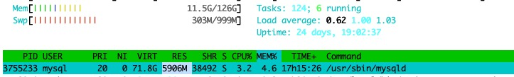
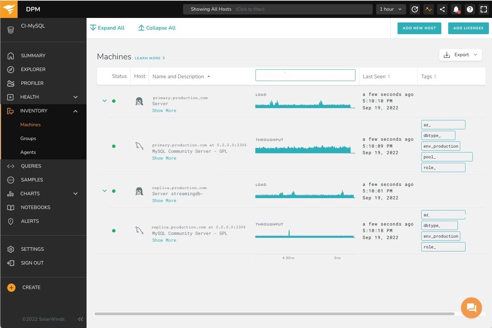
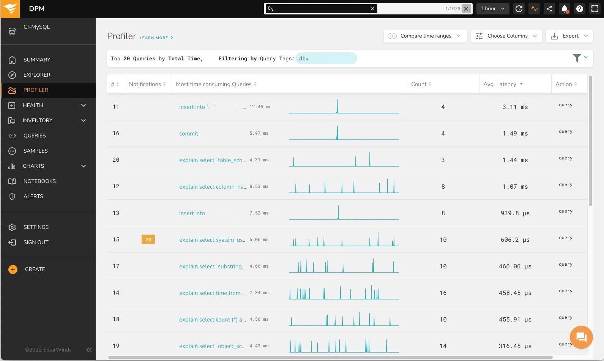

Query latencies in one data center are larger than elsewhere for one replication hierarchy, but only in the high percentiles.
This impacts production and traffic is being failed away from that data center to protect production.

When the P50 and P90 look okay, but the P99 and the P99.9 do not, the database(s) operate normally, and only some queries are running slow.
The initial guess was "for some queries the plan has flipped, but only in that data center."

But first let's have a look at the database size and the schema.

# A tiny database

The schema in question holds metadata for a change data capture process, and that is not a lot.

```console
# du -sh *
0    coredumps
5.6G    data
704M    log
0    tmp
# du -sh data/theschema
93M    data/theschema
```

and in memory:



*The mysqld process has a RES (resident set size) of only 5.9GB, even if the database is allowed to grow to a VIRT (virtual memory size) of 71.8 G.*

This is running on a bare metal blade for the moment, and these do not come smaller than this.
In a virtual machine, it can be as small as a 1/4 blade – but database instances have a fixed overhead and going much smaller hardly makes sense.

In any case, this is running off memory, and would be doing so even if hosted on an iPhone.
There can't be disk scans, even if there were bad queries.
And even with memory scans a thing this tiny won't exhaust CPU or scan for a long time in memory.
Something definitively smells funny around here.

```sql
[information_schema]> select table_name, table_rows from tables where table_schema = 'schemaregistry' order by table_rows desc;
+--------------------+------------+
| TABLE_NAME         | TABLE_ROWS |
+--------------------+------------+
| table_01           |      14376 |
| table_02           |       9510 |
| table_03           |       3079 |
| table_04           |         84 |
| table_05           |          0 |
| db_waypoint        |          0 |
+--------------------+------------+
6 rows in set (0.00 sec)
```

## Scanning for slow queries

We are using `performance_schema` directly to ask for statistics for queries that have been seen that are slow.

```sql
[performance_schema]> select 
     -> user, 
     -> event_name, 
     -> count_star, 
     -> avg_timer_wait/1000000000 as avg_ms 
     -> from events_statements_summary_by_user_by_event_name 
     -> where user = 'production_username'
     -> and event_name like  'statement/sql/%' and count_star > 0;
+----------------------+-----------------------------+------------+--------+
| user                 | event_name                  | count_star | avg_ms |
+----------------------+-----------------------------+------------+--------+
| production_username  | statement/sql/select        |   42121722 | 0.2913 |
| production_username  | statement/sql/set_option    |     270284 | 0.0708 |
| production_username  | statement/sql/show_warnings |      67571 | 0.0498 |
+----------------------+-----------------------------+------------+--------+
3 rows in set (0.01 sec)
```

`P_S` is not intended to be used directly by humans.
The tables are optimized for fast data collection.
Data is not locked during read as to not slow collection, times are reported in PicoSeconds (1/10^12) as to avoid any DIV instructions on write and buffers are size-limited so if some action is spamming `P_S`, data is lost, but the server does not slowed or losing memory.

Consequently we divide by 10^9 to get average statement runtime, and we report any statement statistics since server start (or table truncate) that have been collected for any statement.
It turns out, the production user has been running only select statements, set statements and show warnings commands.

While the averages look good, maxima are not:

```sql
[performance_schema]> select 
     -> event_name, 
     -> count_star, 
     -> avg_timer_wait/1000000000 as avg_ms, 
     -> max_timer_wait/1000000000 as max_ms 
     -> from events_statements_summary_by_user_by_event_name 
     -> where user = 'production_username' 
     -> and event_name like  'statement/sql/%' and count_star > 0;
+-----------------------------+------------+--------+------------+
| event_name                  | count_star | avg_ms | max_ms     |
+-----------------------------+------------+--------+------------+
| statement/sql/select        |   42121722 | 0.2913 | 14934.0024 |
| statement/sql/set_option    |     270284 | 0.0708 |     1.2732 |
| statement/sql/show_warnings |      67571 | 0.0498 |     0.9574 |
+-----------------------------+------------+--------+------------+
3 rows in set (0.00 sec)
```

So there was one select statement that ran a whopping 14s on a database that has no table with more than 15k rows.

# Vividcortex aka SolarWinds DPM

We onboard this hierarchy to Vividcortex, a monitor that collects performance data from databases, and allows to see specific queries that execute slowly. 
It can also help in determining possible improvements.



*Vividcortex inventory for streaming. Normally Vividcortex does not run on all instances, but the primary and one pooled replica. We wanted a specific pooled replica in Frankfurt, though, so something with a 6000 number.*

Our normal Vividcortex onboarding installs probes on the primary and one pooled replica, because it is not necessary to overwhelm the collection interface with all queries from all production machines.
A sample will do fine.

In this case, we want a replica in a specific location, though: only one data center behaves abnormally, so we would want one more machine within that location.
This required some bespoke puppet artistry, but it worked.
But, even then we do not get queries that are particularly interesting:



*We get Query Count, and Average Latency.
But from the counts and the word average we can already see that this is not useful: we would have wanted to see high percentiles.
Also, the queries are all uninteresting.*


Now, we believe most queries are fine, only some instances of queries that are mostly fine are taking unexpectedly long. 
And we want to see those.

We can already see that the default view of VividCortex here is not helpful, and a quick exploration of the user interface quickly reveals that this tool is maybe not optimally useful for our specific hunt.

We go back to `P_S` and handcraft our stuff.

# Plundering P_S

Let's see what is on the menu:

```sql
[performance_schema]> show tables like '%statement%';
+----------------------------------------------------+
| Tables_in_performance_schema (%statement%)         |
+----------------------------------------------------+
| events_statements_current                          |
| events_statements_histogram_by_digest              |
| events_statements_histogram_global                 |
| events_statements_history                          |
| events_statements_history_long                     |
| events_statements_summary_by_account_by_event_name |
| events_statements_summary_by_digest                |
| events_statements_summary_by_host_by_event_name    |
| events_statements_summary_by_program               |
| events_statements_summary_by_thread_by_event_name  |
| events_statements_summary_by_user_by_event_name    |
| events_statements_summary_global_by_event_name     |
| prepared_statements_instances                      |
+----------------------------------------------------+
13 rows in set (0.00 sec)
```

I don't know about you, but `events_statements_summary_by_digest` looks tasty by me.
What is in it?

```sql
[performance_schema]> desc events_statements_summary_by_digest;
+-----------------------------+-----------------+------+-----+---------+-------+
| Field                       | Type            | Null | Key | Default | Extra |
+-----------------------------+-----------------+------+-----+---------+-------+
| SCHEMA_NAME                 | varchar(64)     | YES  | MUL | NULL    |       |
| DIGEST                      | varchar(64)     | YES  |     | NULL    |       |
| DIGEST_TEXT                 | longtext        | YES  |     | NULL    |       |
| COUNT_STAR                  | bigint unsigned | NO   |     | NULL    |       |
| SUM_TIMER_WAIT              | bigint unsigned | NO   |     | NULL    |       |
| MIN_TIMER_WAIT              | bigint unsigned | NO   |     | NULL    |       |
| AVG_TIMER_WAIT              | bigint unsigned | NO   |     | NULL    |       |
| MAX_TIMER_WAIT              | bigint unsigned | NO   |     | NULL    |       |
| SUM_LOCK_TIME               | bigint unsigned | NO   |     | NULL    |       |
| SUM_ERRORS                  | bigint unsigned | NO   |     | NULL    |       |
| SUM_WARNINGS                | bigint unsigned | NO   |     | NULL    |       |
| SUM_ROWS_AFFECTED           | bigint unsigned | NO   |     | NULL    |       |
| SUM_ROWS_SENT               | bigint unsigned | NO   |     | NULL    |       |
| SUM_ROWS_EXAMINED           | bigint unsigned | NO   |     | NULL    |       |
| SUM_CREATED_TMP_DISK_TABLES | bigint unsigned | NO   |     | NULL    |       |
| SUM_CREATED_TMP_TABLES      | bigint unsigned | NO   |     | NULL    |       |
| SUM_SELECT_FULL_JOIN        | bigint unsigned | NO   |     | NULL    |       |
| SUM_SELECT_FULL_RANGE_JOIN  | bigint unsigned | NO   |     | NULL    |       |
| SUM_SELECT_RANGE            | bigint unsigned | NO   |     | NULL    |       |
| SUM_SELECT_RANGE_CHECK      | bigint unsigned | NO   |     | NULL    |       |
| SUM_SELECT_SCAN             | bigint unsigned | NO   |     | NULL    |       |
| SUM_SORT_MERGE_PASSES       | bigint unsigned | NO   |     | NULL    |       |
| SUM_SORT_RANGE              | bigint unsigned | NO   |     | NULL    |       |
| SUM_SORT_ROWS               | bigint unsigned | NO   |     | NULL    |       |
| SUM_SORT_SCAN               | bigint unsigned | NO   |     | NULL    |       |
| SUM_NO_INDEX_USED           | bigint unsigned | NO   |     | NULL    |       |
| SUM_NO_GOOD_INDEX_USED      | bigint unsigned | NO   |     | NULL    |       |
| SUM_CPU_TIME                | bigint unsigned | NO   |     | NULL    |       |
| COUNT_SECONDARY             | bigint unsigned | NO   |     | NULL    |       |
| FIRST_SEEN                  | timestamp(6)    | NO   |     | NULL    |       |
| LAST_SEEN                   | timestamp(6)    | NO   |     | NULL    |       |
| QUANTILE_95                 | bigint unsigned | NO   |     | NULL    |       |
| QUANTILE_99                 | bigint unsigned | NO   |     | NULL    |       |
| QUANTILE_999                | bigint unsigned | NO   |     | NULL    |       |
| QUERY_SAMPLE_TEXT           | longtext        | YES  |     | NULL    |       |
| QUERY_SAMPLE_SEEN           | timestamp(6)    | NO   |     | NULL    |       |
| QUERY_SAMPLE_TIMER_WAIT     | bigint unsigned | NO   |     | NULL    |       |
+-----------------------------+-----------------+------+-----+---------+-------+
37 rows in set (0.00 sec)
```

## Huh? What? The structure of `P_S`

At this point it is maybe a good idea to stop and establish a few facts about `P_S`.
`P_S` collects data about statement execution and server performance. 

```sql
[performance_schema]> show tables like 'setup%';
+---------------------------------------+
| Tables_in_performance_schema (setup%) |
+---------------------------------------+
| setup_actors                          |
| setup_consumers                       |
| setup_instruments                     |
| setup_objects                         |
| setup_threads                         |
+---------------------------------------+
```

The server is instrumented for collection, and the data sources are called instruments. 

We can ask an instrument to collect or not collect data for certain monitoring users, certain actors.
We can also ask the instruments ignore certain tables, schemas or other things, certain objects.
And again, the same, for certain threads.

Collected data is stored in preallocated ring-buffers, or added to certain aggregates.
All these things are consumers.

Configuration happens through the setup tables above, which set up the data flow from instrument through the filtering dimensions to the consumers.

Event data collection happens in event tables, inside a hierarchy, from transactions, to individual statements that make up a transaction, to execution phases of a statement, stages, to waits (mostly for IO or locks).
These things nest, but not necessarily on a 1:1 basis – a statement can contain waits, or other statements, for example.

```sql
root@streamingdb-6001 [performance_schema]> show tables like 'event%current';
+----------------------------------------------+
| Tables_in_performance_schema (event%current) |
+----------------------------------------------+
| events_stages_current                        |
| events_statements_current                    |
| events_transactions_current                  |
| events_waits_current                         |
+----------------------------------------------+
4 rows in set (0.00 sec)
```

For each of these events, we have `_current`, `_history` and `_history_long` tables.
For example `events_statements_current` contains one entry for each active connection, `events_statements_history` the last few statements for each active connection, and `events_statements_history_long` the last few thousand statements across all connections.

There are other collections, about other aspects of the server, and more generalized statement aggregations, the summaries.

## Queries and Query Digests

To be able to aggregate statements, there is the concept of a statements `digest_text`, and ultimately the `digest`, a hash number generated from the digest text.

So statements such as 

```sql
select id from atable where id in ( 1, 2, 3)
SeLeCt id FROM atable where id IN (92929, 29292, 17654, 363562);
```
should be considered equivalent in an aggregate. 
This is done by unparsing the statement from the parse tree, which gets rid of all the spacing and letter case differences in keywords.
During this, all constants and constant lists are replaced by `?` or `'?'` respectively.

The digest text for the above two statements becomes

```sql
select id from atable where id in ( ? )
```

and the digest from that can then be generated by running a hash function over the digest text.

The disadvantage is that a digest cannot be explained with the `EXPLAIN` command, so we need to make sure to also keep a representative explainable version of the query.

# Getting some data

In our case, `events_statements_summary_by_digest` is exactly what we want.
So we truncate the collection, and wait a bit, then ask. 
The results are impossible:

```sql
[performance_schema]> truncate events_statements_summary_by_digest;
...
[performance_schema]> select 
   -> count_star, avg_timer_wait/1000000000 as avg_ms,
   ->  QUANTILE_95/1000000000 as q95_ms, 
   -> first_seen, 
   -> last_seen,
   ->  query_sample_text 
   -> from events_statements_summary_by_digest 
   -> where schema_name = 'schemaregistry' 
   -> and QUANTILE_95/1000000000 > 0.1
   -> order by QUANTILE_95/1000000000 asc \G
*************************** 1. row ***************************
       count_star: 21
           avg_ms: 0.0782
           q95_ms: 0.1202
       first_seen: 2022-09-19 14:35:28.885824
        last_seen: 2022-09-19 14:38:06.110111
query_sample_text: SELECT @@session.autocommit
*************************** 2. row ***************************
       count_star: 21
           avg_ms: 0.0902
           q95_ms: 0.1514
       first_seen: 2022-09-19 14:35:28.886215
        last_seen: 2022-09-19 14:38:06.110382
query_sample_text: SET sql_mode='STRICT_ALL_TABLES,NO_ENGINE_SUBSTITUTION,STRICT_TRANS_TABLES'
```

So we have completely internal configuration commands that sometimes take longer than 0.1ms to execute. 
We have other instances of simple queries that sometimes take 14s to run, 1000x and more than the average.

# And then...

Yeah, and that is as far as I got with my digging, when a colleague chimes in, pointing at  the machine dashboard for the machine I am on.


*A sick network interface is for sure messing with system performance.*

One of the machines in the pooled replicas for this data center location is showing an elevated amount of network retransmits and the box probably needs some love from the data center operations engineers.

We experiment a bit by removing and re-adding the box to the pool, and sure enough: As soon as the system under test is in the pool the latencies are no longer production worthy.


*The image from the title bar: End user experience with and without the broken box in the replica pool. One bad box spoils the experience for all the users.*

So the root cause was not instances of one query executing badly, but all queries executing badly on one box of the pool, in one location.
Average query latencies, and even the P90 look good, but the P99 and the P99.9 go to hell.

The box is removed from the pool and a replacement has been scheduled.
The broken box will get a DCOE ticket.
