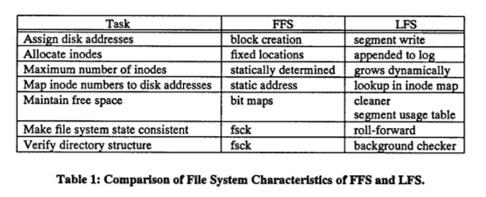

This is part 5 of a series.
1. "[1974]()" on the traditional Unix Filesystem.
2. "[1984]()" on the BSD Fast File System.
3. "[1994]()" on SGI XFS.
4. "[Vnodes]()" on how to have multiple filesystems in Unix. 

Progress is sometimes hard to see, especially when you have been part of it or otherwise lived through it.
Often, it is easier to see by comparing modern educational material and the problems discussed with older material.
Or look for the research papers and sources that fueled the change. So this is what we do.

# Frontiers in the Nineties

SGI's XFS is pretty much the culmination point in filesystem technology for anything that does in-place updates.
Extents, generous usage of B+-trees and lock splitting across allocation groups make it a great filesystem that is fast and scales well.
The introduction of a metadata log allows it to recover quickly.

The Nineties were also busy with operating systems research.
Specifically, cluster operating systems were very much en vogue:
Tanenbaum was in Amsterdam, busy with [Amoeba](https://en.wikipedia.org/wiki/Amoeba_(operating_system)).
Bell Labs was busy with [Plan 9](https://en.wikipedia.org/wiki/Plan_9_from_Bell_Labs).
And at the UCB, Ousterhout was working on [Sprite](https://en.wikipedia.org/wiki/Sprite_(operating_system)).

All were experimenting with cluster-unified filesystems, distributed processing, workload migration, 
and generally trying to build what 20 years later would become the [Warehouse-Scale Computer](https://www.amazon.com/Datacenter-Computer-Introduction-Warehouse-Scale-Architecture/dp/159829556X).

Part of the Sprite development at UCB, specifically, was the Log-Structured File System (LFS), and
Mendel Rosenblum and John K. Ousterhout present it in [this paper](https://www.usenix.org/legacy/publications/library/proceedings/sd93/seltzer.pdf) from 1992.
This is a long paper, 27 pages, but if you read it with hindsight, you can really appreciate how enlightened it was.

# LFS

Filesystems with in-place updates are in part already using logs for faster recovery in 1992.
The paper poses the question "What if we had a filesystem that only had a log, and never did in-place updates?",
calling it a log-structured file system.
It then proceeds to present an implementation and benchmarks for such a thing.

## "Reads are cached, only writes matter"

In working with distributed operating systems, the Sprite team noticed that they have a lot of memory available.
They found with increasing memory sizes, the probability of a file being served by the buffer cache instead of reading it from disk increased by a lot,
and eventually almost all disk reads are being served from memory.

Writes cannot be cached very well, and eventually they need to hit persistent storage, 
but with the reads being cached it would be worthwhile and possible to construct a filesystem optimized for writes.

The team also observes that CPU speeds grow exponentially, following Moore's law.
The same seems to be true for memory sizes, which being on-chip silicon structures also obey this law.
But disks do not work that way.
While their capacity grows, their transfer speed and seek time does not improve much, because mechanical parts do not obey Moore's law.
Disks are a problem: While linear writes perform well, seeks are slow and are not getting faster much.

So they propose never overwriting any data, but always appending changed blocks to the end of a log.

*“Ah you think the log is your ally? You merely adopted the log. I was born with it, designed for it.”*

## Garbage collection

Of course, disks in the Nineties were finite, as they are now. 
So there has to be a *cleaner* process that identifies, frees and compacts space that is no longer needed by any current view of the filesystem.

This is much like the Garbage Collection in Java Virtual Machines, which were invented around the same time.
And much like the GC in JVMs, it would turn out to be the weak spot of the system.

A lot of the paper busies itself with simulating workloads on the filesystem with different cleaner policies,
and the team then lands on a system that very much evolves in the same way Java GC evolved, 
with a multi-tier compaction process that mirrors the "Young", "Old", and "Permanent" generations of Java objects.
This is not entirely surprising from hindsight:
Other, newer systems such as Cassandra, Zookeeper and other storages that use LSM Trees are using a very similar strategy with good success.

Specifically, LFS partitions the storage into contiguous segments, and cleans storage segment by segment:
> We used a simulator to explore different cleaning policies and discovered a simple but effective algorithm based on cost and benefit: 
> it segregates older, slowly changing data from younger rapidly changing data and treats them differently during cleaning.

Other code takes multiple nearly empty segments of the same age and copies them together into a single segment, freeing up the others.

This creates a certain amount of background copy activity from the cleaner process.
It also creates a race between the writers to the system using up free space,
and the cleaner process trying to provide sufficient free space.
If the system writes data heavily and free space goes down, the cleaner may need to be prioritized higher,
consuming more I/O, in order to make sufficient progress in providing clean segments to write to.
This will also slow down the writers.

Benchmarks executed as part of the research show that the system can indeed write to disk at up to 70% of the theoretically available maximum bandwidth.
But this is true only under ideal conditions.
Also, the data is not stored in read-order at all, so read performance is only good if data is actually cached.

Segments are sufficiently large to amortize the cost of seeking to them.
In the Mid-Nineties, that meant a size of around 0.5 to 1 MB.

Cleaning is then a three-step process:
After suitable segments have been identified from metadata, 
the cleaner reads multiple segments into memory, compacts them into a smaller number of segments,
and writes them out to disk in a single large I/O operation.
The old segments can now be marked as clean, and be returned to the free segment pool.

## Using FFS data structures

LFS uses data structures from FFS almost unchanged:
The filesystem has superblocks, inodes, direct and indirect blocks, and uses the same structures for directories, too.
All information changed is buffered and then written out sequentially in a single disk write that appends atomically and asynchronously to the log.

Not overwriting things means duplicating things, so when a file grows by appending a block, the file's inode changes.
This means the block containing the changed inode needs to be written out again, together with block added to the file.
LFS needs to keep track of inodes in an *inode map*, and this now also needs to be updated and written out:
even if it is small enough to be cached in memory, it needs to be persisted.

*LFS does indeed do limited in-place updates: The superblock and checkpoint region are written in fixed locations.*

LFS stops short of also appending new copies of the inode map and ultimately the superblock for each disk write,
and puts these things into fixed locations.
So we do have in-place updates for certain limited metadata structures.
This is unfortunate, as we will see when we are looking at LFS' legacy.

## Soft Updates

In order for LFS to write out changes to data and metadata such as indirect blocks, direct blocks, inodes and directories,
updates had to be written in the proper order, even if the entire write happened in a single big I/O operation.
Writing out data "from the leaves of the filesystem tree to the top" sorts the updates in a way that made recovery easier,
because each data structure that had pointers to dependent blocks would be written out only after these blocks had already been persisted.

It turns out that this logic also has merit for traditional filesystems that do in-place updates.
It allows [file system checking to go on in the background](https://www.usenix.org/legacy/publications/library/proceedings/bsdcon02/mckusick.html) while the filesystem is already being made available,
and it can [eliminate almost all synchronous metadata updates](https://www.usenix.org/legacy/publications/library/proceedings/usenix99/mckusick.html) in the filesystem.

# LFS in BSD

The BSD FFS crew, also at UCB, was very aware of Ousterhout's work, and picks it up the year after he publishes.
They port the filesystem to BSD and [write a 1993 paper about it](https://www.usenix.org/legacy/publications/library/proceedings/sd93/seltzer.pdf)

*Features and subsystems of BSD FFS are matched with the equivalent structures and concepts on the BSD LFS side.*

They note a few shortcomings, and present improvements:
The cleaner was single-threaded. No matter how many LFS filesystems were mounted, there was only a single cleaner process.
Now there is one per mounted filesystem.
They also provide a structural verifier for the filesystem, something similar to a `fsck`, but a thing that can run in the background,
while the filesystem is mounted.

Also, the original LFS code was using more memory than necessary, and BSD LFS was made a lot more memory efficient.

A lot of the paper is then a validation that their implementation is indeed a faithful port, and an improvement over original LFS,
and benchmarking.

The benchmarks confirm improved write performance, but also show weakness concerning read workloads.
This is for two reasons: data is possibly fragmented, 
and the file system buffer cache in their machines is often too small to soak up the disk reads.
And secondly, when the cleaner process is running, it interacts badly with both the disk reads and writes via disk seeks,
and that costs more performance than anticipated.
This is in particular true for a database-like (TPC-B) benchmark load,
which performs badly and requires extensive tuning.

Notably, the paper already hints at several improvements:

- There are two places where in-place updates still happen.
  By removing them, the filesystem would automatically become transactional and gain snapshot functionality.
  In fact, each disk write would eventually create a snapshot, and actually "snapshotting" the filesystem would simply mean
  to prevent the cleaner from collecting certain snapshots.
- Adding checksums to disk blocks already has happened in a few places.
  Turning this into a Merkle tree would be a trivial extension, and make validating the complete integrity not only of the
  structure, but also of the file data a lot easier.
- The paper already notes that ordering writes in the log in a certain way makes background validation easier:
  If blocks being pointed to are written before blocks that point to them, referential integrity of the filesystem is being kept at all times.
  It is just that a transaction may be incomplete, but because it's not referenced anywhere that is not a problem,
  and the disk blocks will be eventually collected and freed by the cleaner.

  Nothing in this idea is actually dependent on the filesystem being LFS.
  In fact, it can and was successfully applied to BSD FFS, too, under the name of 
  [*soft updates*](https://www.usenix.org/legacy/publications/library/proceedings/usenix99/mckusick.html),
  allowing to mount unchecked filesystems and then running a check in the background.

# Performance War

While Seltzer, Bostic, McKusick et al., the original authors of the BSD FFS, were busy porting Sprite LFS to BSD,
and tuning it,
Larry McVoy and S.R. Kleiman pick up the BSD FFS sources at Sun and add support for extents to it.
The resulting patch is tiny, and the work is being documented in 
[Extent-like Performance from a UNIX File System](https://people.freebsd.org/~pfg/docs/fs/ExtentlikePerformanceforUFS.pdf).

To Seltzers chagrin, EFS often and consistently outperforms LFS, requires little to no tuning.
In [File System Logging Versus Clustering: A Performance Comparison](https://www.usenix.org/legacy/publications/library/proceedings/neworl/full_papers/seltzer.pdf)
this is confirmed, even if it takes a long paper with many benchmarks to arrive at this finding.
The problem is mostly with the disk seeks induced from running the cleaner.

If only something could be done about this...

Something could be done, but it would happen at Sun and NetApp, and not in BSD: We're getting ZFS and WAFL.

Also, we're getting things that can seek a lot faster than disks: Flash Storage.
