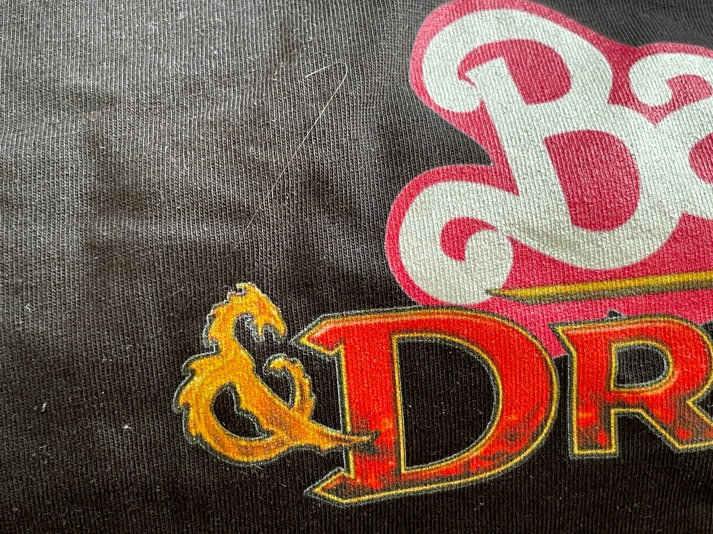

Hier ist ein T-Shirt/Tragetasche Unikat mit einem selbst gemachten Slogan.

*Eine Tasche mit Aufdruck, via [Mastodon](https://xvlt.net/@frainfostudent/110917197522005126).*

Schon vor vielen Jahren, in Kiel und Karlsruhe, habe ich angefangen, meine T-Shirts drucken zu lassen.
Darauf waren selbstgemachte Slogans oder Grafiken, oder welche, die ich hemmungslos geklaut und verfremdet habe.
Auch heute ist das noch so.
Jeder kann das, es ist gar nicht schwer.

Man braucht eine Quelle für T-Shirts in Größen, Qualitäten und Farben, die Euch zusagen.
Dazu einen Textslogan oder eine Grafik-Vorlage.

## PNG

Bei den Grafiken ist ein PNG mit transparentem Hintergrund von 1000+ Pixel entlang der längeren Kante vollauf ausreichend.
Ein SVG ist manchmal möglich, aber nicht notwendig und als direkte Druckvorlage oft nicht hilfreich.
Das ist so, weil das SVG die verwendeten Zeichensätze und Grafiken nicht unbedingt direkt enthält,
und das SVG dann beim Dienstleister anders dargestellt wird als bei Euch.

Auch JPG ist nicht hilfreich, weil es nicht transparent sein kann.
Dann wird beim Druck die Hintergrundfarbe auf den Stoff gedruckt, wenn man das gar nicht möchte,
und man bekommt eine 30 cmx20 cm Plastikplatte auf der Brust statt weicher, atmungsaktiver Baumwolle. 

1000 Pixel bei 72 dpi sind 30+ cm, vollauf formatfüllend auch bei breiter Brust oder großen Brüsten.

## Dienstleister

Ihr braucht außerdem einen "Copyshop" auf dem Pro-Level, also einen Grafikdienstleister, der so was kann.
In Kiel habe ich im Knooper Weg gegenüber der Humboldt-Schule gewohnt 
und ein wenig nach Norden rauf zur damaligen Fachhochschule war an der Ecke ein Druckladen, 
der so etwas konnte und auch 3XL Shirts in Qualitäten hatte, die angenehm waren.
(EDIT: Jetzt [am Exer](https://maps.app.goo.gl/dN3UZzpiobBmi7x66))

Hier in Haarlem habe ich ebenfalls mehrere solche Shops ([Tinto](https://tinto.nl/textiel-bedrukken/) et al),
und es gibt natürlich immer spreadshirt.nl und spreadshirt.de, wenn man nicht nach draußen gehen mag.

## Druck

Der Druck kann auf die vordere oder hintere T-Shirt-Seite oder auf die Ärmel.
Jede Stelle, die bedruckt wird, kostet extra – ein doppelseitiges Shirt also deutlich mehr als ein einseitiges.

Druck von Bildmotiven und mit Farben ist weniger Haltbar, als Schrift mit dem Einbaufont des Dienstleisters
(also Text mit einem Font von der Maschine, statt Text als Grafik von Euch als PNG), 
und binnen 2-3 Jahren regelmäßigen Tragens wird sich die Grafik ablösen.

Strichdicke spielt eine Rolle. 
Ein T-Shirt ist kein Skizzenblock

*Ein mehrere Jahre altes Elite Retro-T-Shirt. Die Schrift hat sich gut gehalten, die feine Grafik vom Raumschiff nicht.*

## Nerdläden in den USA

Wie dem auch sei: 
Es ist viel einfacher, schneller und ökonomisch und ökologisch vorteilhaft,
solche T-Shirts lokal fertigen zu lassen, als sie von irgendeinem US-Dienstleister per Luftfracht zu Euch schicken zu lassen.
Man braucht das PNG und einen lokalen Laden und kein Shirt.
Manche Dienstleister nehmen auch AI oder PSD, weniger SVG oder PDF.

Es ist wirklich am einfachsten mit einem moderat aufgelöstem PNG.
PSD, AI, SVG und PDF müssen gerendert werden, und dann fehlen Fonts oder so was.
PNG sieht genau so aus wie man das will.

## Qualitäten

Und schließlich:

- [Stoffe](https://www.trigema.de/magazin/grundmaterialien-der-stoffherstellung)
- [Qualitäten](https://www.trigema.de/magazin/grundbegriffe-der-stoffe/)
- [Andere Quelle](https://www.kalani-home.com/de/stoffen/)

## Auflösungen

Hier ein Motiv 835 px hoch, und sein Druck, ca. 11 cm hoch.

Man kann sehen, daß man sich mit der Auflösung ziemlich entspannen kann. 

Hier ein anderes Motiv (1629px breit) und sein Druck:

Die Druckvorlage ist eine Reproduktion: Ich habe vor einigen Jahren ein Barbie & Dragons T-Shirt geschenkt bekommen, aber hatte keine Vorlage.
Im Jahr von Barbie-Film und Baldur's Gate 3 mußte ich das in frisch haben, also hab ich mir das selbst neu gemacht.

