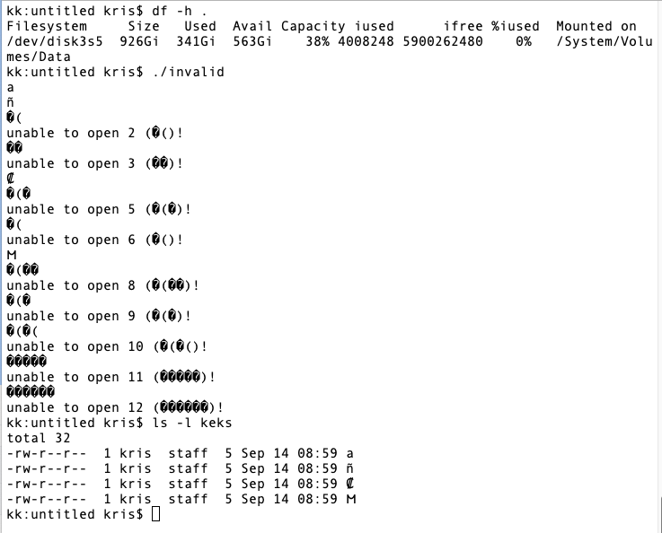

A UNIX filename can contain arbitrary bytes in an arbitrary sequence, with two exceptions:

- It cannot contain NUL (`\0`).
- It cannot contain slash (`/`), because that is the directory separator.

But will all filesystems accept such filenames?
And how will this work with languages such as Python, which require all strings to be valid `utf-8` and
which declare the filesystem interface to accept and return strings?

# A test program

Let's check.
Here is a small C program, based on [this stackoverflow article](https://stackoverflow.com/questions/1301402/example-invalid-utf8-string).

```C
#include <stdio.h>
#include <sys/stat.h>
#include <unistd.h>

char* examples[] = {
        "a",
        "\xc3\xb1",
        "\xc3\x28",
        "\xa0\xa1",
        "\xe2\x82\xa1",
        "\xe2\x28\xa1",
        "\xe2\x82\x28",
        "\xf0\x90\x8c\xbc",
        "\xf0\x28\x8c\xbc",
        "\xf0\x90\x28\xbc",
        "\xf0\x28\x8c\x28",
        "\xf8\xa1\xa1\xa1\xa1",
        "\xfc\xa1\xa1\xa1\xa1\xa1",
};


int main(void) {
    int result;
    FILE *fp;

    result = mkdir("keks", 0755); // don't care if exists
    result = chdir("keks");       // don't care if succeed.

    for (int i = 0; examples[i]; i++) {
        printf("%s\n", examples[i]);
        fp = fopen(examples[i], "w");
        if (!fp) {
            printf("unable to open %d (%s)!\n", i, examples[i]);
            continue;
        } else {
            fprintf(fp, "keks\n");
            fclose(fp);
        }
    }

    return 0;
}
```

## XFS

When running this on a Linux system with XFS, this works:


*The program runs and generates all files. Even those with byte sequences that are not valid utf-8.*

This works the same with ext4 on Linux.

## ZFS

When running this on a Linux system with ZFS, filenames containing invalid utf-8 sequences are rejected.


*The program runs and generates files with valid utf-8 names. The `open(2)` syscall fails for names with invalid utf-8 filenames.*


## APFS

When running this on a MacOS Ventura system with APFS, filenames containing invalid utf-8 sequences are rejected.



*The program runs and generates files with valid utf-8 names. The `open(2)` syscall fails for names with invalid utf-8 filenames.*

# Unpacking invalid utf-8 filenames with Python

I went and creates a `tar` archive of the files generated on XFS and copied it over to my Mac.

The following test program was used to unpack the `tar`:
```python
#! /usr/bin/env python

from tarfile import TarFile
import chardet
import os

with TarFile.open('test.tar', 'r') as t:
    names = t.getnames()

for name in names:
    bname = bytearray(name, 'raw')
    print(chardet.detect(name))
```

The test run fails:

```console
(venv) $ python tarnames.py
Traceback (most recent call last):
  File ".../tarnames.py", line 15, in <module>
    bname = bytearray(name, 'raw')
            ^^^^^^^^^^^^^^^^^^^^^^
LookupError: unknown encoding: raw
```

# Intermediate result

It probably is useful to restrict POSIX further and demand that filenames are always valid utf-8.
But that is not what the standard currently says, and also not what all filesystems guarantee.
And it can lead to unexpected behavior.

Also, some programming languages such as Python demand of strings that they have valid utf-8 encoding,
but use filenames and strings equivalently.

That can lead to weird behavior.

# Further research

Apparently there is a function
[`sys.getfilesystemencoding()`](https://docs.python.org/3/library/sys.html#sys.getfilesystemencoding)
without parameters.
Python seems to assume that all filesystems have the same encoding and that it is not path dependent.

Apparently there are `os.fsencode()` and 
[`os.fsdecode()`](https://docs.python.org/3/library/os.html#os.fsencode).

## Modified Python code

We are using `os.fsencode()` to get `bytes` from the filesystem interface.
We are then using `chardet.detect()` on this byte-string and check the guesses.

```python
#! /usr/bin/env python

from tarfile import TarFile
import chardet
import os

with TarFile.open('test.tar', 'r') as t:
    names = t.getnames()

for name in names:
    bname = os.fsencode(name)
    print(f"{bname=}")
    print(chardet.detect(bname))
```

The result:

```console
bname=b'keks'
{'encoding': 'ascii', 'confidence': 1.0, 'language': ''}
bname=b'keks/a'
{'encoding': 'ascii', 'confidence': 1.0, 'language': ''}
bname=b'keks/\xc3\xb1'
{'encoding': 'ISO-8859-1', 'confidence': 0.73, 'language': ''}
bname=b'keks/\xc3('
{'encoding': 'ISO-8859-1', 'confidence': 0.73, 'language': ''}
bname=b'keks/\xa0\xa1'
{'encoding': 'IBM866', 'confidence': 0.99, 'language': 'Russian'}
bname=b'keks/\xe2\x82\xa1'
{'encoding': 'Windows-1252', 'confidence': 0.73, 'language': ''}
bname=b'keks/\xe2(\xa1'
{'encoding': 'ISO-8859-1', 'confidence': 0.73, 'language': ''}
bname=b'keks/\xe2\x82('
{'encoding': 'Windows-1252', 'confidence': 0.73, 'language': ''}
bname=b'keks/\xf0\x90\x8c\xbc'
{'encoding': 'Windows-1254', 'confidence': 0.48310298982778344, 'language': 'Turkish'}
bname=b'keks/\xf0(\x8c\xbc'
{'encoding': 'Windows-1252', 'confidence': 0.73, 'language': ''}
bname=b'keks/\xf0\x90(\xbc'
{'encoding': 'Windows-1254', 'confidence': 0.5521177026603239, 'language': 'Turkish'}
bname=b'keks/\xf0(\x8c('
{'encoding': 'Windows-1252', 'confidence': 0.73, 'language': ''}
bname=b'keks/\xf8\xa1\xa1\xa1\xa1'
{'encoding': 'ISO-8859-1', 'confidence': 0.73, 'language': ''}
bname=b'keks/\xfc\xa1\xa1\xa1\xa1\xa1'
{'encoding': 'ISO-8859-1', 'confidence': 0.73, 'language': ''}
```

The guesses are trying to find a valid charset for the bytestring, and they find the lowest (least large) charset that matches.
