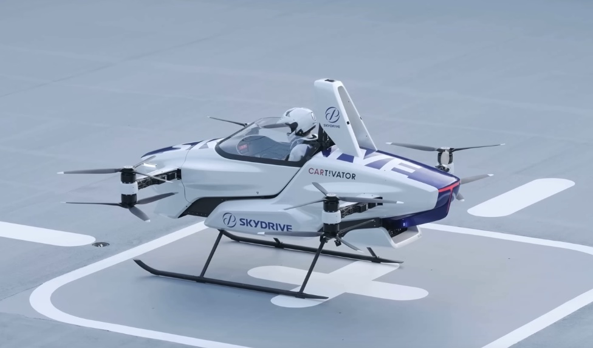

Golem schreibt: [Über 2000 Skydrive-Lufttaxis vorbestellt](https://www.golem.de/news/urban-air-mobility-ueber-200-skydrive-lufttaxis-vorbestellt-2309-177728.html).
> Das eVTOL Skydrive ist 13 x 13 Meter groß und 3 Meter hoch.
> Angetrieben wird es von zwölf Elektropropellern, die auf einem Gestell angebracht sind, ähnlich wie bei den Volocoptern.
> In dem eVTOL ist Platz für drei Personen: zwei Passagiere und eine, die es fliegt.
> Die Fluggeräte, die später ohne Pilot fliegen sollen, können auf einer relativ kleinen Fläche senkrecht starten und landen.

und

> Urban Air Mobility (UAM) ist eine neue Form der Luftfahrt: 
> Passagiere sollen mit Lufttaxis oder Taxidrohnen kürzere oder mittlere Strecken in der Stadt zurücklegen.
> Dadurch, dass ein Teil des Verkehrs in die Luft verlagert wird, sollen die Straßen weniger belastet werden. 

## Lärm

Hier ist ein Video von einem Vorläufer dieses Modells, von 2020.
Der Soundtrack ist wichtig:

*Skydrive Piloted Flight Demo.
SkyDrive performed the first public flight demonstration of its SD-03 eVTOL on Aug. 25, 2020
([Video](https://www.youtube.com/watch?v=4Yc2L5koWZY))*

Beim Deutschlandfunk Nova heißt es zum selben Problemkomplex:
[Drohnen: Wenn die Kettensäge kommt](https://www.deutschlandfunknova.de/nachrichten/drohnen-wenn-die-kettensaege-kommt)
> Die Drohnen werden aber nicht nur Päckchen bringen, sondern vor allem Lärm.
> Kommerzielle Drohnen, die Lasten transportieren, sind deutlich lauter als kleine Kameradrohnen.
> Je schwerer das Päckchen, desto lauter.
> Der Lärmpegel ist vergleichbar mit Laubsaugern, Rasenmähern und Kettensägen.

und

> Videos, die die Lieferdrohnen bewerben, sind gerne mit Musik unterlegt, das Drohnengeräusch ist nicht zu hören.

## Downwash

Ein anderer Effekt von Rotorflüglern jeder Art ist Newtons Gesetz:
Jede Kraft erzeugt eine gleiche, entgegengesetzte Gegenkraft. 
Wenn ein Flugtaxi also bei Erdanziehung 1250 kg Schub aufwärts erzeugt, dann muß es auch einen 1250 kg Downwash geben.

*Luftströme am Rotorflügler, in der Luft ("out of ground effect") und in Bodennähe ("in ground effect").
([ausführliche Erläuterungen](https://wiki.ivao.aero/en/home/training/documentation/Ground_effect))*

In der Luft befindet sich unter einem Rotorflügler ein Abwindkorridor, dem andere Flieger fern bleiben müssen.
Nahe dem Grund können Sand, Schnee oder Steine aufgewirbelt werden (Brownout, Whiteout).

In
[Helicopter Rotor Downwash – Excessive wind, FOD and brownouts, what are the risks?](https://jjryan.com.au/index.php/helicopter-rotor-downwash-excessive-wind-fod-and-brownouts-what-are-the-risks/) 
haben wir eine bildliche Darstellung von Downwash und auch eine Tabelle von Mindestabständen.

*Beispiele für Helicopter Rotor Downwash.*

Generell werden 3-5 Rotordurchmesser als sicherer Abstand zu einem landenden oder startenden Helikopter genannt.
Dies gilt für Personen, aber auch andere am Grund parkende Fluggeräte 
oder andere Gegenstände mit einer großen Angriffsfläche für Wind wie etwa belaubte Bäume. 

Bei einem Volocopter mit einer Größe von 13x13 Metern also circa 50 x 50 Meter.
Zum Vergleich: Ein frei stehendes Einzelhaus hat eine Grundfläche von 8x8 Metern, und steht auf einem Grundstück von 12x20 Metern.

Hier zwei Starts:
der Hubschrauber kann relativ schnell an Höhe gewinnen, weil er nicht in seinen eigenen Downwash fliegt.
Landungen sind wesentlich gemächlicher.

*Start von D-HBLN vom Metzplatz, Berlin vor dem Wenckebach-Krankenhaus. Die Bäume sind unbelaubt.
([Video](https://www.youtube.com/watch?v=ZJD1xvVC4cA))* 

*Start eines Rettungshubschraubers von einem Spielplatz in Vijfhuizen, NL.
Die Polizei hat das Gelände abgesperrt, etwa 50-70m Sicherheitsabstand. 
Der Downwash schüttelt die belaubten Bäume.
([Video](https://www.youtube.com/watch?v=Ur4z1woV0ak))*

## Energieverbrauch

Schließlich ist noch der Energieverbrauch zu berücksichtigen,
denn anders als Starrflügler können Rotorflügler und Drohnen nicht gleiten.
Sie müssen also jederzeit in der Luft die volle Energie aufwenden, um ihr Gewicht gegen die Gravitation zu halten.

Dies setzt auch der Reichweite und Flugzeit enge und absolute Grenzen als Funktion der Energiedichte des Treibstoffs.

**Flugtaxis sind für Verkehrsprobleme was Kernfusion für Energieprobleme ist.**

## Bonuscontent: Downwash

*[Vuichard Recovery Technique - How to escape a Vortex Ring State](https://www.youtube.com/watch?v=HjeRSDsy-nE#t=2m14s)*

*[Planes clouds and vortices](https://youtu.be/dfY5ZQDzC5s?t=336)*
