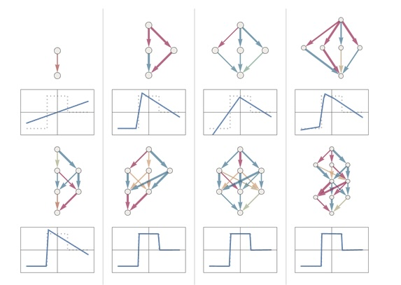
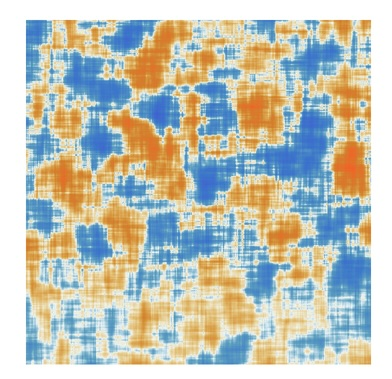

Es gibt einen wunderbaren Artikel von Stephen Wolfram,
[What Is ChatGPT Doing … and Why Does It Work?](https://writings.stephenwolfram.com/2023/02/what-is-chatgpt-doing-and-why-does-it-work/)

Dies ist ein etwa ein Jahr alter und langer Text, und man muss dran bleiben, wenn man ihn verstehen möchte.
Er erklärt wie ChatGPT intern funktioniert, warum das so viel Ressourcen kostet,
und er erklärt auch, daß wir keine Ahnung haben, wieso das "funktioniert".
Er zeigt aber auch, was ChatGPT alles prinzipbedingt niemals erreichen kann, und auch nicht lernen wird.

*[What is ChatGPT doing…](https://writings.stephenwolfram.com/2023/02/what-is-chatgpt-doing-and-why-does-it-work/) 
von Stephen Wolfram vom 14. Februar 2023.*

Stephen Wolfram ist ein Informatiker und Physiker, 
der einen recht guten Prolog-Interpreter mit Regeln zur Termumformung und Fakten gefüttert hat,
und dies unter dem Namen Mathematica vertreibt.

Prolog ist eine deklarative Sprache, die vor 30 Jahren die Grundlage regelbasierter künstlicher Intelligenz-Forschung war.
Deklarative Sprachen wie SQL oder Prolog schreiben keine Programme, die dem Computer sagen, was zu tun ist,
sondern sie beschreiben das gewünschte Ergebnis.
Ein Programmgenerator, der Planer, versucht dann einen Ausführungspfad zu finden,
der das beschriebene Ergebnis auf eine effiziente Weise findet.

Die Idee hinter diesem Ansatz in der KI-Forschung war, daß man die Welt regelbasiert beschreiben könnte,
ein Welt-Wissensmodell bauen und daß so "Intelligenz" entsteht.
Das war ein Fehlschlag, aber Mathematica ist eines der beeindruckendsten Arbeitssysteme für Mathematik,
Physik-Visualisierung und Modellierung und alle verwandten Arbeiten.
Eine private Lizenz ist teuer, aber ich gönne mir die, 
weil es so einen Heidenspaß macht mit dem Ding zu arbeiten und Sachen auszuprobieren.
Rein optisch und von der Arbeitsweise ist Jupyter ein gnadenloser Mathematica-Clone,
aber in Mathematica steckt eine komplett andere Sprache (etwas, das mal ein Prolog war) und eine viel, viel größere Bibliothek.

*Ein Mathematica Arbeitsblatt, das die Approximation von Rechteckwellen durch Fouriersynthese zeigt, 
indem es eine Formelschar generiert und plotted.*

*Wir generieren daraus Audio, stellen das Audio dar, und spielen es ab.*

Wolfram geht in seinem Text auf einen der simpelsten Textgeneratoren ein (und zeigt, wie man ihn in Mathematica realisiert) –
ein Zeichenfrequenz-Zähler, der Wikipedia-Seiten konsumiert und zeigt, 
wie oft (normiert, also in %) jeder Buchstabe in der Seite auftaucht.

Er vergleicht die Seiten von "Cat" und "Dog" und zeigt, daß in der "Dog"-Seite natürlich die o-Wahrscheinlichkeit höher ist,
aber daß beide für Englisch charakteristische Buchstabenhäufigkeiten haben.
Er greift sich dann die Häufigkeiten von Buchstabenpaaren (Bi-Grammen) und zeigt an der Spalte für den Buchstaben "q",
daß "q" quasi immer von "u" gefolgt wird, und man kann das sehen.

*Entlang der X-Achse die ersten Buchstaben von Paaren, 
entlang der Y-Achse die zweiten Buchstaben.
Je roter und dunkler das Feld, umso häufiger die Kombination.
Die Spalte "q" ist ganz weiß, mit Ausnahme der "qu"-Kombination.*

Nimmt man mehr Kontext, also statt Paaren Dreiergruppen (Tri-Gramme) oder noch längere Gruppen,
dann bekommt man irgendwann fast aussprechbare oder reale englische Worte.
Schon 4-Gramme produzieren gute Worte. 
Englisch hat also einen Buchstabenkontext von circa 4-5.

*Eine Reihe von Worten, die aus Nachfolgewahrscheinlichkeiten von Bi-, Tri- und n-Grammen erzeugt worden ist.
Ab einer Länge von etwa 4 entstehen oft gültige Worte der englischen Sprache.*

Würde man das mit chinesischen Schriftzeichen machen, 
bekäme man aus einem Grundwortschatz von einigen tausend Worten auf diese Weise Sätze.
Viele chinesische Begriffe haben ein Schriftzeichen, manche zur Klärung der Bedeutung zwei.
ChatGPT macht das genau so. 

Dort sind es keine Schriftzeichen, sondern Token.
Aber ein Token entspricht ziemlich genau der Funktion, die ein Schriftzeichen in Chinesisch hat.
Und es sind fast genau so viele – in der Größenordnung von Zehntausenden.
Davon sind viele Begriffe Ein-Token und einige Mehr-Token.

Bigramme auf Token produzieren Dinge wie dies hier: Wortsalat.

*Eine Reihe von Wortfolgen, die alle zufällig generiert wurden, auf der Basis von Wortfolgewahrscheinlichkeiten,
die über Bi-Grammen, also Wortpaaren, errechnet worden sind.
Alle Beispiel starten mit dem Wort "cat".*

Stellt man mehr Kontext, arbeitet man also mit n-Grammen für n=3, 4, …, 
dann bekommt man eher Dinge, die wie korrekte Sätze aussehen.

Man bekommt auch eine kombinatorische Explosion: 
Statt 26, 26\*26, 26\*26\*26, ... Wahrscheinlichkeiten zum Abspeichern hat man jetzt zum Beispiel 40.000 als Basis.
Und bei einem großen Kontext – statt 4 oder 5 eher was bei 100 – hat man dann mit 40.000 hoch 100 zu tun.

Also, nicht – weil man das so nicht verarbeiten kann,
und ein wenig Arbeit in die Speicherung von dünn besetzten Matrizen und große Datenmengen stecken muss.
Aber das ist ein lösbares Problem, auch wenn es Aufwand erfordert, der auf der Mathematik nicht sichtbar ist.

Wolfram erklärt dann "Modellierung durch Interpolation".
Er hat Messwerte, die den Weg eines geworfenen Balls durch den Raum beschreiben,
und will dann nacheinander eine Gerade, eine Parabel oder "was Kompliziertes" da hindurchlegen.

Er nutzt dieses Beispiel, um viele Dinge um den Modellbegriff zu erklären:
Einmal gibt es verschiedene Wege, um den Fehler zu messen, 
also die Abweichung der interpolierten Linie von den Messwerten zu beschreiben.

*Die Messwerte eines Ballwurfes, und die verschiedenen hindurch interpolierten Kurven.
Eine Gerade, eine Parabel und "was Kompliziertes".*

Dann setzt die "Beweglichkeit" der Funktion, die zur Interpolation genutzt wird, dem Modell Grenzen.
Egal, welche Koeffizienten man findet – die "komplizierte" Funktion aus dem letzten Beispiel hat immer große Fehler.
Sie kann keinen Fit ergeben.

Die zweite Funktion, die Parabel, ist immer ein guter Fit.
Das ist so, weil das real-weltliche Phänomen sich aus Gründen tatsächlich parabolisch verhält, 
bis es durch Luftwiderstand gestört wird.
In jedem Modell stecken Annahmen – und die können, wenn sie falsch sind, – das Modell unmöglich machen.

Er geht dann zu neuronalen Netzen über und diskutiert, wie diese aufgebaut sind,
und welche Mathematik da drin steckt und wofür man sie einsetzen kann.
Es sind Geradengleichungen, mx+b, und Summen, aber sehr, sehr viele.
Sein Beispiel ist die Schrifterkennung.

*Ein Datentyp in Mathematica sind zweidimensionale Bitmaps – Bilder.
Hier sind es handgeschriebene Ziffern.
Man kann diese in eine Menge (einen weiteren Datentyp) tun, und dann einem NetModel (dem Datentyp für ein Neurales Netz) vorwerfen.
Dieses spezielle NetModel gibt dann als Ausgabe die erkannten Ziffern.
Dies ist eine Anwendung eines NN als Classifier, also als ein Ding, das erkennen und gruppieren kann.*

*Auf ein Bitmuster einer gut lesbaren 2 wird sukzessive ein immer stärkerer Gaussian Blur angewendet.
Die resultierende Eingabemenge wird in das NetModel-Objekt verfüttert und man bekommt "2, 2, 2, 1, 1, 1, 1, 1, 1" als Ausgabe.
Das Modell bricht bei schlechten Daten irgendwann zusammen.
Als Mensch erkennt man mehr Ziffern korrekt als 2, aber am Ende wird es wirklich sehr unlesbar.*

Wolfram macht dann weiter und diskutiert das Konzept der Nähe oder Ähnlichkeit, indem er mit Voronoi-Maps herumexperimentiert.
Er stellt sich jetzt die Aufgabe, eine bestimmte Funktion mit zwei Parametern x und y, die die Werte -1, 0 und +1 liefert, 
zu "lernen" und durch ein neuronales Netz zu produzieren.
Er benutzt das, um zu zeigen, wie man Koeffizienten einer Näherungsfunktion findet,
indem man simple Geradengleichungsrechner (Neuronen) verknüpft.

*Von einem NN erkannte handgeschriebene Ziffern nach Ähnlichkeit sortiert und angeordnet.*

*Eine Reihe von zufällig auf einer Ebene verteilte Punkte und die von ihnen "beherrschten" Gebiete:
Jeder Punkt der Ebene wird dem orangen Punkt zugeordnet, der ihm nach irgendeiner Distanzmetrik am nächsten ist.
Es entsteht eine Partition, eine Aufteilung, der Karte in Zonen um die Punkte.
Es sieht aus wie Seifenblasen, die aneinander kleben und gerade Schnittflächen bilden.*

*Die Aufgabe: Ein simples Voronoi, das drei Punkte mit den Werten +1, 0 und -1 auf einer Ebene verteilt.*

*Die 3D-Darstellung desselben Diagramms.*

Er nimmt dann die vorherigen Gedanken zur Interpolation wieder auf.
Dazu erfindet er ohne weitere Erläuterung eine Aneinanderreihung von "Neuronen", schreibt Koeffizienten dran,
und diskutiert verschiedene mögliche Abstandsberechnungsfunktionen (Fehler-Meßfunktionen).
Wenn man die Mathematik und den Prozess der Suche nach den passenden Koeffizienten mal wegläßt,
kommt man am Ende bei einer Näherung des Wunsch-Graphen an, die so aussieht.

*Das von Wolfram gewählte neuronale Netz.*

*Das Resultat weicht vom Wunschergebnis ab, ist aber eine gute Näherung.*

Er diskutiert und demonstriert dann durch Simulation, daß man bestimmte Dinge nicht darstellen kann, 
wenn man nicht genügend Neuronen hat.
Das zu modellierende Subjekt ist zu kompliziert, sodaß der mögliche Parameterraum nicht groß genug ist:
Eine Gerade kann keine Parabel annähern.

*Verschiedene NN und die resultierenden Näherungen.*

Es geht dann in einen längeren Exkurs, in dem er die Anatomie der Netze zu erklären, die da verwendet werden.
Man erkennt, daß die Modelle Schichten haben und daß sie keine Rückflüsse haben:
Daten fließen immer von der oberen Schicht in die unmittelbar darunter liegende – es gibt keine Rückflüsse und auch kein Überspringen.

Man erkennt auch, daß generell größere Modelle bessere Ergebnisse liefern.
Wolfram gibt zu, daß wir nicht wissen, wie groß ein NN für ein bestimmtes Problem sein muss.
Wir wissen auch nicht, wie die konkrete Verschaltung der Schichten aussehen sollte,
oder muss, um gute Ergebnisse zu liefern.

Er versucht immerhin, die Inhalte der Schichten zu verstehen und ihnen Bedeutung zuzuweisen, 
aber auch das ist nicht wirklich Wissenschaft und teilweise Kaffeesatzlesen.
Fast alles am Bau von NN ist "Erfahrung" und "Empirik" ohne viel Theorie dahinter.

Wir können Daten aus Schichten von NN herausziehen und sie nach einer Abstandsfunktion sortieren lassen,
und die Anordnung ergibt für unsere menschlichen Hirne irgendwie Sinn.

*Hunde und Katzenbilder nach einer Abstandsfunktion eines NN sortiert.*

Wir können auch die Neuronen einiger Schichten nehmen, die Koeffizienten in einer Bildmatrix anordnen,
und bekommen vereinfachte Bilder von den Dingen, die da gespeichert oder erkannt werden sollen.

Aber wir haben keine Funktionstheorie oder Mathematik von NN und Kognition.

*Aus einer Schicht aus dem NN eines Katzen-Hunde-Sortierers herausgezogene Daten ergeben Katzenbilder.*

Wolfram beschäftigt sich weiter mit dem Training von NN, der Datenbeschaffung und der Auszeichnung von Daten.
Das Korpus von Trainingsdaten muss groß und zuverlässig ausgezeichnet sein. 
Wir brauchen also viele Katzenbilder (Dafür gibt es das Internet!) und Hundebilder, 
und diese müssen von Menschen korrekt mit Tags versehen worden sein, damit ein NN das lernen kann.

Er zeigt dann Verbesserungen der Koeffizienten und der Resultate über Iterationen des Lernprozesses.
"Lernen" bedeutet für ein NN, die Koeffizienten der verschiedenen Neuronen zu verändern.
Dazu nimmt man die Eingabe-Koeffizienten als "Ebene" und den Fehler als "Höhe" 
und wandert dann in der so entstehenden Fehlerlandschaft auf einem zufälligen Pfad in die Täler.

Das findet lokale Minima und man hofft, aus "lokalen Löchern" zu entkommen, indem man zufällige Schritte zufälliger Größen macht.

*Die Berg- und Tallandschaft des Fehlergraphen und der Weg des Modells zum lokalen Minimum.*

Wieder diskutiert Wolfram mögliche Layouts von NN –
nicht immer kann man jedes Neuron mit allen Neuronen der nächsten Lage verschalten und in der Tat ist das bei großen NN nie machbar.
Bestimmte Formen haben sich als besser lernfähig erwiesen:
Ein schmaler Layer der zwischen zwei breite Layers eingefügt wird scheint Ergebnisse stark zu verbessern.
Niemand weiß, warum das so ist oder hat ein Modell, das dies erklärt.

*Verschiedene Formen von NN und die Ergebnisse, die sie produzieren.*

Etwa in der Mitte des Textes wendet sich Wolfram generativen Modellen und LLMs zu.
Training von LLMs ist sehr, sehr einfach, weil sie einfach Text essen:
Man nimmt beliebigen Text, lässt das Modell das folgende Wort generieren und vergleicht es mit dem Wort, das hätte kommen müssen.
Daraus kann man Trainingsfeedback erzeugen.

*Eine Karte, auf der englische Worte nach Ähnlichkeit angeordnet sind.
Säugetiere sind links oben, links unten sind "alligator" und "crocodile" dicht beieinander, "ant" und "bee" sind es auch.
Rechts unten Früchte.
Tiere und Früchte sind klar durch einen Graben getrennt.*

Es entsteht dadurch sogar so etwas wie eine Wissens-Karte nach Ähnlichkeits-Metriken.
Das ist nicht so, weil das LLM ein Weltmodell hat.
Sondern es ist so, weil Menschen ein Weltmodell haben und wenn sie Worte gebrauchen, 
bestimmte Worte "nach beieinander" in Sätzen angeordnet sind.
Ein Weltverständnis entsteht so nicht, ein gewisses Sprachverständnis wohl schon.

Wieder und wieder und wieder versucht Wolfram zu einem Verständnis der Koeffizienten von LLMs oder NNs zu kommen,
oder zu irgendeiner Theorie, die die Funktionsweise von LLMs und NNs planbar und vorhersagbar macht und sich über pure Empirik erhebt.
Er macht dies mit verschiedenen Visualisierungen von Koeffizienten auf die unterschiedlichsten Weisen,
aber er findet nur quälende Muster, die wie Inhalt wirken und nichts enthüllen.

*Eine Vergröberung einer ChatGPT Koeffizientenmatrix und Einfärbung nach bestimmten Werten erzeugt eine interessante Teal-and-Orange Batik,
die nichts bedeutet.*

Am Ende geht es dann darum, 
wie man mit solchen riesigen Koeffizienten-Matrizen und einem austrainierten Modell generativ arbeitet und "interessante" Texte erzeugt.
Dabei geht es auch um den Parameter der "Temperatur" und den "Seed":

Würde man ein generatives LLM mit einer Null-Temperatur laufen lassen, 
würde es immer dasselbe, wahrscheinlichste Folgetoken wählen, um einen Satz zu komplettieren.
Indem man die Wahrscheinlichkeiten der Folgetoken sortiert,
und dann zufällig ein anderes wahrscheinliches Token wählt, bekommt man immer noch "gültige" Fortsetzungen, die aber variabel sind.

Das Seed ist dabei der Startwert des Pseudo-Zufallszahlen-Generators, 
die Temperatur die "Sprungweite" vom wahrscheinlichsten Wert weg.
Auch hierzu gibt es keine Theorie, wir wissen nur, daß "0.8 ein guter Wert ist".

Wolfram schließt:

> So … What Is ChatGPT Doing, and Why Does It Work?
> 
> The basic concept of ChatGPT is at some level rather simple.
> Start from a huge sample of human-created text from the web, books, etc.
> Then train a neural net to generate text that’s “like this.” 
> And in particular, make it able to start from a “prompt” and then continue with text that’s “like what it’s been trained with”.
> 
> As we’ve seen, the actual neural net in ChatGPT is made up of very simple elements — though billions of them.
> And the basic operation of the neural net is also very simple, consisting essentially 
> of passing input derived from the text it’s generated so far “once through its elements” (without any loops, etc.)
> for every new word (or part of a word) that it generates.
> 
> But the remarkable—and unexpected—thing is that this process can produce text that’s successfully “like” what’s out there on the web,
> in books, etc. 
> And not only is it coherent human language, it also “says things” that “follow its prompt” making use of content it’s “read”.
> It doesn't always say things that “globally make sense” 
> (or correspond to correct computations because it’s just saying things that “sound right” based on what things “sounded like” in its training material).

Das ist der Stochastische Papagei, von dem bei LLMs gerne mal die Rede ist.
Er ist wortwörtlich gemeint.

Ein LLM reproduziert Versatzstücke aus Texten, die es verarbeitet hat,
auf der Basis von Auftretenswahrscheinlichkeiten von "großes n"-Grammen von chinesischen Schriftzeichen ("Token").
n ist dabei gerne groß zweistellig.

Ein Konzept von Korrektheit gibt es nicht.
Wir wissen auch nicht, wie es das geben kann, denn es gibt keine Theorie.

Die Idee, daß ein LLM in "full autopilot" Mode irgendwas Funktionales in irgendeiner Gesellschaft leisten kann – Arbeiten kann – ist lächerlich.

- Es reproduziert und würfelt.
- Es hat kein Weltmodell.
- Es kennt keine Grenzen in den Termen von Ethik, Moral, Physik oder Logik.
- Es reiht nur Token aneinander.

Ein LLM kann Menschen Arbeit abnehmen, indem es bestimmte Standardfunktionen erleichtert, 
und es ist wahrscheinlich ein ausgezeichneter Sprachübersetzer, 
und sicher ein wunderbarer Imitator, denn das ist, als was es konstruiert ist.

Aber Imitation schafft nicht.

Die Redewendung des "Blurry JPEG of the Internet" ist wieder exakt zutreffend, 
denn das ist, was der Konstruktionsprozeß eines LLM produziert – eine verlustbehaftete Kompression von Wort-Folge-Wahrscheinlichkeiten.

In meiner beruflichen Karriere habe ich um mich herum eine Reihe von KI-Projekten in kommerzieller Anwendung gelingen und scheitern sehen.
Das Muster, daß sich dabei ergeben hat, bestätigt sich auch bei LLMs:

Wann immer meine Arbeitgeber KI eingesetzt haben, um Menschen full-auto zu ersetzen ist das Projekt ein unmitigiertes Desaster gewesen,
das der Firma geschadet und den Kunden Leid zugefügt hat.

Wann immer meine Arbeitgeber KI eingesetzt haben um Menschen zu augmentieren war das Projekt eine Effizienzsteigerung 
um eine halbe Größenordnung (den Faktor 3-5), die durch Feedback menschlicher Entscheidungen in den Trainingskorpus noch verbessert werden konnte.
Dabei war oft entscheidend, Confidence-Werte (aus der Modell-Fehler-Metrik abgeleitete Werte) herauszuführen und für Menschen sichtbar zu machen.

Die Grundidee dahinter ist, daß wir eine Maschine bauen, die wir zwingen eine Entscheidung zu treffen, egal wie groß die Fehlermetrik ist.
Wenn die Maschine sich sicher ist, daß ein Standardfall in einer oder ander Weise vorliegt, ist das wahrscheinlich gut.
Wenn die Maschine aber eine hohe Fehlermetrik anzeigt, dann erzwingen wir eine Entscheidung, die wahrscheinlich zufällig ist.

Hier ist es gut, den Fall herauszunehmen und Menschen vorzulegen.
Anders als die KI haben diese ein Weltmodell, und insbesondere ein Modell der ganzen Welt inklusive all der Informationsquellen,
Kontexte und Eskalationsstufen, die dem KI-Modell nicht zugänglich sind.
Menschen können Dinge auf Weisen kontextualisieren und umordnen, die einem Reproduktions-Papagei nicht möglich sind.
Und diese Menschen sind glücklicher, schneller und effektiver, wenn sie mit den Standardfällen nichts zu tun haben.

Wir können KI erfolgreich einsetzen, wenn wir es nach diesem Modell tun.

Wir können die Hölle auf Erden erschaffen, indem wir Menschen einer unkontrollierten Papagei-KI aussetzen,
die nach zufällig aufgerufenen Reproduktionen vorheriger Fälle entscheidet, ohne Ausweg.
