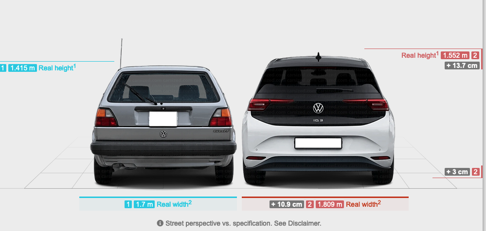
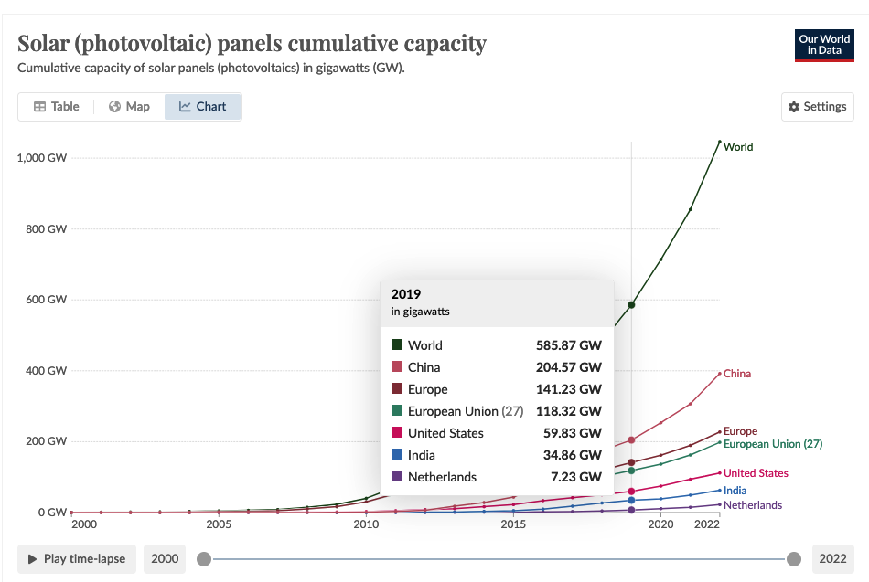

Ich schrieb einige Dinge im Fedi, und wurde gebeten, die hier in einen Blogpost zu kippen.
Dies ist größtenteils eine unbearbeitete Kopie der Postings, und nicht die übliche Form Fließtext für das Blog.
Das tut mir leid.

Veränderung nicht verstehen ist leicht.
Wenn man 16 Jahre Kohl, 7 Jahre Schröder und 16 Jahre Merkel gesehen hat, dann sind das fast 40 Jahre Stagnation,
die Abwesenheit von Veränderung in der Politik.

Aber die Welt hat sich verändert. Sehr.

Zum Beispiel:
Die Anzahl der PKW in Deutschland hat sich seit 1985 von 25 Millionen auf 50 Millionen verdoppelt.

*[Quelle](https://de.statista.com/statistik/daten/studie/12131/umfrage/pkw-bestand-in-deutschland/)*

Und die Autos selbst haben sich auch verdoppelt.

- 700 kg Mini vs. 1200 kg Mini,
- 800 kg Golf vs. 1700 kg ID.3

*[Quelle](https://www.carsized.com/en/cars/compare/volkswagen-golf-1983-5-door-hatchback-vs-volkswagen-id3-2019-5-door-hatchback/rear/) Golf vs. ID.3*

*[Quelle](https://www.carsized.com/en/cars/compare/mini-cooper-1990-3-door-hatchback-vs-mini-cooper-2013-3-door-hatchback/rear/) Mini vs. Mini*

CO₂-Level haben sich von einer vorindustriellen Baseline von 285 ppm auf 420 ppm in 2024 erhöht.
Das ist eine Veränderung von 135 ppm, und eine Verdoppelung des menschlichen CO₂-Eintrages seit 1985,
von 352 ppm auf 420 ppm.

Das mit der Klimakatastrophe waren wir, nicht unsere Eltern oder Großeltern.
Wir haben das menschengemachte CO₂ in der Atmosphäre seit 1985 verdoppelt.
Im vollen Wissen um die Folgen.

*[Quelle](https://ourworldindata.org/grapher/co2-long-term-concentration?time=1800..latest) 285 ppm vorindustriell, 
352 ppm in 1965, 420 ppm jetzt.*

Die Bevölkerung der Welt hat sich von 1974 bis heute verdoppelt,
von 4 Milliarden auf 8 Milliarden Menschen.
Sie wächst nicht mehr und wird laut Modell in 2086 oder so einen Spitzenwert von 10 Milliarden erreichen,
aber das Modell berücksichtigt keine Klimakatastrophe oder andere Einwirkungen, 
die Mortalität erhöhen oder die Geburtenrate senken.

*[Quelle](https://ourworldindata.org/grapher/population?time=1800..latest&country=~OWID_WRL), 
die Weltbevölkerung war 4 Milliarden in 1974, und liegt jetzt bei 8 Milliarden.*

Die Welt, in der ihr groß geworden seid, bzw. die Welt mit der Struktur der Arbeit und den Methoden, 
die mal funktioniert haben, existiert nicht mehr.
Die Politik, die ihr kennt, könnt Ihr nicht fortsetzen, weil ihre Methoden nicht mehr adäquat sind.
Wenn man sich hinstellt, mit dem Fuß aufstampft und "Ich will aber" wählt, 
dann wird das nicht funktionieren, weil die Methode nicht mehr zum Problem paßt.

Aber das werden wir jetzt im Detail ausprobieren.

# Es ist nicht alles schlimm

Teile der Welt verändern sich übrigens noch schneller.

So hat sich die installierte Solarleistung zwischen 2019 und 2022 einfach mal eben so verdoppelt
*und der Trend beschleunigt sich*.

*[Quelle](https://ourworldindata.org/grapher/installed-solar-pv-capacity). PV Installation in der Welt, Summe über Zeit.*

Die Kosten haben sich seit 2012 geviertelt, und seit 2017 halbiert.

*[Quelle](https://ourworldindata.org/grapher/solar-pv-prices). 
Die PV Kosten sinken exponentiell (gerade Linie in einem Log-Y Graphen) seit 1975, und bisher ist das Ende noch nicht in Sicht.*

Für Batterien sieht es genauso aus:
Die Kosten für LiIon Batterien sind in 30 Jahren um 97 % auf 3 % gefallen, 
aber wir brauchen inzwischen kein Lithium mehr in Batterien, sondern können Natrium verwenden.
Das ist aber genau überhaupt kein kritischer Rohstoff, sondern in Massen verfügbar.

Genau wird auch Kobalt nicht mehr gebraucht und viele andere seltene oder schwierige Rohstoffe sind ersetzbar geworden.
[Quelle](https://www.weltderphysik.de/gebiet/technik/nachrichten/2023/energiespeicher-lithium-ionen-batterie-ohne-kobalt/)

Entsprechend hat sich die Anzahl der installierten PV Batteriesysteme in einem Jahr, in 2023, mehr als verdoppelt,
*und der Trend beschleunigt sich.* [Quelle](https://renewablesnow.com/news/germanys-solar-battery-capacity-doubles-in-2023-846621/)

Alles, was ihr über die Probleme und die Kosten einer Energietransition wißt oder an Artikeln lest,
das älter als 12 Monate ist, ist wahrscheinlich falsch und basiert auf veralteten Annahmen.
Der Wandel passiert schneller, ist einfacher und gefahrloser und sehr, sehr viel billiger als ihr denkt.

# Das ist nicht das erste Mal so

Das ist übrigens nicht spezifisch für unsere Zeit.

Auch zur Zeit der industriellen Revolution kam es zu gravierenden Veränderungen, einer Landflucht und Verstädterung,
und damit einhergehenden echten und eingebildeten Problemen.

Die Stadt Kiel, meine Heimatstadt, ist damals zum Beispiel in 30 Jahren um den Faktor 10 gewachsen.

Berlin ebenso. 
Ich habe in Berlin in einer Wohnung nahe der U6 Kaiserin-Augusta-Straße gewohnt. 
Die Wohnung war von 1908, und man kann dort durch die Straßen gehen stadtauswärts bis Mariendorf, 
und die Querstraßen sind wie Jahresringe:
Vom Tempelhofer Feld bis Mariendorf wird die Bausubstanz mit dem Ausbau der U6 
bis zur Endstation wie Jahresringe Querstraße um Querstraße immer jünger.

Auch damals hatte man eine Menge "Probleme":

Die Dienstbotenfrage zum Beispiel ist eine Folge dieser Landflucht–Haushaltsführung war weitgehend manuell, 
und auf das Vorhandensein großer Mengen abhängiger und niedrig ausgebildeter Arbeitskräfte angewiesen.
Die waren dann aber schlagartig nicht zu kriegen.

Während die Politik das Problem noch diskutierte, 
hatte man den Haushalt automatisiert–Waschmaschinen und Staubsauger, 
basierend auf dem Siemens-Elektromotor,
haben sehr große Teile der anfallenden Arbeiten mechanisiert.

Genau dasselbe Problem hatte man in der Landwirtschaft: 
Durch die Landflucht hatte man ein Personalproblem.
Aber auf einmal gab es Traktoren und eine mechanisierte Landwirtschaft.

Um 1900 herum schien es,
als ob dieselbe Landwirtschaft auf der vorhandenen Fläche die wachsende Bevölkerung nicht ernähren würde können.
Aber auf einmal gab es chemische Düngemittel und das Haber-Bosch-Verfahren (1913), und etwa um dieselbe Zeit
entwickelte Bayer Pestizide und Herbizide (Dinitrol und andere), 
sodass Ernteausfälle und Hungersnöte aus anderen Gründen als Krieg in Europa der Vergangenheit angehörten.  

Die Politik hat dennoch bis in den 2. Weltkrieg rein von notwendigem Lebensraum für das Volk geschwafelt.
Das ist auch ein Fall von Leuten, 
die ihr Gehirn mit den Problemen ihrer Jugend belasten und ihr Weltbild nicht aktualisiert haben.

# Wir können das nicht

Vermutlich sind Menschen nicht gut gemacht für Veränderungen, die schneller als in 30 Jahren ablaufen.
Oder wir haben noch keine funktional wirksamen Kulturtechniken entwickelt und Prozesse etabliert,
mit denen wir solche Veränderungen zuverlässig kommunizieren und managen können.

Wie gesagt, gegenwärtig sind wir bei 3 Jahren Zykluszeit mit Leuten, 
deren Weltbild 30 Jahre und länger in Bernstein konserviert worden ist. 
Das ist ein Problem.

Man muss sich selbst da aktiv einbringen und aktualisieren.

*Ich hatte, wie viele Kinder meiner Generation, 
in meinem Regal hier gut 50 Was-ist-Was-Bücher aus den 1980er Jahren stehen.
Hier sind die überlebenden Bände zu sehen.*

Man kann sich diese Was-ist-Was Bände nehmen und mit einem großen orangen Textmarker durchgehen.
Markiert man veraltete, falsche oder überholte Informationen, kommt da schon eine ganze Menge zusammen.
Markiert man auch inzwischen gelöste Probleme, noch weitaus mehr.
Die Teile sind nicht falsch per se, aber sie sind 40 oder 50 Jahre alt, und wir haben seit damals viel gelernt.

[Reality has a well-known liberal bias](https://www.youtube.com/watch?v=UwLjK9LFpeo)

Das Problem ist: Es handelt sich um lebendige Geschichte.
Die Leute, die mit diesen Informationen groß geworden sind, leben noch und sind heute in Entscheidungspositionen.
Und machen da gefährlichen Quatsch, der auf falschen oder veralteten Daten beruht.
Das ist schlecht.

Wenn Stephen Colbert scherzhaft sagt "Reality has a well-known liberal bias", dann bezeichnet das auch genau das:
Leute mit konservativem, veraltetem Weltbild scheitern an einer sich ändernden, progressiven Realität.
