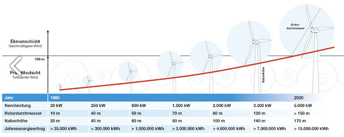

Auf Mastodon hieß es als Antwort auf einen Heim-Solar-Artikel:
> Es fehlt irgendwie die haushaltstaugliche Windkraftanlage.

Die kann es nicht geben.
Mehrere physikalische Grundlagen sprechen gegen so etwas:

- Bebaute Flächen und raue Untergründe zerstören den laminaren Flow des Windes.
  In Wohngebieten weht der Wind instabil, stoßweise und aus wechselnden Richtungen.
- Generell muss man in mindestens 100 Meter Höhe über dem Boden arbeiten, in der [Ekman-Schicht](https://de.wikipedia.org/wiki/Ekman-Schicht).
  Dies gilt idealerweise für die Untergrenze des Rotorblattes.
- Die Fläche eines Windrades steigt quadratisch mit dem Rotordurchmesser an.
  Der Windenergie-Ertrag steigt mit 
  [der dritten Potenz der Windgeschwindigkeit](https://energiewende.eu/warum-werden-windraeder-immer-groesser/) 
  an (die in der Ekman-Schicht stabil und gleichmäßig hoch ist).

Das heißt, ein sinnvolles Windrad ist groß, steht "weit draußen" in der Fläche und ragt weit in den Bereich 100 m –
1000 m Höhe störungsfreier laminarer Strömung hinein.
Das wird nie in Wohngebieten sein.

Es gibt immer mal Ideen für "Windräder, die mit Wind aus wechselnden Richtungen" klar kommen,
aber die Instabilität bodennaher Winde ist nur der kleinere Teil des Problems.
Die Energie, die man ab-ernten will, ist in bodennahen und verwirbelten Schichten nicht vorhanden.
Man muß nach oben in die stabilen laminaren Schichten, um die Energie da heraus zu holen.

Die Folge ist:
Zwar ist die Summe von Wind- und Sonnenenergie-Ertrag im Jahr in unseren Breiten im Mittel ungefähr konstant, 
aber Du kannst Windstrom nicht autonom daheim erzeugen.

Das heisst, Du wirst vier Monate im Jahr Strom aus dem Netz beziehen.

Das heißt auch, dass wir Wind und Sonnenenergie balanciert ausbauen müssen. 
Ein einziger Ausbau wird nicht funktionieren.

Und weil der Ertrag nur ein Teil der Nennleistung ist, werden wir außerdem überbauen müssen, ggf. um den Faktor 2-3.
Das heisst, dass wir an ertragreichen Tagen einen Stromüberschuss haben werden – 
und entweder abregeln oder Wasser elektrolysieren werden, auch wenn das ineffizient ist.
