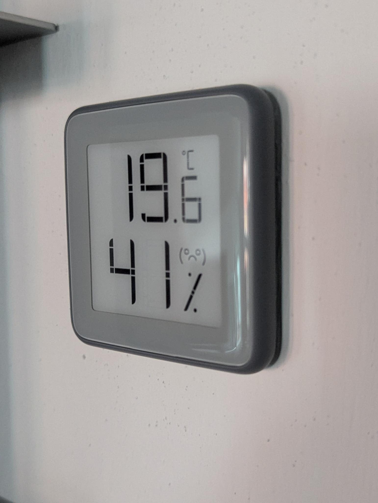
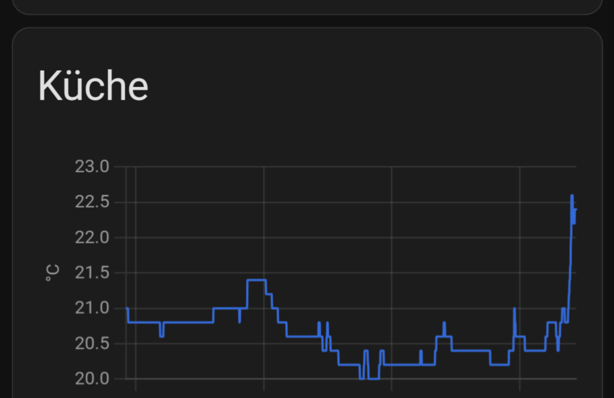

# Thermometer

Eine der wesentlichen Kenngrössen für die Behaglichkeit in den eigenen vier
Wänden ist die Umgebungstemperatur.

Üblicherweise betrachten wir die Temperatur im Zusammenspiel mit Heizung in der
kalten Jahreszeit. Aufgrund des Klimawandels gewinnt der Aspekt der
Raumtemperaturkühlung aber zunehmend an Bedeutung.

Thermostate verwenden wir im wesentlichen für drei Dinge: Beobachten, Messen,
und Steuern. 

## Beobachten, Messen, Steuern

Diese Begriffe sind natürlich beliebig von mir gewählt, mir hat diese Taxonomie
aber geholfen zu verstehen, was ich an verschiedenen Thermometern gut oder
schlecht fand.

 - Beobachten: Punktuelle Überprüfung von Umweltfaktoren. Thermometer die für
   die Beobachtung geeignet sind, haben ein eigenes Display und die Möglichkeit
   weitere Referenzwerte wie die Uhrzeit anzuzeigen.
 - Messen: Kontinuierliche Erfassung von Umweltfaktoren. Hier ist wichtig, dass
   die Messreihe konsistent und regelmässig aktualisiert wird.
 - Steuern: Verwendung von Messwerten um andere Geräte (Heizung, Kühlung,
   Verschattung) zu steuern.

Für welchen Zweck sich ein bestimmtes Thermometer eignet, hängt im wesentlichen
von zwei Eigenschaften ab:

## Präzision und Auflösung 

Wir sprechen hier über Digitalthermometer, die in der Regel eine hohe Präzision
haben -- sie geben für eine bestimmte Temperatur am Messpunkt in der Regel den
gleichen Wert wieder. In der Regel sind sie aber nicht _genau_: Sie werden im
Vergleich zu anderen Thermometern einen anderen Wert wiedergeben, meistens aber
mit feststehenden Differenzen / Offsets. Ein anderer Punkt in dem sich
Thermometer unterscheiden ist die Auflösung, also in welchen Teilschritten sie
Temperaturwerte messen und anzeigen. 

Einige Beispiele: 

 1. Die IKEA Vindstyrka Raum-Messgeräte liefern Informationen zu Temperatur,
    Luftfeuchtigkeit, und Feinstaubbelastung. Und obwohl in den Geräten
    hochsensitive Sensoren von Sensirion verbaut sind, zeigt das Gerät nur
    ganzzahlige Temperaturwerte an (und liefert ohne Veränderungen am Gerät
    auch nur ganzzahlige Werte). Diese Ausführung eignet sich meiner Meinung
    nach für Beobachtung: Ich schaue aufs Display und habe eine grobe Idee, wie
    sich die Umweltwerte in der aufgestellten Umgebung zueinander verhalten.

*Ein IKEA Vindstyrka in einem Bücherregal* 

 2. Ein Shelly HT G3 liefert mir auf dem ePaper Display und Online
    Temperaturwerte mit einer Auflösung von 0.1 Grad Celsius, die angezeigten
    und über die Shelly API gelieferten Werte stimmen im wesentlichen überein.

*Shelly HT G3 mit externer Stromversorgung* 
    
 3. Ein mit freier Alternativfirmware bestücktes Xiaomi MMC MHO-C401(N) zeigt
    auf dem ePaper-Display eine Auflösung von 0.1 Grad Celsius an, aber über
    die BTHome API liefert es Werte mit einer Auflösung von 0.01 Grad Celsius.

*Ein MHO-C401(N) mit der [alternativen Firmware für BTHome
Support](https://pvvx.github.io/MHO_C401/). Es sei angemerkt, dass es für C401
und C401N unterschiedliche Firmware gibt. Wenn man die falsche verwendet hat,
aktualisiert sich das Display nicht; man kann dann aber einfach die andere
flashen.*
 
 4. Ein Aqara Zigbee Thermostat liefert Werte mit einer Auflösung von 0.1 Grad
    Celsius.

 
 5. Ein Sonoff SNZB-02P liefert Werte mit einer Auflösung von 0.1 Grad Celsius.

 6. Tasmota unterstützt verschiedene Thermostate von DHT22 bis BME820, die
    jeweils entsprechend der technischen Kapazitäten Werte liefern.
 
Ein weiterer Grund warum _Präzision_ und nicht _Genauigkeit_ relevant sind:
Wenn es um Hausautomatisierung geht, ist die Frage welche Temperatur angenehm
ist und welche nicht, bereits subjektiv. Insofern sind "meine" 19.5 Grad
Raumtemperatur vielleicht angenehmer für mich als Kris' 21 Grad Raumtemperatur.
(Es sei auch angemerkt, dass die klassischen Raumsteuerungen für
Fussbodenheizungen mit Bimetall-Technik auch nur eine Genauigkeit von +-0,5
Grad haben).

*Ein temperaturgeführter Raumregler für Stellventile einer Flächenheizung. Im
Inneren bewährte, unkaputtbare Bimetalltechnik. Leider nutzlos, weil die
Heizung 'normally open' betrieben wird.* 

Eine hohe Auflösung der Messwerte hat nicht nur Vorteile: Es bedeutet auch,
dass kleinste Veränderungen in der Umwelt (zum Beispiel: Ein Mensch der 100W
Abwärme erzeugt sitzt in der Nähe eines Raumthermometers) zu unmittelbaren
Veränderungen in den Messwerten führen. Wenn dies in der Nähe eines
Schwellwertes geschieht, der zur Steuerung verwendet wird (zum Beispiel:
Heizung an/aus); dann kann es zu Taktung kommen: Das geschaltete Gerät wird
in (zu) schneller Folge ab und wieder angeschaltet. In diesem Fall empfiehlt es
sich, den Messwert zu glätten, bevor man ihn zur Schaltung verwendet. Das
verzögert den Steuerungsvorgang in der Regel, aber die Taktung wird
vermieden.

*Die Heizleistung von 12 Personen auf einer Party.* 

Es gibt noch zwei weitere Aspekten von Thermometern, die wichtig sind, um das
richtige Thermometer für den richtigen Anwendungszweck auszuwählen:
 
## Stromverbrauch und Aktualisierungs-Frequenz

Beim Stromverbrauch gehört eigentlich noch die Art der Stromversorgung hinzu.
Die gängigen Spielarten sind: Stromversorgug über USB (Vindstyrka, Shelly HT,
Tasmota), CR2032 (Aqara Zigbee, Xiaomai MHO-C401(N), und Sonderformate wie
CR2450 (Sonoff SNZB-02P). Batteriebetriebene Thermometer haben maximale
Freiheitsgrade bei der Aufstellung, aber je nach Implementierung halten die
Batterien nur wenige Monate. Gerade die Zigbee Thermometer optimieren ihren
Stromverbrauch, indem sie Updates nur schicken, wenn sich die Temperatur um ein
bestimmtes Delta verändert haben, und dann noch alle X Minuten, auch wenn sich
nichts geändert hat. Bei einigen Zigbee Sensoren sind die Schwellwerte über
gewisse API Calls anpassbar -- bei mir hat das aber nie funktioniert.

Wer Batterien vermeiden möchte, hat die Wahl zwischen

 - IKEA Vindstyrka, aber aufgrund des aktiven Lüfters im Gerät, eignet sich
   dieses Gerät nicht für die Aufstellung in Räumen mit hohen Anforderungen an
   die Ruhe. Und wegen der niedrigen Auflösung der Werte (ohne massive
   Modifikationen), eignet sich dieses Gerät auch nicht für Messen oder
   Steuern.
 - Shelly HT G3: Hoher Home Aesthetics Adequacy Factor, und mit Stromversorgung
   aus der Steckdose auch hohe Aktualisierungs-Frequenz. Aber die Konfiguration
   des Shelly HT G3 setzt das Drücken eines Knopf hinter der hinteren Abdeckung
   voraus, für die man die externe Stromversorgung abziehen muss. Meiner
   Meinung nach ein eklatanter Fehler im Design.
 - Tasmota-Selbstbau: Ob das eine bessere oder schlechtere Lösung ist als ein
   Vindstyrka zu modifizieren, sei der geneigten Leserschaft als Übung
   überlassen. Die selbst konfigurierbare Aktualisierungs-Frequenz und
   weitestgehend freie Wahl des Sensors entbehrt aber nicht einer gewissen
   Attraktivität, genauso wie die Einbindung über MQTT anstatt Zigbee oder
   BTHome ...

Wenn es Batterien sein dürfen:

 - sowohl die Aqara THS als auch die MHO-C401(N) verwenden einfache CR2032
   Batterien und laufen damit deutlich länger als ein Jahr. Ja, es gibt
   aufladbare CR2032 Zellen, aber deren Leistung ist stark eingeschränkt; ob
   man hier wirklich gewinnt sei dahin gestellt. Es gibt auch Adapterzellen, um
   entweder 2xAAA oder gleich USB anzuschliessen, damit habe ich aber keine
   Erfahrung.
 - Die Sonoff SNZB-02P verwenden CR2045 Batterien. Diese sind gross, und selten
   also teurer, und weil diese Thermometer LCD-Displays verwenden, sind die
   Batterien auch eher nach 6-8 Monaten leer als nach 12-15.

# Aktualisierungsfrequenz

Wie bereits erwähnt, unterscheiden sich diese Geräte in ihrer
Aktualisierungsfrequenz. Die MHO-C401(N)s aktualisieren sich ca einmal pro
Minute, Shelly HT G3 im Netzbetrieb ebenso (im Batteriebetrieb ca alle drei
Minuten). Aqara THS aktualisieren sich ca einmal alle 3-5 Minuten (oder wenn
die Temperatur sich um 0.1 Grad ändert), die SNZB-02P ca einmal alle 15 Minuten
oder wenn die Temperatur sich um 0.2 Grad ändert. 

*Vergleich der Aktualisierung der Werte in HomeAssistant von verschiedenen
Thermometern, die direkt nebeneinander stehen. 'rettemp' ist ein DS18B20 an
meinem EMS-ESP zur Referenz; Aqara, Shelly, und Sonoff sind die im weiteren
Text erwähnten Geräte. Man sieht, dass der Shelly etwa alle drei Minuten ein
Update schickt, und Sonoff und Aqara in den gezeigten 2 Stunden nur eine
handvoll Updates liefert, während der DS18B20 unmittelbare Werte liefert,
sobald sich die Temperatur ändert.* 

Meiner Erfahrung nach eignen sich Geräte mit einer niedrigen
Aktualisierungsfrequenz im wesentlichen nur für die Beobachtung: Also wenn ich
grob wissen will, was Sache ist und mir Tages- oder Wochen-Trends ausreichen.
Für Werte die ich innerhalb einer Stunde oder schneller mit anderen Dingen
korrelieren möchte, brauche ich eine zügigere Aktualisierung. Und schliesslich,
wenn ich Wärme- oder Kälte-Erzeugung aktiv steuern will, ist es unerlässlich,
einen schnellen Sensor zu haben -- selbst wenn ich die Messwerte zur Vermeidung
von Taktung durch einen Tiefpassfilter schicke oder eine Zweipunktschaltung
implementiere.

Wir haben als über Genauigkeit, Präzision, Auflösung, Stromverbrauch, und
Aktualisierungs-Frequenzen gesprochen. Für die praktische Anwendung im Home
Assistant Umfeld ist noch ein weiterer Aspekt wichtig:

## Protokoll-Konformität

Ich habe Erfahrung mit Zigbee, BTHome, Shelly, und Tasmota/MQTT -- andere
Protokolle und Implementierungen wie ESPHome, Matter, etc. sind hier nicht
berücksichtigt, weil ich zu ihnen nichts sagen kann. Es soll aber nicht
ausschliessen, dass sie für verschiedenste Anwendungsfälle geeignet sind.

 Zigbee
: Meiner Erfahrung nach ist ein Gutteil der als Zigbee-kompatibel
   ausgewiesenen Thermometer leider dergestalt, dass die Hersteller ihre
   eigenen Protokollvarianten fahren, die es erschweren bis verunmöglichen,
   diese Thermostate in einer offenen Umgebung wie Home Assistant zuverlässig
   einzubinden oder dauerhaft zu betreiben. 

   Home Assistant bringt für hunderte
   von Zigbee Geräten "Quirks" Definitionen mit, also gerätespezifische
   Anpassungen, damit das Gerät auch funktioniert. Leider sind die
   Gerätehersteller nicht in der Lage, ein Gerät mit einer Ausführung von
   Hardware und Firmware sauber zu benennen. Deswegen ist die Frage ob ein
   bestimmtes Zigbee-Thermometer mit Home Assistant funktioniert, immer mit
   "möglicherweise" zu beantworten. Das ganze ist insofern besonders
   verstörend, weil die meisten Thermometer, egal wie sie gebranded sind,
   entweder von Xiaomi oder Aqara hergestellt werden. Das ganze Theater ist
   also konsumentenfeindliche Marktzersplitterung. 

   Bei HomeAssistant kommt noch
   dazu, dass es unterschiedliche Implementierungen von Zigbee gibt: ZHA und
   Z2M. ZHA kommt von NabuCasa, der Firma hinter HomeAssistant, Z2M bindet den
   ganzen Zigbee-Kram über MQTT an HomeAssistant an. Die oben erwähnten Quirks
   unterscheiden sich, und so unterscheidet sich auch, ob ein Gerät mit
   HomeAssistant gut funktioniert, hin und wieder aufgrund einer Entscheidung
   für ZHA oder Z2M. Man kann theoretisch beides parallel fahren, wenn man zwei
   Zigbee Coordinators hat, aber ob das eine Lösung ist? Für mich zumindest
   nicht.

   Deswegen hier gleich die erste **Nicht-Empfehlung**: Finger weg von
   allem, was Tuya in der Beschreibung hat! Viele der Tuya-Geräte sprechen
   nominell Zigbee, haben aber zum Beispiel proprietäre Kopplungsprozesse oder
   andere Eigenheiten, die eine Verwendung im HomeAssistant stark
   verkomplizieren bis verunmögligen. Das gilt übrigens nicht nur für
   Thermometer (OSRAM LEDVANCE, I'm looking at you!). Die LocalTuya
   Integration, die einen Developer Account bei Tuya voraussetzt und auch
   ansonsten wirre Dinge tut, ist für mich Teil des Problems und nicht der
   Lösung.

BTHome
: BTHome ist ein Protokoll aus dem Hause Shellly und Bestandteil der
   [Open Home Foundation](https://www.openhomefoundation.org/). Ich muss gestehen, dass ich wenig Lust hatte, meinem
   Home Assistant einen weiteren Dongle für Bluetooth und eine weitere
   Integration anzutun, aber am Ende war es die richtige Entscheidung. Was ich
   ganz elegant finde: Die Geräte werden über den Webbrowser geflasht, man muss
   also weder das Gerät öffnen noch irgendwelche wilden Buildchains
   installieren.

Shelly
: Shelly hat sein eigenes proprietäres Protokoll, aber die Integration
   mit HomeAssistant ist lokal und funktioniert im wesentlichen sehr gut. Als
   europäisches Produkt zahlt man für Shelly-Lösungen etwas mehr, aber
   insgesamt finde ich die Qualität stimmt. (Wer keine Lust auf einen eigenen
   lokalen Home Assistant hat, ist mit der Shelly Cloud Lösung vermutlich auch
   ganz gut bedient, ich verwende das nicht).

Tasmota
: Tasmota verwendet MQTT und ist lokal, Wifi basiert, und für mich
  zum Beispiel im Bereich Smart Plugs bereits das Protokoll meiner Wahl. Wer
  Freude am Basteln hat, bekommt hier a) den Sensor in der Ausführung der Wahl
  und b) eine Integration die keine weiteren Dongles benötigt.

# Abschliessende Empfehlung

Die bisher besten Erfahrungen mit über einem halben Dutzend Thermometer-Modelle
lässt für mich nur zwei Empfehlungen zu: Aqara Temp and Humidity Sensor für
Anwendung ohne Display und mit nur einfachen Steuerungen, für alle anderen
Anwendungen Xiaomi MMC MHO-C401(N) mit der BTHome Firmware. Der Shelly HT G3
ist aufgrund seiner Größe und der oben genannten Design-Fehler nur abgeschlagen
auf dem Dritten Platz. Tasmota nur für Leute die sinnvoll selbst Geräte bauen
können, dann aber meiner Erfahrung nach am Flexibelsten.
