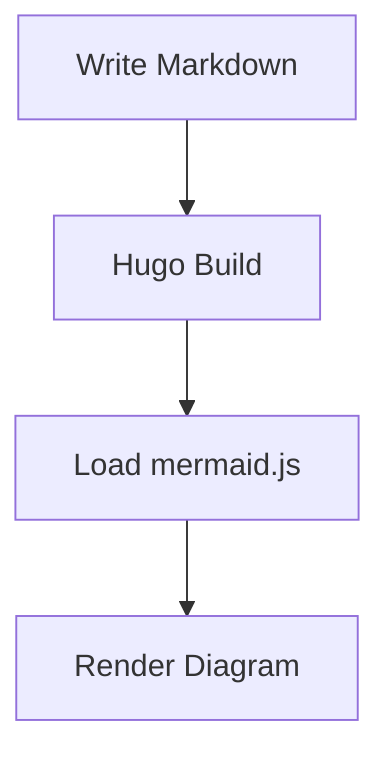
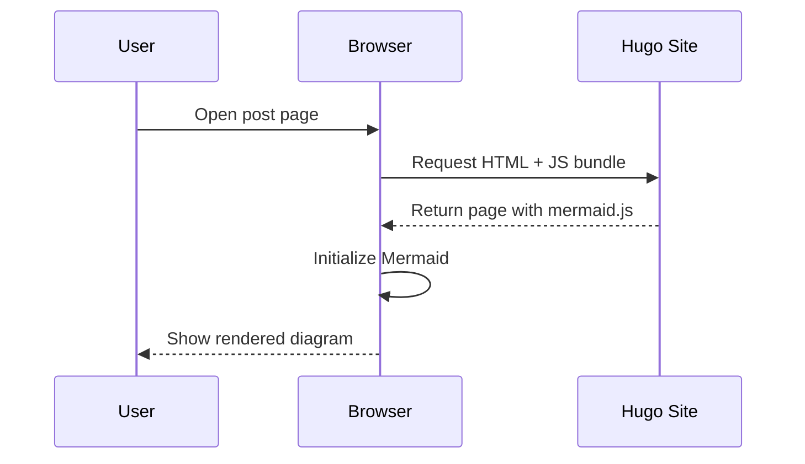

This is a Mermaid rendering test post.

If Mermaid is wired correctly, both diagrams below should render as SVG diagrams.

```mermaid
flowchart TD
    A[Write Markdown] --> B[Hugo Build]
    B --> C[Load mermaid.js]
    C --> D[Render Diagram]
```

```mermaid
sequenceDiagram
    participant U as User
    participant B as Browser
    participant H as Hugo Site
    U->>B: Open post page
    B->>H: Request HTML + JS bundle
    H-->>B: Return page with mermaid.js
    B->>B: Initialize Mermaid
    B-->>U: Show rendered diagram
```
