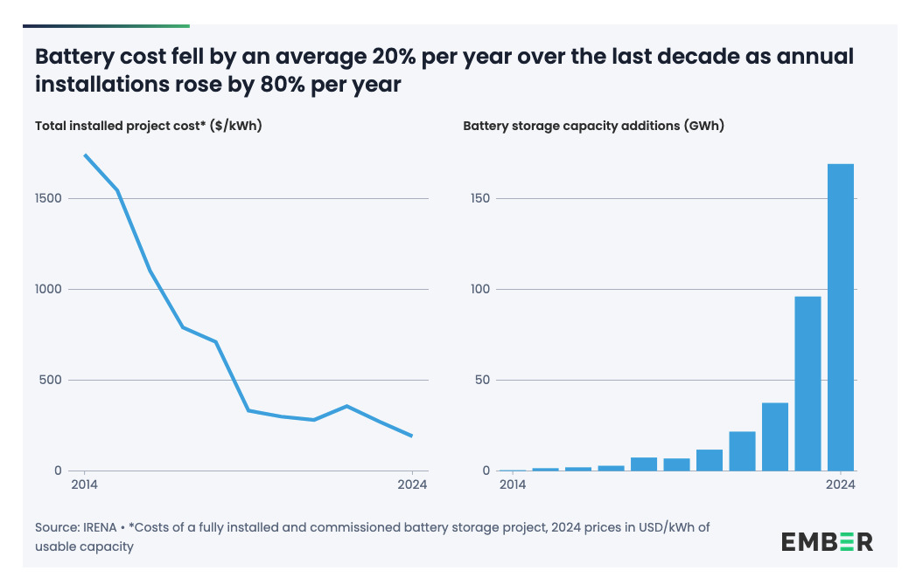
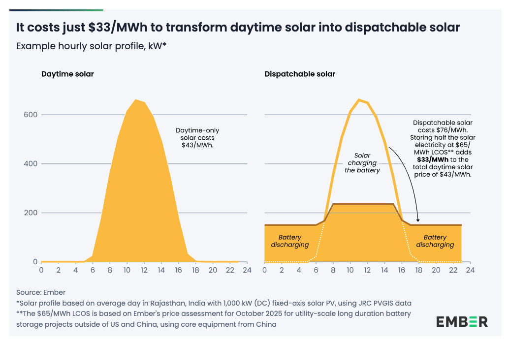

[[basierend auf einer Reihe von Artikeln in Mastodon](https://infosec.exchange/@isotopp/116198329364176001)]

# Solar mit Batterie – was kostet der Speicher?

Kommerzielle große Solaranlagen werden heute oft mit angeschlossenem Batteriespeicher gebaut.
Das liegt daran, dass der Energiebedarf abends, nach Sonnenuntergang, oft am größten ist.

Die Speicherdauer, "hours of storage" oder "E/P Ratio" (Energy-to-Power Ratio)
bezeichnet dabei das Verhältnis von Energiespeicher-Kapazität zu Nennanschlußleistung, also MWh/MW.
Das ist die Anzahl der Stunden, die die Batterie Energie liefert, wenn man mit maximaler Last ausspeichert.
Wenn das nicht der Fall ist, hält der Speicher entsprechend länger durch.

Der Capex der Installation ist dabei proportional zur Speicher-Kapazität, kann also in USD/kWh angegeben werden.

[EMBER: How cheap is battery storage](https://ember-energy.org/latest-insights/how-cheap-is-battery-storage/)

EMBER Energy liefert Zahlen und zeigt, dass der kWh-Capex in 2024 unter $100 pro kWh gefallen ist:

> Capex of $125/kWh means a levelised cost of storage of $65/MWh

und rechnet dann die Wirtschaftlichkeitsrechnung durch.

Dabei geht man von reiner Solarnutzung durch die angeschlossene Solaranlage aus.
Nimmt man weitere Swing-Energie aus dem Netz auf, sinkt der LCOS weiter ab.
Die Zahlen sind für Europa, für China und USA ergeben sich weit bessere Zahlen.

Und:
> With a $65/MWh LCOS, shifting half of daily solar generation overnight adds just $33/MWh to the cost of solar

und weiter:

> This is not the same as baseload solar.
> Delivering constant power every hour of the year, including cloudy weeks and seasonal lows, 
> requires solar overbuild and more battery storage.
> But shifting half of daytime solar is a major step.
> It aligns solar generation more closely with a typical demand profile,
> meaning solar can meet a much larger share  of the evening and night-time demand and
> significantly increase its contribution to the power mix.

# Und können wir so viel Batterie bauen?

> Battery manufacturing capacity is already scaling far ahead of demand,
> with supply exceeding demand by a factor of three in 2024. 
> While China currently dominates global battery production, 
> this has triggered a wave of investment in new manufacturing capacity across Asia, Europe,
> the Middle East and the US
> as countries seek to diversify supply chains and enhance energy security.

Dabei ist Lithium auch keine kritische Resource mehr.
Insbesondere bei stationären Speichern hat eine Natrium-Batterie enorme Vorteile (unter anderem ist die komplett Durchgangssicher und zyklenstabiler).

# Auch Gas ist unrentabel

Strukturell bedeutet das, daß fossile Kraftwerke (Nuklear sowieso) vollständig unrentabel werden.

Neu gebaute Gaskraftwerke können als Peaker und zugeschaltete Kraftwerke in bestimmten Perioden des Jahres Sinn haben,
sind aber durch Betrieb alleine nicht rentabel zu betreiben –
sie hätten unter 16 Tage Betriebszeit im Jahr bei konsequenter Umsetzung von Wind und Solar mit Batteriespeicher.

Sie sind damit nicht mehr von der Wirtschaft zu bauen und zu betreiben,
sondern wären ein staatliches Absicherungsprojekt,
das als Energieversicherung des Landes meistenteils in Standby hingestellt werden würde.

Das ist alles auf Daten von 2024 basierend, aber der Batteriepreis sinkt weiter– wenn auch langsamer als 2014-2024.

Wenn also der Ministerinnen-Marionette der Fossilwirtschaft die Muffe geht und ihre "Vorschläge" zusehends irrationaler werden,
dann deswegen.

Wenn ihr mit älteren Zahlen als denen von 2024 rechnet, dann arbeitet ihr mit veralteten Informationen,
die aufgrund der rapiden Verbilligung in diesem Bereich falsche Ergebnisse bringen.

# Wieviel Stunden für welchen Zweck?

Ohne Berücksichtigung der Wirtschaftlichkeit ist ein Profil von

- 2-4h – Abendspitze, Preisarbitrage sinnvoll
- 6-8h – systemoptimal, Verschiebung der Mittagsspitze bis in den Abend, Nach komplett abdecken
- 10-14h – komplette Abdeckung der Nachtlücke auch im Winter in Mitteleuropa

Wirtschaftlich ist Modell 3 nur mit Natrium-Batterien denkbar, Stand heute,
oder halt durch massiven Zubau von Pumpspeichern.

Modell 2 wird absehbar wirtschaftlich mit Li und Na-Batterien.

Modell 1 ist bereits wirtschaftlich.

In den USA ist eine E/P-Ratio von 4h vorgeschrieben.
In China wird derzeit im Schnitt mit 2.4h gebaut, d.h.
viele bestehende Projekte sind noch 2h-Speicher, aber man beginnt jetzt mit dem 4h-Zubau.

BESS kann auch Schwächen des Leitungsnetzes abfangen:
Ein 1GW Solarpark kann durch als BESS am Solarpark die Spitzenleistung glätten und gleichmäßig ausspeichern.
Dabei ist dann keine 1 GW Anschlußleitung notwendig.

Batteriespeicher am Zielort von großen Verbrauchern haben einen ähnlichen Effekt.

# Overbuild ist nicht schlimm, verändert Baustrategie

Wir haben schon, auf eine Weise, einen Overbuild von Solar –
wir haben zu Spitzenzeiten weit mehr Solarenergie als im Netz verwertet werden kann.

Die Solarenergie kann auch nicht an Nachbarn weiter gegeben werden, weil es bei denen, modulo Wetter,
auch so aussieht wie bei uns.

Das heißt,
beim Bau von privaten und kommerziellen Solaranlagen muss man bereits jetzt mit Abriegelung in Spitzenzeiten leben.
Das ist nicht schlimm: Selbst wenn man privat Solar nur betreibt,
um den eigenen Verbrauch zu beschrânken kann man mit einem Einfamilienhausdach und erstaunlich wenig Batterie auf 8 Monate Totalautonomie im Jahr kommen.

Das heißt aber – sowohl für private als auch für kommerzielle Solaranlagen –
dass wir eigentlich Stromerzeugung nicht für volle Direkteinstrahlung zur Mittagszeit optimieren wollen,
sondern für die Randzeiten, für bedeckte Tage und für Tage früh oder spät im Jahr.

Entsprechend sind Solarpaneele nicht nach der Spitzenlast zu planen,
sondern wie sie sich bei geringer Einstrahlung verhalten.
Und ob wir sie so anordnen können, dass sie bei niedrig stehender Sonne, in Ost- oder West-Ausrichtung,
oder an bewölkten Tagen einen Beitrag leisten können.

Wenn man hat, noch ein bischen Kapazität nach Süden dazu, aber im Grunde ist Strom dann so billig,
dass das auch egal ist.

Entscheidend sind diese Rand- und Schwachlicht-Zeiten, und halt ordentlich Batterie –
zur Zeit sind 2 kWh pro kWp rentabel.
Wnn man eine Wärmepumpe hat oder viel Swing-Kapazität braucht eventuell auch mehr,
aber das belastet eine Wirtschaftlichtkeits-Rechnung zur Zeit sehr.

# Vergleich zur Pflanzenwelt

Viele Pflanzen machen das ganz ähnlich.

[Wikipedia Photosynthetic Efficiency](https://
en.wikipedia.org/wiki/Photosynthetic_efficiency)

>  For actual sunlight, where only 45% of the light is in the photosynthetically active spectrum,
> the theoretical maximum efficiency of solar energy conversion is approximately 11%.

Das theoretische Maximum ist ca. 30% [Shockley-Queisser Limit](https://
en.wikipedia.org/wiki/Shockley%E2%80%93Queisser_limit).

Und viele Pflanzen sind sehr effizient bei niedriger Einstrahlung (unter 100W/qm):

>  Photosynthesis increases linearly with light intensity at low intensity, 
> but at higher intensity this is no longer the case. 
> Above about 10,000 lux or ~100 watts/square meter the rate no longer increases. 
> Thus, most plants can only use ~10% of full mid-day sunlight intensity.

Wir müssen uns für zukünftigen Overbuild ebenso an solchen Ideen orientieren:
Solarzellen sind inzwischen sehr günstig geworden, teilweise günstiger als Baumaterial für Zäune.
Die Kosten liegen in der Montage, Verkabelung und im Wechselrichter,
der aber gar nicht nach Nennkapazität berechnet werden muss, wenn die Module so aufgestellt sind,
dass die Nennkapazität nie erreicht werden kann.

Jedenfalls ist es inzwischen nicht nur möglich, sondern sogar sinnvoll geworden,
Solaranlagen auch unter dem Gesichtspunkt nicht optimaler Ertragslage zu planen,
insbesondere wenn man stattdessen Ertrag in Randzeiten oder Rand-Jahrezeiten haben kann.

# Volts: The Fate of Fossil Fuel Systems

Zum Kontext auch [Volts.wtf Podcast - The fate of fossil fuel systems in the "mid-transition"](https://www.volts.wtf/p/the-fate-of-fossil-fuel-systems-in)

> Pretty good episode:
> The volts.wtf podcast explaining
> that it would be pretty useful to actually plan the transition from fossil infrastructure to renewable infrastructure in advance,
> as we're in the middle of a disruptive change towards a positive future but will be left with stranded assets we can't just let "the market" decide how to handle them.

Fossile Energiequellen sind auf dem Weg nach draußen.
Das ist wirtschaftlich zwingend und unabwendbar, und ökologisch notwendig.

Den Übergang zu planen ist für alle Beteiligten vorteilhafter als sich ihm zu verweigern.

Wir kennen das schon von der Autoindustrie: Indem sich die deutschen Autobauer der Umstellung auf Elektro verweigerten,
statt sie zu planen, haben sie die Führungsrolle auf dem Gebiet des Autobaus weltweit aus der Hand gegeben.
