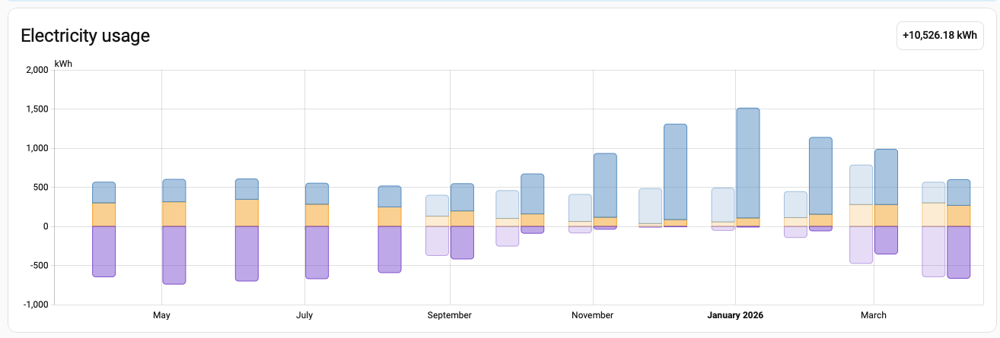
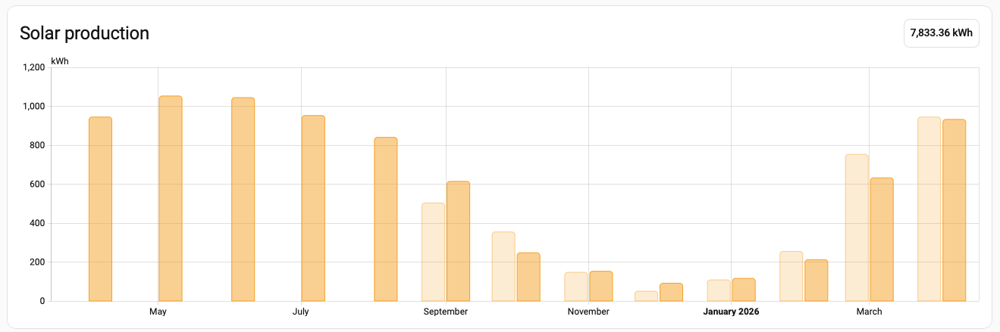
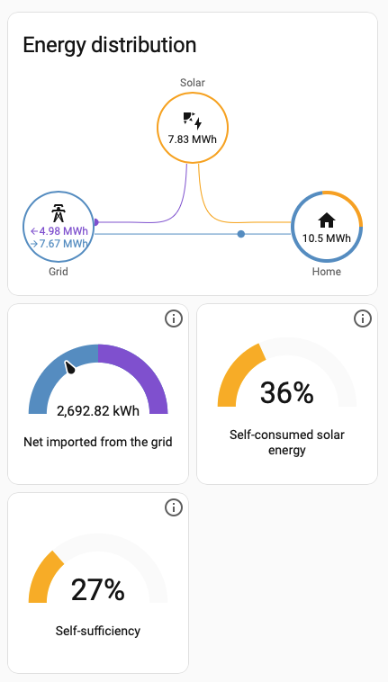
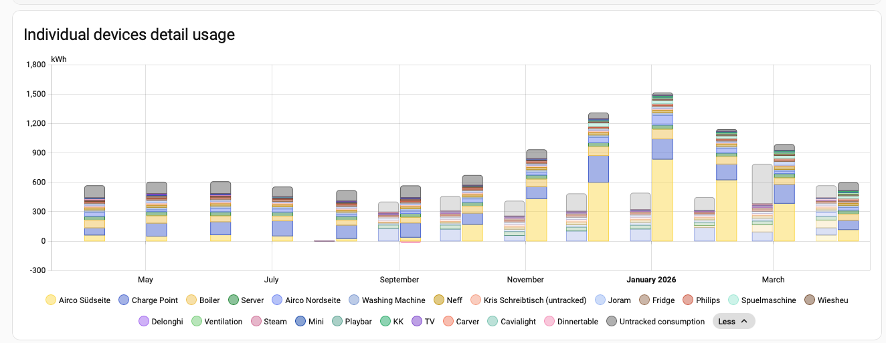
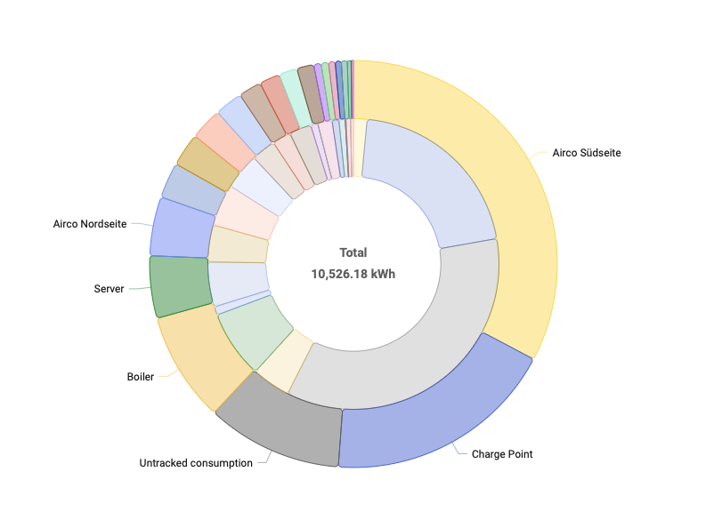
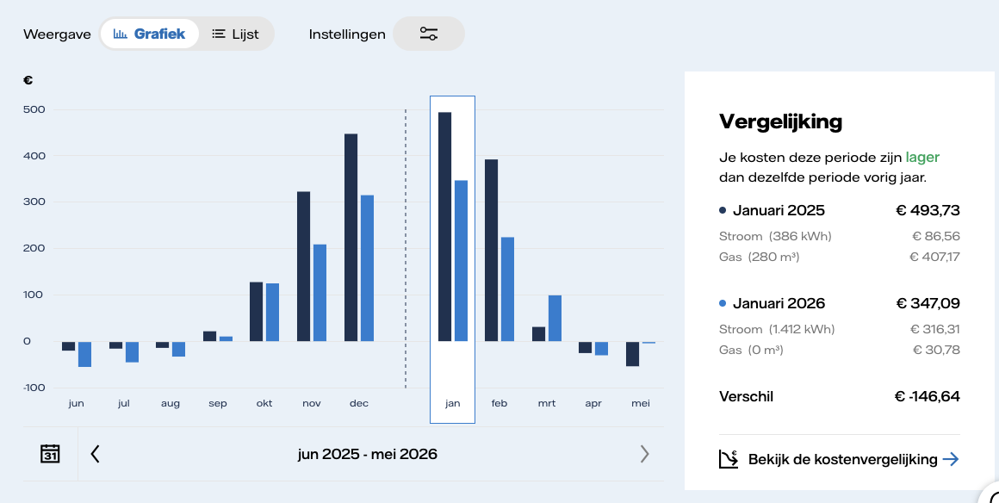
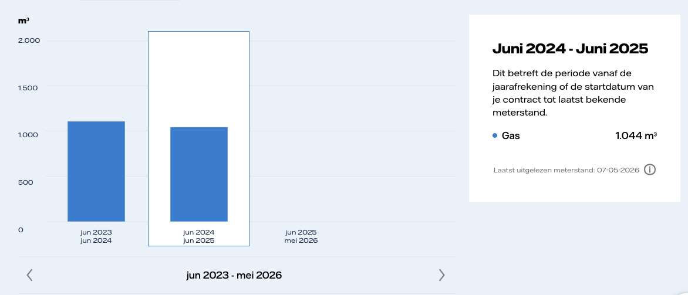
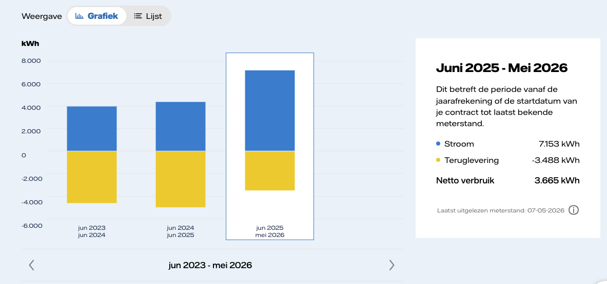

On 1 April 2025 we stopped heating the house with natural gas.
The installation was described while it was still fresh in [Going fully electric]():
two Panasonic multi-split air-air heat pump systems, seven indoor units, and a heat-pump boiler for warm water.

One year later the interesting question is no longer whether the house can be heated.
It can.
The interesting question is where the energy moved to, and how visible that move is in the numbers.

# The yearly view

For the first full year we consumed 10.5 MWh of electricity.
That includes everything: household electricity, cooking, warm water, space heating and charging the car.
The original projection was 10-12 MWh/year, so the result is right inside the expected range.



*Bar chart titled "Electricity usage" comparing two yearly periods of household electricity consumption. Darker colored bars represent April 2025 through March 2026. Lighter translucent bars behind them represent the previous year, April 2024 through March 2025. The vertical axis ranges from about -1,000 to 2,000 kWh.*

*Each month contains stacked sections above and below zero. Blue sections above zero represent the largest share of electricity usage. Orange sections above zero are smaller supporting values. Purple sections extend below zero and represent exported or offset energy.*

*From spring through summer, both years show similar electricity use, with positive usage around 500 to 650 kWh and negative values around -600 to -750 kWh. Starting in autumn, the darker 2025-2026 bars rise sharply above the lighter previous-year bars. Usage peaks in winter, reaching about 1,500 kWh in January 2026, compared with roughly 500 kWh in the previous winter. The largest increases occur from November through February.*

*The comparison reflects a major heating-system change. During 2024-2025, the home used gas heating, which is not included in the electricity figures. During 2025-2026, gas heating was removed and replaced with an air-to-air heat pump, causing winter electricity consumption to rise substantially. A badge in the upper right shows a cumulative annual electricity usage of "+10,526.18 kWh."*

The important shape in this diagram is the winter step.
Spring and summer still look like the previous year.
From autumn onward the gas boiler is gone from the energy accounting, and the heating load appears as electricity.

January 2026 is the peak month with about 1.5 MWh.
That sounds large when compared to old household electricity usage,
but it is now also carrying the heat load that previously appeared on the gas meter.

# Solar still helps, but at the wrong time

The solar roof produced 7.8 MWh over the same period.
With net metering still active, that can be put against the 10.5 MWh consumption,
leaving a net yearly electricity consumption of about 2.7 MWh.
At current pricing that is around 700 EUR for living, cooking, heating and driving.



*Bar chart titled "Solar production" comparing monthly solar energy generation between two yearly periods. Darker orange bars represent April 2025 through April 2026. Lighter translucent orange bars represent the previous year, with available historical data beginning in September 2024. The vertical axis ranges from 0 to about 1,200 kWh.*

*Solar production in the 2025-2026 period starts high in spring and summer, reaching just above 1,000 kWh in May and June, then gradually declines through autumn. Production falls to around 600 kWh in September, about 250 kWh in October, and reaches its lowest levels during winter, with roughly 100 to 150 kWh per month between November and January. Output rises again toward spring, reaching about 630 kWh in March and around 930 kWh in April.*

*The lighter comparison bars show that earlier-year data is only available from September 2024 onward. Compared with the previous year, the newer period produced somewhat more solar energy in September through January, while March production was lower. April production was nearly identical between both years, at just under 950 kWh. A badge in the upper right shows a cumulative solar production total of "7,833.36 kWh."*

The problem is not the yearly total.
The problem is timing.

Solar production is strongest in May and June.
Heating demand is strongest in December and January.
The annual balance is good because the Dutch net-metering scheme still hides this mismatch.
That is also why the result changes when net metering ends.
At that point the house needs more local buffering, and the next obvious component is a battery.



*Dashboard titled "Energy distribution" showing how electricity moves between solar generation, the electrical grid, and home consumption. A central flow diagram connects three circular nodes labeled Solar, Grid, and Home. The Solar node at the top shows 7.83 MWh generated. The Home node on the right shows 10.5 MWh consumed. The Grid node on the left shows two values: about 7.67 MWh imported from the grid and 4.98 MWh exported back to the grid. Colored lines between the nodes indicate energy flow directions and amounts.*

*Below the diagram are three gauge-style indicators. The first gauge shows "Net imported from the grid" with a value of 2,692.82 kWh. The second gauge shows "Self-consumed solar energy" at 36%, meaning just over one-third of solar production was used directly in the home. The third gauge shows "Self-sufficiency" at 27%, indicating about one-quarter of the home's electricity demand was covered by solar generation rather than grid imports.*

The energy distribution diagram is the clearest argument for the battery.
The house imported 7.67 MWh and exported 4.98 MWh.
The net import is only 2.69 MWh, but the gross traffic is large.
Only 36% of solar production was self-consumed directly, and self-sufficiency was 27%.

That is not a failure of the heat pumps.
It is a storage problem.
Without a buffer, the house exports midday solar and imports evening, night and winter electricity.

# Where the electricity went

The device view shows the heating system directly.
The car existed in the previous year as well.
The new loads are the two air-air heat pump systems and the heat-pump boiler.



*Stacked bar chart titled "Individual devices detail usage" comparing monthly electricity consumption by device across two yearly periods. Darker colored stacked bars represent April 2025 through April 2026. Lighter translucent bars behind them represent the previous year, April 2024 through March 2025. The vertical axis ranges from about  0 to 1,800 kWh.*

*Many household devices are listed in the legend, but the dominant contributors are the Airco Südseite, Airco Nordseite, Boiler, and Charge Point categories. During spring and summer, total monthly electricity usage remains moderate, generally between 500 and 650 kWh in both years. Beginning in autumn 2025, consumption rises sharply in the darker bars. Usage peaks during winter, reaching roughly 1,500 kWh in January 2026.*

*Most of the winter increase comes from the Airco Südseite and Airco Nordseite systems, which represent air-to-air heat pumps used for heating, along with the Boiler, a heat-pump water heater. The Charge Point category also contributes noticeably, especially during higher-consumption months.*

*Compared with the previous year, winter electricity demand is dramatically higher because the earlier 2024-2025 period relied on gas heating, which is not included in the electricity data.*

*The lighter bars therefore remain much lower during winter months.*

Over the year the heating-related electrical consumption was approximately:

- Airco Südseite: 3,446 kWh
- Airco Nordseite: about 500 kWh
- Boiler: about 920 kWh

The charge point used about 1,950 kWh.
That is visible and relevant, but it is not part of the heating conversion.



*Double-ring circular chart showing household electricity consumption by device category for April 2025 through April 2026. The outer ring represents the 2025-2026 period. The lighter inner ring represents the previous year for comparison. The center of the chart displays a total electricity usage of 10,526.18 kWh.*

*The largest segment in the outer ring is Airco Südseite, representing one of the air-to-air heat pumps used for heating. The second largest segment is the Charge Point for electric vehicle charging. Together, these two categories account for roughly half of all electricity consumption.*

*Additional large segments include Airco Nordseite, the second heating heat pump, the Boiler, which is a heat-pump water heater, and Untracked consumption. Together, these categories contribute roughly another quarter of total usage. A Server category is also large enough to stand out as a named segment.*

*Many smaller categories form narrow slices around the remainder of the chart, representing ordinary household devices and appliances. Compared with the lighter inner ring from the previous year, the outer ring shows substantially greater heating-related electricity consumption because the household switched from gas heating to electric heat pumps during the 2025-2026 period.*

Space heating and warm water therefore used:

```text
3,446 + 500 + 920 = 4,866 kWh/year
```

Before the change, the house used about 1,100 m³ of gas per year.
Using the usual rough conversion of 10 kWh/m³, that is about 11 MWh/year of thermal input from gas.

```text
11,000 kWh/year / 156 m² = 70.5 kWh/(m² year)
```

For the house, that was already a decent number.
It is around the German class B boundary range, and in the broad Dutch label bands it lands in the good part of the scale.

The important result is the replacement:

```text
11,000 kWh gas input / 4,866 kWh electricity = 2.26
```

As a whole-system seasonal performance factor, 2.26 is not spectacular for the theoretical heat pump,
but it is the actually measured system including behavior, winter conditions, warm water, defrosting, distribution losses and auxiliary heating.
It is also enough to eliminate gas consumption while keeping yearly costs under control.

The weakest part is the warm-water heat pump.
It is less efficient than I want, especially in cold weather when it falls back to the heating element.
The air-air heat pumps are doing the heavy lifting.

# Cost in the winter peak

The useful cost comparison is January, because January is where the conversion is most visible.



*Dashboard comparing household energy costs between June 2025 through May 2026 and the previous yearly period. A grouped bar chart on the left shows monthly cost differences in euros. Dark blue bars represent the earlier year, while lighter blue bars represent the current year. Positive values indicate higher winter energy costs, while several summer months show small negative values.*

*Costs rise sharply during winter in both years, peaking around January. The current year shows noticeably lower winter peaks than the previous year, despite much higher electricity consumption caused by switching from gas heating to electric heat pumps.*

*A highlighted comparison panel on the right focuses on January. January 2025 total energy costs were EUR 493.73, consisting of EUR 86.56 for electricity usage of 386 kWh and EUR 407.17 for gas usage of 280 cubic meters. January 2026 total costs were lower at EUR 347.09, consisting of EUR 316.31 for electricity usage of 1,412 kWh and EUR 30.78 for gas usage of 0 cubic meters.*

*The overall monthly cost difference is shown as -EUR 146.64, indicating the newer heating setup reduced total winter energy expenses despite substantially higher electricity demand.*

*The chart period label at the bottom reads "jun 2025 - mei 2026," covering June 2025 through May 2026.*

January 2025 was the gas-heated reference month:
386 kWh electricity, 280 m³ gas, total cost EUR 493.73.

January 2026 was the electric-heated month:
1,412 kWh electricity, no gas use, total cost EUR 347.09.

So the electricity bill became large, as expected,
but the gas bill disappeared.
The winter peak month was EUR 146.64 cheaper.

# The gas meter is the point

The gas chart is boring in the best possible way.



*Bar chart comparing annual household gas consumption across multiple yearly periods. The vertical axis is measured in cubic meters, ranging from 0 to slightly above 2,000 m³. Three yearly periods are shown along the horizontal axis.*

*The first period, June 2023 through June 2024, shows gas usage slightly above 1,100 m³. The second period, June 2024 through June 2025, is highlighted and shows gas consumption of 1,044 m³. A detail panel on the right confirms this value and notes that the latest meter reading was taken on 07 May 2026.*

*The third period, June 2025 through May 2026, shows effectively zero gas consumption, with no visible bar. This reflects the household transition away from gas heating during the 2025-2026 period after replacing the gas heating system with electric air-to-air heat pumps and a heat-pump water heater.*

*The overall comparison demonstrates a complete reduction in annual gas usage after the heating-system conversion.*

The previous years were around 1,100 m³/year.
The first complete post-conversion period is effectively zero.

The electricity grid chart shows the other side of the same change.



*Bar chart comparing annual household electricity usage and grid feed-in across three yearly periods from June 2023 through May 2026. The vertical axis is measured in kilowatt-hours and ranges from about -6,000 to 8,000 kWh. Blue bars above zero represent electricity imported from the grid and consumed in the home. Yellow bars below zero represent electricity exported back to the grid from solar production.*

*The first two yearly periods, June 2023 through June 2024 and June 2024 through June 2025, show similar patterns. Electricity consumption is around 4,000 to 4,500 kWh per year, while grid feed-in is slightly larger in magnitude, around 4,200 to 4,600 kWh exported.*

*The highlighted third period, June 2025 through May 2026, shows a major increase in electricity consumption. The right-side detail panel lists 7,153 kWh imported from the grid and 3,488 kWh exported back to the grid, resulting in a net annual electricity usage of 3,665 kWh. The latest meter reading was taken on 07 May 2026.*

*Compared with earlier years, electricity imports increased substantially because the household replaced gas heating with electric air-to-air heat pumps and a heat-pump water heater. At the same time, solar production continued to offset part of the increased demand through grid feed-in.*

Imported electricity increased substantially.
That is not surprising; it is the intended substitution.
The household moved energy demand from the gas network to the electricity network.

From a consumption-shift point of view, the result is clean:

- Gas went from about 1,100 m³/year to zero.
- Heating and warm water moved to about 4.9 MWh/year of electricity.
- Total electricity consumption landed at 10.5 MWh/year including the car.
- Solar produced 7.8 MWh/year.
- Net electricity import was only 2.7 MWh/year under net metering.
- Gross import and export remain too high, so local storage is the next optimization.

# Conclusion

The conversion worked.
The house is gas-free, winter comfort is fine, and the yearly electricity consumption matches the original projection.

The main lesson is that electrification does not make the energy demand disappear.
It moves it.
That makes the demand measurable in a different place, and it makes timing more important.
The heat pumps solved the gas problem.
The next problem is matching more of the solar roof to the house load before the electricity reaches the grid.

Sources: [first Mastodon post](https://infosec.exchange/@isotopp/116540526349027443), [second Mastodon post](https://infosec.exchange/@isotopp/116540594050079219), and [Going fully electric]().
