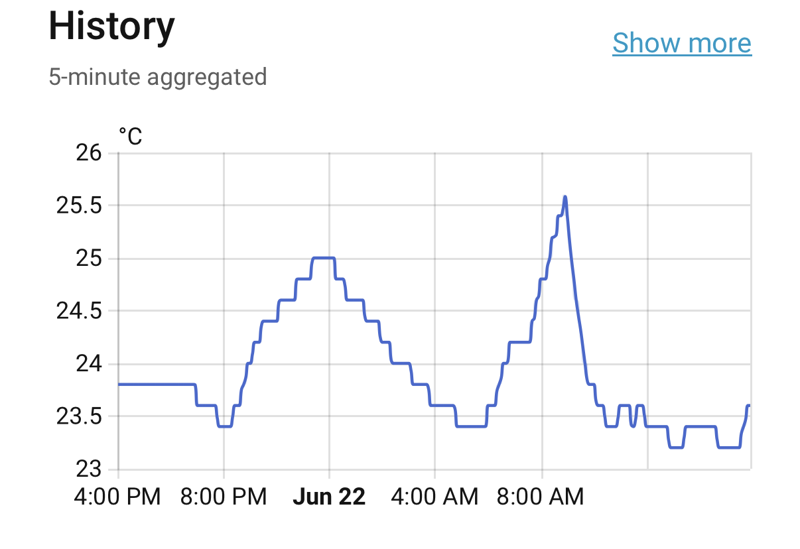
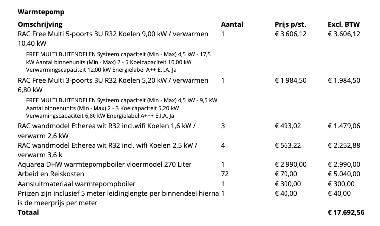
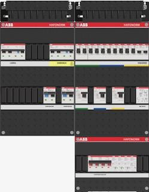
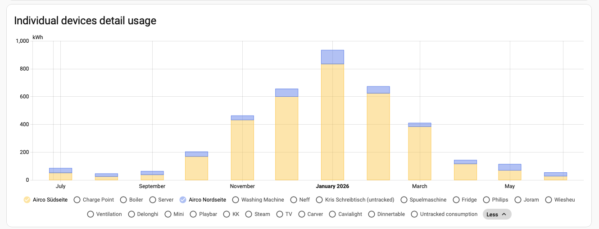
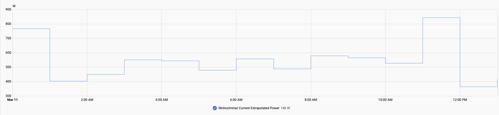

[[basierend auf einem Mastodon-Thread](https://infosec.exchange/@isotopp/116794114363945211)]

Wir haben im März 2025 die Gasheizung abgeschaltet.
Seitdem - also seit mehr als einem Jahr - heizen und kühlen wir das Haus mit Klimageräten, also Luft-Luft-Wärmepumpen.
Die erste Beschreibung der Installation steht in [Going fully electric](),
die Auswertung nach einem Jahr in [One year gas-free]().

Das kurze Ergebnis: Es funktioniert.
Im Winter wird das Haus schnell warm.
Im Sommer bleibt der Arbeitsplatz unter dem Dach bei 23,5 Grad stabil, auch wenn es draußen heiß ist.



*Temperatur am Arbeitsplatz unter dem Dach: Morgens fällt die Temperatur nach dem Einschalten des Klimagerätes von 26 Grad auf 23,5 Grad und bleibt dort stabil.*

# Ausgangslage

Das Projekt ist nicht nur "Gasheizung raus, Klimageräte rein".
Es ist Teil einer fast fünf Jahre langen Umstellung:

- Test mit einem Carver S+ als kleinem Elektrofahrzeug für lokale Fahrten.
- Installation einer Ost-West-Solaranlage mit 3,3 kWp auf der Ostseite und 6,6 kWp auf der Westseite, zusammen 9.250 Wp.
- Installation eines 11-kW-Ladeanschlusses und Kauf eines gebrauchten Megane e-Tech 60 kWh (Jahreswagen).
- Abschalten der Gasheizung und Umstellung auf Luft-Luft-Wärmepumpen.
- Senkung der elektrischen Grundlast des Hauses von etwa 5,5 MWh/Jahr auf etwa 4,0 MWh/Jahr durch Austausch ineffizienter Komponenten (der Haus-Server war 12 Jahre alt).

Der alte Renault Scenic Diesel ist weggefallen.
12.000 km/Jahr bei 7 l/100 km waren 840 Liter Diesel, also grob 8,4 MWh Primärenergie.
Der Megane braucht etwa 14 kWh/100 km im Sommer und 18 kWh/100 km im Winter.
Das sind ungefähr 2 MWh elektrische Energie pro Jahr.

Die Solaranlage produziert etwa 7 MWh/Jahr.
In den Niederlanden wirkt Net Metering bis Ende 2026 noch wie eine virtuelle Batterie:
eingespeiste kWh werden für das Intervall Juli-Juni des Folgejahres gegen bezogene kWh gerechnet.
Die eingespeiste Solarproduktion wird also voll auf den Verbrauch angerechnet.

# Die Anlage

Installiert sind zwei Panasonic-Multisplit-Systeme.

An der Südseite:

- Panasonic RAC Free Multi 5-Port BU R32
- 9,00 kW Kühlen
- 10,40 kW Heizen

An der Nordseite:

- Panasonic RAC Free Multi 3-Port BU R32
- 5,20 kW Kühlen
- 6,80 kW Heizen

Innen hängen sieben Etherea-Wandgeräte mit WLAN:

- 3x 1,6 kW Kühlen / 2,6 kW Heizen
- 4x 2,5 kW Kühlen / 3,6 kW Heizen

Dazu kommt ein Panasonic Aquarea DHW Wärmepumpenboiler mit 200 Litern.
Das ursprüngliche Angebot enthielt 270 Liter; wir haben auf 200 Liter reduziert.

Die Außengeräte versorgen die Innengeräte mit Strom, Kältemittel-Vor- und Rücklauf sowie Kondensatableitung.
Dafür braucht jedes Innengerät einen Wanddurchbruch von etwa 5 bis 8 cm.
Durch den laufen Stromkabel, zwei dünne Kupferrohre und ein Kondensatschlauch.
Der Durchbruch wird danach wieder isoliert und innen vom Gerät verdeckt.



*Teileliste und Preise aus dem Angebot, ohne Mehrwertsteuer.*

# Kosten und Nebenarbeiten

Die Wärmepumpenanlage selbst lag bei etwa 17.700 Euro inklusive Installation.
Davon waren rund 5.000 Euro Arbeitskosten.

Dazu kamen Arbeiten, die nicht direkt Wärmepumpe sind, aber in der Praxis zu diesem Umbau gehörten:

- neue HRV, also mechanische Hauslüftung mit Wärmezurückgewinnung von Duco;
- Bau eines Dachbodens als Zwischendecke mit Isolierung;
- komplette Erneuerung des Sicherungskastens;
- späteres Entfernen der Radiatoren und des Gasbrenners.

Am Ende sind etwa 25.000 Euro abgeflossen.
Das waren ungefähr 5% des Hauswerts.
Nicht wenig, aber für das Ergebnis auch nicht absurd.

Der Sicherungskasten war von 2002 und über Jahre inkrementell erweitert worden:
Solar, Ladeanschluss, Klima, Zusatzteile auf die Wand.
Das war selbst nach niederländischem Maßstab nicht mehr tragbar.
Die Kontoauszüge legen nahe, daß die Erneuerung des Sicherungskastens etwa 2.500 Euro gekostet hat.
Der lokale Satz lag bei 70 Euro/Stunde.
3 x 8 Stunden Elektrikerarbeit wären also 1.680 Euro netto.

In den Niederlanden gibt es kein deutsches Zunftsystem und keine so strenge Trennung nach Gewerken.
Die Arbeiten hat ein Unternehmer gemacht, der Klimatechnik, Trockenbau, Elektro und noch ein bischen abdeckt:
[Flink Duurzaam](https://flinkduurzaam.nl/).
Das ist quasi ein neues, modernes Gewerk: Nämlich ganzheitliche Energiesanierung von Häusern. 



*Plan des neuen Sicherungskastens.*

Das spätere Entfernen der alten Heizung war noch einmal ein eigener Eingriff.
Die Radiatoren vor den Fenstern wurden abgeflext und entfernt, der Gasbrenner kam raus.
Das hat in den Räumen spürbar Platz geschaffen und die Hauswirtschaftskammer unter dem Dach etwa zur Hälfte freigemacht.

Das Kündigen des Gasliefervertrages war überraschend zäh.
Auch ohne Gasverbrauch liefen Bereitstellungskosten von ziemlich genau 1 Euro pro Tag.
Der Zähler ist jetzt stillgelegt.
Aus dem P1-Interface des Stromzählers kommen im Home Assistant jetzt keine Gas-Pakete mehr, nur noch Strom-Pakete.

# Warum Luft-Luft funktioniert

Das funktioniert bei uns aus drei Gründen:

- Das Haus ist kein Altbau.
- Die Deckenhöhe liegt bei 2,65 m.
- Die Winter hier sind nicht sehr kalt.

Die Anlage ist für +45 Grad bis -15 Grad spezifiziert.
Bei -10 Grad wird sie aber deutlich ineffizient.
Eine solche Nacht hatten wir im Januar: zusammen 45 kWh für die Heizung und 88 kWh für das ganze Haus, weil auch das Auto geladen werden mußte.

Wer in einer Gegend mit längeren tiefen Minusgraden lebt, ist mit einer Luft-Wasser-Wärmepumpe, Pufferspeicher und Heizstab vermutlich besser bedient.
Die kann dann aber nicht trivial kühlen, weil Kondensat behandelt werden muß.

Eine Luft-Luft-Wärmepumpe kann nicht mit einem Heizstab unterstützt werden.
Wenn die untere Temperaturgrenze der Anlage nicht reicht, braucht man eine andere Zusatzheizung.
Alle Wärmepumpen werden am unteren Ende ihres Spezifikationsbereichs ineffizienter.
Bei Luft-Wasser-Anlagen legt man deshalb auf einen großzügigen Durchschnitt aus und läßt sehr kalte Tage selten vom Heizstab abfangen.
Der Heizstab ist dann zwar nur 100% effizient, läuft aber kaum, und die auf den Durchschnitt statt den Extremwert skalierte Anlage macht das an den nicht so kalten Tagen durch höhere Effizienz wieder wett.

Generell gilt als Faustregel:
Bei weniger als 100 kWh/(m² Jahr) Heizenergiebedarf kann eine Wärmepumpe meist stressarm installiert werden.
Bei mehr als 100 kWh/(m² Jahr) sind Energiesparmaßnahmen wichtiger.
Unser Haus lag vorher bei etwa 1.000 bis 1.200 m³ Gas pro Jahr, also 10 bis 12 MWh.
Bei 156 m² sind das etwa 64 bis 77 kWh/(m² Jahr).

# Hub, Vorlauf und Effizienz

Der zentrale Begriff ist der Hub.
Die Wärmepumpe muß eine Temperatur von einem Eingangswert auf einen Ausgangswert anheben:
zum Beispiel von 5 Grad Außenluft auf 45 Grad Vorlauf.
Das sind 40 Grad Hub.

Diesen Hub zu verringern ist der Kern der Effizienz.
Bei einer Luft-Wasser-Wärmepumpe heißt das meistens: Vorlauf runter.
In einem Berliner Altbau würde ich vorhandene Rippenheizkörper vermutlich durch Typ-33-Heizkörper ersetzen lassen und in einigen Räumen generell mehr Fläche installieren.
Wenn man im kältesten Raum die Heizkörper aufrüstet und dadurch den Vorlauf absenken kann, hilft das dem ganzen Haus.

Klimageräte sind hier "verschweint effizient", weil der Hub klein ist.
Sie müssen nicht Wasser auf Vorlauftemperatur bringen, sondern Innenluft zwangsbelüftet auf die Zieltemperatur plus etwas Reserve.
Es muß keine Konvektion über Radiatoren unterhalten werden.

Der Nachteil ist Schichtung.
Warme Luft steigt, kalte Luft sinkt.
Das gibt es bei Radiatoren auch, aber dort gibt es keinen Ventilator, der die Luft aktiv mischt.
Niedrige Räume sind für Luft-Luft deshalb besser als Altbauzimmer mit 3,5 m Deckenhöhe.

# Zonen und Trägheit

Wir mußten das Haus stockwerkweise in Temperaturzonen unterteilen.
Sonst fällt kalte Luft ins Erdgeschoss, oder die ganze warme Luft sammelt sich im Dachgeschoss und der Rest bleibt kalt.
Man kann das mit Türen oder mit Umbauten an Treppenhäusern lösen.
Bei uns reichen an einigen Stellen Vorhänge.

Eine Luft-Luft-Wärmepumpe hat praktisch keine thermische Trägheit.
Die Lufttemperatur reagiert binnen Minuten.
Möbel, Wände und andere Massen brauchen Stunden bis einen Tag, bis sie thermisch nachgezogen haben.
Das merkt man daran, daß die Temperatur nach kurzem Betrieb schnell wieder auf den alten Wert zurückfällt.

Im Winter ist genau diese geringe Trägheit angenehm.
Man kommt morgens in ein 18 Grad warmes Wohnzimmer und hat es in weniger als zehn Minuten angenehm.
Es dauert länger, bis die Wärme in Möbel und Wände eingezogen ist, aber Frühstück im Erdgeschoss ist sofort besser.

Im Sommer ist es noch deutlicher:
Die Westseite und das Dachgeschoss bleiben unter 24 Grad.
Für einen Arbeitsplatz unter dem Dach, der vorher gerne auch mal 35 Grad am Platz hatte, ist das kein Komfortdetail, sondern der Unterschied zwischen benutzbar und unbenutzbar.

# Geräusch und Luftbewegung

Die Innengeräte haben mehrere Betriebsarten, darunter "Quiet".
In dieser Einstellung wird die Lüfterdrehzahl begrenzt.
Dann hört man den Lüfter bestenfalls flüstern.
Wenn die Lamellenverschwenkung aktiv ist, ist die Mechanik lauter als der Lüfter in Quiet.

Am Ende bleibt es aber ein Lüfter.
Er bewegt Luft.
Wer das nicht mag, braucht eine Radiatorheizung mit Wärmepumpe.
Die kann dann aber nicht kühlen.

# Gemessener Verbrauch

Die alte Gasheizung brauchte je nach Jahr 1.000 bis 1.200 m³ Gas, also 10 bis 12 MWh Primärenergie.

Nach der Umstellung liefen durch die Klimageräte:

- 3.370 kWh für Heizung und Kühlung auf der Südseite;
- 469 kWh auf der Nordseite.

Zieht man die Kühlung ab, landen wir bei etwa 3.500 kWh für Heizung.
Dazu kommen etwa 800 kWh für Brauchwasser.



*Monatlicher Stromverbrauch der Klimageräte. Der größte Teil fällt im Winter auf der Südseite an.*

Der Gesamtbedarf sieht damit so aus:

```text
4,0 MWh Haus
+3,5 MWh Heizung
+0,8 MWh Warmwasser
+2,0 MWh Auto
=10,3 MWh Gesamtbedarf
```

Dem stehen etwa 7 MWh Solarertrag gegenüber.
Unter Net Metering haben wir also etwa 3,3 MWh Strom bezahlt.
Das sind deutlich unter 1.000 Euro Gesamtenergiekosten pro Jahr, inklusive Fahren.

Ohne Net Metering sieht die Rechnung anders aus:
7 MWh produziert, 4 MWh eingespeist, 7,3 MWh bezogen.
Dann würden 7,3 MWh Strom bezahlt, also grob 1.800 Euro im Jahr bei einem Vertrag mit Festkosten.
Das ist immer noch nicht extrem teuer, aber es ist nicht mehr dieselbe einfache Jahresbilanz.

# Batterie

Eine Batterie kommt im August.
Geplant sind 30 kWh als Teil einer VPP, also einer Virtual Power Plant.
Der Lieferant der Solaranlage, des Ladeanschlusses, der Batterie und des Stroms kann die Batterie aus Solar oder aus dem Netz laden und ins Haus oder ins Netz entladen, je nachdem, was wirtschaftlich besser ist.
In Deutschland würde man sagen: Die Batterie wird netzdienlich betrieben.

Eine 30-kWh-Batterie für ein Haus mit 350 bis 400 W Nachtgrundlast wäre als reine Eigenverbrauchsbatterie Quatsch.
Acht Monate im Jahr kann der Tagesertrag der Solaranlage den Akku nicht voll machen.
Wenn der Akku aber auch aus dem Netz geladen und wieder ins Netz abgegeben wird, kann das sinnvoll sein.

Wie lange hält so ein Akku?

Wenn das Auto lädt: weniger als 3 Stunden.
Das Auto zieht 11 kW.
30 kWh sind bei 11 kW in unter 3 Stunden weg.

Im Sommer: etwa 3 Tage.

Im Winter bei etwa 0 Grad draußen: 0,75 bis 1,25 Tage.
Bei 2.000 W Heizleistung im Haus und 400 bis 600 W Grundlast gehen rund 2.500 W ins Haus.
Eine 10-kWh-Batterie ist dann in 4 Stunden leer, eine 30-kWh-Batterie in 12 Stunden.

Am 11. März, einem normalen kühlen Tag mit 8 bis 9 Grad, zog die Südseiten-Anlage 400 bis 800 W.
Das Haus lag damit vermutlich bei 800 bis 1.200 W total.
Bei 10 kWh kommt man damit etwa 10 Stunden hin, bei 30 kWh etwa 30 Stunden.



*Leistungsaufnahme der Südseiten-Anlage am 11. März 2026: meist 400 bis 800 W.*

Perioden mit sehr hohen Stundenpreisen dauern typischerweise 2 bis 4 Stunden.
Schon 10 kWh reichen, um solche Phasen zu überbrücken, solange man in dieser Zeit nicht das Auto laden will.

Die wichtige Regel bleibt:
Erst messen, dann planen.
Ohne Messwerte schätzt man schlecht und kauft sich Angstprodukte.

# Ergebnis

Die Lebensqualität ist deutlich besser.
Das Haus ist im Winter schnell warm, im Sommer kühlbar, und Gas ist weg.

Die Umstellung hat den Energiebedarf nicht verschwinden lassen.
Sie hat ihn von Gas und Diesel auf Strom verschoben und die Effizienz erhöht,
also die Primärenergie deutlich verkleinert.
Dazu kommt der Eigenverbrauch selbst generierten Stromes aus der Solaranlage, der die Kostendeckung noch weiter erhöht.

Das ist genau der Punkt:
Strom ist messbar, lokal teilweise selbst erzeugbar und mit Batterie zeitlich verschiebbar.

Die nächste Optimierung ist nicht mehr die Heizung.
Die funktioniert.
Die nächste Optimierung ist Timing:
mehr eigenen Solarstrom selbst nutzen, teure Stunden überbrücken und nach Ende von Net Metering nicht unnötig viel Strom durch das Netz hin und her schieben.

Quellen: [Mastodon-Thread](https://infosec.exchange/@isotopp/116794114363945211), [Going fully electric](), [One year gas-free]().
