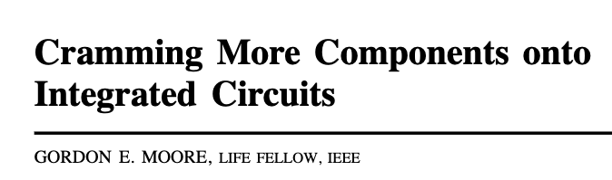
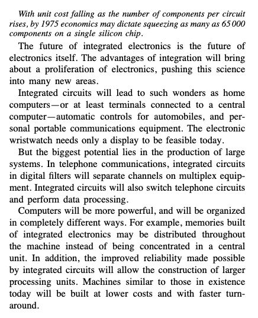
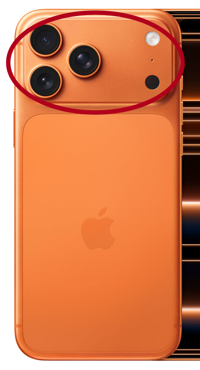

[[basierend auf einer Reihe von Artikeln in Mastodon](https://infosec.exchange/@isotopp/116963194663853346)]

# Compute-Angebot

1965 schrieb Gordon E. Moore den Artikel
["Cramming more components onto integrated circuits"](https://www.cs.utexas.edu/~fussell/courses/cs352h/papers/moore.pdf).
Darin beschreibt er die Beobachtung, die später, ungefähr ab 1975 durch Carver Mead,
als "Moore's Law" bezeichnet wurde.

Moore's Law sagt im Kern:
Alle `x` Monate verdoppelt sich die Anzahl der Komponenten in einem Prozessor, IC oder Chip,
den wir sinnvoll kostendeckend herstellen können.

Das genaue `x` ist für die Betrachtung gar nicht so wichtig.
Man findet 12, 18 oder 24 Monate als häufig zitierte Zahlen,
und Moore selbst hat über die Zeit unterschiedliche Basen verwendet.
Wichtig ist: Das war ein exponentielles Wachstum über Jahrzehnte.

Moore's Beobachtung wurde in der Halbleiterindustrie erst zur Erwartung,
dann zur Selbstverpflichtung und schließlich zur Koordination der gesamten Supply Chain.
Seit 1992 veröffentlichte die US Semiconductor Industry Association die
National Technology Roadmap for Semiconductors.
Ab 1999 wurde daraus die ITRS, also eine globale Roadmap,
in der Chiphersteller, Zulieferer und Kunden gemeinsame Ziele für Density,
Power, Interconnects und Manufacturing Capabilities koordinierten.

Wie genau die Verdopplung erreicht wurde, hat sich mehrfach geändert.
Die Tatsache, dass sich pro sinnvoll herstellbarem Chip mehr Transistoren unterbringen ließen,
blieb lange erhalten.

Das erste harte Ende war [Dennard Scaling](https://en.wikipedia.org/wiki/Dennard_scaling).
Vor ungefähr 2005 war es so:
Kleinere Transistoren brauchten weniger Spannung,
verbrauchten weniger Energie und erzeugten weniger Abwärme.
Man bekam also kleinere, schnellere und sparsamere Transistoren gleichzeitig.
Sehr bequem.

Um 2005 war das vorbei.
Die Taktfrequenzen stiegen nicht mehr sinnvoll weiter.
Stattdessen wechselte die Industrie von Single Core auf Multi Core.

Das war schmerzhaft.
Nahezu keine Software von 2005 konnte gut auf Multicore skalieren.
Es hat mehr als zehn Jahre gedauert,
bis breite Softwareentwicklung brauchbare Techniken hatte,
um den ganzen Bumms in einer CPU parallel, sinnvoll und halbwegs sicher zu verwenden.

Seitdem haben wir Performance per Watt als explizite Größe.
Vorher kam das quasi automatisch aus Dennard Scaling.
Seitdem haben wir auch Dark Silicon:
Teile eines Chips sind vorhanden,
können aber aus TDP-Gründen nicht gleichzeitig mit voller Leistung betrieben werden.
Man hat Transistoren, aber nicht genug thermisches Budget, um alle jederzeit zu benutzen.

Das zweite harte Ende kam um 2010.
Bis dahin wurden dichtere CPUs auch billiger pro Transistor.
Danach wurden die Herstellungsverfahren zwar weiter besser,
aber auch teurer.

Das führte zur Herstellerkonzentration.
Mit Intels Niedergang gibt es weltweit nur noch sehr wenige Firmen,
die Spitzenprozesse überhaupt herstellen können.
Im praktischen Sinne hängt sehr viel an TSMC.
TSMC wiederum existiert nicht als isolierte Zauberfabrik,
sondern als Knotenpunkt eines multinationalen Konsortiums aus Firmen,
Regierungen, Patenten, Maschinenbau und Supply Chain.

Seit 2015 ist der klassische ITRS-Roadmap-Prozess am Ende.
Traditionelles Moore's Law ist damit ebenfalls am Ende.

Pro Sockel bekommen wir immer noch mehr.
Aber das ist inzwischen zu einem guten Teil Packaging:
mehrere Dies in einem Package,
Chiplets, gestapelte Speicher, Spezialbeschleuniger.
Das ist technisch beeindruckend.
Es ist aber nicht mehr dieselbe ökonomische Maschine wie früher.

# Compute-Bedarf

Seit ungefähr 2010 bis 2015 ist der Compute-Bedarf im Haushalt ausentwickelt.

Selbst Videoschnitt als anspruchsvolle Haushaltsanwendung war auf einem Desktop möglich.
Mehr Compute war einem Heimanwender nicht mehr sinnvoll zu verkaufen.
Also hat man die Leistungsgewinne kleiner,
leiser und weniger leistungshungrig verpackt.

In 2026 kann man Videoschnitt auf einem Mobiltelefon machen,
mit einem Powerbudget im einstelligen Wattbereich.
E-Mail liest man nicht mehr an einem 150-Watt-Desktop mit Röhrenmonitor,
sondern auf einem Telefon, mit einem Verbrauch im Bereich von einigen hundert Milliwatt,
inklusive Netzwerk bis zum WLAN-AP oder Cell-Tower.

Der Heimmarkt ist saturiert.

Dasselbe gilt weitgehend für das Büro und große Teile der Enterprise-IT.
Nicht für HPC, Finite-Elemente-Analyse, Wettermodelle oder anderen Spezialkram.
Aber für sehr viel Large Scale Enterprise IT gilt:
2015 war das Angebot größer als der Bedarf.

Eine Analyse der Booking.com-Flottenworkload auf Instruction-Level zeigte 2018,
dass mehr als 80% des Computes Integer- oder String-Workloads waren.
"Lade Daten aus der Datenbank und setze sie in Templates ein" wird zu `memcpy`,
und `memcpy` wird zu `REP MOVSB`.
Booking war eine `REP MOVSB`-Maschine at scale.

Da war nahezu kein Bedarf an großen FPUs, SIMD-Instruktionen oder anderen Flächenfressern,
die auf höherwertigen Xeons viel Platz wegnehmen und viel Geld kosten.
Booking hätte von mehr Speicherbandbreite mehr profitiert als von noch tolleren CPUs.

Booking ist ein Webshop.
Bei einem sinnvoll konstruierten Webshop sieht das nicht grundsätzlich anders aus.

Ab 2015 ist auch viel Enterprise-IT im Compute-Bedarf ausentwickelt und abgedeckt.

Gleichzeitig wird der Druck auf Chiphersteller größer,
Anwendungen für all die Transistoren zu finden.
Die Fläche ist da.
Die Roadmap will weiter.
Also muss irgendetwas diese Transistoren fressen.

Wer am Ende der ITRS-Zeit in Roadmap-Meetings mit HPE, Dell und Intel saß,
kannte die Tonlage:
mehr FPU, AES- und RSA-Beschleuniger, FPGA-Accelerators,
Sonderfunktionen, Spezial-SKUs.
Kunde, sag uns bitte, wozu Du diese ganzen Dinger brauchen kannst.

Auf dem Heimanwendermarkt passiert dasselbe:
Desktop-CPUs mit 6, 12 oder 48 Cores,
3D V-Cache und anderem Zeug,
das außer Gamern und Spezialfällen kaum jemand braucht.
Irgendwie muss die Fläche voll werden.

Apple hat das Problem anders gelesen.
Man baut ein SoC und zieht alles auf den einen zentralen Die:
CPU, GPU, RAM-Anbindung, NVMe-Controller und möglichst viel sonstige Peripherie.
Neben der CPU sitzen nur noch wenige tief integrierte Bausteine.

*Aktuelles iPhone. Nur der rot umrandete Bereich ist das Telefon, der Rest ist Batterie. Und im rot umrandeten Bereich sitzen im Grunde nur 2 Chips: Der SoC von Apple, ein A19 und ein SoC von Qualcomm für den ganzen Funk- und Analogmodem-Kram. Den will Apple gerne weg haben und durch was eigenes ersetzen, einmal weil sie Qualcomm nicht gerne Geld geben, und zum anderen weil sie den Kram nur dann mit dem A19 integrieren können.*

Wenn ihr also glaubt,
dass ihr euren 2015er Laptop in 2026 noch benutzen könnt,
dann liegt das nicht daran, dass ihr besonders genügsam seid.
Es liegt daran, dass der Compute-Bedarf im Haushalt seit ungefähr 2015 saturiert ist.

Schlecht für eine Industrie,
die an dreijährige Replacement-Zyklen gewöhnt war.

# Erfundener Bedarf

Blockchain, Metaverse und AI kann man als Reihe erfundener Compute-Bedarfe lesen.

Das sind Wege,
mehr Nachfrage nach Compute zu synthetisieren,
um das Investorenmärchen von IT als ewiger Wachstumsbranche am Leben zu halten.
Nicht Mature Market, sondern Growth.
Nicht Dividende, sondern Aktienkursphantasie.
Nicht solide Firma, sondern Rakete.

Bei Blockchain und Metaverse sind die Blasen schnell geplatzt.
Das ist schlecht,
wenn man seine Silicon-Valley-Aktie gern als Wachstumsaktie halten möchte
und seine Entwickler-Divas mit Aktienpaketen bezahlen will.
Bei einem Mature Enterprise funktioniert das schlechter,
weil die Aktie nicht mehr automatisch explodiert.

Bei AI ist die Blase noch nicht geplatzt.
Aber die Financials darunter sind kaputt.
Da sind Ringfinanzierungen,
absurde Capex-Programme,
versprochene Effizienzgewinne,
die sich in dieser Größenordnung nicht realisieren lassen,
und ein Strom- und Hardwarebedarf,
der eher nach Schwerindustrie aussieht als nach Software-Marge.

Seit ungefähr 2015 hat die IT also eine Kapitalertragskrise.

Es gibt wortwörtlich Billionen an USD und EUR,
die Investitionsgelegenheiten brauchen,
damit sie weiter Kapitalertrag bringen.
Die Default-Antwort der letzten vierzig Jahre war "IT".
Aber IT als breiter Markt ist saturiert.

Das ist die Verzweiflung,
die man riechen kann,
wenn man in diesem Markt gearbeitet hat.

# Warum AI so gut passt

Für Investoren ist AI ein maßgeschneidertes Versprechen.

- Es parallelisiert sich hervorragend. Matrizenmultiplikation ist wie dafür gemacht.
- Qualität wird mit größeren Modellen besser. Mehr ist mehr.
- Riesenmodelle lassen sich zentral als AIaaS anbieten. Monatliche Mieterlöse, sehr schön.
- Es gibt kein klar definiertes "fertig".
- Die Ersetzung des Menschen als Arbeitskraft klingt nach unendlichem Markt.
- Endlich gibt es eine Anwendung für absurde Transistorbudgets.

Für viele Firmen ist AI zum letzten Investment geworden,
das sie je machen müssen.
Alle anderen Projekte werden minimiert,
eingestellt oder abgestoßen,
um mehr AI finanzieren zu können.

Oracle ist der deutlichste Fall:
Die Firma ist komplett von einem Erfolg der AI-Blase abhängig.
Wenn diese Blase platzt,
platzt Oracle mit.

Microsoft opfert sichtbar Teile des über Jahre konsolidierten Gaming-Business der AI.
Xbox, Game Pass und Studios werden sukzessive umgebaut,
abgewickelt oder ausgehöhlt.
Gaming wird sich davon nicht einfach erholen.
AAA-Gaming in der alten Form ist vorbei.

AI hat klaren Wert.
AI kann Effizienz steigern.
AI ist kein reiner Unsinn.

Aber AI kann diese absurden Investments nicht in dem Umfang zurückverdienen,
in dem sie gerade getätigt werden.
Das wird ein Blutbad.
Und es wird nicht auf IT-Werte beschränkt bleiben,
sondern auch Investmentfonds und Rentenfonds treffen.

Schade, wenn man eine Aktienrente hat.

# Kein Burggraben

AI hat keinen Burggraben.

Die Technik ist derzeit absurd ineffizient.
Wenn es gelingt,
sie um Faktor 100 effizienter zu machen,
dann ist das nur sieben Verdopplungen oder etwas mehr als drei Vervierfachungen.
Was heute auf einem 8x-Nvidia-Cluster läuft,
läuft dann auf einem großen Laptop.

Damit ist AIaaS als dauerhaftes Monopolmodell tot.

Es gibt auch kein US-Silicon-Valley-Monopol auf AI.
Chinesische Open-Weights-Modelle sind tödliche Raketen auf westliche Überinvestments.
Sie können die Blase platzen lassen,
weil sie genau den Burggraben zerstören,
den Investoren gerade kaufen zu glauben.

Das ist die Lage Mitte 2026.

# Gaming als Kollateralschaden

Gaming ist die gleiche Frage wie der Servermarkt,
nur marginal anders.

AAA-Gaming mit Windows-Kröte,
Nvidia-Grafikkarte und Spielen mit dreistelligem Millionenbudget ist eine Nische geworden.
Einigen wenigen PC-Master-Race-Ballermännern stehen Millionen Casual Gamer mit Mobiltelefonen gegenüber.
Der mobile Markt macht mehr und konstanteren Umsatz,
bei weniger Entwicklungsrisiko.

Unabhängig davon,
dass AI gerade Hardware auffrisst,
war PC-Gaming also schon angeschossen.
Corona hat kurz geholfen:
Mehr Spielstunden,
mehr Nachfrage,
mehr Hardwarekäufe.
Der Markt hat das als Strukturtrend gelesen und überinvestiert.
War aber ein Einmaleffekt.

Genau in die Korrektur kam dann der AI-Boom:
RAM wird teurer,
NVMe wird teurer,
GPUs werden für AI priorisiert,
und die Hersteller strangulieren den Enthusiast-PC-Markt,
weil AI-Chips höhere Margen versprechen.

Die Folgen sind sichtbar:

- [Nvidia verschiebt neue Gaming-GPUs wegen RAM-Knappheit](https://www.tomsguide.com/computing/nvidia-wont-release-new-gaming-gpu-for-first-year-in-three-decades-due-to-ram-shortage-and-its-also-slashing-rtx-50-production).
- [Motherboard-Verkäufe brechen um mehr als 25% ein](https://www.tomshardware.com/pc-components/motherboards/motherboard-sales-collapse-by-more-than-25-percent-as-chipmakers-strangle-enthusiast-pc-market-to-build-more-ai-chips-asus-projected-to-sell-5-million-fewer-boards-in-2025-gigabyte-msi-and-asrock-also-expected-to-see-reduced-sales-numbers).
- [RAM-Preise steigen massiv](https://www.tomshardware.com/pc-components/ram/ram-price-index-2026-lowest-price-on-ddr5-and-ddr4-memory-of-all-capacities).
- [NVMe-Preise haben sich verdreifacht](https://datastorage.com/articles/the-nvme-shortage-nobody-budgeted-for-why-storage-prices-tripled-and-what-to-do-before-2027/).

Das zwingt den PC-Gaming-Markt zur Kontraktion.
Es wird Studios in die Pleite treiben.
Selbst wenn es jetzt sofort besser würde,
ist schon viel kaputt.

In fünf Jahren ist AAA/PC-Gaming in dieser Form vorbei.
Es kommt auch nicht einfach zurück.

# Servermarkt

Was hat das mit Servern zu tun?

Sehr viel.

2018 stellte Intel ungefähr zwei Millionen Xeon-Server-CPUs her.
AMD war zu diesem Zeitpunkt kaum noch auf dem Spielfeld.
Von diesen zwei Millionen gingen etwa 85% an zehn Firmen.
Mehr als 45% gingen an einen einzigen Kunden.

Die CPUs für diesen einen Kunden waren Spezial-SKUs mit Eigenschaften,
die normale Xeons zu diesem Zeitpunkt nicht hatten.
Einige davon fanden später mit Jahren Verzögerung ihren Weg in normale Produkte.

Eine Firma mit so einer Kundenstruktur ist nicht frei.
Sie bekommt Entwicklungsrichtung und Pricing von wenigen Großkunden diktiert.
Das ist im Kern krank.

Gleichzeitig ist Intel der letzte große CPU-Hersteller,[^samsung]
der nicht TSMC ist.
Auch nicht gut.

Die ganze IT-Supply-Chain hängt an sehr wenigen Läden.
Das ist kein robuster Markt.
Das ist ein Klumpenrisiko mit PowerPoint.

[^samsung]: Technisch gesehen gibt es noch Samsung, aber die machen keine Server- oder Desktop CPUs, sondern nur ARM für Mobilegeräte, und Speicher – aber das sind ganz andere Prozesse.

# Fazit

Der IT-Markt,
mit dem viele von uns groß geworden sind,
ist seit ungefähr 2015 vorbei.

Was wir gerade beobachten,
ist eine Reihe von Blasen,
getrieben von Investorenverzweiflung.
Da ist sehr viel Kapital,
das nicht weiß wohin,
aber Erträge liefern muss.
Ein Teil gehört Einzelinvestoren.
Ein anderer Teil steckt in Fonds,
mit denen eine Generation Boomer ihren Ruhestand finanzieren will.

Genau in dem Moment geht der alte Motor aus.

Diese Krise ist technisch und finanziell sichtbar.
Alle gucken stur daran vorbei,
weil die naheliegenden Schlussfolgerungen politisch unangenehm sind.

Moore's Law war nicht nur eine technische Beobachtung.
Es war vierzig Jahre lang eine industrielle Wachstumsmaschine.
Diese Maschine läuft nicht mehr wie früher.

Die AI-Blase ist der Versuch,
noch einmal einen Compute-Hunger zu erfinden,
der groß genug ist,
um die alte Wachstumsstory weiterzuerzählen.

AI wird bleiben.
Die Blase nicht.

# Quellen

- [Mastodon-Thread von Kristian Köhntopp](https://infosec.exchange/@isotopp/116963194663853346)
- [Gordon E. Moore: Cramming more components onto integrated circuits](https://www.cs.utexas.edu/~fussell/courses/cs352h/papers/moore.pdf)
- [Dennard Scaling](https://en.wikipedia.org/wiki/Dennard_scaling)
- [International Technology Roadmap for Semiconductors](https://en.wikipedia.org/wiki/International_Technology_Roadmap_for_Semiconductors)
- [Tom's Guide: Nvidia won't release new gaming GPU for first year in three decades](https://www.tomsguide.com/computing/nvidia-wont-release-new-gaming-gpu-for-first-year-in-three-decades-due-to-ram-shortage-and-its-also-slashing-rtx-50-production)
- [Tom's Hardware: Motherboard sales collapse by more than 25%](https://www.tomshardware.com/pc-components/motherboards/motherboard-sales-collapse-by-more-than-25-percent-as-chipmakers-strangle-enthusiast-pc-market-to-build-more-ai-chips-asus-projected-to-sell-5-million-fewer-boards-in-2025-gigabyte-msi-and-asrock-also-expected-to-see-reduced-sales-numbers)
- [Tom's Hardware: RAM Price Index 2026](https://www.tomshardware.com/pc-components/ram/ram-price-index-2026-lowest-price-on-ddr5-and-ddr4-memory-of-all-capacities)
- [DataStorage.com: The NVMe Shortage Nobody Budgeted For](https://datastorage.com/articles/the-nvme-shortage-nobody-budgeted-for-why-storage-prices-tripled-and-what-to-do-before-2027/)
