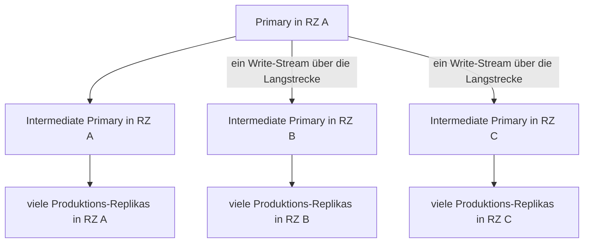
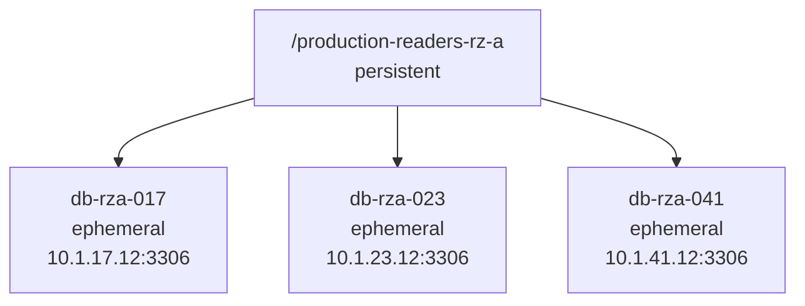
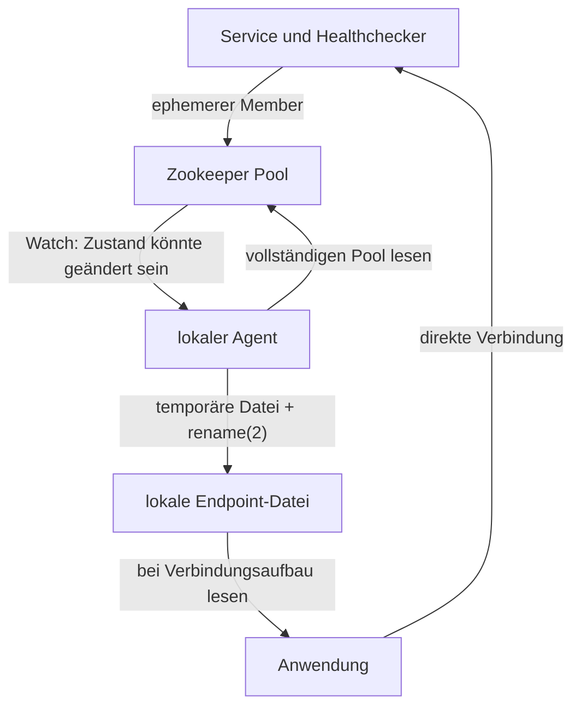

Ein anpaßbares Pattern für Service Discovery, hier am Beispiel MySQL – aber es kann im Grunde für jede andere Flotte von Servern verwendet werden. Ein Dienst veröffentlicht seine Bereitschaft in Zookeeper. Ein lokaler Agent beobachtet diesen Zustand und materialisiert daraus eine Datei. Anwendungen lesen die Datei und müssen Zookeeper weder kennen noch erreichen können; sie arbeiten mit der Datei und müssen diese bei Änderungen neu lesen.

Das Pattern stammt aus dem Betrieb großer MySQL-Installationen bei Booking.com. Es funktioniert genauso für andere Datenbanken, Caches, Message-Broker oder beliebige Pools gleichartiger Dienste.

Der wichtige Punkt ist die Trennung der Aufgaben:

- Zookeeper ist die konsistente Control Plane für die Mitgliedschaft im Pool.
- Eine lokale Datei ist die möglicherweise kurz veraltete, aber hoch   verfügbare Sicht der Data Plane.
- Der Übergang zwischen beiden ist ein Reconciliation Loop mit Eventual   Convergence.

# Woher das Problem kam

Booking.com betrieb MySQL in Replikationsbäumen über drei Rechenzentren. An
der Wurzel stand ein Primary. In jedem Rechenzentrum übernahm ein Intermediate
Primary die Verteilung der Writes an lokale Leaf Replicas.



Auf diese Weise gingen die Writes nur einmal pro entferntem Rechenzentrum über eine Long-Distance-Verbindung. Der dortige Intermediate Primary verteilte sie lokal weiter. Die Zahl der Leaf Replicas vergrößerte daher nicht die Zahl der WAN-Verbindungen.

Anwendungen schrieben auf den Primary und lasen von lokalen Leaf Replicas. Nicht jede Replica war dafür jederzeit geeignet. Eine Produktions-Replika mußte unter anderem erreichbar sein, laufende Replikation und akzeptablen Replikationsverzug haben und durfte sich nicht in Wartung befinden.

Die Menge geeigneter Server war dynamisch. Neue Maschinen kamen hinzu, alte wurden entfernt, Replikas fielen zurück oder wurden aus einem Pool genommen. Die Clients brauchten also nicht die Liste aller MySQL-Server, sondern die Liste der jetzt für ihren Zweck geeigneten lokalen Endpoints.

Eine ausführlichere Beschreibung der MySQL-Topologie steht in [That's a lot of databases]().

# Drei Generationen Discovery

Die Discovery durchlief drei Generationen: einen Layer-2-Load-Balancer, DNS und schließlich Zookeeper. Diese Alternativen waren bereits Teil einer [System-Design-Frage zu MySQL bei Booking.com](). Hier geht es um die dort nur angerissene Zookeeper-Variante.

## Layer 2 paßte nicht mehr zum Netz

Der erste Load-Balancer arbeitete auf Layer 2. Das war brauchbar, solange das Netz die dafür benötigten gemeinsamen Broadcast-Domains bereitstellte.

Mit dem Wechsel auf ein geroutetes Leaf-and-Spine-Fabric war diese Annahme nicht mehr gegeben. Virtuelle Adressen mit ARP, VRRP oder ähnlichen Verfahren lassen sich nicht einfach über die Grenzen der L2-Domains verschieben. Man kann um die neue Netzstruktur herum wieder L2-Inseln und zusätzliche Komponenten bauen, aber dann arbeitet die Service Discovery gegen die Netzarchitektur statt mit ihr.

## DNS konvergierte schlecht kontrollierbar

DNS beseitigte die Abhängigkeit von einer gemeinsamen L2-Domain, brachte aber eine andere Klasse von Problemen:

- Autoritative Updates und die Sicht der Clients sind zwei verschiedene Vorgänge.
- Resolver und Anwendungen cachen mit unterschiedlichen Regeln.
- Manche Clients lösen einen Namen nur beim Start oder beim Aufbau eines Connection Pools auf.
- Positive und negative Caches reagieren unterschiedlich auf Änderungen.
- Das schnelle und verläßliche Entfernen eines ungeeigneten Servers ist schwer.

Auch DNS konvergiert schließlich. Zeitpunkt und Zwischenzustände lassen sich bei schnell veränderlichen Server-Pools jedoch schlecht kontrollieren.

Daher ist man zu einem Zeitpunkt auf Zookeeper umgestiegen, um Server zu registrieren und um Clients zu informieren, wo welche Server erreichbar sind.

## Zookeeper-Grundlagen

Zookeeper speichert Daten in einem hierarchischen Baum. Ein Knoten in diesem Baum heißt Znode. Anders als bei einem Unix-Dateisystem kann ein Znode gleichzeitig Daten enthalten und Kinder haben. Der Pfad `/services/search` kann also Konfiguration enthalten und zugleich Elternknoten für einzelne Search-Server sein.

Znodes können persistent oder ephemeral sein:

- Ein persistenter Znode bleibt bestehen, bis ihn jemand explizit löscht.
- Ein ephemerer Znode gehört einer Zookeeper-Session. Er verschwindet, wenn diese Session endet oder abläuft.

Eine Session ist nicht dasselbe wie eine einzelne TCP-Verbindung. Ein Client kann die Verbindung zu einem Mitglied des Zookeeper-Ensembles verlieren und sich mit einem anderen verbinden, ohne seine Session zu verlieren. Während einer kurzen Unterbrechung bleiben seine ephemeren Znodes daher bestehen.

Erst wenn der Client nicht innerhalb des ausgehandelten Session-Timeouts zurückkehrt, läuft die Session ab. Zookeeper entfernt dann deren ephemere Znodes. Kommt der Client später zurück, beginnt er eine neue Session und muß seine ephemeren Znodes neu anlegen.

Ein Client kann außerdem Watches auf Znodes setzen. Ein Watch ist eine einmalige Benachrichtigung darüber, daß sich der beobachtete Zustand geändert haben könnte. Danach muß der Client den Watch erneut installieren. Die Benachrichtigung ist kein vollständiger Diff und keine dauerhaft gespeicherte Event-History, sondern nur eine Mitteiling, daß sich die Dinge geändert haben und die Znodes unter dem Watch neu gelesen werden müssen. Mehrere Änderungen können zu einer einzigen relevanten Benachrichtigung zusammenfallen ("Debouncing").

Diese vier Eigenschaften ergeben zusammen das Discovery-Primitive:

- Der Znode-Baum organisiert Services und Pools.
- Persistente Znodes definieren deren Struktur.
- Ephemere Znodes repräsentieren die an eine Session gebundenen Mitglieder.
- Watches invalidieren die bei den Consumers gespeicherte Sicht.

## Zookeeper machte Membership explizit

In Zookeeper konnte jeder Pool als Pfad und jeder geeignete Server als dessen Kind dargestellt werden. Änderungen wurden damit explizite Zustandsänderungen statt indirekte Folgen von DNS-Caches.



Der Pool-Knoten ist persistent. Die Member sind ephemeral und gehören jeweils
einer Zookeeper-Session. Endet die Session, entfernt Zookeeper die zugehörigen
Member automatisch.

Auf einem MySQL-Server zum Beispiel läuft ein Healthchecker neben dem `mysqld`, verbindet sich mit diesem und entscheidet, ob dieser Dienst bereit ist.
Ist er bereit, erzeugt der Healthchecker den ephemeren Knoten. Ist er nicht
mehr geeignet, entfernt er ihn oder beendet seine Session.

Ein ephemerer Knoten ist dabei ein Healthcheck-Resultat, aber keine Garantie. Er bedeutet:

> Der Besitzer dieser Zookeeper-Session lebt und hält den Endpoint weiterhin
> für geeignet.

Ein abgestürzter Server bleibt daher bis zum Ablauf der Session sichtbar. Ein
hängender Healthchecker kann einen ungeeigneten Server weiterhin
veröffentlichen. Der Client muß Verbindungsfehler trotz Service Discovery
behandeln können.

# Watches sind keine Events

Zookeeper-Watches sind keine zuverlässige Ereignisaufzeichnung. Ein Watch
bedeutet nicht: „Verarbeite genau diese Änderung.“ Er bedeutet:

> Der beobachtete Zustand könnte sich geändert haben. Lies ihn neu.

Das ist für Discovery ideal. Der Client interessiert sich nicht für jede
Zwischenstufe einer Änderung:

```text
db17 hinzugefügt
db23 entfernt
db17 geändert
db41 hinzugefügt
```

Er braucht nur den Zustand, gegen den er schließlich konvergieren soll:

```text
Der Pool besteht jetzt aus db17 und db41.
```

Der Consumer installiert seine Watches erneut und liest den vollständigen
Pool. Wird währenddessen wieder eine Änderung signalisiert, beginnt er den
Vorgang noch einmal. Nach einem Verbindungsabbruch macht er ebenfalls einen
vollständigen Rescan.

Verpaßte Zwischenzustände sind bedeutungslos. Es muß nur irgendwann wieder
eine vollständige Reconciliation stattfinden. Das System garantiert Eventual
Convergence, nicht die Beobachtung jedes Updates.



# Änderungen dürfen zusammenfallen

Bei einer größeren Wartungsaktion können viele Pool-Änderungen kurz
hintereinander auftreten. Es ist nicht sinnvoll, jeden Zwischenzustand auf
alle Clients zu verteilen.

Der Agent wartet nach einer Invalidierung eine zufällige Zeit bis zu einem
konfigurierten Maximum. Weitere Änderungen in dieser Zeit werden
zusammengefaßt. Nach dem Ende des Änderungsbursts erzeugt der Agent eine neue
vollständige Sicht.

Das hat zwei erwünschte Effekte:

- Viele Änderungen erzeugen nur wenige neue Dateien.
- Nicht alle Agents lesen gleichzeitig denselben Pool aus Zookeeper.

Der zufällige Delay begrenzt nicht die Zeit seit der ersten Änderung. Bei
andauernden Änderungen kann die Materialisierung weiter aufgeschoben werden.
Das ist hier akzeptabel: Eine konsistente Sicht nach Ende des Bursts ist
wichtiger als die Wiedergabe aller Zwischenzustände.

# Die Datei ist die lokale materialisierte Sicht

Der Agent schreibt für den Pool eine einfache Datei:

```text
10.1.17.12:3306 # db-rza-017
10.1.23.12:3306 # db-rza-023
10.1.41.12:3306 # db-rza-041
```

Das Format ist nicht wesentlich. Es kann Text, JSON oder ein Format für eine
bestimmte Clientbibliothek sein. Wesentlich ist, daß die Datei eine vollständige
materialisierte Sicht darstellt.

Die Anwendung muß dadurch keine Zookeeper-Bibliothek enthalten. Sie braucht
keine Sessions zu verwalten, keine Watches neu zu installieren und keine
Reconnects zu implementieren. Beim Aufbau einer Verbindung liest sie die
lokale Datei, wählt einen passenden (zufälligen!) Endpoint und verbindet sich direkt.

Die Datei ist gleichzeitig ein Read Cache. Ein Verbindungsaufbau erzeugt
keinen Read im Zookeeper-Cluster. Der Agent liest nur beim Start, nach einer
Invalidierung und nach einem Reconnect. Ein Agent pro Host kann dieselbe Sicht
für viele lokale Prozesse bereitstellen.

# Die Datei wird atomar ersetzt

Eine Serverliste darf beim Lesen nicht halb alt und halb neu sein. Der Agent
schreibt den neuen Inhalt deshalb nicht direkt in die Zieldatei:

```text
endpoints.$pid schreiben
endpoints.$pid schließen
rename("endpoints.$pid", "endpoints")
```

Die temporäre Datei liegt im selben Verzeichnis und damit auf demselben
Filesystem wie das Ziel. `rename(2)` ersetzt dann den Verzeichniseintrag in
einer atomaren Operation. Ein Reader sieht entweder die alte oder die neue
vollständige Datei, niemals eine teilweise geschriebene Version.

Das Verfahren wird ausführlicher in
[But is it atomic?]()
diskutiert.

Reader müssen die Datei für eine neue Sicht erneut öffnen. Ein `tail -f` kann
am alten Inode hängenbleiben, nachdem der Name bereits auf die neue Datei
zeigt. Darum verwenden wir für solche Dateien immer `tail -F`: Es folgt dem
Dateinamen, erkennt den Austausch und öffnet die neue Datei.

Für diese Anwendung ist atomare Sichtbarkeit wichtig, nicht garantierte
Persistenz nach einem Stromausfall. Die Datei ist ein rekonstruierbarer Cache,
kein autoritativer Datenspeicher. Zusätzliche `fsync()`-Operationen lösen hier
kein relevantes Discovery-Problem.

# Loss of Control ist nicht Loss of Service

Zookeeper ist ein Konsenssystem. Wenn es kein Quorum herstellen kann, darf es
vorübergehend lieber keine Antwort geben als eine möglicherweise falsche. Das
ist für die Control Plane die richtige Entscheidung, darf aber nicht jeden
Verbindungsaufbau in der Data Plane blockieren.

Der Agent behält bei einem Zookeeper-Ausfall die zuletzt vollständig
geschriebene Datei. Bestehende und neue Prozesse können weiter Endpoints
auswählen. Nach der Rückkehr von Zookeeper liest der Agent den gesamten Pool
neu und konvergiert gegen den aktuellen Zustand.

Die Materialisierung erhält also die Verfügbarkeit der Data Plane auf Kosten
der Aktualität:

| Eigenschaft   | Zookeeper                          |  Lokale Datei                            |
|---------------|------------------------------------|------------------------------------------|
| Zustand       | aktuell und koordiniert            | möglicherweise veraltet                  |
| Verfügbarkeit | bei fehlendem Quorum eingeschränkt | lokal weiter lesbar                      |
| Zugriff       | Netzwerk und Clientbibliothek      | lokaler Dateizugriff                     |
| Änderung      | Watch als Invalidierung            | atomarer Austausch                       |
| Last          | Read bei Reconciliation            | beliebig viele lokale Reads              |
| Aufgabe       | Control Plane                      | materialisierte Data-Plane-Konfiguration |

Die Datei garantiert während eines Ausfalls nicht, daß jeder gelistete Server
noch erreichbar ist. Sie garantiert eine vollständige letzte Auswahl. Der
Client probiert beim Verbindungsfehler einen anderen Endpoint. Aus einem
Ausfall der Control Plane wird dadurch Staleness statt eines unmittelbaren
Ausfalls der Data Plane.

Dieses Verhältnis zwischen Control Plane und Data Plane ist aus zwei anderen
Perspektiven in [Service Mesh]()
und [Konsenssysteme]()
beschrieben.

# Was das Pattern garantiert

Das System gibt drei nützliche Garantien:

- Ein Reader sieht eine vollständige alte oder neue Endpoint-Datei.
- Der letzte bekannte Zustand bleibt ohne verfügbare Control Plane nutzbar.
- Nach der Rückkehr der Control Plane konvergiert der Agent gegen den aktuellen
  Pool.

Es gibt bewußt keine Garantie für Folgendes:

- Der Consumer sieht jeden Zwischenzustand.
- Die lokale Datei ist während eines Ausfalls aktuell.
- Ein gelisteter Endpoint ist beim nächsten Connect tatsächlich erreichbar.
- Alle Consumers wechseln gleichzeitig auf denselben neuen Zustand.

Diese Einschränkungen sind keine Fehler im Design. Sie sind die Folge einer
bewußten Entscheidung: Service Discovery muß für diesen Anwendungsfall schnell
und betriebssicher konvergieren, aber sie muß kein synchrones Protokoll im
Request-Pfad sein.

# Das allgemeine Pattern

MySQL war der konkrete Anwendungsfall, ist aber keine Voraussetzung. Das
Pattern paßt, wenn folgende Bedingungen gelten:

- Es gibt dynamische Pools gleichartiger Endpoints.
- Ein lokaler Agent kann den zentralen Zustand beobachten.
- Consumers können mit einer vollständigen, kurzzeitig veralteten Sicht leben.
- Consumers behandeln Fehler einzelner Endpoints ohnehin selbst.
- Der zentrale Discovery-Dienst soll nicht im Request- oder Connect-Pfad
  liegen.

Eine ausführbare Python-Demonstration steht im Repository
[zkdemo](https://github.com/isotopp/zkdemo). Sie registriert ephemere Server,
beobachtet Pool-Änderungen, faßt Änderungsbursts zusammen und ersetzt die
lokale Endpoint-Datei atomar.

Ich behaupte nicht, daß eine Datei moderner als DNS oder ein Load-Balancer
wäre. Aber wir sehen hier eine saubere Trennung: Zookeeper entscheidet konsistent
über Membership. Der Agent materialisiert diese Entscheidung lokal. Die
Anwendung arbeitet mit dem letzten vollständigen Ergebnis weiter, auch wenn
die Control Plane gerade nicht erreichbar ist.
