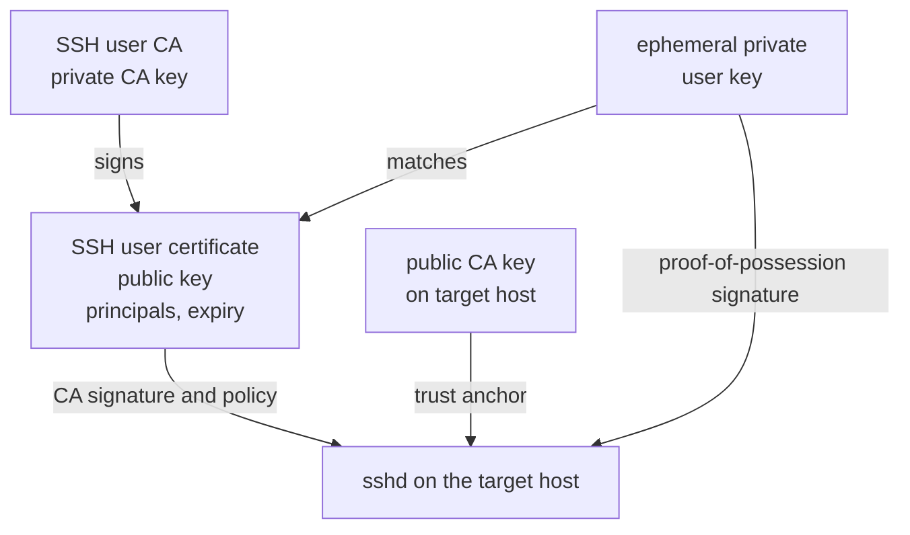
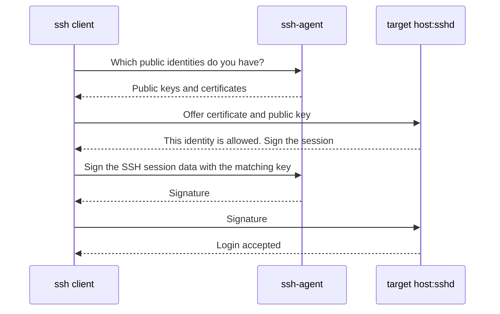
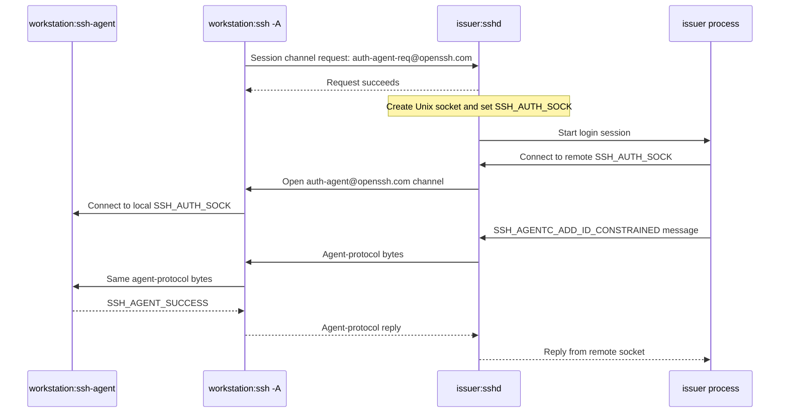
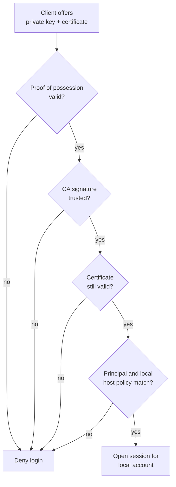

The SSH keys living in your `$HOME/.ssh` are practically immortal. You create `id_ed25519` once, copy its public half to a target host and insert it into `authorized_keys`, and retain access for years. The private key lives on a laptop, in backups, and often on machines which have long since stopped being used.

That is convenient, but it makes for an unpleasant authorization model. When someone leaves the company or a team, every relevant host must be changed. If a laptop is lost, someone must know where its key is authorized. And `authorized_keys` becomes a distributed, hard-to-audit identity database.

A better separation is to stop having hosts trust every individual user key. Instead, they trust a small number of SSH certificate authorities (CAs). A CA issues an SSH certificate for a fresh, short-lived key. The certificate might be valid for only 25 hours. Its private key lives solely in `ssh-agent` and then disappears. It is never materialized on a developer's laptop disk.

This is not a new SSH protocol. OpenSSH has supported it for a long time (since OpenSSH 8.8). The important part is understanding what the key, certificate, agent, and `sshd` each do.

## Three things which are not the same

Classic public-key authentication has one key pair:

- The **private key** stays with the user and produces signatures.
- The **public key** lives in `authorized_keys` on the target host.

SSH certificates add a third object: the **user certificate**. It contains a public user key, a list of principals, a validity period, a serial number, and optional restrictions. An SSH CA signs this package with its private CA key.

The certificate is not secret. Nor is it a replacement for the private key. It merely says: “The holder of *this* public key may act as these principals between these times.” During login, the client must still prove that it holds the matching private key.



The central private CA key is especially sensitive: anyone who controls it can issue certificates. The temporary private user key is shorter lived, but it is still a real login secret for as long as it remains valid. It belongs neither in a Git repository nor a shell history nor permanently in `~/.ssh` – and it usually isn't, because we'll put it into a developers agent, which will not let to go to a disk.

## What `ssh-agent` actually does

`ssh-agent` is a process on the workstation. It keeps private keys in memory and exposes a Unix socket. The path to this socket is in `SSH_AUTH_SOCK`. Programs such as `ssh`, `scp`, and `git` talk to the agent instead of reading the key file themselves.

In this setup, the SSH client is never handed the private key. Instead it asks the agent: “Here are the authentication-protocol data; can you sign them with key X?” The agent returns the signature. This permits local passphrase prompts, hardware-backed keys, or a fixed lifetime without every SSH client needing to understand those details.



Normally, one loads a long-lived key into the agent with `ssh-add`.

In the model with ephemeral keys, a new key is generated by the remote issuer and tunneled into the agent through the local ssh client, together with its matching certificate. This ephemeral key and cert are given a lifetime.

`ssh-add -l` will then show both: an `ED25519` entry and an `ED25519-CERT` entry.

```
$ ssh-add -l
...
256 SHA256:RquDquM94ouXwDMCo4uNdWiuGz1nwEzvX7Qmwev80QI ski:kris:SHA256:w6aQ5C02+aexz6g5eULg7TSO1piXyAD90+fy259e5fg:13861769879096579493 (ED25519-CERT)
256 SHA256:RquDquM94ouXwDMCo4uNdWiuGz1nwEzvX7Qmwev80QI ski:kris:SHA256:w6aQ5C02+aexz6g5eULg7TSO1piXyAD90+fy259e5fg:13861769879096579493 (ED25519)
```

These are not two independent credentials: the first is the private key, the second is its signed public certificate.

When the lifetime expires, the agent removes the identity. The private key is then no longer present. It can also be removed explicitly; `ssh-add -D` is often too broad because it removes every identity from the agent.

## How the key reaches the agent

In our setup, we have the "issuer", a server into which the user logs at the beginning of the work day.

The issuer verifies the user password and a TOTP 2FA challenge, then creates a fresh Ed25519 key pair with a 25h lifetime, the users user-principal and the set of groups the user is in, plus the capabilities of the key (agent forwarding, port forwarding and so on). It signs the public half with the user CA, and puts both into the workstation's agent. It then closes the connection.

For the issuer to reach the local agent, the agent is deliberately forwarded to this one host:

```bash
ssh -A kris@ssh.example.com
```

This is what happens at the protocol level:

1. The client sends an `auth-agent-req@openssh.com` request on the SSH session    channel. This asks the remote `sshd` to make the forwarded agent available    to this login session.
2. `sshd` creates a Unix-domain listening socket owned by the logged-in user,    sets `SSH_AUTH_SOCK` in that user's session environment, and gives the    process restrictive access to the socket.
3. When a process on the issuer connects to that socket, `sshd` opens an    `auth-agent@openssh.com` channel back to the client. It does not send a    private key and it does not create a second agent on the server.
4. The client connects to its local `SSH_AUTH_SOCK` and copies the byte stream    between that socket and the `auth-agent@openssh.com` channel.

The result is a short-lived proxy. To an issuer process, the socket named by `SSH_AUTH_SOCK` looks like an ordinary local OpenSSH agent socket. The real agent, and the private keys already stored in it, stay on the workstation.

An agent socket transports the SSH agent protocol, not SSH packets. Individual messages are length-prefixed and start with a request or reply type. In this case, the issuer uses an add-identity request — normally the constrained form, `SSH_AGENTC_ADD_ID_CONSTRAINED` — containing the newly generated private key, the certificate associated with its public half, and a lifetime constraint. The exact message bytes cross the remote socket, the SSH channel, and the local socket before reaching the local agent unchanged. The reply follows the same route in reverse.



The channel is opened for each connection to the remote socket. It is a stream proxy, so an issuer can first request identities, then request signatures, or add an identity. The forwarded connection ends when the socket connection or SSH session ends; the credential loaded into the local agent survives only for the lifetime set in the add-identity request.

This pattern has an important trust assumption: agent forwarding does not belong on arbitrary servers. Whoever may use a forwarded agent can request login signatures from its keys. In this case, the issuer may also add a new identity to the agent. That is the intended effect, but it is justifiable only for a particularly trusted, reviewed issuer.

The alternative — having the issuer return a private key as a file — is worse: it produces files, backups, and copies. Agent injection is no magic, but it limits the key to memory and a defined lifetime.

## What the production host verifies

On a conventional host, an entry in `~/.ssh/authorized_keys` means that one public key may log in as one local Unix account. Certificates move the trust anchor to the CA key:

```text
TrustedUserCAKeys /etc/ssh/user-ca.pub
```

`sshd` can now verify an offered user certificate by itself:

1. Is it really a user certificate, and does its public key match the key now    proving possession?
2. Is the signature valid under a configured CA key?
3. Does the local clock fall between `valid_after` and `valid_before`?
4. Does one of the certificate principals match the requested local login name    or the local principal policy?
5. Do critical options or a revocation list prevent login?

Cryptography therefore does not answer the whole question, “May Kris use this host?” It answers only: “A trusted CA issued this certificate for this key and these claims.” The host policy then decides whether any of those claims is sufficient here.



The local policy can be simple: the `kris` principal may use the `kris` Unix account. It may also use groups as principals, such as `group:prod`. An `AuthorizedPrincipalsCommand` can then compare a certificate's signed group against a local, root-protected policy to decide whether that group grants access on this host. The host need not query the issuer, LDAP, Okta, or any other identity service.

The `AuthorizedPrincipalsCommand` does not need to run as `root` or the `ssh` user, and in fact it should not. It also does not need to own any files at all, so it can't overwrite anything. All communication is through pipelines and command line parameters.

That is operationally useful. The production host needs only the public CA key and its local policy. There may even deliberately be no route from the production network to the issuer. The user carries their fresh, signed certificate across the firewall.

## Short lifetime is the revocation strategy

A certificate with a 25-hour lifetime has a clear disadvantage: if someone is removed from a group at 09:00, a certificate issued at 08:59 may still open new sessions until it expires. The agent cannot “recall” a certificate merely because central group membership has changed.

This is not a bug; it follows from hosts operating offline. The maximum remaining lifetime is the deliberately chosen risk window. Shorter certificates reduce it, but require renewal more often. Additional Key Revocation Lists (KRLs) can invalidate individual certificates early, but must then be reliably distributed to every host too.

Time synchronization and an explicit lifetime policy are therefore security features. A 25-hour period can cover a working day and the next morning's renewal window; other environments may use four hours, one shift, or a few minutes. “Short” is not a cryptographic property. It is a trade-off between operations and the exposure window.

## What this improves — and what it does not

Ephemeral SSH keys reduce the lifetime of a compromisable user secret and replace a large collection of distributed `authorized_keys` entries with a few CA trust anchors. Group and authorization changes take effect at the next issuance, without every host having to make a central query at login.

They do not replace normal SSH fundamentals:

- The workstation must still verify the issuer's host key. A user CA is not   the issuer's host key.
- The private CA key needs much stronger protection than an ordinary user key.
- Agent forwarding is a powerful capability and must be targeted only at   trusted issuers.
- Target hosts must correctly manage their public CA key, local policy, and   clock.

The model does not remove trust; it makes it visible: in a small CA, a tightly bounded issuer, the local agent, and an explicit policy on every target host. The user still works with ordinary `ssh`. Only the key used to identify them has a short, intentionally ephemeral life.

This description is based on the architecture and operational documentation
of [server-key-injection](https://github.com/isotopp/server-key-injection/).
