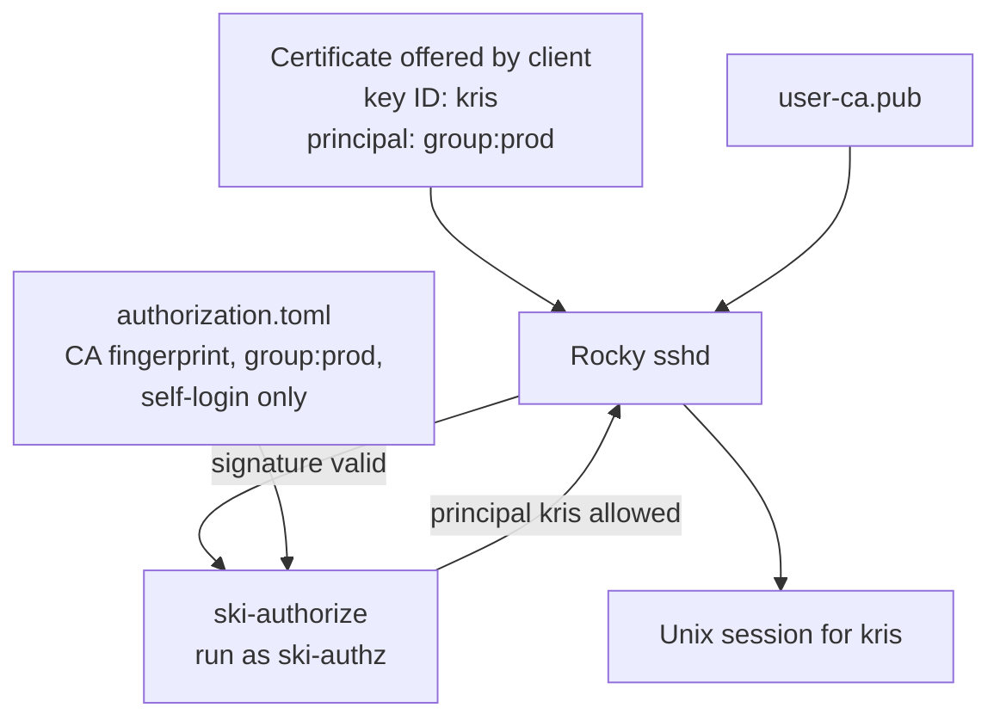

The [previous article]() explained
ephemeral SSH keys. This is the concrete demonstrator: a Mac runs the
certificate issuer, a Rocky Linux VM is the production host, and a normal
`ssh` login uses a one-day certificate held only in the Mac's `ssh-agent`.

```text
Mac: issuer                                      Rocky Linux: target host
────────────────────────────────────────────     ─────────────────────────────────────
ski serve                                         sshd
  ├── user CA private key                           ├── public user-CA key
  ├── local identity and group data                 ├── local authorization.toml
  └── issues a short-lived certificate              └── ski-authorize helper
          │                                                        ▲
          │ agent forwarding during issuance                       │ certificate login
          ▼                                                        │
     ssh-agent on the Mac ─────────────────────────────────────────┘
     ephemeral private key + certificate
```

The CA private key, issuer database, and user private key remain on the Mac.
The Rocky VM receives only the CA *public* key and its own local authorization
policy. Its login path does not contact the issuer.

This is a demonstrator, not a production deployment guide. In a real setup,
verify host keys through a trusted channel, protect the issuer's CA key, and
deploy target-host files with configuration management.

More importantly, the issuer's SQLite database is demonstrator scaffolding,
not a production identity source. A real issuer would read canonical users and
group memberships from the organisation's identity backend: for example LDAP,
Active Directory, Keycloak, or Okta. User creation, passwords, second factors,
and group administration remain the responsibility of that backend. The
issuer is read-only with respect to identity data: after authenticating a
request and reading a current group snapshot, it issues a certificate. It does
not manage users or mutate group membership through `ski` commands.

## 1. Prepare the issuer on macOS

The checkout on the Mac is `~/PycharmProjects/ski` and its dependencies are
locked through `uv`:

```console
~ $ cd PycharmProjects/ski/
ski $ ls
AGENTS.md                README.md                
developer                docs
packages                 pyproject.toml
src                      tests
uv.lock
```

The local `.env` selects paths. It contains no secret material: the private CA
key is a file at the named path, not a value in the environment file.

```dotenv
SKI_CA_DATABASE=ski.sqlite3
SKI_CA_PRIVATE_KEY=etc/keys/user_ca
SKI_CA_PUBLIC_KEY=etc/keys/user_ca.pub
SKI_CA_KRL=etc/keys/revoked.krl
ORDINARY_CERT_EXTENSIONS=pty
```

`ORDINARY_CERT_EXTENSIONS=pty` deliberately grants a terminal but not agent,
TCP, or X11 forwarding to the resulting production login. Agent forwarding is
needed only for the brief connection to the issuer, to put the new credential
in the workstation's agent.

## 2. Create the user CA

Initialize a User CA once. This generates an Ed25519 CA keypair and records
its state in the configured database:

```console
ski $ mkdir -p etc/keys
ski $ uv run ski ca init
CA initialized.
Algorithm: ssh-ed25519
Fingerprint: SHA256:r2+zadY0Ln3LQiNrCFxNY5aVVqSFuuDtCDEwc5itj+Q
CA committed, but service notification failed; retry notification.
ski: CA initialized; service notification failed; retry notification

ski $ uv run ski ca show
CA ID: 1
Algorithm: ssh-ed25519
Fingerprint: SHA256:r2+zadY0Ln3LQiNrCFxNY5aVVqSFuuDtCDEwc5itj+Q
Status: active
Activated: 1787422938

ski $ uv run ski ca public-key
ssh-ed25519 AAAAC3NzaC1lZDI1NTE5AAAAILGt49Riwdjygm6Okt1Uvd9ldgNaFRrpb8OZhyCktJQR
```

There is no running issuer yet, so the service-notification warning is
expected. Keep both values. The target policy pins the CA by fingerprint;
`user-ca.pub` is the public verification key given to `sshd`. Neither is
secret. The private CA key in `etc/keys/user_ca` must never leave the issuer.

## 3. Create a user and group

Create `kris` and make it a member of `prod`:

```console
ski $ uv run ski user add kris
Password:
User created: kris
TOTP secret: <redacted>
TOTP URI: otpauth://totp/ski:kris?secret=<redacted>&issuer=ski
ski: service notification failed; mutation committed; retry notification

ski $ uv run ski group add prod
Group created: prod
ski: service notification failed; mutation committed; retry notification

ski $ uv run ski group member add prod kris
Membership added: prod kris
ski: service notification failed; mutation committed; retry notification
```

Those notifications also have nowhere to go until `ski serve` starts. Password
and TOTP authenticate the issuance request. The outcome is a certificate with
the signed principal `group:prod`; the password is not used on the target
host.

For this demonstrator, we added the TOTP secret into a TOTP generator such as bitwarden. Another way to work with this is to use `oath-toolkit`:

``` 
$ brew install oath-toolkit
$ oathtool -b  <redacted>
459274
```

## 4. Start the issuer and obtain a certificate

Run the issuer in one terminal:

```console
ski $ uv run ski serve --port 2222
service_starting: ski startup requested
service_ready: ski is ready
```

In another terminal, ensure a local `ssh-agent` exists, then forward it only
to this trusted local issuer:

```console
ski $ ssh -A -tt -p 2222 \
  -o StrictHostKeyChecking=no \
  -o UserKnownHostsFile=/dev/null \
  kris@127.0.0.1
Warning: Permanently added '[127.0.0.1]:2222' (ED25519) to the list of known hosts.
ski
Authenticate with your ski password and TOTP code.
(kris@127.0.0.1) Password:
(kris@127.0.0.1) 2FA:
Key loaded: kris serial=367065752294255925 valid-until=1787513156
Groups: prod
Connection to 127.0.0.1 closed.
```

The host-key options are acceptable only for this disposable loopback test:
they disable SSH's protection against connecting to the wrong server. A real
issuer needs a verified `known_hosts` entry.

The issuer authenticates the user, generates a fresh keypair, signs the public
key, and sends an add-identity request through the forwarded agent channel.
It then closes the interactive connection. The local agent now shows one key
and its certificate:

```console
ski $ ssh-add -l
...
256 SHA256:uQLZAupxPTPBXhEMMWW6UzsH3JfFNIVS1Fl9xkOgg+U ski:kris:SHA256:r2+zadY0Ln3LQiNrCFxNY5aVVqSFuuDtCDEwc5itj+Q:367065752294255925 (ED25519-CERT)
256 SHA256:uQLZAupxPTPBXhEMMWW6UzsH3JfFNIVS1Fl9xkOgg+U ski:kris:SHA256:r2+zadY0Ln3LQiNrCFxNY5aVVqSFuuDtCDEwc5itj+Q:367065752294255925 (ED25519)
```

These are one credential, not two: the `ED25519` entry is the ephemeral private key,
while `ED25519-CERT` is its signed public certificate.
They have the same fingerprint.
Nothing new was written to `~/.ssh`.

At this point the issuer and agent work. No target host has yet been taught to
trust the certificate.

## 5. Install the target-host authorizer

The target is a Rocky Linux VM with a pre-existing local Unix account named
`kris`. The authorizer does not create accounts or map the certificate to a
different account. Check for OpenSSH 9 or later, then run the packaged
installer as root from `packages/ski-authorize`:

```console
[root@localhost ski-authorize]# git clone https://github.com/isotopp/server-key-injection/ 
...

[root@localhost ski-authorize]# cd server-key-injection
[root@localhost server-key-injection]# cd packages/ski-authorize
[root@localhost ski-authorize]# ./install.sh
Python 3.12 is already installed
Resolved 6 packages in 121ms
Building ski-authorize @ file:///root/server-key-injection/packages/ski-authorize
Prepared 1 package in 14ms
Installed 1 executable: ski-authorize
warning: `/opt/ski-authorize/bin` is not on your PATH.
ski-authorize installed below /opt/ski-authorize
```

The PATH warning is irrelevant: `sshd` invokes the helper by absolute path.
The installation tree is root owned; the helper runs under an unprivileged
`ski-authz` account (which was already created by the installer):

```text
/opt/ski-authorize/
├── bin/ski-authorize
├── cache/
├── config/
│   ├── authorization.toml
│   └── user-ca.pub
├── python/
└── tools/
```

Transfer only the public CA key from the Mac through a reviewed mechanism.
Never transfer the private CA key, SQLite database, `.env`, or agent contents.

Put the output of `uv run ski ca show` and `uv run ski ca public-key` into the
host's local policy and verification-key file:

```toml
[ssh]
trusted_ca_fingerprint = "SHA256:r2+zadY0Ln3LQiNrCFxNY5aVVqSFuuDtCDEwc5itj+Q"
allowed_groups = [ "group:prod" ]
allow_self_login_only = true
```

```console
[root@localhost config]# pwd
/opt/ski-authorize/config
[root@localhost config]# cat user-ca.pub
ssh-ed25519 AAAAC3NzaC1lZDI1NTE5AAAAILGt49Riwdjygm6Okt1Uvd9ldgNaFRrpb8OZhyCktJQR
[root@localhost config]# ls -l
total 8
-rw-r-----. 1 root ski-authz 375 Aug 22 20:30 authorization.toml
-rw-r--r--. 1 root root       81 Aug 22 20:32 user-ca.pub
```

Compare the fingerprint using an independent channel before accepting it.

`allow_self_login_only = true` permits a certificate for `kris` only to log
into local account `kris` (other configurations are not supported anyway at this point int time).

The group requirement adds `group:prod` to the host: Only users with `group:prod` in their certficate may log in.

## 6. Configure and reload `sshd`

The installer places this fragment in `/etc/ssh/sshd_config.d`:

```text
PubkeyAuthentication yes
PasswordAuthentication no
KbdInteractiveAuthentication no
TrustedUserCAKeys /opt/ski-authorize/config/user-ca.pub
CASignatureAlgorithms ssh-ed25519
AuthorizedPrincipalsCommand /opt/ski-authorize/bin/ski-authorize --config /opt/ski-authorize/config/authorization.toml --ca-fingerprint %F %u %t %k
AuthorizedPrincipalsCommandUser ski-authz

AllowAgentForwarding no
AllowTcpForwarding no
X11Forwarding no
```

`TrustedUserCAKeys` names the CA allowed to sign user certificates.
`AuthorizedPrincipalsCommand` receives the signing CA fingerprint (`%F`),
requested local user (`%u`), certificate type (`%t`), and certificate body
(`%k`). `sshd` verifies the cryptography; the helper applies the local policy.
The forwarding directives constrain the production session, not the earlier
connection to the issuer.

Validate the whole SSH configuration before reloading:

```console
[root@localhost ~]# sshd -t
[root@localhost ~]# systemctl reload sshd
[root@localhost ~]# logout
```



## 7. Login and inspect the evidence

The Mac SSH client discovers the certificate-backed key in its agent. No
special `IdentityFile` is needed:

```console
~ $ ssh 192.168.64.3 -l kris
Last login: Sat Aug 22 20:28:45 2026 from 192.168.64.1
[kris@localhost ~]$
```

The host log proves that this was certificate authentication:

```console
[root@localhost log]# tail -4 /var/log/secure
Aug 22 20:35:20 localhost sshd-session[2152]: Accepted publickey for kris from 192.168.64.1 port 60378 ssh2: ED25519-CERT SHA256:yutOUApby5l70x4kxF1QYwXCnrygAWEVsZYiEmuoz+s ID kris (serial 9739375750096054870) CA ED25519 SHA256:r2+zadY0Ln3LQiNrCFxNY5aVVqSFuuDtCDEwc5itj+Q
Aug 22 20:35:20 localhost sshd-session[2152]: pam_unix(sshd:session): session opened for user kris(uid=1000) by kris(uid=0)
```

The useful evidence is `ED25519-CERT`, the key ID, serial, and CA fingerprint.
The target verified a certificate signed by the expected CA and opened its
local `kris` account. The issuer did not take part in this login.

## 8. Treat the SELinux AVC as a finding

The successful Rocky login also produced an AVC for `ski-authorize` trying to
execute `ldconfig` from `sshd_session_t`. The helper still completed because
native-library discovery has a fallback. That is not a reason to suppress the
denial. Do not disable SELinux, run `audit2allow`. Fix packaging, runtime dependency discovery, and file labels so the helper works under its intended confinement.

The end state is deliberately small: the Mac agent contains a short-lived
private key and certificate; the Rocky host accepts it only when its local CA
and group policy agree. Once the agent entry or certificate expires, new logins
stop until the user obtains a fresh credential from the issuer.
