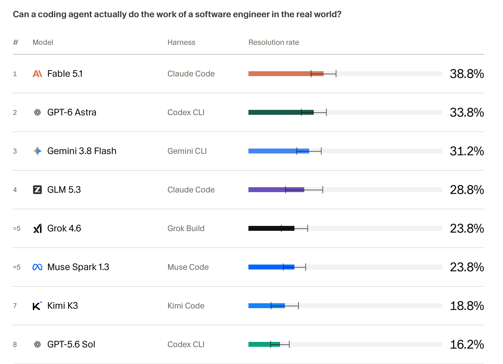

Der [Real-SWE-Benchmark](https://withspecific.com/benchmarks/real-swe) wirft moderne Coding Agents auf private Codebasen realer Firmen und gibt ihnen Aufgaben, die dort tatsächlich angefallen sind. Das Ergebnis sieht im ersten Moment schlecht aus: Der beste getestete Agent löst 38,8 Prozent, GPT-6 Astra mit Codex 33,8 Prozent und GPT-5.6 Sol mit Codex 16,2 Prozent.

Genau deshalb halte ich das Ergebnis für unerwartet gut. Die Zahlen sind erstaunlich hoch.

Der Benchmark setzt einen neuen Mitarbeiter ohne Einarbeitung vor eine proprietäre Enterprise-Codebase, gibt ihm ein Ticket mit median 1.742 Zeichen und erwartet eine fertige Änderung. Die Referenzlösung berührt median elf Dateien. Es geht um Abrechnung, Steuern, Migrationen, Identitäten und verteilte Datenspeicher. Das sind Aufgaben, bei denen eine plausible Lösung nicht genügt. Sie muß zu den Geschäftsregeln und Arbeitsweisen genau dieser Firma passen.

Wenn ein Uni-Abgänger oder Postdoc bei seinem ersten Tag in einer Firma aus einem solchen Ticket in einem Versuch eine korrekte produktionsreife Änderung baut, hat man großes Glück gehabt. Normalerweise stellt er Fragen, liest Dokumentation, spricht mit Kollegen, schreibt einen Plan, läßt ihn prüfen, implementiert in Schritten und bekommt seinen Code im Review zurück.

Warum sollte ein LLM ohne all das besser abschneiden?

*Resolution Rate im Real-SWE-Benchmark. Gezeigt wird Pass@1, gemittelt über acht unabhängige Läufe pro Aufgabe; die Striche zeigen 95-Prozent-Konfidenzintervalle. Quelle: [Specific Labs, Real-SWE](https://withspecific.com/benchmarks/real-swe).*

Dieser Text basiert auf [einem Mastodon-Thread über Firmenwissen und LLMs](https://infosec.exchange/@isotopp/117263456718697657).

# Zwei Sorten Wissen

Eine Hochschule kann allgemeines Wissen über ein Fach vermitteln. Das sind Grundlagen, Methoden, Begriffe und der aktuelle Stand der Technik. Es ist absichtlich austauschbar: Buchhaltung, Werkstoffkunde, Vertragsrecht, Softwareentwicklung oder Statistik werden nicht für genau eine Firma erfunden. Wer gut ausgebildet ist, kennt nicht jede Antwort, kann aber lernen, bewerten und eine begründete Antwort erarbeiten.

Eine Firma besitzt zusätzlich lokales Wissen. Wie man dieses Wissen nennt, ist weniger wichtig als sein Inhalt. Es beschreibt, warum *dieser* Laden *diese* Dinge in *dieser* Form macht:

- welche Kunden welchen Sonderfall brauchen;
- welche Risiken in der Vergangenheit tatsächlich eingetreten sind;
- welche Entscheidung ein Review oder ein ausdrückliches Go verlangt;
- welche Systeme nur scheinbar unabhängig sind;
- welche Abkürzung einmal teuer geworden ist;
- welche Qualität die Firma verspricht und worin ihr Alleinstellungsmerkmal besteht.
- und natürlich die Dinge, die nur diese Firma kann und umsetzt, und die deswegen ein Alleinstellungsmerkmal sind. 

Dieses Wissen kann nicht vollständig an der Universität gelehrt werden. Wäre es allgemeingültig und überall verfügbar, wäre es kein Alleinstellungsmerkmal. Eine Firma muß allgemeines Fachwissen deshalb durch in ihr lokales Firmenwissen anreichern.

Das geschieht durch Einarbeitung, Zusammenarbeit, Prozesse und Reviews. Neue Mitarbeiter hören Gespräche, beobachten Entscheidungen, stellen Fragen und lernen, welche geschriebenen Regeln wörtlich gelten und wo noch eine unsichtbare Nebenbedingung existiert. Sie eignen sich in der Kantine, im Meeting und im Code Review Dinge an, die nirgendwo sauber dokumentiert sind.

Ein LLM kann das nicht. Es hört nicht zu und bekommt nichts zufällig mit. Es kann lesen und schreiben. Wenn das Firmenwissen nicht in lesbarer Form existiert, existiert es für das Modell nicht.

# Verschriftlichung tut weh

Viele Firmen sind schlecht darin, ihre eigene Arbeit auf der Metaebene zu beschreiben. Sie können sagen, was sie seit zwanzig Jahren tun. Schwieriger ist die Erklärung, worin heute die Wertschöpfung besteht, warum ein Schritt vor dem nächsten kommt und welche Erkenntnis zu einer bestimmten Regel geführt hat.

Ein Teil davon ist gewöhnliche Betriebsblindheit. Wer eine Arbeit lange allein erledigt, trägt einen Haufen unverbalisierter Annahmen im Kopf. Man ahnt, daß etwas falsch ist, ohne die Kriterien noch benennen zu können. Das funktioniert für eine Person, solange sie verfügbar ist.

Beim Wachsen muß dieser Dunstgeist aus dem Kopf heraus. Aus einer Person werden nicht einfach zwei unabhängige Personen. Sobald mehrere Menschen dieselbe Arbeit teilen, muß jemand Zustände, Übergaben und Entscheidungen koordinieren. In der Gegend von 15 und später noch einmal von 150 Menschen kommen typische Sprungstellen: Gründer und Prozeßeigner müssen implizite Kontrolle abgeben, Regeln erklären und Entscheidungen reproduzierbar machen. Wenn sie das nicht schaffen, wächst der Laden nicht weiter oder zerlegt sich beim Versuch.

Manchmal ist die fehlende Transparenz auch Absicht. Sobald eine Regel mit Grund und Ziel aufgeschrieben ist, wird sie diskutierbar und veränderbar. Nicht jeder, der von einer undokumentierten Entscheidung Macht bezieht, will das.

LLMs machen dieses Problem sichtbar. Für ihren Einsatz muß die Firma ihr lokales Wissen externalisieren, konkretisieren und linearisieren. Sie muß es also aufschreiben. Das tut weh, weil dabei nicht nur Text entsteht. Es werden Widersprüche, unbegründete Rituale, private Fürstentümer und nie entschiedene Sonderfälle sichtbar.

Der Lacher ist: Zertifizierung und Compliance haben viele Firmen bereits gezwungen, genau diese Arbeit wenigstens teilweise zu erledigen. Der angeblich unsinnige bürokratische Overhead dokumentiert Rollen, Freigaben, Kontrollen und Nachweise. Schlechte Compliance produziert Papierfriedhöfe. Gute Compliance erzeugt eine lesbare Beschreibung, wie der Laden zuverlässig arbeitet. Das ist auch die Grundlage für den Einsatz eines LLM.

# Ein Prozeß ist Kommunikation

Für die Menschen innerhalb eines schlechten Prozesses sieht ein Prozeß wie eine Arbeitsverhinderungsmaßnahme aus. Formulare, Tickets, Freigaben und Meetings bremsen die eigentliche Arbeit und behindern alle mit Bürokratie.

Das ist oft korrekt beobachtet, aber nicht der Sinn eines Prozesses.

Ein brauchbarer Prozeß ist eine Arbeits- und Kommunikationsanweisung. Er legt fest, wer wann warum mit wem worüber sprechen muß, welche Information dabei entsteht und unter welcher Bedingung die Arbeit in den nächsten Zustand wechselt. Sein Ziel ist Reproduzierbarkeit: Das Ergebnis soll nicht davon abhängen, daß eine bestimmte Person zufällig im Raum war und noch wußte, was 2019 schiefging.

Reviews sind ein Teil davon. Sie sind keine Zeremonie, sondern Stellen, an denen fehlendes Wissen ergänzt und falsche Annahmen gestoppt werden. Manche Reviews müssen Menschen machen. Andere lassen sich als mechanische Gates ausdrücken: Zahlen müssen sich ausgleichen, Pflichtfelder müssen vorhanden sein, eine Checkliste muß vollständig sein oder ein Test muß grün werden.

Genau solche Prozesse braucht auch ein LLM. Nicht weil es eine besonders dumme Maschine ist, sondern weil jede neue Arbeitskraft ohne lokales Wissen sie braucht.

# Kontext ist Kurzzeitgedächtnis

Ein LLM hat bei der Arbeit keinen dauerhaften inneren Zustand. Als vereinfachtes Modell kann man es sich wie einen REST-Service vorstellen: Ein Request geht hinein, eine Antwort kommt heraus. Der nächste Request enthält die Vorgeschichte erneut. Das Modell erinnert sich nicht an die Unterhaltung. Die Software um das Modell, der Harness, schickt sie wieder mit.

Diese mitgeschickte Arbeitsmenge heißt Kontext. Darin stehen die Anweisungen, die bisherige Unterhaltung, gelesene Dokumente und Ergebnisse aus Werkzeugen. Der Kontext ist das Kurzzeitgedächtnis der aktuellen Arbeit.

Er hat eine maximale Größe, das Context Window. Moderne Modelle können sehr große Fenster anbieten, zum Teil bis in die Größenordnung von einer Million Token. Das heißt nicht, daß sie bis zum letzten Token gleich gut arbeiten. Mit wachsendem Kontext konkurrieren relevante Regeln mit alten Antworten, langen Logs und inzwischen bedeutungslosen Zwischenergebnissen um Aufmerksamkeit.

[Matt Pocock nennt den späteren Bereich die „Dumb Zone“](https://github.com/mattpocock/dictionary-of-ai-coding/blob/main/dictionary/Smart%20zone.md). Bei aktuellen Modellen beobachtet er den Übergang oft ungefähr zwischen 125.000 und 150.000 Token, aber das ist keine harte Grenze. Modell, Aufgabe und Qualität des Kontextes verschieben sie. Der Punkt ist unabhängig von der genauen Zahl: Ein großes technisches Fenster ist keine Erlaubnis, den gesamten Speicherboden da hineinzurümpeln.

Wenn das Modell Regeln vergißt, frühere Fehler wiederholt und trotz vorhandener Information zu raten beginnt, hilft nicht unbedingt noch mehr Text. Dann beginnt man mit einem frischen Kontext und lädt gezielt das wieder ein, was für den nächsten Arbeitsgang gebraucht wird.

# Dateien sind Langzeitgedächtnis

Ein Coding Harness gibt dem Modell Werkzeuge. Es kann Dateien im aktuellen Repository lesen und schreiben, Programme ausführen, Tests starten und Änderungen mit Git vergleichen. Dadurch bekommt die Arbeit neben dem Kurzzeitgedächtnis ein Langzeitgedächtnis: die Dateien im Repo.

Das Modell kennt diese Dateien nicht magisch. Es muß sie finden und lesen. Dafür braucht es Indizes: ein `README`, eine `AGENTS.md` oder eine andere kurze Karte, in der steht, welches Wissen wo liegt und wann es relevant ist. Der Index gehört früh in den Kontext. Die großen Detaildokumente werden nur geladen, wenn die aktuelle Aufgabe sie braucht.

Nicht jedes Firmenwissen liegt in Markdown neben dem Code. Tickets stehen in Jira, Entscheidungen in Confluence, Kundendaten in Datenbanken und Kennzahlen in internen Diensten. MCP-Server und andere Integrationen können solche Quellen für den Harness zugänglich machen. Auch dort braucht man Beschreibungen und Suchwege. Eine Datenhalde wird nicht dadurch zu Wissen, daß das Modell theoretisch darauf zugreifen darf.

Das Modell kann außerdem Ergebnisse aus seinem Kurzzeitgedächtnis in Dateien schreiben: eine geklärte Anforderung, einen Plan, offene Fragen oder ein Review. Im nächsten frischen Kontext liest es diese Artefakte wieder ein. So überlebt das Ergebnis eines Arbeitsganges, ohne daß die gesamte Unterhaltung erhalten bleiben muß.

# Skills sind Arbeitsanweisungen

Ein Skill ist keine neue Intelligenz und kein magischer Experte im Modell. Er ist eine kleine, wiederverwendbare Arbeitsanweisung: Verwende für diese Sorte Aufgabe diese Schritte, lies diese Quellen, erzeuge dieses Format und prüfe das Ergebnis auf diese Weise.

Das lokale Firmenwissen steckt also nicht vollständig im Skill. Der Skill erklärt, wie es gefunden und angewendet wird. Ein TDD-Skill kann zum Beispiel verlangen:

1. beobachtbares Verhalten festlegen;
2. einen Test schreiben, der das fehlende Verhalten zeigt;
3. nur den kleinsten Code schreiben, der den Test bestehen läßt;
4. erst bei grünem Test refaktorieren;
5. vor der Übergabe die Projektprüfungen ausführen.

Das ist keine Garantie für den richtigen Geschäftsvorgang. Der Skill verhindert aber, daß der Agent ohne prüfbare Grenze einfach plausiblen Code erzeugt. Die geschäftliche Anforderung kommt aus den Firmendokumenten; der Skill liefert die Arbeitsdisziplin.

# One-Shotting testet den falschen Arbeitsmodus

Real-SWE verwendet kurze, leicht unterspezifizierte Aufgaben. Die Details sollen aus der Codebase und den angeschlossenen Werkzeugen entdeckt werden. Das ist als Benchmark legitim und interessant. Es mißt aber einen ersten Lauf. Die Resolution Rate ist Pass@1.

Die häufigsten Fehler passen exakt zum Einarbeitungsproblem: Anforderungen werden übersehen, Annahmen nicht geprüft und richtige Ideen falsch in das vorhandene System integriert. Das sind keine exotischen Maschinenfehler. Das sind die Fehler eines Neulings, der zu früh losarbeitet.

In realer Arbeit würde ich aus einem 1.700-Zeichen-Ticket nicht sofort Code erzeugen lassen. Der erste Arbeitsgang macht daraus strukturierte User Stories. Das Modell muß dabei ausdrücklich „Offene Fragen“ und „Wichtige Hinweise“ liefern. Dort landen die Annahmen, die der Ausgangstext nicht auflösen konnte.

Die User Stories werden geprüft und korrigiert. Danach zerlegt ein weiterer Arbeitsgang sie in kleine Implementation Tickets, wieder mit Review. Erst dann wird Ticket für Ticket implementiert, jeweils mit Test, kleinstem Code, Projektprüfungen und einem Git-Checkpoint.

Das ist der [Spezialisierungs-Workflow]():

1. Aus einem groben Ziel werden explizite User Stories.
2. Reviews ergänzen Sicherheit, Architektur und lokale Regeln.
3. Aus den abgenommenen Stories werden geordnete, testbare Tickets.
4. Aus jedem Ticket wird in einem frischen, begrenzten Kontext Code.
5. Tests, Reviews und Git machen Fehler sichtbar und Schritte rückgängig.

Ein [konkretes Beispiel sind die User Stories](https://github.com/isotopp/server-key-injection/blob/main/developer/2026-08-20-dummy-issuer-and-agent-injection-tracer/user-stories.md) und die daraus erzeugten [Implementation Tickets](https://github.com/isotopp/server-key-injection/blob/main/developer/2026-08-20-dummy-issuer-and-agent-injection-tracer/tickets.md) für den `server-key-injection`-Tracer.

Jedes Arbeitsergebnis ist nie besser als sein Briefing. Ein gutes Briefing ist dabei nicht notwendig ein riesiger Prompt. Es ist die Kombination aus einer klaren Aufgabe, auffindbarem Firmenwissen, einer passenden Arbeitsanweisung und den richtigen Kontrollen.

# Die positive Lesart des Benchmarks

Real-SWE zeigt nicht, daß LLMs für Enterprise-Arbeit unbrauchbar sind. Der Benchmark zeigt, daß allgemeines Wissen lokales Firmenwissen nicht ersetzt und daß One-Shotting für komplexe Arbeit nicht genügt. Das war vorher bei Menschen so und ist bei Modellen nicht anders.

Wer Resultate will, muß:

- die eigene Arbeitsweise explizit machen;
- das lokale Wissen verschriftlichen und erschließen;
- Aufgaben in überprüfbare Arbeitsgänge zerlegen;
- an den richtigen Stellen menschliche Reviews und mechanische Gates setzen;
- früh im Spezialisierungs-Workflow steuernd eingreifen;
- neue Kontexte beginnen, bevor der alte in die Dumb Zone rutscht.

Das ist anstrengender als ein langer Prompt und billiger als eine Serie falscher produktiver Änderungen. Es verbessert außerdem nicht nur die Arbeit mit LLMs. Eine Firma, die erklären kann, wie sie Wert erzeugt, Entscheidungen trifft und Wissen findet, kann auch Menschen besser einarbeiten, Vertretungen organisieren und Prozesse verändern.

LLMs arbeiten dabei überraschend menschlich. Sie lernen nicht während des Einsatzes wie ein Mensch, aber ihre Fehler werden mit denselben Mitteln beherrschbar: Einarbeitung, kleine Aufgaben, sichtbare Zwischenergebnisse, Rückfragen, Reviews und überprüfbare Grenzen.

Wir haben LLMs in unserem Angesicht geschaffen und mit unseren Schriften trainiert. Nun arbeiten sie wie wir und machen Fehler wie wir. Diese Fehler lassen sich erfassen und auf dieselbe Weise korrigieren wie unsere.

Eventuell klappt das nicht mit dem Maschinengott. Aber wir bauen gerade die Menschmaschine.
